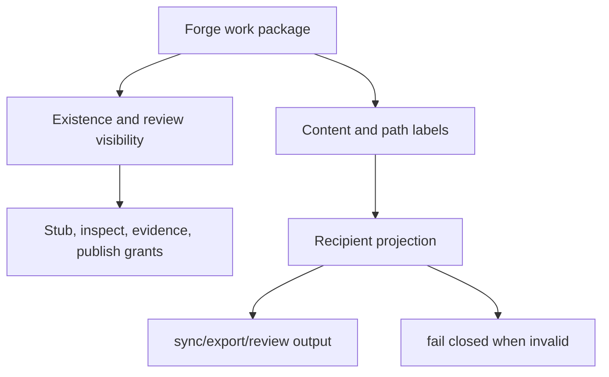

# Permissioned Forge - Change-Level Private Collaboration (NER-354)

## Summary

Permissioned Forge adds change-level visibility to Forge work packages so a single Forge graph can contain public core work, private extensions, private attempts, and embargoed fixes without falling back to split repos or private forks. The v1 product contract is local-first, projection-based, and safe-by-default: Forge-managed sync/export/review produces only the recipient's allowed view and fails closed when it cannot do so.

---

## Problem Frame

Forge has reached the local/native release-candidate boundary: native history, diff, merge, sync, conflict-as-data, signed evidence, trust policy, and Git export are in place. The next product gap is not another local VCS primitive. It is making collaboration safe when not all work should be visible to every recipient.

Theo's source-control critique is the right pressure test for this brainstorm. Git and GitHub treat private/public mostly as repo-level state, while real projects often need private files, private in-flight work, and security fixes that can be built or released before the source becomes visible. That forces teams into split repos, hidden forks, side channels for env/config, and manual security embargo processes.

Forge already has a better native unit than a Git branch or PR: an intent -> attempt -> proposal -> evidence -> decision work package. Permissioned Forge should use that unit first, then apply path/content labels inside it. This makes private collaboration a Forge-native capability instead of rebuilding Git's repo-level access model.

---

## Key Decisions

- **Work-package-first permissioning.** Visibility starts at the intent/attempt/proposal/evidence/decision bundle because that maps to Forge's product model and covers private branch/private PR use cases.
- **Hybrid content labels.** Work-package visibility controls existence and review access; path/content labels control sync, materialization, and export filtering.
- **Projection guarantee first.** v1 guarantees unauthorized recipients do not receive private data through Forge-managed surfaces; it does not claim to protect data already materialized on a local machine.
- **Local-first enforcement.** The Forge CLI enforces policy during sync/export/review projection before hosted infrastructure exists.
- **Safe sync/export first.** The first success path is preventing leaks through `forge sync`, `forge export`, and generated Git artifacts.

---

## Actors

- A1. **Creator:** creates an intent, attempt, or proposal and owns the first private collaboration loop.
- A2. **Reviewer:** is explicitly invited to inspect and materialize private work for review.
- A3. **Maintainer:** controls widening to `team`/`public`, all embargoed grants, and reveal/publish actions.
- A4. **Recipient:** receives a sync/export/review projection shaped by the policy.
- A5. **Forge CLI:** enforces local policy, produces projections, runs declared projection checks, and records audit events.

---

## Key Flows

- F1. **Private collaboration on public core plus private extensions**
  - **Trigger:** A creator starts work in one Forge graph that includes public core code and private extension code.
  - **Actors:** A1, A2, A3, A5.
  - **Steps:** The work package starts under the workspace default visibility -> the creator invites reviewers for private review -> path/content labels protect private extension content -> reviewers materialize only what policy permits -> public publish requires maintainer approval and projection checks.
  - **Outcome:** One Forge graph replaces split public/private repos while the public projection remains usable.
  - **Covered by:** R1, R2, R3, R8, R10, R13, R15, R16.

- F2. **Recipient-scoped sync/export**
  - **Trigger:** A user syncs, exports, or publishes a Forge view to a recipient.
  - **Actors:** A4, A5.
  - **Steps:** Forge evaluates the recipient's capabilities -> builds the allowed projection -> omits private objects and ledger rows the recipient cannot receive -> runs declared projection checks when the target is public -> refuses if a valid projection cannot be produced.
  - **Outcome:** Sync/export behaves like a policy-shaped view, not a raw repo dump.
  - **Covered by:** R8, R9, R10, R11, R12, R15.

- F3. **Embargoed security fix**
  - **Trigger:** A maintainer marks work as embargoed so authorized actors can prepare a fix before source is public.
  - **Actors:** A3, A4, A5.
  - **Steps:** The work package becomes fully invisible except to explicit grantees -> maintainers grant only required capabilities -> authorized recipients can build or receive the allowed release projection -> maintainers later perform reveal/publish with sanitized provenance.
  - **Outcome:** Forge supports release-before-source without exposing the exploit-bearing source, raw evidence, or review history.
  - **Covered by:** R4, R5, R6, R7, R11, R14, R18, R19, R20.

---

## Requirements

**Visibility Model**

- R1. Forge work packages have a visibility label: `private`, `team`, `public`, or `embargoed`.
- R2. Privacy applies before proposal creation; intents and attempts can be private while exploration is still in progress.
- R3. Work-package visibility controls existence, review access, and collaboration metadata.
- R4. `private` work may expose a coordination stub when policy allows.
- R5. `embargoed` work is fully invisible by default and exposes no coordination stub unless explicitly granted.
- R6. `embargoed` is a workflow, not only a stricter label: it supports explicit grants, release-before-source, reveal/publish, and audit.
- R7. New-work visibility defaults are workspace/repo policy, not a hardcoded product constant.

**Capability Model**

- R8. NER-354 defines these capability tiers: `see_stub`, `inspect_content`, `inspect_evidence`, `sync_materialize`, and `publish_reveal`.
- R9. Normal private stubs may reveal owner, title/intent summary, status, and reviewers; they must not reveal paths, diffs, evidence, check output, private object IDs, or private content.
- R10. Invited reviewers on `private` work can inspect content/evidence and sync/materialize for review by default.
- R11. `embargoed` grants are maintainer-controlled and minimal; recipients receive only the exact capabilities needed.
- R12. Fail-closed diagnostics may include coordination information only when the caller has `see_stub`; embargoed failures remain generic unless policy grants more.

**Path and Content Policy**

- R13. Path/content labels control whether objects can be synced, materialized, inspected, or exported for a recipient.
- R14. Private and embargoed raw evidence, command logs, excerpts, diffs, and review discussion inherit the work package's restricted visibility unless sanitized for reveal.
- R15. Public projections must be usable without private extensions; the public core exposes stable extension points and private implementations plug in behind them.
- R16. A mixed public/private work package may exist under `private` or `team`, but public publish requires projection-safe separation or explicit maintainer approval.

**Projection, Sync, and Export**

- R17. Forge sync/export/review produces a recipient-scoped projection rather than transferring every local object and ledger row.
- R18. Unauthorized recipients do not receive private content, private ledger rows, private evidence, private review data, or private object payloads through Forge-managed sync/export/review.
- R19. If Forge cannot produce a valid recipient projection, it fails closed instead of silently dropping pieces or emitting misleading placeholders.
- R20. Public sync/export/publish runs declared public projection checks and fails closed when the public projection is not usable.
- R21. Public Git export must exclude private work packages, private path/content, restricted evidence, and embargoed material.

**Publish, Reveal, and Provenance**

- R22. Accepting private work does not imply public visibility; public reveal/publish is a separate policy-controlled action.
- R23. Publishing private or embargoed work uses staged reveal: accepted content and sanitized provenance can become public while raw attempts, private paths, sensitive evidence, and review discussion stay restricted.
- R24. Sanitized provenance includes accepted content reference, decision actor, timestamp, signature/trust level, and required-check pass/fail summary.
- R25. Sanitized provenance excludes raw command logs, evidence excerpts, private paths, diffs, and private review discussion.

**Roles, Widening, and Audit**

- R26. Creators can invite explicit reviewers for `private` work, subject to policy.
- R27. Maintainers control widening to `team` or `public`.
- R28. Maintainers control all `embargoed` grants, reveal, and publish actions.
- R29. Every visibility change records an audit event with actor, prior label, new label, affected work package, and policy reason.
- R30. Revocation is future-only in v1: it blocks future Forge-managed sync/review/export/materialization, but cannot claw back content already materialized by a recipient.

---

## Acceptance Examples

- AE1. **Covers R1, R2, R10.** Given a creator starts a private attempt before any proposal exists, when they invite a reviewer, the reviewer can materialize the private attempt for review while other recipients cannot see the content.
- AE2. **Covers R4, R5, R9, R12.** Given normal private work with a visible stub, an unauthorized teammate sees only owner, summary, status, and reviewers; given embargoed work, the same teammate sees no existence signal.
- AE3. **Covers R13, R17, R18, R21.** Given a public export from a repo with private extensions, the exported Git artifact contains public core content and sanitized provenance only, with no private extension objects, ledger rows, evidence, or review data.
- AE4. **Covers R15, R20.** Given a public projection would fail declared public checks because it depends on private implementation code, public export fails closed.
- AE5. **Covers R16.** Given a mixed work package touches public core and private extension code, private review proceeds; public publish requires projection-safe separation or maintainer approval.
- AE6. **Covers R22, R23, R24, R25.** Given private work is accepted, it remains private until a maintainer publishes; the public reveal includes content ref, decision actor, timestamp, trust level, and check summary, but not raw evidence or review discussion.
- AE7. **Covers R6, R11, R28.** Given an embargoed fix, only maintainers can grant recipients materialization access or publish/reveal it, and each grant is explicit.
- AE8. **Covers R29, R30.** Given a maintainer revokes a reviewer's access, future sync/materialization is blocked and the revocation is audited, but Forge does not claim to erase already materialized content.

---

## Success Criteria

- A team can keep public core and private extensions in one Forge graph without splitting repos or private forks.
- Public sync/export/publish creates a usable public projection that passes declared checks.
- Unauthorized recipients receive no private work packages, private path/content, restricted evidence, or embargoed material through Forge-managed surfaces.
- Private collaboration remains practical: invited private reviewers can inspect evidence and materialize work on their own machines.
- Embargoed work supports release-before-source with explicit grants, staged reveal, and audit.
- Downstream planning can implement NER-354 without inventing visibility labels, capability tiers, projection behavior, publish semantics, or v1 privacy guarantees.

---

## Scope Boundaries

- Cryptographic object encryption is deferred to NER-356; this doc defines the policy/projection contract first.
- Full org identity, key ownership, rotation, and revocation are deferred to NER-357.
- Hosted review UI design is deferred to NER-359; this doc defines what hosted review may show.
- Resumable/partial network transfer is deferred to NER-360.
- Intent-aware blame/annotate is deferred to NER-362.
- v1 does not claim cryptographic secrecy for content already materialized on a recipient's machine.
- v1 does not solve same-user agent zero-trust, command sandboxing, or secret-safe execution beyond the existing Forge safety model.

---

## Dependencies / Assumptions

- Builds on the current Forge local/native surface: work packages, native content/history, sync, conflict-as-data, signed evidence/decisions/native commits, trust policy, and Git export.
- Assumes Forge's existing secret-risk exclusion and evidence redaction remain mandatory for every projection.
- Assumes trust policy and signatures remain local-first until org identity/governance is designed.
- Assumes public projection checks are declared by policy or existing Forge check configuration; the exact configuration shape belongs in planning.
- Assumes hosted collaboration will reuse the local projection semantics instead of becoming a separate visibility model.

---

## Outstanding Questions

### Resolve Before Planning

- None. The product contract is specific enough for a first `ce-plan`.

### Deferred to Planning

- [Affects R8-R12][Product/technical] Exact capability-to-command matrix for each Forge command surface.
- [Affects R13-R21][Technical] How projection checks are configured and how their results appear in the JSON contract.
- [Affects R29][Technical] Exact audit event shape and how audit entries interact with existing signed ledger/provenance.
- [Affects R30][Technical] User-facing revocation diagnostics that are honest without encouraging false expectations.

---

## Sources / Research

- `docs/ROADMAP.md` - current release-candidate boundary and hosted/collaboration follow-on themes.
- `docs/P9_RELEASE_AUDIT.md` - proven local/native claims and public wording limits.
- `README.md` - current Forge workflow, safety defaults, native sync, and trust ladder.
- `docs/brainstorms/2026-05-29-encrypted-env-secrets-requirements.md` - prior local secret-at-rest scope and explicit exclusion of team key sharing/revocation.
- `docs/brainstorms/2026-05-31-ner-139-phase-8-requirements.md` - prior requirements style for preserving Forge safety invariants and redaction at egress.
- [Theo's YouTube video](https://www.youtube.com/watch?v=wEAb0x3wTRc), source-control section around 13:19-17:24 - product pressure for private files, private in-flight work, embargoed security fixes, and change-level visibility instead of repo-level visibility.
