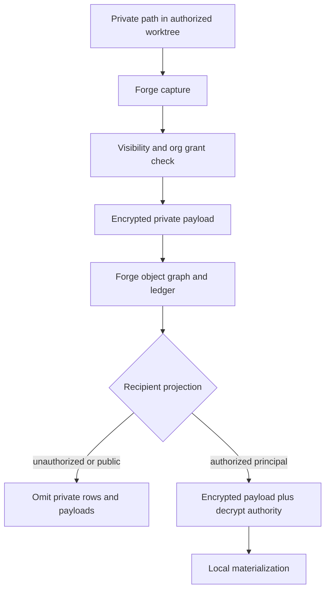

# Encrypted Private Content and Visibility Labels (NER-356)

## Summary

NER-356 adds the cryptographic private-content layer that permissioned Forge deliberately deferred. The prototype proves that one Forge graph can hold public core work plus a private source/config path, encrypt that private payload through Forge-managed storage and sync, and let only an authorized org recipient materialize it.

---

## Problem Frame

Theo's source-control critique is the product pressure for this slice: repo-level public/private boundaries do not match how real teams ship software. Teams need private files inside otherwise public projects, private in-flight attempts, and embargoed fixes that can be built or released before the source is visible. The usual workaround is split repos, hidden forks, copied env/config, and manual release choreography.

Forge already has the right unit of collaboration: work packages and path/content labels inside one native graph. NER-354 added visibility policy and recipient-scoped projections. NER-357 added a local org identity/key-governance foundation. The remaining gap is that a restricted path is still only projection-filtered, not cryptographically private. If restricted content exists as plaintext in the Forge object graph or projected bundle, policy bugs become data leaks.

NER-356 should close that gap for the first practical case: a private source or config path that belongs to a private work package, is encrypted before it enters Forge-managed storage or transport, is omitted from unauthorized projections, and can be decrypted only for a granted org principal.

---

## Key Decisions

- **Private source/config path first.** The first prototype targets a generic private path in a normal project, not an `.env`-only secret manager. The prior encrypted-env work informs the threat boundary, but NER-356 is about private content in the Forge graph.
- **Encryption complements projection.** Visibility labels and grants decide who may know or materialize content; encryption makes the protected payload safe at rest and in authorized transport.
- **Unauthorized recipients get omission, not ciphertext.** Public and unauthorized projections should not receive private plaintext, encrypted payloads, private object ids, private diffs, or private ledger rows unless policy explicitly allows a safe stub.
- **Authorized recipients decrypt locally.** A granted org principal can receive encrypted private payloads and materialize plaintext into their local worktree for review or build, with future operations preserving the private label.
- **Forge re-encrypts on capture.** A private path may be plaintext in an authorized local worktree, but Forge must store and sync it as private encrypted content rather than accidentally snapshotting it into public/plain objects.
- **Threat boundary stays honest.** This prevents Forge-managed at-rest, sync, export, and Git-export leaks. It does not claim to stop an authorized same-user agent or process from reading plaintext after materialization.

---

## Actors

- A1. **Creator:** creates private source/config work and expects Forge to preserve privacy while normal work continues in the same graph.
- A2. **Maintainer:** grants or revokes private materialization access and controls widening or reveal.
- A3. **Authorized reviewer:** receives a private projection and materializes the private path for review or build.
- A4. **Unauthorized recipient:** receives only the public or permitted view and must not receive private payloads or private object references.
- A5. **Org principal/key:** the identity and key binding used to decide whether a recipient may decrypt private content.
- A6. **Forge CLI:** enforces labels, encrypts/decrypts payloads, builds projections, records audit, and fails closed.
- A7. **Coding agent:** drives Forge commands and must get machine-readable outcomes without scraping prose or touching `.forge` internals.

---

## Key Flows

- F1. **Create private content in one Forge graph**
  - **Trigger:** A creator adds a private source/config path while working in a repo that also contains public core code.
  - **Actors:** A1, A6, A7.
  - **Steps:** The creator labels the path private under the relevant work package -> Forge captures the worktree -> public paths enter normal Forge storage -> the private path is stored as encrypted private content.
  - **Outcome:** The single Forge graph contains both public and private work without storing the private path as public plaintext.
  - **Covered by:** R1, R2, R4, R5, R15.

- F2. **Export or sync to an unauthorized recipient**
  - **Trigger:** A user exports, syncs, or publishes a projection for a recipient without private materialization authority.
  - **Actors:** A4, A6.
  - **Steps:** Forge evaluates work-package and path visibility -> denies private content capability -> omits private payloads, object references, diffs, evidence, and ledger rows -> emits a projection with redacted metadata.
  - **Outcome:** The recipient cannot recover private plaintext or ciphertext from Forge-managed output.
  - **Covered by:** R3, R6, R9, R10, R11, R13.

- F3. **Materialize for an authorized reviewer**
  - **Trigger:** A maintainer grants a reviewer private materialization.
  - **Actors:** A2, A3, A5, A6.
  - **Steps:** Forge resolves the recipient to an org principal/key -> verifies the grant and key authority -> transfers encrypted private payloads in the projected bundle -> decrypts locally during materialization.
  - **Outcome:** The reviewer can build or inspect the private path while Forge preserves private labels for future capture, sync, and export.
  - **Covered by:** R7, R8, R14, R15, R17, R18.

- F4. **Revoke private access**
  - **Trigger:** A maintainer revokes a reviewer or key after private materialization was previously allowed.
  - **Actors:** A2, A3, A5, A6.
  - **Steps:** Forge records revocation -> future sync/export/materialization refuses the private payload -> diagnostics state that prior materialization is not clawed back.
  - **Outcome:** Future Forge-managed access is blocked without making false secrecy claims.
  - **Covered by:** R8, R12, R18.

---

## Requirements

**Visibility and Content Model**

- R1. Forge supports private path/content labels inside a work package so public and private files can coexist in one Forge graph.
- R2. The first prototype supports at least one private source/config path under one private work package.
- R3. Private content is deny-by-default for every recipient unless a current grant and decrypt authority are both present.
- R4. Existing visibility labels remain authoritative for work-package existence, stubs, and egress decisions.
- R5. Private content labels refine work-package visibility by marking which paths or payloads require encryption and restricted projection.

**Encryption and Decryption**

- R6. Private path payloads are encrypted before they are stored in Forge-managed content storage, sync bundles, or exported Forge artifacts.
- R7. Authorized materialization decrypts private payloads only for the granted org principal/key context.
- R8. Missing, revoked, stale, or mismatched decrypt authority fails closed and does not run a partial materialization.
- R9. Unauthorized projections omit private encrypted payloads rather than shipping ciphertext as a placeholder.
- R10. Public Git export includes neither plaintext nor ciphertext for private paths.

**Egress, Evidence, and Projection Safety**

- R11. Unauthorized sync/export/review output omits private object ids, private ledger rows, private diffs, private evidence, and private command excerpts.
- R12. Revocation blocks future Forge-managed sync, export, review, materialization, and reveal for the private payload.
- R13. Diagnostics for unauthorized private content are redacted by capability and do not leak private path names when policy says the recipient cannot see a stub.
- R14. Authorized private evidence and command output inherit restricted visibility unless a later reveal creates sanitized public provenance.
- R15. Re-capturing an authorized worktree with a materialized private path preserves the private label and re-encrypts the payload.

**Agent Contract and Audit**

- R16. Machine-readable command output distinguishes full content, omitted content, encrypted private content, and failed decrypt authority without prose parsing.
- R17. Grants, revocations, encryption/materialization decisions, and reveal actions record principal-aware audit events.
- R18. User-facing docs and errors state the residual risk: Forge cannot erase or protect plaintext already materialized on an authorized machine.

---

## Acceptance Examples

- AE1. **Covers R1, R2, R4, R6, R15.** Given a repo with public core code and a private extension path, when Forge captures a private work package, the public files are stored normally and the private path is stored only as encrypted private content.
- AE2. **Covers R3, R9, R10, R11, R13.** Given an unauthorized recipient exports or syncs the same work, the output contains no private plaintext, no private ciphertext, no private path name, no private object id, and no private ledger row.
- AE3. **Covers R7, R8, R16, R17.** Given a maintainer grants a reviewer private materialization and the reviewer has a valid org-bound decrypt key, the reviewer can materialize the private path and the JSON response records the authorized encrypted-to-plaintext transition.
- AE4. **Covers R8, R12, R18.** Given the reviewer or key is revoked, future materialization fails closed with an honest revocation diagnostic while already materialized local plaintext remains outside Forge's clawback guarantee.
- AE5. **Covers R10, R14.** Given private work is accepted but not publicly revealed, public Git export contains the public projection and sanitized provenance only, with no restricted evidence or private path content.
- AE6. **Covers R3, R13.** Given the label is `embargoed`, an unauthorized recipient receives no existence signal unless explicit policy grants a safe view.
- AE7. **Covers R15.** Given an authorized reviewer edits the materialized private path and saves a new attempt, Forge stores the changed private path as encrypted private content and does not regress it to public/plain storage.

---

## Success Criteria

- A public core plus private extension/config path can live in one Forge graph without split repos or hidden forks.
- Unauthorized Forge-managed sync, export, review, and Git export leak neither private plaintext nor private ciphertext.
- An authorized org principal can receive, decrypt, and materialize the private path for real review or build work.
- Re-capture preserves privacy after authorized local materialization.
- The dogfood repo proves the feature with an end-to-end private path, an authorized recipient, an unauthorized recipient, and a public Git export leak check.
- Downstream planning can implement without inventing the threat boundary, recipient model, projection behavior, or success bar.

---

## Scope Boundaries

- No hosted identity, SSO, SCIM, OIDC, hosted certificate authority, or external KMS in the first prototype.
- No general team key-distribution system beyond one explicit authorized recipient/decrypt authority path.
- No same-user zero-trust guarantee after materialization; an authorized process can read plaintext from its own worktree.
- No claim to claw back already materialized plaintext after revocation.
- No `.env`-only secret manager as the primary product shape; encrypted env handling remains a related but narrower follow-up or sub-slice.
- No encrypted private content in public Git export as ciphertext.
- No full hosted review UI; hosted surfaces must later reuse the local projection semantics.
- No broad path-label UX polish beyond what is needed to dogfood the prototype.

---

## Dependencies / Assumptions

- Builds on `docs/brainstorms/2026-06-23-permissioned-forge-requirements.md` for work-package visibility, path/content labels, capability tiers, projection behavior, and future-only revocation.
- Builds on `docs/brainstorms/2026-06-24-org-identity-key-governance-requirements.md` and the rc6 org bootstrap foundation for principal/key-bound authority.
- Reuses the prior encrypted secret threat boundary in `docs/brainstorms/2026-05-29-encrypted-env-secrets-requirements.md`: at-rest and Forge-managed egress protection are in scope, same-user zero-trust is not.
- Assumes existing secret-risk exclusion and evidence redaction remain mandatory controls, not replacements for private-content encryption.
- Assumes planning will choose audited cryptographic libraries and a concrete envelope/key format; custom cryptography is outside the acceptable solution space.
- Assumes the first dogfood pass runs in `forge-dogfood` and records a feature-specific leak matrix before release.

---

## Outstanding Questions

### Resolve Before Planning

- None. The product contract is specific enough for a first `ce-plan`.

### Deferred to Planning

- [Affects R1-R5][Technical] Exact command surface for labeling and inspecting private paths.
- [Affects R6-R9][Technical] Exact encrypted payload and recipient envelope format.
- [Affects R7-R8][Technical] Exact mapping from org principal/key bindings to decrypt authority.
- [Affects R11-R15][Technical] Exact graph reachability rules for omitting private rows, objects, diffs, and evidence together.
- [Affects R16-R17][Technical] Exact JSON fields and audit event names for encrypted content, decrypt, materialize, and omission outcomes.
- [Affects AE1-AE7][Testing] Exact dogfood fixture shape in `forge-dogfood`.

---

## Sources / Research

- `docs/brainstorms/2026-06-23-permissioned-forge-requirements.md` - work-package-first permissioning, path/content labels, recipient-scoped projection, embargo boundaries, and Theo-derived product pressure.
- `docs/plans/2026-06-23-001-feat-permissioned-forge-plan.md` - current implementation plan for visibility policy, projected sync/export, Git export, and public projection checks.
- `docs/brainstorms/2026-06-24-org-identity-key-governance-requirements.md` - principal, key, role, and future-only revocation semantics for permissioned Forge.
- `docs/brainstorms/2026-05-29-encrypted-env-secrets-requirements.md` - prior encrypted-secret threat model and explicit non-goals around same-user zero trust.
- `crates/forge-store/migrations/018_visibility_policy.sql` - current visibility policy, path labels, grants, and audit persistence.
- `crates/forge-store/migrations/019_org_identity_governance.sql` - current org profile, principal, key binding, role binding, issuer binding, and org audit foundation.
- `docs/P9_RELEASE_AUDIT.md` - current release boundary: projection and org bootstrap exist, encrypted private content and full org enforcement do not.
- [Theo's YouTube video](https://www.youtube.com/watch?v=wEAb0x3wTRc), source-control section around 13:19-17:24 - pressure for private files, private in-flight work, embargoed fixes, and change-level visibility instead of repo-level privacy.
