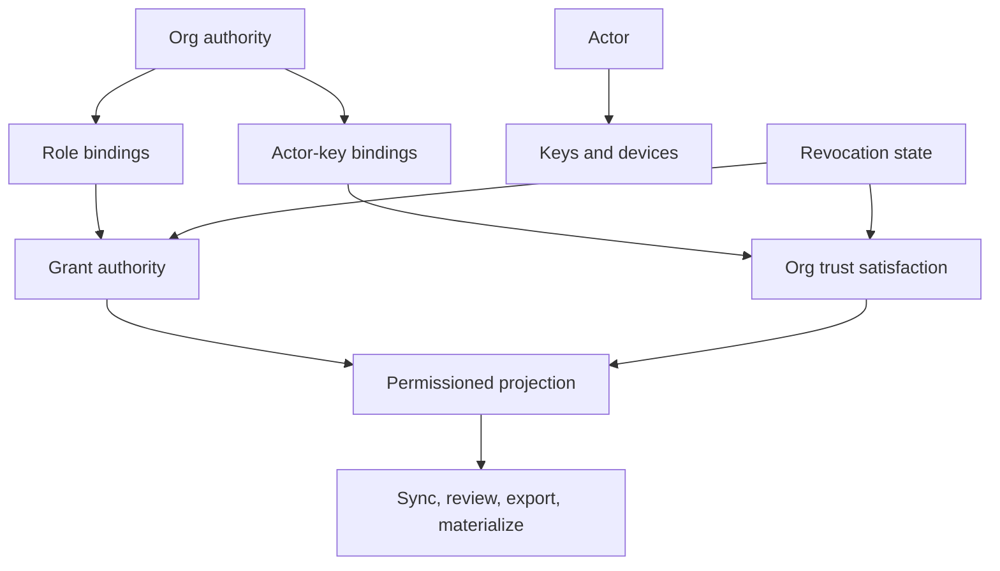

# Org Identity, Key Governance, and Revocation (NER-357)

## Summary

NER-357 defines the identity and governance layer that turns Forge's local key fingerprints, trust origins, and permissioned projection recipients into auditable organization principals. It gives Forge stable actors, actor-owned keys, org-scoped roles, role-bound grant authority, and future-only revocation semantics without pretending v1 has a hosted certificate authority or cryptographic clawback.

This is the bridge between NER-354 permissioned projections and hosted/team collaboration. A recipient should no longer be only a raw string, and a signature should not satisfy org policy just because it arrived from a peer.

---

## Problem Frame

Permissioned Forge now has visibility labels, capability grants, projection decisions, and audit rows. That is enough to dogfood change-level privacy, but the current permission surface still treats `recipient` and `actor` as raw strings. Local signing records fingerprints and trust origins, and local key rotation preserves historical verification, but Forge does not yet know which organization actor owns a key or which role authorizes a grant.

Theo's source-control critique pushed Forge toward change-level privacy: private files, private work, and embargoed fixes should not force split repos or hidden forks. The next pressure point is governance. In a team setting, privacy is not only "which bytes can this recipient see"; it is "who is this actor, what authority do they have, what key/device acted, and what happens after revocation?"

Forge must answer those questions without weakening the trust ladder. Peer-imported signatures can remain useful evidence, but they must not become local or organization trust unless an organization authority binds the key and actor.

---

## Key Decisions

- **Org identity is ledger-backed and local-first.** v1 records an organization authority profile in Forge data so local and synced repos can evaluate policy without requiring hosted accounts first.
- **Actors and keys are separate identities.** A human, service, or external reviewer has a stable actor id; keys and devices can be added, rotated, expired, or revoked under that actor.
- **Peer signatures stay below org trust by default.** Imported signatures can verify cryptographically, but they do not satisfy org policy until a trusted org authority binds the key to an actor or approved issuer.
- **Role authority and visibility grants are distinct.** Org roles decide who may grant, revoke, reveal, publish, or administer identity; work-package grants decide what a recipient may see or materialize.
- **Revocation is future-only.** Revocation blocks future Forge-managed grant, sync, review, export, materialization, reveal, and policy satisfaction; it does not erase content already materialized on another machine.
- **Audit must be principal-aware.** Every identity, role, key, grant, revocation, and reveal action records the actor, acting key/device when known, authority used, reason, and prior/new state.

---

## Actors

- A1. **Org owner:** creates or accepts the org authority profile, manages admins, and can recover governance state.
- A2. **Maintainer:** grants private or embargoed access, widens visibility, reveals or publishes work, and revokes access under org policy.
- A3. **Contributor:** owns one or more local signing keys and creates signed work, evidence, or decisions.
- A4. **Service actor:** represents automation such as hosted runners, CI, release tooling, or bots.
- A5. **External reviewer:** receives scoped access without necessarily becoming a full org member.
- A6. **Forge CLI:** resolves actor/key/role state, enforces policy, fails closed, and records audits.
- A7. **Peer or attester:** supplies imported signatures or third-party attestations that can be verified but need org-scoped trust binding before satisfying org policy.

---

## Key Flows

- F1. **Bind a contributor key to an org actor**
  - **Trigger:** A contributor joins an org-governed Forge repo or enables org policy in an existing local repo.
  - **Actors:** A1, A2, A3, A6.
  - **Steps:** Forge creates or resolves the actor id -> records an active key/device binding -> records who authorized the binding -> future signatures from that key can be evaluated against org policy.
  - **Outcome:** Work can be attributed to an actor instead of only a key fingerprint or raw CLI actor string.
  - **Covered by:** R1, R2, R3, R11, R21.

- F2. **Rotate or revoke a key**
  - **Trigger:** A key is replaced, compromised, expired, or moved to a new device.
  - **Actors:** A2, A3, A6.
  - **Steps:** Forge records the old key status change -> binds the new active key when present -> keeps historical signatures verifiable with validity-at-time semantics -> blocks revoked keys from satisfying future org policy.
  - **Outcome:** Key lifecycle does not break history and does not allow stale keys to authorize future actions.
  - **Covered by:** R3, R4, R15, R16, R19, R21.

- F3. **Grant embargoed access under org authority**
  - **Trigger:** A maintainer needs an external reviewer or service actor to materialize an embargoed fix.
  - **Actors:** A2, A4, A5, A6.
  - **Steps:** Forge resolves the recipient principal -> verifies the acting maintainer's role and active key -> grants the minimum capability -> records the audit event -> projection allows only the granted view.
  - **Outcome:** Embargo grants become role-authorized actions, not stringly recipient writes.
  - **Covered by:** R5, R6, R7, R8, R20, R21.

- F4. **Import peer signatures without trust upgrade**
  - **Trigger:** A repo receives signed evidence, decisions, or sync metadata from another machine.
  - **Actors:** A6, A7.
  - **Steps:** Forge verifies the signature bytes and key fingerprint -> records the key origin and issuer context -> checks whether org authority binds that key or issuer -> refuses org-policy satisfaction when no binding exists.
  - **Outcome:** Imported signatures remain useful provenance without becoming organization trust by accident.
  - **Covered by:** R10, R11, R12, R13, R14.

- F5. **Revoke a reviewer or actor**
  - **Trigger:** Access is removed because a reviewer leaves, a service is retired, or a grant was too broad.
  - **Actors:** A2, A5, A6.
  - **Steps:** Forge records role/key/grant revocation as applicable -> future projection, sync, export, review, and materialization check the revocation state -> diagnostics state that already materialized content is outside Forge's clawback guarantee.
  - **Outcome:** Future Forge-managed access is blocked and audited without making false secrecy claims.
  - **Covered by:** R15, R17, R18, R19, R22.

---

## Requirements

**Identity Model**

- R1. Forge supports stable org actor ids for human, service, and external principals.
- R2. Actor aliases such as email, display name, or handle are mutable metadata and must not be the primary identity.
- R3. Actors can own multiple signing keys or devices, each with lifecycle state: active, rotated, expired, or revoked.
- R4. Local key status and rotation remain compatible with existing local signing while gaining org actor binding when org identity is configured.
- R5. Service actors can own automation keys or issuer identities without being modeled as human contributors.

**Role and Authority**

- R6. Org roles define authority to manage policy, bind keys, grant access, revoke access, widen visibility, and reveal or publish work.
- R7. Work-package visibility grants continue to use capability tiers, but recipients resolve to org principals when org identity is enabled.
- R8. `private`, `team`, and `embargoed` decisions can require both an explicit grant and a role-authorized grantor.
- R9. Embargoed grants, reveal, and publish require maintainer or owner authority unless policy narrows that further.

**Trust and Signatures**

- R10. Existing trust ladder levels remain intact and do not collapse into a single org-trusted state.
- R11. A signature satisfies org policy only when its key or issuer is bound by trusted org authority at the time of evaluation.
- R12. Peer-imported signatures remain cryptographically verifiable but do not satisfy local or org policy by default.
- R13. Hosted-runner and third-party issuer trust is scoped to configured issuers, not global trust in any matching string or key origin.
- R14. Doctor and policy diagnostics distinguish raw signature validity, local trust satisfaction, and org policy satisfaction.

**Revocation**

- R15. Key revocation blocks future signatures from satisfying org policy from the revocation point forward.
- R16. Historical signatures remain verifiable with validity-at-time semantics unless the signature itself is invalid or tampered.
- R17. Actor, role, issuer, and grant revocation block future Forge-managed sync, review, export, materialization, reveal, and publish actions.
- R18. Revocation is honest about residual risk and never claims to erase data already materialized by a recipient.
- R19. Sync and import carry enough identity and revocation metadata for receivers to fail closed on stale, missing, or revoked authority.

**Audit and Projection**

- R20. Every identity, key, role, grant, revocation, reveal, and publish mutation records an audit event with actor, acting key when known, authority, reason, prior state, new state, and timestamp.
- R21. Permissioned projection outputs include only identity metadata the recipient is allowed to see.
- R22. Public or sanitized provenance can show stable actor id, role/trust summary, timestamp, and decision reference without leaking private aliases, raw keys, private paths, or restricted evidence.
- R23. Machine-readable CLI output exposes identity, role, key, revocation, and org-policy diagnostics without requiring agents to parse human prose.

---

## Acceptance Examples

- AE1. **Covers R1, R2, R3, R11.** Given actor `alice` has an active org-bound local key, when she signs evidence, org policy can attribute the signature to `alice` and evaluate the key binding.
- AE2. **Covers R3, R4, R15, R16.** Given `alice` rotates her key, old valid signatures remain verifiable as historical records while future org-policy checks require the active key.
- AE3. **Covers R10, R12, R14.** Given a peer bundle imports a signed decision from an unknown key, Forge reports the signature as cryptographically valid but refuses a policy requiring an org-bound maintainer.
- AE4. **Covers R6, R8, R9, R20.** Given an embargoed work package, a contributor without maintainer authority cannot grant `sync_materialize`; a maintainer can grant it and the audit names the acting authority.
- AE5. **Covers R17, R18, R19.** Given an external reviewer is revoked, future sync/export/materialization fails closed while Forge states that previously materialized files are not clawed back.
- AE6. **Covers R13, R14.** Given a hosted-runner signature from an unconfigured issuer, Forge verifies bytes if possible but does not satisfy hosted-runner org policy.
- AE7. **Covers R21, R22.** Given private work is publicly revealed, sanitized provenance includes the decision actor and trust summary but excludes private aliases, raw evidence, private paths, and review discussion.
- AE8. **Covers R19, R23.** Given a projected bundle lacks required revocation metadata, import refuses with a typed org-policy error instead of accepting a stale grant.

---

## Success Criteria

- A maintainer grants private or embargoed access to an actor, not to an unstructured recipient string.
- Forge can show which actor and key produced or authorized a trust-bearing action.
- Key rotation and revocation preserve historical verification while blocking future org-policy satisfaction.
- Peer-imported signatures cannot satisfy local or org policy unless a trusted authority binds them.
- Revocation diagnostics are precise about future blocking and honest about already materialized content.
- Downstream planning can implement NER-357 without inventing actor semantics, role authority, revocation semantics, or peer-trust boundaries.

---

## Scope Boundaries

- Cryptographic object encryption and group key distribution are deferred to NER-356.
- Hosted account management, SSO, SCIM, OIDC, and a hosted certificate authority are deferred beyond v1.
- Hosted review UI design is deferred to NER-359.
- Resumable or partial network transfer is deferred to NER-360.
- Intent-aware blame and annotate remain deferred to NER-362.
- v1 does not erase data already synced or materialized outside Forge-managed future operations.
- v1 does not make peer-imported signatures satisfy org policy automatically.
- v1 does not require central online verification for every local command.

---

## Dependencies / Assumptions

- Builds on existing local signing, trust policy, hosted-runner attestations, third-party attestations, key rotation, native sync, and permissioned visibility projections.
- Assumes NER-354 projection enforcement remains the egress boundary for private and embargoed work.
- Assumes org identity state travels with Forge sync/export surfaces only when the recipient is authorized to receive it.
- Assumes unknown, missing, stale, or revoked authority fails closed because this layer gates trust-bearing capabilities.
- Assumes existing secret-risk exclusion and evidence redaction remain mandatory for identity and audit surfaces.

---

## Outstanding Questions

### Resolve Before Planning

- None. The product contract is specific enough for a first implementation plan.

### Deferred to Planning

- [Affects R1-R5][Technical] Exact org actor, alias, key, and issuer persistence shape.
- [Affects R6-R9][Technical] Exact role set and CLI command names for role/key governance.
- [Affects R10-R14][Technical] How org policy composes with existing `trust_policy` thresholds.
- [Affects R15-R19][Technical] Validity-at-time and stale-revocation checks for imported/synced data.
- [Affects R20-R23][Technical] Exact JSON schema additions and typed error names.

---

## Sources / Research

- `docs/brainstorms/2026-06-23-permissioned-forge-requirements.md` - NER-354 visibility, capability, audit, and future-only revocation contract.
- `docs/plans/2026-06-23-001-feat-permissioned-forge-plan.md` - current permissioned projection implementation plan.
- `docs/ROADMAP.md` - current release-candidate boundary and identity/governance follow-on positioning.
- `docs/P9_RELEASE_AUDIT.md` - proven local signing, trust policy, sync, and non-claims around global identity/revocation.
- `crates/forge-store/migrations/011_local_signatures.sql` - existing signed evidence/decision/commit rows keyed by fingerprint.
- `crates/forge-store/migrations/013_signing_key_origins.sql` - current local vs peer signing key origin model.
- `crates/forge-store/migrations/018_visibility_policy.sql` - current visibility grants and audit rows with raw actor/recipient strings.
- `crates/forge-cli/tests/forge_signatures.rs` - current local key status and rotation behavior.
- `crates/forge-cli/tests/forge_trust_policy.rs` - current trust ladder and anti-upgrade tests.
- [Theo's YouTube video](https://www.youtube.com/watch?v=wEAb0x3wTRc), source-control section around 13:19-17:24 - pressure for private files, private in-flight work, embargoed security fixes, and change-level visibility.
