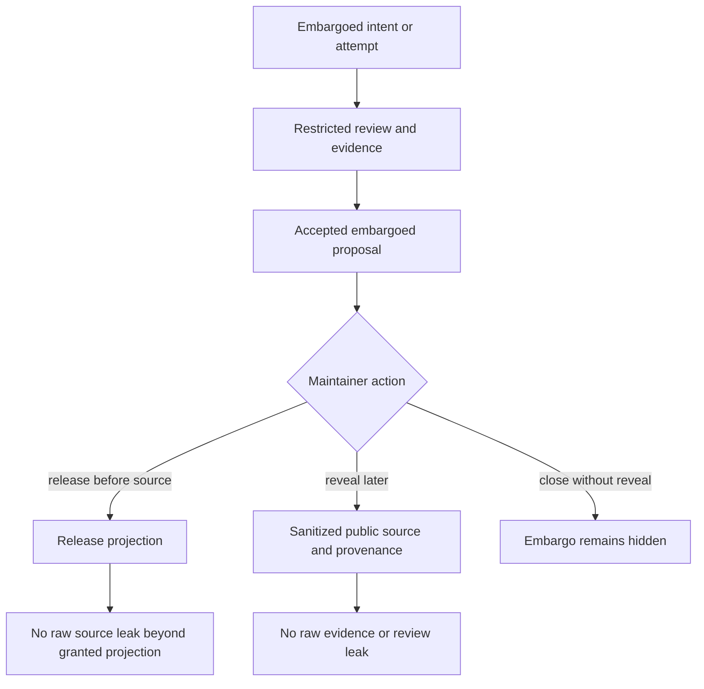

# Embargoed Security-Fix Workflow (NER-358)

## Summary

NER-358 defines the release-before-source workflow for permissioned Forge. An
authorized maintainer should be able to accept, build, sync, and release an
embargoed security fix while exploit-bearing source, private paths, raw evidence,
diffs, and review history stay hidden until a separate reveal or publish action.

---

## Problem Frame

Forge now has the local/native substrate, recipient-scoped projections, org
identity, and encrypted private content needed to carry restricted work inside
one Forge graph. The remaining product gap is a security workflow where the fix
must move before the source can be public.

Theo's source-control critique is the pressure test: Git and GitHub mainly make
visibility a repository or PR property, while real projects often need private
files, private in-flight work, and security fixes that can be built or released
before the source becomes visible. That forces split repos, hidden forks, copied
patches, and manual embargo choreography. Forge should instead model the
security fix as a work package with explicit embargo state, role-authorized
grants, encrypted private content, trusted evidence, and staged reveal.

The first NER-358 slice should optimize for release-before-source. Private
vulnerability review and staged public reveal are supporting flows, not separate
products.

---

## Key Decisions

- **Release-before-source is the primary workflow.** NER-358 is not only private
  review; it must prove that authorized actors can prepare a release artifact
  while source and raw provenance remain embargoed.
- **Embargo is a stateful workflow, not a stronger private label.** Embargoed
  work starts invisible by default, requires explicit grants, supports release
  projection, and ends through reveal or closure.
- **Accept does not reveal.** A decision can establish that an embargoed fix is
  accepted and trusted, but public visibility changes only through a separate
  reveal or publish action.
- **Sanitized provenance is the public bridge.** Public output may carry the
  accepted content reference, decision actor, timestamp, trust level, and check
  summary, but not exploit-bearing diffs, raw evidence, private paths, review
  discussion, or command excerpts.
- **Future-only revocation remains honest.** Revocation blocks future
  Forge-managed sync, export, review, materialization, release, and reveal, but
  does not claim to erase content already materialized by an authorized actor.

---

## Actors

- A1. **Security maintainer:** creates or marks work as embargoed, controls
  grants, approves release-before-source, and decides reveal timing.
- A2. **Fix author:** produces the patch and evidence under embargo without
  exposing exploit-bearing source or paths to unauthorized recipients.
- A3. **Authorized reviewer:** receives scoped inspect/materialize access for
  private review, reproduction, or validation.
- A4. **Release automation:** receives only the allowed release projection needed
  to build or ship the fix.
- A5. **Public recipient:** receives only revealed source and sanitized
  provenance after the embargo is lifted.
- A6. **Unauthorized recipient:** receives no existence signal unless policy
  explicitly grants a safe coordination view.
- A7. **Forge CLI:** enforces embargo state, grants, encrypted content handling,
  projection, audit, release, and reveal boundaries.

---

## Key Flows

- F1. **Create or mark an embargoed fix**
  - **Trigger:** A maintainer or authorized actor starts work on a vulnerability
    fix that would reveal exploit details if public.
  - **Actors:** A1, A2, A7.
  - **Steps:** Forge creates or updates the work package with embargoed
    visibility, applies private path/content labels where needed, and records
    the acting authority and reason.
  - **Outcome:** The fix exists in the Forge graph but is invisible by default
    to unauthorized recipients.

- F2. **Restricted vulnerability review**
  - **Trigger:** The maintainer needs a reviewer or service actor to inspect,
    reproduce, test, or materialize the embargoed fix.
  - **Actors:** A1, A3, A7.
  - **Steps:** Forge resolves the recipient to an org principal, verifies
    role-authorized grant authority, emits only the granted projection, and
    records audit for each grant and materialization decision.
  - **Outcome:** Review can proceed without exposing private paths, evidence,
    diffs, or content to non-grantees.

- F3. **Accept under embargo**
  - **Trigger:** The embargoed proposal has enough trusted evidence for a
    decision.
  - **Actors:** A1, A2, A7.
  - **Steps:** Forge evaluates the required checks and trust policy, records the
    accepted decision, and keeps the work package embargoed.
  - **Outcome:** The fix is accepted for release planning without becoming
    public source.

- F4. **Release before source**
  - **Trigger:** A maintainer needs to ship a binary, package, patch artifact, or
    downstream projection before the source can be revealed.
  - **Actors:** A1, A4, A7.
  - **Steps:** Forge builds a recipient-scoped release projection, runs the
    required release projection checks, includes only sanctioned content and
    sanitized provenance, and refuses if the projection depends on hidden
    material the recipient may not receive.
  - **Outcome:** Release automation can ship the fix without receiving raw
    embargoed source, private review history, or restricted evidence outside
    its grant.

- F5. **Reveal or publish sanitized public state**
  - **Trigger:** The embargo ends or the maintainer chooses to publish the fix
    source and public provenance.
  - **Actors:** A1, A5, A7.
  - **Steps:** Forge verifies maintainer authority, widens the allowed public
    projection, emits sanitized provenance, and keeps raw attempts, exploit
    discussion, sensitive evidence, and restricted private paths hidden unless a
    separate policy allows them.
  - **Outcome:** The public receives source and trustworthy provenance without
    retroactive leakage of raw embargo material.

- F6. **Revoke or close access**
  - **Trigger:** A reviewer, service actor, key, role, or grant should no longer
    participate in the embargo.
  - **Actors:** A1, A3, A4, A7.
  - **Steps:** Forge records revocation and blocks future Forge-managed
    projection, materialization, release, and reveal actions for that authority.
  - **Outcome:** Future access is blocked and audited without claiming clawback
    of already materialized content.

---

## Requirements

**Embargo State and Authority**

- R1. Forge supports an `embargoed` workflow state for work packages that is
  invisible by default and distinct from normal `private` visibility.
- R2. Creating, marking, widening, revealing, publishing, or closing embargoed
  work requires role-authorized maintainer or owner authority.
- R3. Embargoed work exposes no coordination stub, path names, object ids, diffs,
  evidence, or existence signal to unauthorized recipients unless policy grants a
  safe view.
- R4. Accepting an embargoed proposal records the decision while preserving the
  embargo state.
- R5. Every embargo state change records actor, authority, reason, prior state,
  new state, and timestamp in audit.

**Grants and Restricted Review**

- R6. Embargo grants are explicit, minimal, and capability-scoped.
- R7. Authorized reviewers can receive only the capabilities granted to them,
  such as inspecting content, inspecting evidence, or materializing a private
  projection.
- R8. Review grants require both a current visibility grant and current org
  authority for the grantor and recipient.
- R9. Revoked, stale, missing, or mismatched authority fails closed before
  sync/export/review/materialization emits embargoed content or metadata.
- R10. Diagnostics for unauthorized embargo access remain generic unless the
  caller has an explicit safe-view capability.

**Release Before Source**

- R11. Forge can produce a recipient-scoped release projection for an accepted
  embargoed fix without making the source public.
- R12. Release projections include only content, metadata, and provenance the
  release recipient is authorized to receive.
- R13. Release projections run declared release checks and fail closed when the
  projection cannot be built or validated without unauthorized embargoed
  material.
- R14. Release automation does not receive raw review discussion, exploit notes,
  command excerpts, private path labels, or ungranted encrypted private overlays.
- R15. Machine-readable output distinguishes embargo-hidden content, authorized
  release projection content, sanitized provenance, and authority failures.

**Reveal, Publish, and Provenance**

- R16. Reveal or public publish is a separate policy-controlled action after
  accept.
- R17. Public reveal can include accepted content, decision actor, timestamp,
  trust/signature level, and required-check summary.
- R18. Public reveal excludes raw evidence, command logs, private paths, exploit
  discussion, unredacted diffs, private review comments, and private key or
  alias metadata.
- R19. Forge can close an embargo without public reveal when the work is
  abandoned, superseded, or handled through a non-public disclosure path.
- R20. Reveal and close actions are audited with the same authority and reason
  requirements as grant and release actions.

**Safety and Residual Risk**

- R21. Existing secret-risk exclusion, evidence redaction, encrypted private
  content, trust policy, and projection filtering remain mandatory controls for
  embargoed work.
- R22. Forge states that revocation blocks future Forge-managed access but cannot
  erase files, bundles, or artifacts already delivered to an authorized
  recipient.
- R23. Public Git export excludes unrevealed embargoed work, restricted evidence,
  private overlays, and embargo audit details.
- R24. Sync import refuses stale or incomplete embargo authority metadata instead
  of accepting a potentially replayed grant.
- R25. Dogfood must prove the end-to-end release-before-source path with an
  unauthorized recipient, an authorized reviewer, release automation, and later
  sanitized reveal.

---

## Acceptance Examples

- AE1. **Covers R1, R2, R3, R5.** Given a maintainer marks a vulnerability fix
  as embargoed, unauthorized recipients cannot see the work package exists and
  the audit records the authority and reason.
- AE2. **Covers R6, R7, R8, R9.** Given a maintainer grants an external reviewer
  `sync_materialize`, the reviewer can materialize the allowed projection only
  while the grant, org identity, and decrypt authority are current.
- AE3. **Covers R4, R16.** Given an embargoed proposal is accepted, the decision
  is recorded but public sync/export still hides the source until reveal or
  publish.
- AE4. **Covers R11, R12, R13, R14.** Given release automation is granted a
  release projection, Forge emits only sanctioned release content and refuses if
  the release would require ungranted source, evidence, or private overlays.
- AE5. **Covers R17, R18, R20.** Given the embargo ends, a maintainer can reveal
  sanitized source and provenance while raw evidence, review discussion, private
  paths, and exploit notes stay restricted.
- AE6. **Covers R19, R20.** Given a fix is superseded or abandoned, a maintainer
  can close the embargo without public reveal and the closure is audited.
- AE7. **Covers R21, R22, R23, R24.** Given a stale bundle or revoked reviewer
  tries to sync embargoed material, Forge fails closed and explains future-only
  revocation without claiming local clawback.
- AE8. **Covers R25.** Given a dogfood repo contains a vulnerable public core and
  embargoed fix, the dogfood matrix proves unauthorized omission, authorized
  review, release projection, and later sanitized reveal.

---

## Success Criteria

- A security maintainer can move a real fix from embargoed work to accepted
  decision to release projection without public source reveal.
- Unauthorized recipients receive no embargo existence signal or restricted
  content through Forge-managed surfaces.
- Authorized reviewers and release automation receive only their scoped
  projections.
- Public reveal produces useful source and provenance without leaking raw
  evidence, exploit discussion, private paths, or review history.
- Revocation and stale-authority failures are typed, machine-readable, and
  honest about residual risk.
- `ce-plan` can implement the workflow without inventing state transitions,
  actor authority, release projection behavior, or reveal semantics.

---

## Scope Boundaries

- Hosted account management, SSO, SCIM, OIDC, external KMS, and hosted
  certificate authority remain out of scope for this slice.
- Same-user zero-trust after materialization remains out of scope.
- General vulnerability disclosure program management, CVE assignment, advisory
  publication, and customer notification workflows are outside Forge's product
  identity for this slice.
- Package signing, binary reproducibility, and release-channel management are
  downstream integrations; NER-358 defines the Forge projection and provenance
  boundary they consume.
- Bulk group key distribution and multi-admin recovery UX are deferred unless
  planning finds they are required for the first dogfood path.
- Non-security private extension workflows remain covered by NER-354 and NER-356;
  NER-358 only specializes the embargoed security-fix lifecycle.

---

## Dependencies / Assumptions

- Builds on `docs/brainstorms/2026-06-23-permissioned-forge-requirements.md`
  for visibility labels, capability tiers, recipient projections, and
  future-only revocation.
- Builds on `docs/brainstorms/2026-06-24-org-identity-key-governance-requirements.md`
  for actor identity, role-authorized grants, trust boundaries, and
  principal-aware audit.
- Builds on `docs/brainstorms/2026-06-24-encrypted-private-content-requirements.md`
  for encrypted private overlays, authorized materialization, and unauthorized
  omission.
- Assumes public projection checks and release projection checks can be declared
  through Forge policy or existing check configuration during planning.
- Assumes hosted review surfaces will reuse the local projection semantics rather
  than creating a separate embargo model.
- Assumes the first implementation can dogfood the workflow in `forge-dogfood`
  without relying on hosted infrastructure.

---

## Outstanding Questions

### Resolve Before Planning

- None. The product contract is specific enough for a first `ce-plan`.

### Deferred to Planning

- [Affects R1-R5][Product/technical] Exact embargo state names and allowed state
  transitions.
- [Affects R6-R10][Technical] Exact capability-to-command matrix for embargoed
  review and release.
- [Affects R11-R15][Technical] Whether release projection is a new command or a
  constrained mode of existing sync/export surfaces.
- [Affects R13][Technical] How release projection checks are declared and
  reported in the JSON contract.
- [Affects R17-R20][Technical] Exact sanitized provenance fields for reveal,
  public Git export, and hosted review surfaces.
- [Affects R25][Testing] Exact dogfood fixture, release artifact shape, and leak
  matrix in `forge-dogfood`.

---

## Sources / Research

- `docs/brainstorms/2026-06-23-permissioned-forge-requirements.md` - defines
  work-package-first visibility, embargo as a workflow, projection guarantees,
  reveal/publish separation, and Theo-derived product pressure.
- `docs/brainstorms/2026-06-24-org-identity-key-governance-requirements.md` -
  defines org principals, role-authorized embargo grants, peer-trust boundaries,
  revocation, and audit.
- `docs/brainstorms/2026-06-24-encrypted-private-content-requirements.md` -
  defines encrypted private path overlays, authorized materialization, and
  unauthorized omission.
- `docs/plans/2026-06-23-001-feat-permissioned-forge-plan.md` - current
  permissioned projection plan and public reveal/provenance boundaries.
- `docs/plans/2026-06-24-001-feat-org-identity-key-governance-plan.md` -
  current governance plan for role authority, policy revisions, and
  revocation-aware sync/import.
- `docs/plans/2026-06-24-002-feat-encrypted-private-content-plan.md` - current
  encrypted overlay implementation plan and private-evidence boundary.
- `docs/P9_RELEASE_AUDIT.md` - current rc7 release boundary and non-claims
  around hosted identity, revocation infrastructure, hosted permissions, and
  reveal workflows.
- `SECURITY.md` - current public vulnerability-reporting posture and sensitive
  data expectations.
- [Theo's YouTube video](https://www.youtube.com/watch?v=wEAb0x3wTRc), source
  control section around 13:19-17:24 - product pressure for private files,
  private in-flight work, embargoed fixes, and change-level visibility instead
  of repo-level privacy.
