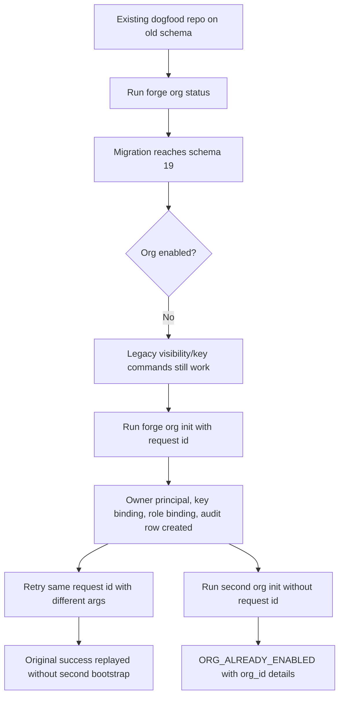
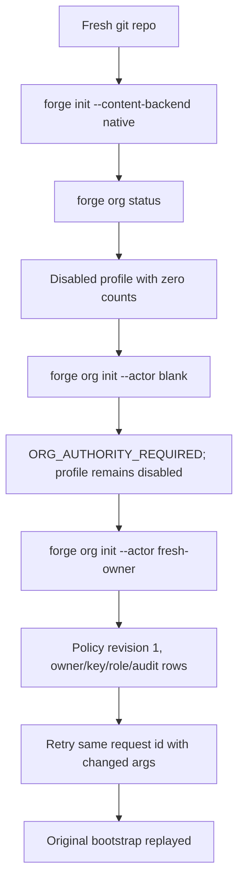

# NER-357 Org Identity Governance Dogfood

Date: 2026-06-24
Branch: `codex/ner-357-identity-governance`
Dogfood repo: `/Users/skolte/Github-Private/forge-dogfood`
Binary: `/Users/skolte/Github-Private/forge/target/debug/forge`

## Diff Summary

This slice adds the org identity governance foundation:

- Migration `019_org_identity_governance` with disabled-by-default org authority profile and org principal/key/role/issuer/audit tables.
- `forge org status`.
- `forge org init --actor <id> [--reason <text>]`.
- Request-id replay support for `org init`.
- Published `forge schema` contract entries and typed ORG_* errors.

Later NER-357 units for actor/key/role/issuer command surfaces, role enforcement, trust integration, revocation, sync/export policy, and imported authority are intentionally not part of this dogfood pass.

## Personas

- Local Forge operator: needs upgraded repos to keep working and wants clear JSON contracts for agent automation.
- Coding agent: needs idempotent command retry, typed errors, and machine-readable status.
- Release maintainer: needs migration-head and ahead-of-binary behavior to stay pinned.

## Flows Tested

## Test Matrix

| Scenario | Repo | Result | Evidence |
| --- | --- | --- | --- |
| Existing repo migrates to schema 19 on first org command | `forge-dogfood` | Pass | `org status` returned disabled profile; SQLite showed `MAX(version)=19`, 19 migration rows |
| Legacy visibility remains usable before org activation | `forge-dogfood` | Pass | `visibility policy` returned public default and supported labels/capabilities |
| Existing local key remains visible before org activation | `forge-dogfood` | Pass | `key status` returned existing local fingerprint and counts |
| `org init` bootstraps owner in upgraded repo | `forge-dogfood` | Pass | Success response included `org_id`, `owner_actor_id`, existing key fingerprint, role `owner`, policy revision 1 |
| Same request id replays original org bootstrap | `forge-dogfood` | Pass | Retry with different actor/reason returned `idempotent_replay: true` and original owner alias `skolte` |
| Duplicate bootstrap fails typed | `forge-dogfood` | Pass | Second init returned `ORG_ALREADY_ENABLED` with `org_id` |
| Post-bootstrap status reports counts | `forge-dogfood` | Pass | `principal_count=1`, `key_binding_count=1`, `role_binding_count=1` |
| DB rows align with status | `forge-dogfood` | Pass | SQLite counts: one principal, key binding, role binding, org_init audit, and `org_initialized` operation |
| Fresh repo starts disabled | `/tmp/forge-org-dogfood.qYFr4j` | Pass | `org status` returned disabled profile with zero counts |
| Blank actor fails before bootstrap side effects | `/tmp/forge-org-dogfood.qYFr4j` | Pass | `ORG_AUTHORITY_REQUIRED`; SQLite profile remained `enabled=0`, `policy_revision=0` |
| Fresh repo bootstrap succeeds | `/tmp/forge-org-dogfood.qYFr4j` | Pass | Success response included new org, owner, key, role, audit, operation id |
| Fresh repo request-id replay preserves original args | `/tmp/forge-org-dogfood.qYFr4j` | Pass | Retry with changed actor/reason replayed original owner alias `fresh-owner` |
| Schema advertises org commands/errors | `forge-dogfood` | Pass | `forge schema` included `org status`, `org init`, `ORG_NOT_ENABLED`, `ORG_ALREADY_ENABLED`, `ORG_AUTHORITY_REQUIRED` |

## Code Review Fixes Applied Before Dogfood

- Fixed `org init` request-id replay by recording an `org_initialized` operation/view in the same transaction as bootstrap.
- Added replay tests, including retry with different args preserving the original bootstrap response.
- Added schema tests for `org status`, `org init`, and ORG_* error codes.
- Added blank actor error-path test with no side effects.
- Added composite foreign keys for org aliases, key bindings, role bindings, and issuer key references.
- Added migration test for org referential integrity.

## Paper Cuts

- The blank actor error currently uses `ORG_AUTHORITY_REQUIRED` with `required_role: non_empty_actor`. This is machine-readable and tested, but may read awkwardly to humans until richer org actor validation errors land.
- `ORG_NOT_ENABLED` is published before this slice has a runtime producer. This is intentional contract pinning for later org-governed commands, but it should get a producer in the next command-surface/enforcement unit.

## Decisions For A Human

None for this slice.

## Final Status

Pass for the NER-357 foundation slice. The new org status/init feature works in an upgraded real dogfood repo and in a fresh repo, with request-id replay and schema contract verified. Remaining NER-357 requirements are later implementation units, not failures of this slice.
