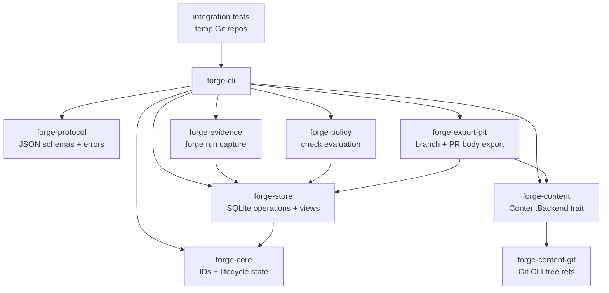
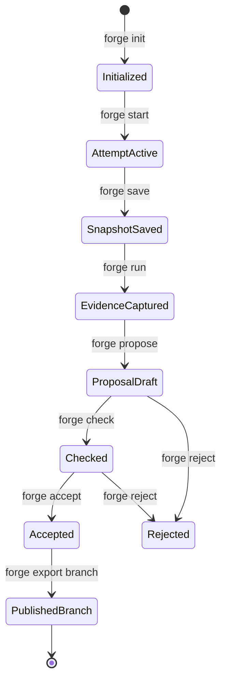
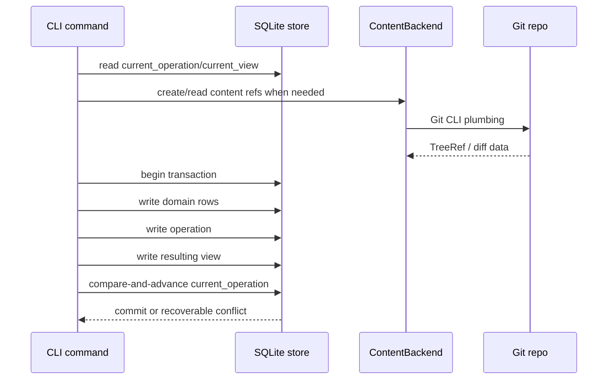

# feat: Forge v0 local agent loop

## Summary

Build Forge v0 as a Rust CLI for a solo developer running local AI agents in an existing Git repository. The first complete product loop is `init -> start -> save -> run -> propose -> check -> accept -> export branch`, backed by SQLite metadata, an operation/view state model, Git CLI-backed content snapshots, bounded evidence capture, and automated integration tests using temporary Git repositories.

This plan covers the full brainstorm scope and keeps implementation vertical: every milestone must produce a locally testable slice instead of a disconnected subsystem.

---

## Problem Frame

Forge needs to prove a narrow wedge before it earns the right to become a full VCS or hosted collaboration platform. The wedge is not "better Git"; it is a safer local change-control loop for agent-produced work. A solo developer should be able to let an agent modify files, save recoverable snapshots, capture command evidence, create a proposal, check it, accept it without mutating the current branch, and export a Git branch for normal PR workflows.

The current repository has no Rust implementation yet, so the first plan must establish the project shape and testing spine while avoiding premature native-VCS scope. The upstream requirements explicitly require vertical milestone plans and an automated local integration harness (see origin: docs/brainstorms/forge-v0-wedge-requirements.md).

---

## Requirements

**User workflow**

- R1. The CLI supports the default v0 loop and recovery surface: `forge init`, `forge start`, `forge save`, `forge restore`, `forge run`, `forge propose`, `forge check`, `forge accept`, `forge reject`, `forge show`, `forge doctor`, `forge export branch`, and `forge export pr-body`.
- R2. The first user is a solo developer in an existing Git repository; team review, hosted collaboration, and multi-user permissions stay out of v0.
- R3. `forge accept` records a decision and does not directly mutate the user's current branch.
- R4. `forge export branch` publishes an accepted proposal to a Git branch and refuses silent branch overwrite.

**Persistence and safety**

- R5. Forge stores lifecycle metadata in SQLite, including repository state, operations, views, intents, attempts, snapshots, proposals, evidence, check results, decisions, publications, conflict sets, and migrations.
- R6. Every mutating command creates an operation and resulting view, or a recoverable failed operation.
- R7. The current repository state is represented as `current_operation -> current_view`.
- R8. File-content snapshots are Git-backed through a `ContentBackend` abstraction in v0.
- R9. Stale-base accept/export fails safely unless a future explicit rebase/merge flow handles it.
- R10. `forge doctor` detects invalid metadata, interrupted operations, dangling temporary files, missing content refs where detectable, and schema mismatches.
- R11. Snapshot restore is available with conservative confirmation behavior so users can trust snapshots as recovery points.

**Agent and evidence contract**

- R12. Every v0 command supports `--json` with stable schema version, command, request ID, operation ID when created, status, data, warnings, errors, and retry metadata.
- R13. Mutating commands accept `--request-id` and use it for idempotency where practical.
- R14. `forge run -- <command>` captures command metadata plus bounded stdout/stderr excerpts by default.
- R15. Evidence records include sensitivity, visibility/redaction hooks, and trust metadata from v0.
- R16. Raw long output, full environment, credentials, `.env` contents, network payloads, and agent private reasoning are not captured by default.

**Local testability**

- R17. Every milestone includes or extends integration tests using temporary Git repositories.
- R18. Integration tests assert CLI behavior, JSON output, filesystem state, `.forge` state, and Git refs where relevant.
- R19. JSON schemas and error codes are covered by golden/snapshot tests before commands are treated as stable.

---

## Key Technical Decisions

- **Cargo workspace from the start:** The repo is greenfield, but Forge already has separable concerns: CLI protocol, domain model, store, Git-backed content, evidence, policy, and tests. A workspace avoids an early monolith without requiring each crate to become a large abstraction.
- **SQLite metadata for v0:** SQLite gives transactional metadata, migrations, indexes, and recoverability without hand-rolling a binary object database. Large evidence payloads can live outside the database as content-addressed files later.
- **Git CLI-backed content backend:** v0 should validate the workflow over existing Git repos. Native Forge content storage, native Git protocol, and packfile work are deferred until the product loop is proven.
- **Operation/view as the transaction root:** The operation log is not a sidecar audit table. Each mutating command produces a resulting view so recovery, idempotency, and future sync have a coherent state model from day one.
- **Schema-first CLI JSON:** Agents will automate Forge. Human output can evolve, but JSON response shapes, error codes, prompt behavior, and idempotency semantics must be specified before command implementation.
- **Bounded evidence by default:** Review value requires some output context, but full logs are a secret and storage hazard. v0 captures metadata and bounded excerpts; raw output capture remains opt-in or policy-required.
- **Accept and export are separate:** Accept records a decision. Export publishes to Git. This keeps local branch state safe and leaves room for future hosted review, merge queues, and server-side checks.
- **Vertical milestones over subsystem plans:** Each milestone must be locally testable through the CLI and integration harness. Subsystems should emerge inside working slices, not as isolated infrastructure.

---

## High-Level Technical Design

### Component Topology



### v0 Lifecycle



### Operation/View Write Shape



---

## Output Structure

The exact module boundaries can be adjusted during implementation, but the initial shape should make CLI contracts, domain logic, storage, Git content, evidence, policy, export, and integration tests independently understandable.

```text
Cargo.toml
crates/
  forge-cli/
    Cargo.toml
    src/main.rs
    tests/
      common/
        mod.rs
      forge_init.rs
      forge_start_save.rs
      forge_run_evidence.rs
      forge_propose_check.rs
      forge_accept_export.rs
      forge_doctor_gc.rs
      forge_pr_body.rs
  forge-protocol/
    Cargo.toml
    src/lib.rs
  forge-core/
    Cargo.toml
    src/lib.rs
  forge-store/
    Cargo.toml
    src/lib.rs
    migrations/
      001_init.sql
  forge-content/
    Cargo.toml
    src/lib.rs
  forge-content-git/
    Cargo.toml
    src/lib.rs
  forge-evidence/
    Cargo.toml
    src/lib.rs
  forge-policy/
    Cargo.toml
    src/lib.rs
  forge-export-git/
    Cargo.toml
    src/lib.rs
```

---

## Implementation Units

### U1. Workspace Scaffold and CLI Contract Spine

- **Goal:** Create the Rust workspace, CLI entrypoint, protocol crate, shared error shape, and first JSON response contract so all later commands build on stable agent-facing output.
- **Requirements:** R1, R12, R13, R19.
- **Dependencies:** None.
- **Files:**
  - `Cargo.toml`
  - `crates/forge-cli/Cargo.toml`
  - `crates/forge-cli/src/main.rs`
  - `crates/forge-protocol/Cargo.toml`
  - `crates/forge-protocol/src/lib.rs`
  - `crates/forge-cli/tests/common/mod.rs`
  - `crates/forge-cli/tests/forge_init.rs`
- **Approach:** Use a Cargo workspace with a thin CLI crate and a protocol crate that owns response envelopes, error objects, request IDs, operation IDs, and retry metadata. The initial CLI can expose `forge --version`, command routing, `--json`, and structured `NOT_IMPLEMENTED` errors for planned commands so JSON behavior is testable before feature logic exists.
- **Patterns to follow:** Cargo workspace documentation; keep workspace-level dependency versions centralized where practical.
- **Test scenarios:**
  - Running the CLI with `--json` on a stubbed command returns a response with `schema_version`, `command`, `status`, `data`, `warnings`, `errors`, and `retry`.
  - Running a stubbed mutating command with `--request-id` echoes the request ID in the JSON envelope.
  - Running a command that requires confirmation in agent/JSON mode returns a structured `CONFIRMATION_REQUIRED`-style error instead of prompting.
  - Human output for a stubbed command is concise and contains no JSON-only internals unless `--json` is set.
- **Verification:** The workspace builds, the CLI binary runs, and integration tests can invoke the binary from a temporary directory.

### U2. SQLite Store, Migrations, Operation/View Model, and Init

- **Goal:** Implement `.forge` initialization, SQLite metadata, migration tracking, repository records, operation records, view records, and `forge init`.
- **Requirements:** R5, R6, R7, R10, R17, R18.
- **Dependencies:** U1.
- **Files:**
  - `crates/forge-core/Cargo.toml`
  - `crates/forge-core/src/lib.rs`
  - `crates/forge-store/Cargo.toml`
  - `crates/forge-store/src/lib.rs`
  - `crates/forge-store/migrations/001_init.sql`
  - `crates/forge-cli/src/main.rs`
  - `crates/forge-cli/tests/common/mod.rs`
  - `crates/forge-cli/tests/forge_init.rs`
- **Approach:** Model typed IDs and core lifecycle enums in `forge-core`. Store initialization creates `.forge/forge.db`, applies migrations, writes a repository row, writes the initial operation, and writes the initial view. The store should expose a transaction helper that can create a new operation/view pair with an expected current operation.
- **Technical design:** Directionally, the first schema should include `repo`, `schema_migrations`, `operations`, `views`, `current_state`, and enough JSON/blob columns to carry view state while the domain tables are still small. Normalize only where the first milestones need querying; avoid a large speculative schema.
- **Patterns to follow:** rusqlite transaction API and migration table pattern; SQLite metadata remains the lifecycle source of truth.
- **Test scenarios:**
  - `forge init` in a temporary Git repo creates `.forge/forge.db` and returns repository metadata in JSON.
  - Re-running `forge init` in an initialized repo is idempotent or returns a structured already-initialized result without corrupting state.
  - `forge init` outside a Git repo returns a structured error for v0.
  - The initial operation and initial view exist after init and `current_operation` points to the initial operation.
  - Interrupt-simulation fixture leaves a temp file or incomplete state that `forge doctor` can identify once doctor is introduced.
- **Verification:** `forge init` is the first real vertical slice: it creates durable `.forge` state, emits JSON, and is covered by integration tests.

### U3. Git-Backed Content Backend, Save, and Restore Snapshots

- **Goal:** Implement `ContentBackend`, a Git CLI-backed implementation, `forge start`, `forge save`, and conservative snapshot restore for one active local attempt.
- **Requirements:** R2, R5, R6, R7, R8, R11, R17, R18.
- **Dependencies:** U1, U2.
- **Files:**
  - `crates/forge-content/Cargo.toml`
  - `crates/forge-content/src/lib.rs`
  - `crates/forge-content-git/Cargo.toml`
  - `crates/forge-content-git/src/lib.rs`
  - `crates/forge-core/src/lib.rs`
  - `crates/forge-store/src/lib.rs`
  - `crates/forge-cli/src/main.rs`
  - `crates/forge-cli/tests/forge_start_save.rs`
  - `crates/forge-cli/tests/common/mod.rs`
- **Approach:** `forge start` creates an intent and active attempt from the current Git HEAD. `forge save` snapshots the current worktree through the Git-backed content backend and stores a snapshot row linked to the active attempt. `forge restore <snapshot-id>` starts conservatively: require an explicit snapshot ID and confirmation unless `--yes` is supplied. For v0, one active attempt is enough; concurrent attempts are deferred.
- **Technical design:** Use Git CLI plumbing conservatively. The content backend should expose `snapshot_worktree`, `diff`, and `materialize` signatures. Avoid putting Git object IDs into `forge-core`; wrap them as backend-specific `TreeRef`/`ContentRef` values.
- **Patterns to follow:** Git's `write-tree` documentation notes the index must match the directory state before writing a tree; the implementation must handle the index/worktree boundary deliberately rather than assuming a dirty worktree automatically has a tree object.
- **Test scenarios:**
  - `forge start "intent"` creates an intent and active attempt linked to current Git HEAD.
  - `forge save` after editing a tracked file creates a snapshot with a content ref and changed-path summary.
  - `forge save` with no active attempt returns a structured error.
  - `forge save` does not capture `.forge` as user content.
  - `forge save --json` returns operation ID, attempt ID, snapshot ID, and content ref.
  - Saving twice creates two snapshots with parent linkage.
  - Restoring an earlier snapshot updates the worktree to that snapshot's content only after confirmation or `--yes`.
  - Restore refuses to run when the current worktree has uncommitted changes that would be overwritten unless a future explicit override is introduced.
- **Verification:** A temp Git repo can be initialized, edited, started, saved, and inspected through Forge metadata without requiring manual Git branch/worktree management.

### U4. Evidence Capture Through `forge run`

- **Goal:** Implement `forge run -- <command>` with bounded output excerpts, evidence metadata, sensitivity/trust fields, and operation/view updates.
- **Requirements:** R6, R12, R13, R14, R15, R16, R17, R18.
- **Dependencies:** U1, U2, U3.
- **Files:**
  - `crates/forge-evidence/Cargo.toml`
  - `crates/forge-evidence/src/lib.rs`
  - `crates/forge-core/src/lib.rs`
  - `crates/forge-store/src/lib.rs`
  - `crates/forge-cli/src/main.rs`
  - `crates/forge-cli/tests/forge_run_evidence.rs`
  - `crates/forge-cli/tests/common/mod.rs`
- **Approach:** Execute child commands with explicit cwd, capture start/end time, exit code, command/args, active attempt context, bounded stdout/stderr excerpts, truncation metadata, default sensitivity, and default `locally_observed` trust for execution metadata. Do not capture full environment. Raw output capture remains deferred unless a small opt-in flag is cheap and safe.
- **Technical design:** Store evidence metadata in SQLite. If output excerpts are small enough for v0, store them in SQLite with clear size bounds; reserve payload files for later evidence pruning. The evidence model should already include fields for redaction state and raw payload refs so later payload storage does not rewrite the conceptual model.
- **Patterns to follow:** `std::process::Command` for execution; `tempfile` for integration fixtures where command scripts or temp files are needed.
- **Test scenarios:**
  - `forge run -- <successful command>` records command, args, cwd, exit code 0, start/end time, attempt ID, and bounded stdout excerpt.
  - `forge run -- <failing command>` records non-zero exit code and still persists evidence.
  - A command producing output larger than the configured excerpt limit is truncated and records truncation metadata.
  - Environment variables are not captured by default.
  - Running without an active attempt returns a structured error unless the plan later explicitly allows repository-level evidence.
  - JSON output returns evidence ID and does not include raw long output.
- **Verification:** Evidence from commands can be inspected and later linked to proposals/check results without exposing full logs by default.

### U5. Proposal Creation, Show/Diff, and Basic Check Policy

- **Goal:** Implement `forge propose`, `forge show`, and `forge check` for the active attempt using the latest snapshot, available evidence, and a constrained local policy.
- **Requirements:** R1, R5, R7, R12, R15, R17, R18.
- **Dependencies:** U1, U2, U3, U4.
- **Files:**
  - `crates/forge-policy/Cargo.toml`
  - `crates/forge-policy/src/lib.rs`
  - `crates/forge-content/src/lib.rs`
  - `crates/forge-content-git/src/lib.rs`
  - `crates/forge-core/src/lib.rs`
  - `crates/forge-store/src/lib.rs`
  - `crates/forge-cli/src/main.rs`
  - `crates/forge-cli/tests/forge_propose_check.rs`
  - `crates/forge-cli/tests/common/mod.rs`
- **Approach:** `forge propose` creates a proposal and first proposal revision from the latest snapshot. `forge show` displays proposal summary, changed paths, evidence summary, and check state. `forge check` evaluates a minimal policy: required command evidence exists, matches the active proposal revision context where possible, and passed. Policy can start from simple defaults or a tiny `.forge/policy.forge` format.
- **Technical design:** Keep check policy intentionally constrained: command name/pattern, required success, freshness against proposal revision, and evidence IDs used. Avoid a general policy language.
- **Patterns to follow:** Serde/serde_json for stable JSON output; insta-style snapshot testing for JSON responses and human summaries.
- **Test scenarios:**
  - `forge propose` creates a proposal revision from the latest snapshot and links existing evidence from the attempt.
  - `forge propose` without a saved snapshot returns a structured error.
  - `forge show --json` returns proposal ID, revision ID, base ref, proposed content ref, changed paths, evidence summary, and current check state.
  - `forge check` passes when required evidence exists and has exit code 0.
  - `forge check` fails or reports missing when required evidence is absent.
  - `forge check` marks results stale when the proposal revision changes after evidence was captured, if that relationship is detectable in v0.
- **Verification:** A temp repo can run through init/start/save/run/propose/check with assertions over proposal and check metadata.

### U6. Accept, Reject, Stale-Base Protection, and Git Branch Export

- **Goal:** Implement decision recording through `forge accept`/`forge reject`, stale-base protection, and `forge export branch`.
- **Requirements:** R3, R4, R5, R6, R7, R8, R9, R12, R17, R18.
- **Dependencies:** U1, U2, U3, U4, U5.
- **Files:**
  - `crates/forge-export-git/Cargo.toml`
  - `crates/forge-export-git/src/lib.rs`
  - `crates/forge-content-git/src/lib.rs`
  - `crates/forge-core/src/lib.rs`
  - `crates/forge-store/src/lib.rs`
  - `crates/forge-cli/src/main.rs`
  - `crates/forge-cli/tests/forge_accept_export.rs`
  - `crates/forge-cli/tests/common/mod.rs`
- **Approach:** `forge accept` records an approval decision for a proposal revision. `forge reject` records rejection. `forge export branch` creates a Git branch from an accepted proposal without mutating the current branch. Export refuses to overwrite an existing branch unless a future explicit force option is introduced. Stale-base detection compares the proposal's expected base against the current target ref and fails safely when they differ.
- **Technical design:** Use Git CLI for branch publication. The export layer should create a commit or branch from the proposal content in a way that is safe and testable; the exact Git plumbing can be finalized during implementation, but it must not require checking out or mutating the user's current branch.
- **Patterns to follow:** Git branch/ref plumbing docs, especially around tree/commit/ref creation; keep Git IDs in adapter/export metadata rather than core domain types.
- **Test scenarios:**
  - `forge accept` records a decision and does not change the current Git branch.
  - `forge reject` records a rejection and prevents export unless policy later allows exporting rejected proposals.
  - `forge export branch <name>` creates a Git branch from an accepted proposal.
  - Export refuses to overwrite an existing Git branch.
  - Export fails with structured stale-base error when the target branch moved after proposal creation.
  - JSON output includes decision ID, publication ID when created, exported branch name, and related proposal revision.
- **Verification:** The full v0 loop can produce an accepted proposal and exported Git branch in a temporary repo while leaving the current branch untouched.

### U7. Doctor, GC Dry-Run, PR Body Export, and End-to-End Harness

- **Goal:** Add baseline `forge doctor`, GC dry-run, PR-body export, and full end-to-end integration coverage for the v0 wedge.
- **Requirements:** R1, R10, R17, R18, R19.
- **Dependencies:** U1, U2, U3, U4, U5, U6.
- **Files:**
  - `crates/forge-cli/src/main.rs`
  - `crates/forge-store/src/lib.rs`
  - `crates/forge-export-git/src/lib.rs`
  - `crates/forge-cli/tests/common/mod.rs`
  - `crates/forge-cli/tests/forge_init.rs`
  - `crates/forge-cli/tests/forge_start_save.rs`
  - `crates/forge-cli/tests/forge_run_evidence.rs`
  - `crates/forge-cli/tests/forge_propose_check.rs`
  - `crates/forge-cli/tests/forge_accept_export.rs`
  - `crates/forge-cli/tests/forge_doctor_gc.rs`
  - `crates/forge-cli/tests/forge_pr_body.rs`
- **Approach:** `forge doctor` validates `.forge` presence, schema version, current operation/view, basic referential integrity, dangling temp files, and content refs where detectable. GC dry-run reports unreachable evidence/snapshot candidates without deleting by default. PR-body export summarizes intent, changed paths, evidence/check results, decision state, and export metadata while respecting sensitivity labels.
- **Technical design:** Keep doctor and GC dry-run conservative. False positives are annoying, but destructive cleanup bugs are worse. GC execution can be deferred; dry-run is enough for v0 wedge confidence.
- **Patterns to follow:** Snapshot/golden tests for PR body and JSON output; temp Git repos for end-to-end workflow tests.
- **Test scenarios:**
  - `forge doctor` passes on a healthy repo after the full local loop.
  - `forge doctor` reports schema mismatch or missing `.forge/forge.db`.
  - `forge doctor` reports dangling temp files without deleting them.
  - GC dry-run lists unreachable candidates and performs no deletion.
  - `forge export pr-body` includes intent, proposal summary, evidence/check summary, and branch export information.
  - PR-body export omits or redacts `secret-risk` evidence excerpts.
  - A single end-to-end integration test runs the full loop from temporary Git repo to exported branch and PR body.
- **Verification:** The milestone validates the full Forge v0 wedge locally and gives `ce-work`/humans a reliable smoke test for future changes.

---

## Phased Delivery

- **Milestone 1:** U1 and U2 establish the workspace, CLI contract, SQLite store, operation/view skeleton, `forge init`, and the integration harness.
- **Milestone 2:** U3 proves local attempt and snapshot behavior through `forge start` and `forge save`.
- **Milestone 3:** U4 adds bounded command evidence through `forge run`.
- **Milestone 4:** U5 creates proposals and basic policy checks.
- **Milestone 5:** U6 and U7 complete accept/export, PR-body export, doctor, GC dry-run, and end-to-end test coverage.

These milestones can become separate detailed implementation plans if execution needs tighter task boundaries. The unit order above is the preferred dependency order.

---

## Scope Boundaries

### In Scope

- Existing Git repository support.
- CLI-first local workflow.
- Cargo workspace and Rust crate scaffold.
- SQLite metadata and migrations.
- Operation/view state model.
- Git CLI-backed content snapshots behind a `ContentBackend` abstraction.
- One active local attempt.
- Manual snapshots.
- Bounded evidence capture.
- Simple check policy.
- Decision records.
- Git branch export.
- PR-body export.
- Automated local integration tests.
- Baseline doctor and GC dry-run.

### Deferred to Follow-Up Work

- Multiple competing attempts UI.
- Native Forge content backend.
- Native Git protocol or packfile writing.
- Full semantic merge engine.
- Server-side evidence attestation.
- Fine-grained permissions.
- IDE integration.
- Automatic snapshots.
- Remote sync.
- Team review workflow.
- Destructive GC execution beyond dry-run.
- Rich policy language.

### Outside v0 Product Identity

- General-purpose Git replacement.
- Better Jujutsu.
- GitHub clone.
- Agent orchestration platform.
- CI platform.

---

## Risks & Dependencies

- **Git worktree/index semantics can surprise snapshotting:** Git-backed snapshots must deliberately handle the dirty worktree/index boundary. Mitigation: keep `ContentBackend` explicit and test dirty tracked files in temp repos before adding broader file states.
- **SQLite schema can overgrow before behavior is proven:** A comprehensive domain model is tempting. Mitigation: start with operation/view and the minimum domain tables needed by each milestone; migrations can refine shape.
- **Evidence can leak secrets:** Even bounded excerpts may contain sensitive data. Mitigation: conservative defaults, sensitivity labels, redaction hooks, and PR-body tests that block secret-risk output.
- **JSON contract drift can break agents:** Mitigation: protocol crate owns envelope/error types and integration/golden tests cover every command's JSON output.
- **Export can mutate user state if Git plumbing is careless:** Mitigation: export tests assert current branch remains unchanged and existing branch overwrite is refused.
- **Vertical milestones may still hide subsystem complexity:** Mitigation: every unit has integration tests through the CLI, not only unit tests inside crates.

---

## Documentation / Operational Notes

- Update `README.md` once U1/U2 land to describe the current runnable command set and local test workflow.
- Keep command documentation honest: commands that are scaffolded but not implemented should return structured `NOT_IMPLEMENTED` errors until their unit lands.
- PR-body export should be documented only after U7 establishes the exact summary shape and sensitivity behavior.

---

## Sources & Research

- Origin requirements: `docs/brainstorms/forge-v0-wedge-requirements.md`.
- Product/architecture context: `PRD.md`.
- Cargo workspace docs: https://doc.rust-lang.org/cargo/reference/workspaces.html.
- rusqlite docs: https://docs.rs/rusqlite/.
- serde_json docs: https://docs.rs/serde_json/latest/serde_json/.
- clap derive docs: https://docs.rs/clap/latest/clap/_derive/.
- tempfile docs: https://docs.rs/tempfile/latest/tempfile/.
- assert_cmd docs: https://docs.rs/assert_cmd/latest/assert_cmd/.
- insta docs: https://docs.rs/insta.
- Git `write-tree` docs: https://git-scm.com/docs/git-write-tree.
