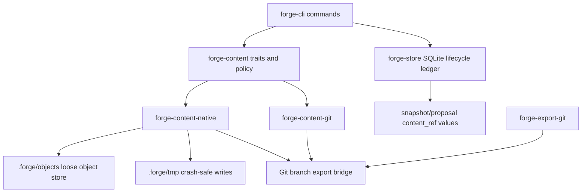
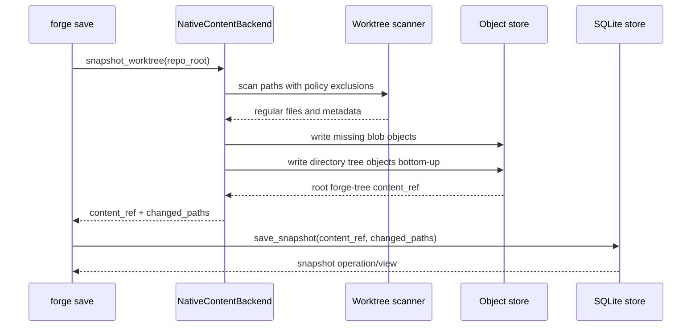

# feat: Native Forge Content Store

## Summary

Add a native Forge content backend that stores worktree snapshots as immutable content-addressed objects under `.forge/objects`, while keeping SQLite as the lifecycle ledger and Git as an export/import adapter. The first version should prove native save/restore integrity and preserve the existing local loop rather than attempting Git protocol, packfiles, remote sync, or merge semantics.

---

## Problem Frame

Forge v0 currently validates the agent-native lifecycle, but its snapshot content is still Git tree objects. That is the right bootstrap, but it means Forge has not yet proven the core standalone premise: a repository state can be captured, verified, restored, and published without Git being the internal content store.

The PRD already draws the boundary: SQLite remains the operation/view and lifecycle source of truth, while content snapshots move behind a `ContentBackend` abstraction. This plan turns that deferred native backend into the next buildable slice. The goal is not a full VCS. The goal is to replace Git tree objects as Forge's internal snapshot representation while keeping Git branch export at the edge for compatibility.

---

## Requirements

### Native Object Identity and Storage

- R1. Forge must write immutable native content objects under `.forge/objects` using domain-separated SHA-256 object IDs shaped as `f1:<object-type>:sha256:<digest>`.
- R2. Object hash input must include object type, schema version, canonical payload length, and canonical payload bytes so IDs cannot collide across object types or schema versions.
- R3. The MVP must support loose objects only; packfiles, compression, chunking, lazy objects, and remote negotiation are deferred.
- R4. Object writes must be crash-safe enough for v0: temp path, flush, sync, atomic rename on the same filesystem, and best-effort parent-directory sync before SQLite metadata points at the object.

### Native Snapshot and Restore

- R5. `forge save` must be able to create snapshots backed by native Forge tree objects instead of Git tree objects.
- R6. Native snapshots must preserve regular file contents, executable bit where available, relative paths, and directory structure.
- R7. Native snapshots must continue to exclude `.forge`, `.env`, `.env.*`, private keys, credential files, and existing secret-risk paths by default.
- R8. `forge restore` must materialize native snapshot trees exactly using the existing dirty-worktree refusal semantics and protected-path behavior.

### Compatibility and Backend Boundaries

- R9. The existing `ContentBackend` abstraction must remain the integration boundary for save/restore; core lifecycle code must not learn native object layout details.
- R10. Existing Git-backed snapshots must remain readable/restorable during the transition.
- R11. `forge export branch` must be able to publish an accepted native snapshot through a Git bridge without switching or mutating the current branch.
- R12. `forge doctor` must detect missing, malformed, or hash-mismatched native content objects referenced by snapshots and proposals.

### Testability and Agent Contract

- R13. The public JSON envelope shape and typed error behavior must stay stable for native-backed save/restore/export failures.
- R14. Integration tests must cover native save, restore, exact-tree materialization, secret exclusion, Git export, doctor integrity failures, and compatibility with existing Git-backed content refs.
- R15. The implementation must keep the full v0 dogfood loop working with native-backed snapshots: `init -> start -> save -> run -> propose -> check -> accept -> export branch -> export pr-body -> doctor`.

---

## Key Technical Decisions

- **SQLite remains the lifecycle ledger:** Native content objects are immutable payloads, not the operation/view source of truth. Snapshot rows continue to carry `content_ref`; operations, views, proposals, decisions, and publications stay in SQLite.
- **Use loose objects for the MVP:** Loose files make correctness, inspection, and doctor checks easier. Packfiles and compression solve later scale problems, but adding them before native correctness would hide failure modes behind container complexity.
- **Add a `forge-content-native` crate:** Native object encoding, object-store IO, tree walking, and tree materialization belong outside `forge-store` and outside the Git adapter. `forge-content` should own shared traits and content-ref concepts; backend-specific layout belongs in backend crates.
- **Represent native roots as backend-specific refs:** Use a prefix such as `forge-tree:<object-id>` for snapshot `content_ref` values. Existing `git-tree:<sha>` refs remain supported by the Git backend and by compatibility routing.
- **Canonical JSON is acceptable for v1 loose objects:** Use deterministic, versioned JSON records for tree objects and explicit raw bytes for blob payloads rather than inventing a binary object format in this slice. The hash envelope must include type/version/length boundaries, so a later binary format can be introduced by schema version rather than by changing semantics.
- **Git export is an adapter, not a storage dependency:** Export may synthesize a temporary Git index/tree/commit from native objects, but native snapshot save/restore must not require Git tree objects internally.
- **Native backend selection should be explicit but conservative:** Defaulting all existing repos to native immediately may obscure compatibility issues. Start with a repository setting or CLI/config flag that can select `git` or `native`, then choose the default only after integration coverage proves parity.
- **Avoid custom cryptography:** Use a small audited SHA-256 crate instead of hand-writing hashing. The PRD explicitly rejects persistent IDs based on Rust's non-persistent hash APIs.

---

## High-Level Technical Design

### Component Topology



### Native Snapshot Flow



### Native Object Layout

```text
.forge/
  objects/
    sha256/
      ab/
        abcdef...      # immutable object payload
  tmp/
    object-...         # same-filesystem temp writes
```

Object IDs identify typed records, not paths. A tree object records entries by name, kind, mode metadata, and child object ID. A blob object records file bytes; file path membership lives in trees, not blobs.

---

## Output Structure

```text
crates/
  forge-content/
    src/lib.rs
  forge-content-native/
    Cargo.toml
    src/lib.rs
  forge-content-git/
    src/lib.rs
  forge-export-git/
    src/lib.rs
  forge-store/
    migrations/
    src/lib.rs
  forge-cli/
    src/main.rs
    tests/
```

The exact module split inside `forge-content-native/src/lib.rs` may change during implementation, but the crate boundary is intentional: native storage should be independently testable without involving CLI command handling.

---

## Implementation Units

### U1. Define Native Content Contracts and Object IDs

- **Goal:** Extend the shared content layer with typed content references, object ID parsing/formatting, native object type vocabulary, and backend selection concepts without coupling core code to a concrete backend.
- **Requirements:** R1, R2, R9, R13.
- **Dependencies:** None.
- **Files:**
  - Create: `crates/forge-content-native/Cargo.toml`
  - Create: `crates/forge-content-native/src/lib.rs`
  - Modify: `Cargo.toml`
  - Modify: `crates/forge-content/Cargo.toml`
  - Modify: `crates/forge-content/src/lib.rs`
  - Test: `crates/forge-content-native/src/lib.rs`
- **Approach:** Introduce native object concepts at the content boundary: object kind, schema version, object ID, and content-ref prefix rules. Keep the existing `ContentBackend` trait stable enough that CLI save/restore still compiles against it, but add helpers so backend dispatch can identify `git-tree:` vs `forge-tree:` refs deliberately. Add `sha2` as an explicit dependency exception with a short dependency note in code/docs if the repo develops one.
- **Execution note:** Implement object ID parsing and hash-envelope behavior test-first because this is a persistent format boundary.
- **Patterns to follow:** `crates/forge-content/src/lib.rs` already centralizes shared sensitivity policy; keep reusable content concepts there and backend-specific IO in backend crates.
- **Test scenarios:**
  - Hashing identical object type/version/payload bytes produces the same `f1:<type>:sha256:<digest>` ID.
  - Hashing the same payload as different object types produces different IDs.
  - Malformed object IDs are rejected with typed errors rather than being treated as paths or raw strings.
  - `forge-tree:` and `git-tree:` refs are classified without string matching scattered through CLI/store code.
- **Verification:** Object ID behavior is deterministic, covered by unit tests, and does not use `DefaultHasher` or other non-persistent hash APIs.

### U2. Implement Loose Object Store with Crash-Safe Writes

- **Goal:** Add filesystem-backed immutable object IO under `.forge/objects` with temp-write and integrity verification primitives.
- **Requirements:** R1, R3, R4, R12.
- **Dependencies:** U1.
- **Files:**
  - Modify: `crates/forge-content-native/src/lib.rs`
  - Test: `crates/forge-content-native/src/lib.rs`
  - Test: `crates/forge-cli/tests/forge_doctor_gc.rs`
- **Approach:** Store objects by digest fanout under `.forge/objects/sha256/<prefix>/<digest>`. Writes should be idempotent: if the final object already exists and verifies, treat it as success. New writes use `.forge/tmp`, flush/sync the object file, rename into place, and best-effort sync the containing directory. Reads verify the object ID against the stored payload before returning content to callers.
- **Execution note:** Test-first around idempotent write, corrupt-object detection, and missing-object detection.
- **Patterns to follow:** `forge-store::doctor` already checks Git content refs and dangling temp files; extend the same doctor posture to native object refs rather than adding a separate command.
- **Test scenarios:**
  - Writing a new object creates the expected fanout path and returns a stable object ID.
  - Writing the same object twice does not create duplicate payloads or fail.
  - Reading an object whose payload no longer matches its object ID returns a typed integrity error.
  - A leftover `.forge/tmp/object-*` file is reported by doctor as dangling temporary state.
  - Directory sync failures on unsupported platforms do not mask file write failures; they are either best-effort warnings or typed errors according to the implementation choice.
- **Verification:** Native object IO can be exercised without Git object plumbing and exposes enough error detail for doctor and JSON envelopes.

### U3. Encode and Materialize Native Trees

- **Goal:** Implement native blob and tree object records plus worktree scan/materialization logic for regular files.
- **Requirements:** R5, R6, R7, R8, R14.
- **Dependencies:** U1, U2.
- **Files:**
  - Modify: `crates/forge-content/src/lib.rs`
  - Modify: `crates/forge-content-native/src/lib.rs`
  - Test: `crates/forge-content-native/src/lib.rs`
  - Test: `crates/forge-cli/tests/forge_start_save.rs`
- **Approach:** Walk the worktree using current policy exclusions, write file bytes as blob objects, then write tree objects bottom-up with sorted entries for canonical encoding. Preserve executable bit where the platform exposes it, and treat unsupported metadata as absent rather than failing the snapshot. Restore reads the root tree, writes files, creates directories, and removes materialized paths absent from the target tree while preserving `.forge` and secret-risk paths.
- **Execution note:** Start with failing integration tests proving native save/restore parity for tracked and untracked files before implementing materialization.
- **Patterns to follow:** Mirror the exact-tree restore expectations in `crates/forge-cli/tests/forge_start_save.rs`, especially removing `later.txt` after restoring an earlier snapshot and refusing unsaved dirty work.
- **Test scenarios:**
  - Saving a modified tracked file and an untracked safe file creates a native root tree content ref.
  - Saving with `.env` present excludes `.env` from changed paths and from the native tree.
  - Restoring an earlier native snapshot restores file bytes and removes files absent from that snapshot.
  - Restoring preserves `.forge` and does not delete secret-risk files that policy protects.
  - Tree encoding is stable regardless of filesystem directory iteration order.
  - Empty directories are either explicitly unsupported or encoded consistently; whichever behavior is chosen is documented and tested.
- **Verification:** Native snapshots can round-trip through save/restore in a temp repo without using Git tree objects as the snapshot content.

### U4. Route CLI Save/Restore Through Selectable Backends

- **Goal:** Let Forge choose the native or Git content backend while preserving existing JSON contracts and compatibility with existing `git-tree:` snapshots.
- **Requirements:** R5, R8, R9, R10, R13, R15.
- **Dependencies:** U1, U2, U3.
- **Files:**
  - Modify: `crates/forge-cli/Cargo.toml`
  - Modify: `crates/forge-cli/src/main.rs`
  - Modify: `crates/forge-store/src/lib.rs`
  - Modify: `crates/forge-store/migrations/001_init.sql`
  - Test: `crates/forge-cli/tests/forge_init.rs`
  - Test: `crates/forge-cli/tests/forge_start_save.rs`
- **Approach:** Add a minimal repository-level backend selection path. The safest first shape is a v0 setting recorded in SQLite or `.forge` config during `init`, plus an override suitable for tests. Save uses the selected backend. Restore dispatches by the stored `content_ref` prefix so old Git-backed snapshots remain restorable even after a repo switches to native. Avoid making every command accept backend flags unless the CLI contract genuinely needs it.
- **Execution note:** Characterization-first: keep existing Git-backed integration tests passing before enabling native-backed tests.
- **Patterns to follow:** Existing `command_result` idempotency and error-envelope behavior in `crates/forge-cli/src/main.rs`; existing SQLite migration style in `crates/forge-store/migrations/001_init.sql`.
- **Test scenarios:**
  - A repo initialized with native content mode saves snapshots with a `forge-tree:` content ref.
  - A repo initialized with Git content mode continues to save `git-tree:` refs.
  - Restore dispatches a `git-tree:` ref to the Git backend and a `forge-tree:` ref to the native backend.
  - Parser/usage errors and domain failures continue returning the existing JSON envelope shape.
  - Replaying a save request ID does not write duplicate native objects or snapshot rows.
- **Verification:** Existing v0 Git-backed tests remain green, and new native-mode tests prove backend selection without changing public lifecycle commands.

### U5. Export Native Snapshots Through the Git Bridge

- **Goal:** Preserve current PR workflow by exporting accepted native proposal revisions to Git branches without using Git as internal snapshot storage.
- **Requirements:** R10, R11, R13, R15.
- **Dependencies:** U3, U4.
- **Files:**
  - Modify: `crates/forge-export-git/Cargo.toml`
  - Modify: `crates/forge-export-git/src/lib.rs`
  - Modify: `crates/forge-content-git/src/lib.rs`
  - Modify: `crates/forge-cli/src/main.rs`
  - Test: `crates/forge-cli/tests/forge_accept_export.rs`
- **Approach:** Export should accept a backend-resolved tree abstraction rather than assuming `git-tree:<sha>`. For native refs, materialize a temporary Git index from the native tree entries, write a Git tree, create a commit on the accepted base, and update the requested branch with the existing no-overwrite/reconcile behavior. Current-branch safety remains mandatory.
- **Execution note:** Test-first for native accepted proposal export, because this is the main compatibility promise while Forge moves internal content away from Git.
- **Patterns to follow:** Current `forge-export-git::export_branch` stale-base and branch-reconcile behavior; current tests that assert export leaves the current branch unchanged.
- **Test scenarios:**
  - Accepted native proposal exports to a Git branch whose tree contains the safe changed files.
  - Exported branch excludes `.forge`, `.env`, and secret-risk paths.
  - Export refuses stale base for native proposals.
  - Export reconciles an already-created branch only when the existing commit matches the expected native tree and base parent.
  - Export still refuses unrelated existing branches.
- **Verification:** Native-backed full loop can produce a Git branch usable by existing PR workflows.

### U6. Extend Doctor and GC Dry-Run for Native Objects

- **Goal:** Make native object integrity observable and recoverable enough for dogfooding.
- **Requirements:** R4, R12, R14, R15.
- **Dependencies:** U2, U3, U4.
- **Files:**
  - Modify: `crates/forge-store/src/lib.rs`
  - Modify: `crates/forge-content-native/src/lib.rs`
  - Test: `crates/forge-cli/tests/forge_doctor_gc.rs`
- **Approach:** `forge doctor` should enumerate snapshot/proposal `forge-tree:` refs, verify the root object exists, recursively verify tree/blob child refs, detect hash mismatches, and report dangling temp files. `forge gc --dry-run` should report unreachable native objects without deleting them; actual deletion remains out of scope.
- **Execution note:** Use direct filesystem corruption fixtures before adding broader recursive traversal tests.
- **Patterns to follow:** Existing doctor checks for schema version, current operation/view, foreign-key violations, dangling temp files, and missing Git content refs.
- **Test scenarios:**
  - Doctor passes a healthy native-backed full loop.
  - Deleting a referenced native blob causes doctor to report a missing content object.
  - Corrupting a referenced native object causes doctor to report a hash mismatch.
  - An unreferenced native object appears in GC dry-run output but is not deleted.
  - A malformed native tree object is reported without panicking or hiding other doctor issues.
- **Verification:** Doctor can distinguish healthy native storage, missing referenced content, corrupted referenced content, and unreachable unreferenced content.

### U7. Update Documentation and Dogfood Native Mode

- **Goal:** Document the native backend honestly and prove the existing loop with native storage enabled.
- **Requirements:** R13, R14, R15.
- **Dependencies:** U4, U5, U6.
- **Files:**
  - Modify: `README.md`
  - Modify: `PRD.md`
  - Test: `crates/forge-cli/tests/forge_pr_body.rs`
  - Test: `crates/forge-cli/tests/forge_propose_check.rs`
  - Test: `crates/forge-cli/tests/forge_run_evidence.rs`
- **Approach:** Update docs to describe Forge as Git-compatible but no longer Git-dependent for internal snapshots when native mode is enabled. Add one integration path that exercises native mode through PR-body export and doctor. Keep limitations visible: no packfiles, no remote sync, no semantic merge, no automatic snapshots.
- **Execution note:** Verification-first; this unit should mostly expose missed integration gaps from earlier units.
- **Patterns to follow:** README safety-defaults section and current plan/PR language that frames Forge v0 as a local wedge rather than a Git replacement.
- **Test scenarios:**
  - Native full loop passes from init through doctor.
  - PR body for a native-backed proposal summarizes intent, paths, evidence, check, decision, and publication without exposing object internals unnecessarily.
  - Evidence captured before a later native snapshot is still treated as stale for the newer proposal revision.
  - Native mode does not change `forge run` redaction or timeout behavior.
- **Verification:** Full workspace tests pass, native dogfood loop passes, and documentation matches implemented behavior without overstating standalone completeness.

---

## Scope Boundaries

### In Scope

- Loose native content objects under `.forge/objects`.
- SHA-256 domain-separated object IDs.
- Native blob and tree records for regular files.
- Native save and restore behind `ContentBackend`.
- Backend selection and compatibility with existing `git-tree:` refs.
- Git branch export from native proposal revisions.
- Doctor and GC dry-run visibility for native objects.
- Integration tests for the existing v0 loop in native mode.

### Deferred to Follow-Up Work

- Packfiles, compression, chunking, object indexes, and compaction.
- Native remote sync or hosted object negotiation.
- Native Git protocol, native packfile writing, or replacing `git` CLI usage in export.
- Semantic merge, conflict materialization, and competing attempt resolution.
- Automatic snapshots and retention policy execution.
- Large-file policy prompts and storage-budget enforcement beyond basic object accounting.
- Symlink, submodule, sparse checkout, and platform-specific special file support unless implementation discovers a cheap safe subset.
- Actual GC deletion; this plan only requires dry-run reporting for native objects.

### Outside This Slice

- Replacing Git as a collaboration protocol.
- Building a hosted Forge service.
- Making Forge command-compatible with Git.

---

## System-Wide Impact

This plan changes Forge's content identity boundary. Snapshot `content_ref` values stop being synonymous with Git tree IDs once native mode exists, so every caller must treat them as backend references and dispatch deliberately. Export, doctor, restore, proposal binding, and PR-body paths all need compatibility tests because they currently transitively assume Git-backed refs in at least one layer.

This also introduces persistent object-format commitments. Even if the object payload format is intentionally simple, object ID calculation and path layout become migration-sensitive and should be treated like schema design rather than ordinary serialization code.

---

## Risks and Mitigations

- **Object format churn can strand early repositories:** Keep schema version in the hash envelope and object payloads. Add tests that malformed or future-version objects fail read-only rather than being misread.
- **Crash safety is easy to overclaim:** Use conservative write ordering and doctor checks, but document platform limits. Do not claim database-grade durability for object writes until crash simulation exists on target platforms.
- **Native export can silently diverge from restore:** Drive export from the same native tree traversal/materialization semantics and assert exported Git tree contents in integration tests.
- **Backend selection can fragment tests:** Keep existing Git-backed tests and add a focused native-mode matrix for save/restore/export/doctor rather than duplicating every CLI test.
- **Loose objects can grow quickly:** Limit this plan to correctness and dry-run reachability reporting. Pack/compression/GC deletion should be planned after object identity and doctor behavior are stable.
- **Path handling can become security-sensitive:** Normalize repository-relative paths, reject path traversal, preserve protected path policy, and test odd path inputs where the platform allows them.

---

## Dependencies and Prerequisites

- `sha2` or equivalent audited SHA-256 implementation for canonical object IDs.
- Existing SQLite migration and operation/view machinery in `forge-store`.
- Existing secret-risk path policy in `forge-content`.
- Existing integration harness using temporary Git repositories under `crates/forge-cli/tests`.
- Git CLI remains available for branch export in this slice.

---

## Phased Delivery

- **Milestone 1:** U1 and U2 define object identity and safe loose-object IO.
- **Milestone 2:** U3 and U4 make native save/restore available behind backend selection while preserving Git-backed compatibility.
- **Milestone 3:** U5 and U6 make native snapshots publishable and inspectable.
- **Milestone 4:** U7 documents and dogfoods the native-backed local loop.

---

## Sources and Research

- Product/storage source of truth: `PRD.md`, especially Storage Architecture, Object Identity, Crash-Safe Writes, MVP Scope, Dependency Policy, and Testing Strategy.
- v0 requirement boundary: `docs/brainstorms/forge-v0-wedge-requirements.md`, which explicitly defers native Forge content backend after Git-backed v0.
- Current implementation baseline: `crates/forge-content/src/lib.rs`, `crates/forge-content-git/src/lib.rs`, `crates/forge-store/src/lib.rs`, `crates/forge-cli/src/main.rs`, and `crates/forge-cli/tests`.
- Previous shipped slice: `docs/plans/2026-05-28-002-hardening-forge-v0-local-loop-plan.md`.
- Rust filesystem durability primitives: `std::fs::File` docs for `sync_all`, `sync_data`, and file creation behavior: https://doc.rust-lang.org/std/fs/struct.File.html.
- SHA-256 dependency reference: RustCrypto `sha2` crate docs: https://docs.rs/sha2.
- Scale boundary for deferred pack work: Git pack format documentation: https://git-scm.com/docs/gitformat-pack.
