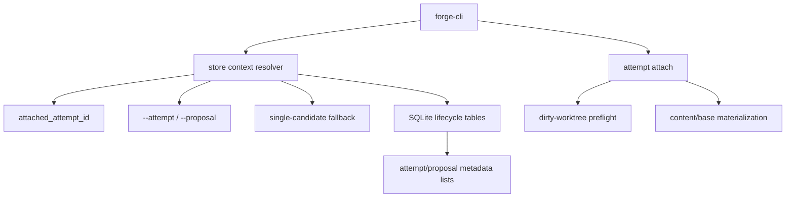

# feat: Competing Local Attempts

## Summary

Add a first competing-attempt workflow to Forge: multiple attempts can exist for one intent, humans can attach an attempt into the current checkout, agents can pass explicit attempt/proposal IDs, and review surfaces can compare candidate proposals by metadata. This plan keeps the current single-checkout model and deliberately defers parallel worktrees, semantic merge, and file-diff comparison.

## Problem Frame

Forge now has a complete single-attempt local loop and native snapshot storage. That proves a safe linear workflow, but the product thesis depends on letting agents make multiple tries and letting a human choose the best proposal without manually juggling branches, scratch commits, or folders.

The current implementation still routes most operations through "latest active attempt" or "latest proposal" helpers. That is acceptable for one attempt, but it becomes unsafe once more than one attempt or proposal exists. This plan turns attempt/proposal context into an explicit resolution boundary while preserving today's no-flag path when the context is unambiguous.

---

## Requirements

**Attempt lifecycle and grouping**

- R1. Forge must allow multiple attempts for a repository and multiple attempts under one intent.
- R2. `forge start <intent>` must keep working as today's simple path: create a new intent, create an attempt, and attach that attempt.
- R3. Forge must provide an adjacent command for starting another attempt under an existing intent without forcing a new intent.
- R4. Attempt-scoped records must bind to the resolved attempt: snapshots, evidence, proposals, checks, decisions, and publications must not drift to the global latest attempt.

**Context selection**

- R5. Forge must persist an attached attempt for human-oriented workflows.
- R6. Attempt-scoped commands must accept explicit `--attempt <id>` where practical; explicit attempt selection wins over attached state.
- R7. If no explicit attempt is supplied, Forge may use the attached attempt. If none is attached, Forge may fall back only when exactly one active attempt exists.
- R8. Ambiguous or invalid attempt resolution must return typed JSON errors such as `AMBIGUOUS_ATTEMPT` and `UNKNOWN_ATTEMPT`.
- R9. JSON success responses for attempt-scoped commands must echo the resolved `attempt_id`.

**Attach and materialization**

- R10. `forge attempt attach <attempt-id>` must refuse unsaved dirty work using the existing restore safety posture.
- R11. Attaching an attempt with snapshots must materialize that attempt's latest snapshot into the current checkout.
- R12. Attaching an attempt with no snapshots must materialize the attempt's base revision into the current checkout.
- R13. Attach materialization must preserve `.forge`, `.env`, `.env.*`, private keys, credential files, and existing secret-risk paths.

**Proposal selection and publication**

- R14. Proposal-sensitive commands must accept explicit `--proposal <id>` where practical.
- R15. `forge check` may default to the latest proposal only when exactly one candidate exists for the resolved attempt.
- R16. `forge accept`, `forge reject`, and `forge export branch` must require explicit proposal selection when multiple candidate proposals exist.
- R17. Ambiguous proposal resolution must return a typed JSON error such as `AMBIGUOUS_PROPOSAL` and include candidate proposal IDs.
- R18. JSON success responses for proposal-scoped commands must echo `attempt_id`, `proposal_id`, and `proposal_revision_id`.

**Metadata comparison**

- R19. Forge must provide metadata-first attempt and proposal listing/show surfaces.
- R20. The metadata surfaces must include intent, attempt ID, proposal ID, changed paths, evidence status, check status, decision status, and publication status where available.
- R21. Existing single-attempt dogfood loops must keep passing without new flags.

---

## Key Technical Decisions

- **Represent attachment as repository context, not attempt status:** Add a nullable `attached_attempt_id` to the repository's current context state rather than overloading `attempts.status`. Multiple attempts can remain `active`; attachment is just the current checkout context.
- **Add a real migration step:** This work needs schema changes beyond the original `001_init.sql`. Introduce a sequential migration path instead of continuing to accumulate ad hoc compatibility ALTERs in `apply_migrations`.
- **Use a resolver boundary in `forge-store`:** Replace direct calls to `active_attempt`, `latest_snapshot`, and `latest_proposal` in feature paths with resolver-style helpers that accept optional attempt/proposal IDs and return typed context records. CLI code should not hand-roll ambiguity queries.
- **Keep simple commands backward compatible:** Existing commands with no selector keep working when there is exactly one plausible context. Ambiguity becomes an explicit error only when multiple candidates exist.
- **Attach uses content backend restore semantics:** For attempts with snapshots, attach should dispatch by the snapshot's `content_ref`, preserving Git-backed and native-backed compatibility. For attempts without snapshots, attach materializes the Git base tree recorded on the attempt.
- **Metadata comparison is a view problem first:** Start with list/show summaries over existing lifecycle records. Do not implement file diffs, overlap detection, conflict sets, or merge behavior in this slice.

---

## High-Level Technical Design

Attempt and proposal resolution should have one owned path:

1. If explicit ID is supplied, validate it belongs to the current repo and has an allowed status.
2. Else if an attached attempt is present and valid, use it.
3. Else if exactly one active attempt exists, use it.
4. Else return an ambiguity error with candidate IDs.

Proposal resolution mirrors this pattern within a resolved attempt:

1. If explicit proposal ID is supplied, validate it belongs to the resolved attempt.
2. Else if the command allows defaulting and exactly one candidate proposal exists, use it.
3. Else return an ambiguity error with candidate IDs.

---

## Implementation Units

### U1. Add Repository Context Migration and Attempt Resolvers

- **Goal:** Introduce durable attached-attempt state and store-level context resolution primitives without changing CLI behavior yet.
- **Requirements:** R1, R4, R5, R7, R8.
- **Files:**
  - Modify: `crates/forge-store/migrations/001_init.sql`
  - Modify: `crates/forge-store/src/lib.rs`
  - Test: `crates/forge-cli/tests/forge_init.rs`
  - Test: `crates/forge-cli/tests/forge_attempts.rs`
- **Approach:** Add `attached_attempt_id` to the persisted repository context and implement a proper migration sequence for existing databases. Add store types such as `AttemptSelector`, `ResolvedAttempt`, and context-resolution helpers. `forge start` should begin attaching the attempt it creates, while old single-attempt save/run/propose behavior remains unchanged through single-candidate fallback.
- **Execution note:** Characterization-first. Capture current single-attempt behavior before replacing implicit helpers.
- **Patterns to follow:** Existing `apply_migrations`, `open_repository`, `active_attempt`, and request-id replay behavior in `crates/forge-store/src/lib.rs`.
- **Test scenarios:**
  - Existing database without `attached_attempt_id` migrates on a normal command.
  - `forge start` attaches the created attempt.
  - With one active attempt and no attached attempt, `forge save` still resolves that attempt.
  - With two active attempts and no explicit/attached attempt, attempt-scoped commands return `AMBIGUOUS_ATTEMPT`.
  - Unknown explicit attempt ID returns `UNKNOWN_ATTEMPT`.
- **Verification:** Store-level context resolution is covered before CLI selectors are broadly wired.

### U2. Add Attempt Commands and Intent Reuse

- **Goal:** Provide a human and agent surface for creating, listing, showing, and attaching attempts.
- **Requirements:** R1, R2, R3, R5, R9, R19, R20.
- **Files:**
  - Modify: `crates/forge-cli/src/main.rs`
  - Modify: `crates/forge-store/src/lib.rs`
  - Test: `crates/forge-cli/tests/forge_attempts.rs`
- **Approach:** Add a `forge attempt` subcommand family. Keep `forge start <intent>` as the simple new-intent path. Add `forge attempt start --intent <intent-id>` for a second attempt under an existing intent. Add `forge attempt list` and `forge attempt show <id>` for metadata review. Add `forge attempt attach <id>` in this unit as a metadata operation only if materialization is not ready yet; U3 completes attach semantics.
- **Execution note:** Test-first around JSON shape and command parsing because these commands become agent-facing contract.
- **Patterns to follow:** CLI subcommand structure in `crates/forge-cli/src/main.rs` and JSON envelope tests in `crates/forge-cli/tests/forge_init.rs`.
- **Test scenarios:**
  - `forge attempt start --intent <id>` creates a second attempt under the same intent.
  - `forge attempt list --json` shows both attempts with IDs, intent IDs, base heads, status, and attached marker.
  - `forge attempt show <id> --json` returns latest snapshot/proposal/evidence/check/decision/publication summaries for that attempt.
  - Human output remains concise and does not dump raw database JSON.
  - Parser errors for missing attempt ID or intent ID still return JSON envelopes in `--json` mode.
- **Verification:** A user can discover competing attempts without inspecting SQLite.

### U3. Implement Attach Materialization

- **Goal:** Make `forge attempt attach <id>` align checkout content with the attached attempt safely.
- **Requirements:** R10, R11, R12, R13.
- **Files:**
  - Modify: `crates/forge-cli/src/main.rs`
  - Modify: `crates/forge-store/src/lib.rs`
  - Modify: `crates/forge-content-git/src/lib.rs`
  - Test: `crates/forge-cli/tests/forge_attempts.rs`
  - Test: `crates/forge-cli/tests/forge_start_save.rs`
- **Approach:** Reuse the existing dirty-worktree refusal semantics before materialization. If the target attempt has a latest snapshot, restore by content-ref dispatch (`git-tree:` or `forge-tree:`). If it has no snapshot, materialize the attempt's base commit tree through the Git adapter without switching the current branch. Record the attach operation only after materialization succeeds.
- **Execution note:** Test-first around "dirty attach refuses and leaves files unchanged" and "empty attempt restores base" because these are safety boundaries.
- **Patterns to follow:** Existing restore implementation in `crates/forge-cli/src/main.rs`, `GitContentBackend::restore_snapshot`, and native restore tests in `crates/forge-cli/tests/forge_start_save.rs`.
- **Test scenarios:**
  - Attaching a clean attempt with a latest snapshot restores that snapshot.
  - Attaching an attempt with no snapshots restores its base revision.
  - Attach refuses unsaved dirty work and leaves files untouched.
  - Attach preserves `.forge`, `.env`, and secret-risk paths.
  - Attach works for attempts whose snapshots are native-backed.
- **Verification:** Checkout content and attached attempt context cannot diverge silently.

### U4. Route Attempt-Scoped Commands Through Explicit or Attached Context

- **Goal:** Make save, run, propose, show, and PR-body paths resolve attempt context deliberately.
- **Requirements:** R4, R6, R7, R8, R9, R21.
- **Files:**
  - Modify: `crates/forge-cli/src/main.rs`
  - Modify: `crates/forge-store/src/lib.rs`
  - Test: `crates/forge-cli/tests/forge_start_save.rs`
  - Test: `crates/forge-cli/tests/forge_propose_check.rs`
  - Test: `crates/forge-cli/tests/forge_pr_body.rs`
  - Test: `crates/forge-cli/tests/forge_attempts.rs`
- **Approach:** Add `--attempt <id>` to attempt-scoped commands where it affects behavior: `save`, `run`, `propose`, `show`, `export pr-body`, and likely `restore` when snapshot IDs are not enough to infer context for current-content checks. Keep no-flag behavior when a single attempt is resolvable. Store functions should accept resolved attempt context instead of calling `active_attempt` internally.
- **Execution note:** Characterization-first for existing no-flag tests, then add multi-attempt ambiguity and explicit-ID tests.
- **Patterns to follow:** Existing command-result and request-id behavior in `crates/forge-cli/src/main.rs`; evidence/proposal binding in `crates/forge-store/src/lib.rs`.
- **Test scenarios:**
  - Existing single-attempt loop still passes without new flags.
  - `forge save --attempt <id>` saves to the selected attempt even when another attempt is attached.
  - `forge run --attempt <id>` records evidence against the selected attempt.
  - `forge propose --attempt <id>` creates a proposal for the selected attempt's latest snapshot.
  - Ambiguous no-flag save/run/propose returns `AMBIGUOUS_ATTEMPT`.
  - Success JSON echoes the resolved `attempt_id`.
- **Verification:** Agent workflows can operate with explicit attempt IDs only.

### U5. Add Proposal Selection and Ambiguity Errors

- **Goal:** Make check, accept, reject, export branch, and publication recording act on a deliberately selected proposal.
- **Requirements:** R14, R15, R16, R17, R18, R21.
- **Files:**
  - Modify: `crates/forge-cli/src/main.rs`
  - Modify: `crates/forge-store/src/lib.rs`
  - Test: `crates/forge-cli/tests/forge_propose_check.rs`
  - Test: `crates/forge-cli/tests/forge_accept_export.rs`
  - Test: `crates/forge-cli/tests/forge_attempts.rs`
- **Approach:** Add `--proposal <id>` to proposal-sensitive commands. `check` can default only when exactly one proposal exists for the resolved attempt. `accept`, `reject`, and `export branch` must require explicit proposal selection when multiple proposals exist. Store functions such as `latest_exportable_proposal`, `decide`, `record_check`, and `record_publication` should move to proposal selector inputs rather than global latest helpers.
- **Execution note:** Test-first around ambiguous accept/export because accidental publication is the highest-risk behavior.
- **Patterns to follow:** Existing stale-base protection and exact proposal-revision binding from `crates/forge-cli/tests/forge_accept_export.rs`.
- **Test scenarios:**
  - Two proposals under one attempt make `forge accept` without selector fail with `AMBIGUOUS_PROPOSAL`.
  - `forge accept --proposal <id>` records a decision for that proposal revision.
  - `forge export branch --proposal <id> <branch>` exports the selected accepted proposal.
  - Rejected proposal cannot be exported even if another proposal is accepted.
  - Stale-base behavior remains intact for selected proposals.
  - Success JSON echoes `attempt_id`, `proposal_id`, and `proposal_revision_id`.
- **Verification:** No proposal-sensitive command depends on repository-global latest proposal when ambiguity exists.

### U6. Implement Metadata-First Attempt and Proposal Review Surfaces

- **Goal:** Give humans and agents enough metadata to compare competing work without raw SQLite or Git branches.
- **Requirements:** R18, R19, R20.
- **Files:**
  - Modify: `crates/forge-cli/src/main.rs`
  - Modify: `crates/forge-store/src/lib.rs`
  - Test: `crates/forge-cli/tests/forge_attempts.rs`
  - Test: `crates/forge-cli/tests/forge_propose_check.rs`
- **Approach:** Extend `forge attempt list/show` and add either `forge proposal list` or a proposal-listing field under attempt show. Prefer an explicit `forge proposal list [--attempt <id>]` if the store data shape stays readable; otherwise keep proposal metadata under attempt show for this slice. Include changed paths, evidence/check/decision/publication status summaries, and IDs needed for follow-up commands.
- **Execution note:** Add golden-ish JSON assertions focused on fields and relationships, not brittle full snapshots.
- **Patterns to follow:** Existing `ShowRecord`, `pr_body`, and list-like JSON conventions in CLI tests.
- **Test scenarios:**
  - Attempt list identifies the attached attempt.
  - Attempt show includes latest snapshot, latest evidence, proposal summaries, check status, decision status, and publication status for that attempt only.
  - Proposal list filters by resolved attempt.
  - Metadata comparison excludes unrelated attempts/proposals.
  - Human output remains readable for two competing attempts.
- **Verification:** Reviewers can choose candidates using metadata-only surfaces.

### U7. End-to-End Compatibility, Docs, and Dogfood

- **Goal:** Prove the competing-attempt slice without regressing single-attempt or native-backed loops.
- **Requirements:** R1-R21.
- **Files:**
  - Modify: `README.md`
  - Modify: `PRD.md`
  - Test: `crates/forge-cli/tests/forge_attempts.rs`
  - Test: `crates/forge-cli/tests/forge_accept_export.rs`
  - Test: `crates/forge-cli/tests/forge_doctor_gc.rs`
- **Approach:** Add a full temp-repo integration path that creates two attempts under one intent, saves different changes, records evidence, proposes both, checks/accepts/exports the chosen proposal, and verifies the exported branch contains the selected proposal only. Update docs to describe attempts as lifecycle records and attach as current-checkout materialization, while keeping parallel worktrees clearly deferred.
- **Execution note:** Verification-first; this unit should mostly expose missed integration gaps from U1-U6.
- **Patterns to follow:** Existing dogfood-style tests in `crates/forge-cli/tests/forge_accept_export.rs` and documentation style in `README.md`.
- **Test scenarios:**
  - Existing single-attempt full loop still passes unchanged.
  - Competing-attempt full loop can export the selected proposal.
  - Native-backed competing attempts can save/propose/attach/export when native mode is enabled.
  - Doctor passes after competing-attempt operations.
  - PR body references the selected proposal rather than global latest state.
- **Verification:** `cargo fmt --all --check`, `cargo test --workspace`, `cargo clippy --workspace --all-targets -- -D warnings`, `ce-code-review mode:autofix`, and a manual dogfood loop using explicit attempt/proposal IDs.

---

## Scope Boundaries

### In Scope

- Multiple attempt records for one repository and one intent.
- Attached attempt context in the current checkout.
- Explicit `--attempt` selectors for agent-safe workflows.
- Explicit `--proposal` selectors for ambiguous proposal-sensitive commands.
- Attach materialization from latest snapshot or base revision.
- Metadata-first attempt/proposal comparison surfaces.
- Typed JSON ambiguity and unknown-ID errors.

### Deferred to Follow-Up Work

- Parallel physical worktrees or per-attempt workspace directories.
- Semantic merge, conflict materialization, conflict prediction, and overlap detection.
- File-level diff comparison between attempts or proposals.
- Hosted review, permissions, multi-user coordination, or remote attempt sync.
- Automatic agent spawning/orchestration across attempts.
- Full intent management beyond minimal intent reuse for attempt grouping.
- General retention/GC changes for attempt histories beyond existing dry-run posture.

---

## System-Wide Impact

This changes Forge's context model. Today, many commands implicitly mean "latest active attempt" or "latest proposal." After this work, that implicit route is valid only when there is exactly one candidate. Store APIs, CLI responses, PR-body generation, check/decision/publication binding, and tests all need to carry resolved attempt/proposal IDs deliberately.

This also adds a second durable repository setting: the attached attempt. Unlike content backend selection, attachment can change often and must be updated through operation/view writes so `forge doctor` and future recovery can reason about it.

---

## Risks and Mitigations

- **Hidden context can publish the wrong proposal:** Require explicit proposal selection when ambiguous and echo selected IDs in success JSON.
- **Attach can lose unsaved work:** Reuse dirty-worktree refusal and only record attachment after materialization succeeds.
- **Attempt status semantics can sprawl:** Keep the first slice to active attempts and attached context. Defer finish/abandon workflows unless implementation needs a tiny abandon command for test cleanup.
- **Migration complexity can regress old repos:** Add migration compatibility tests for repositories created before `attached_attempt_id` exists.
- **Single-attempt ergonomics can degrade:** Keep no-flag behavior green when there is one resolvable attempt/proposal.
- **Native and Git-backed content can diverge under attach:** Attach through existing content-ref dispatch for snapshots and Git-tree materialization only for base commits.

---

## Acceptance Examples

- AE1. Given an initialized repo and one intent, when the user creates two attempts under that intent and saves different changes in each, then `forge attempt list --json` shows two attempts and neither attempt's snapshots overwrite the other.
- AE2. Given two active attempts and no attached attempt, when an agent runs `forge save` without `--attempt`, then Forge returns `AMBIGUOUS_ATTEMPT` with candidate IDs.
- AE3. Given attempt A is attached and the checkout has unsaved changes, when the user runs `forge attempt attach <attempt-b>`, then Forge returns `DIRTY_WORKTREE` and leaves files unchanged.
- AE4. Given attempt B has no snapshots, when the user attaches attempt B from a clean checkout, then the checkout materializes B's base revision.
- AE5. Given two proposals exist for one resolved attempt, when the user runs `forge accept` without `--proposal`, then Forge returns `AMBIGUOUS_PROPOSAL` with candidate proposal IDs.
- AE6. Given the user accepts proposal B explicitly and exports a branch explicitly, then the exported branch contains proposal B's content and not proposal A's content.

---

## Documentation and Operational Notes

- Update `README.md` command list and safety notes with `forge attempt` and selector behavior.
- Update `PRD.md` only if the implemented slice changes the product source beyond the already documented Attempt Isolation section; avoid overstating parallel workspace support.
- Keep command examples explicit for agents: prefer `--attempt` and `--proposal`.

---

## Sources and Research

- Requirements origin: `docs/brainstorms/2026-05-28-competing-local-attempts-requirements.md`.
- Product source: `PRD.md`, especially Attempt Isolation, Proposal Semantics, Conflict and Merge Model, and v0 success criteria.
- Current implementation baseline: `crates/forge-cli/src/main.rs`, `crates/forge-store/src/lib.rs`, and `crates/forge-store/migrations/001_init.sql`.
- Current integration patterns: `crates/forge-cli/tests/forge_start_save.rs`, `crates/forge-cli/tests/forge_propose_check.rs`, `crates/forge-cli/tests/forge_accept_export.rs`, and `crates/forge-cli/tests/forge_doctor_gc.rs`.
- Prior shipped plans: `docs/plans/2026-05-28-001-feat-forge-v0-local-loop-plan.md`, `docs/plans/2026-05-28-002-hardening-forge-v0-local-loop-plan.md`, and `docs/plans/2026-05-28-003-feat-native-forge-content-store-plan.md`.
