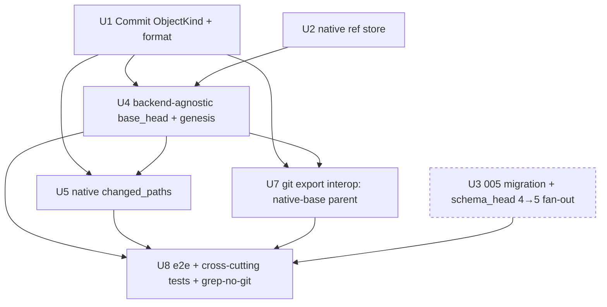

# feat: Phase 7 Slice 2 — Native commit object format + ref store + backend-agnostic `base_head` + native `changed_paths`

## Summary

Slice 1 made the native backend's **snapshot enumerator** git-binary-free (the `ignore`-crate walker). Slice 2 makes the native backend's **base anchoring and changed-paths** git-binary-free, and lays Forge's first history substrate: a native **`Commit` `ObjectKind`** (today `ObjectKind` is `Blob` + `Tree` only) that is content-addressed, domain-separated, and **intent-aware by design** — its payload can reference its tree + parent commit(s) + the intent / proposal-revision / decision that justified it + an evidence digest, the thing git's commit graph cannot represent. (The handoff calls this the "Commit/Change `ObjectKind`"; this plan implements it as a single `ObjectKind::Commit` — there is no separate `Change` kind.) A small **native ref store** under `.forge/refs/` holds the history tip (`HEAD`). The load-bearing reversal is making `base_head` **backend-agnostic**: `NativeContentBackend::current_base`/`base_content_ref` stop shelling `git rev-parse` and instead anchor on a native commit id — a **genesis commit** created over the start-time worktree (the Phase-3-marked git delegation slice 2 is explicitly allowed and required to replace) — and native `changed_paths` stops shelling `git diff --name-only` and instead diffs the base commit's tree against the freshly-walked worktree tree at name granularity. Git export survives as **interop** by resolving a native base into a deterministic synthesized git parent commit. A numbered `005_*.sql` migration (the native-object-format registry the handoff mandates "from day one") ships with the full `schema_head` 4→5 fan-out. No new error code is introduced, so `FORGE_ERROR_CODES` stays 23.

**Slice 2 is genesis-only.** The ref-store HEAD is established (the genesis commit) but does **not advance** during the lifecycle: writing *justified* commits at `accept` (and the resulting base progression + `decisions.commit_id`) is **deferred to slice 3**, where `log`/checkout/`undo` are the features that read and rewind the resulting DAG. This deferral — adopted after the doc-review gate (see Open Questions) — keeps the riskiest reversal slice free of the commit-on-accept ordering/idempotency hazards while still delivering every *named* slice-2 deliverable: the commit format, the ref store, backend-agnostic `base_head`, native `changed_paths`, the migration, and working git-export interop.

After slice 2, a native `save` is **fully git-free** for snapshot + base + `changed_paths`; only `log` / historical checkout / `forge undo` / justified-commit-writing / symlink-content / object-kind headers / git-export demotion remain for slice 3.

---

## Problem Frame

After slice 1, a native-backend `forge save` walks the worktree natively but its **base anchoring still shells git**: `NativeContentBackend::current_base` runs `git rev-parse --verify HEAD`, `base_content_ref` runs `git rev-parse <base>^{tree}` and emits a `git-tree:` ref, and `changed_paths` runs `git diff --name-only HEAD` + `git ls-files --others`. These three methods carry the `// Phase 7 (NER-138): replace with native base anchoring` markers and a guard forbidding `forge-tree:` base refs before the native walker existed (Phase 3 §4). The walker now exists (slice 1), so slice 2 is where that guard is lifted: a native repo must anchor on **its own** history, not on a git commit.

This is the riskiest reversal in the phase because `base_head` is consumed by stale-base detection (`accept` / `export`), worktree materialization (`attempt attach`), `changed_paths`, and — critically — the **git export adapter**, which today passes `base_head` straight into `git commit-tree -p <parent>`. Making `base_head` a native id breaks that one call unless export learns to synthesize a git parent. Getting this wrong either reintroduces the git dependency Phase 7 exists to remove, or breaks publication/compare. The commit-object format is a **near-permanent format commitment** (it will anchor sync/signing in Phase 9), so it must reuse the audited `f1:` versioned tag + length-prefixed domain-separated hashing (**no custom crypto**) and ship a format-version registry from day one.

---

## Requirements

- **R1. Native `Commit` `ObjectKind` + format.** Add a third `ObjectKind` (`Commit`) to `forge-content-native`, content-addressed via the existing length-prefixed, domain-separated `ObjectId::new` hashing (extend the `as_str` domain set with `"commit"`). The commit object payload references: the root **tree** id, zero-or-more **parent** commit ids, and (nullable) the **intent / proposal-revision / decision** ids that justified it + an **evidence digest**. `ObjectId::parse` / `kind()` accept `"commit"`; `Display` emits `f1:commit:sha256:<hex>`. The `evidence_digest` field, when present, is an **opaque lowercase-hex digest only** (e.g. the ledger's existing evidence `content_hash`) — never an excerpt or any free text — because the commit payload is written via `write_object` and never passes through `redact_evidence_excerpt`. The full payload (all justification fields populated) is exercised by unit tests even though slice 2 only *writes* genesis commits (all-null justification).
- **R2. Native ref store under `.forge/`.** A small, crash-atomic ref store (`.forge/refs/`) holding the history tip (`HEAD` → a commit id). Writes follow slice-1's `write_object` durability discipline (temp + `sync_all` + atomic rename + parent-dir fsync incl. newly-created ancestors; propagate-never-swallow). The store is **lock-agnostic** (never acquires `.forge/forge.lock`; callers hold it). Reading an absent HEAD yields "no tip yet", not an error. In slice 2 HEAD is **set once** (the genesis); advancing it is slice 3.
- **R3. Backend-agnostic `base_head` (the reversal).** `NativeContentBackend::current_base` returns a **native commit id** (the ref store's HEAD), lazily creating a **genesis root commit** over the walked worktree tree on first call if no HEAD exists. `base_content_ref` resolves a native base commit → its tree → a **`forge-tree:`** ref (S2: a policy-excluded tree; `.env`/keys never materialized). Both honor **S1** (no filesystem paths in `anyhow` error context). The git delegation and the `// Phase 7 (NER-138)` markers are removed. *(The origin handoff described anchoring on "a native tree/snapshot id"; this plan resolves that to a commit id — a tree id would move on every worktree edit and trip stale-base spuriously; see Key Technical Decisions.)*
- **R4. Native `changed_paths` (name-level).** Replace the `git diff --name-only HEAD` + `git ls-files --others` shell-out with a name-level diff of the **base HEAD commit's tree** against the **freshly-built worktree tree** (added / removed / blob-id-changed), computed from the tree objects `snapshot_worktree` already builds. Policy-excluded paths stay excluded; **hunk-level diff is Phase 8 — do NOT build it.**
- **R5. Git export stays working as interop.** `export branch` / `compare` / `export verify-branch` keep working when `base_head` is a native commit id. The export adapter resolves a native base → a **deterministic** synthesized git parent commit (fixed identity + `@0 +0000` date + fixed message + an empty-ambient-git-env, so reconciliation stays idempotent **across environments**); stale-base re-check and branch reconciliation compare the resolved git parent. `verify-branch` (ledger-derived, no `base_head`) and `compare` (opaque `base_head`) are unaffected.
- **R6. `005_*.sql` migration + full `schema_head` 4→5 fan-out.** A numbered `005_native_history.sql` adds the `native_object_format` registry table (seeded `f1`/`sha256`/commit-schema-version — the handoff-mandated "hash-registry / format-migration table from day one"). Bump **every** `schema_head`/`4` site: `migrations.rs` (`schema_head_is_max_version`, `fresh_apply_reaches_head_with_checksums`, `three_genesis_cases_converge_by_name`, `cd1bb3b_v1_..._converges`, the convergence-fixture stubs), `crates/forge-cli/tests/forge_init.rs` (`:170` `data.schema_version`, `:203`, `:229` `MAX(version)` at-HEAD asserts), `crates/forge-cli/tests/forge_concurrency.rs:519` (`head, 4` "reached HEAD"), `crates/forge-cli/tests/forge_migration_upgrade.rs:35` (the HEAD+1 stamp literal `5` → `6`), and `scripts/e2e-eval.sh` (doctor `schema_version=4`, `versions 1,2,3,4`, HEAD+1 insert `5`→`6`). The grep gate must catch **both** residual schema-`4` literals **and** the prior HEAD+1 literal (`5`, which moves to `6`), since the future-version stamp moves with every head bump.
- **R7. No secret-hygiene, durability, or boundary regression.** The ref store + objects live under `.forge/`, already always-excluded by `is_ignored_by_policy` (no new exclusion needed). `forge-store` stays git-free and `ignore`-free; all native-history code lives in `forge-content-native`. S1/S2 preserved (incl. on the U7 interop path). After slice 2, `grep` finds **no `git ls-files` / `git diff` / `git rev-parse` in the native snapshot/base/changed-paths path**.
- **R8. Error-code contract stability.** Prefer mapping onto existing codes. No new typed code is introduced (IO failures → path-free `anyhow` per S1; missing/corrupt objects → the existing `NativeObjectStore` `bail!`s). `FORGE_ERROR_CODES` stays 23; both `error.rs` drift-guard tests untouched. The Operational Notes record this as a deliberate tradeoff (native-history corruption is, today, indistinguishable from transient IO at the contract layer; a typed `NativeHistoryCorrupt` code is the designated slice-3 follow-up once the DAG walk makes corruption agent-distinguishable).

**Origin actors:** N/A (substrate work; no end-user actor change).
**Origin flows:** `start` (stamps `base_head` = genesis), `save` (`changed_paths` + snapshot), `accept` / `export branch` (stale-base re-check against the genesis base), `attempt attach` (`base_content_ref` materialization).
**Origin acceptance examples:** advances NER-138 whole-phase exit criteria — "make `base_head` backend-agnostic", "native changed-paths replacing `git diff`", "native Commit `ObjectKind` … native ref store under `.forge`", "no `git ls-files`/`git diff` in native paths (grep)", "git export still works as interop". (Whole-phase criteria "walks its own history / checks out any past commit / `forge undo`", and the *writing* of justified lifecycle commits, remain slice 3.)

---

## Scope Boundaries

**In scope (slice 2):** native `Commit` `ObjectKind` + commit object format + format-version registry; native ref store (genesis `HEAD` tip); backend-agnostic `base_head` (native `current_base`/`base_content_ref`, removing the git delegation); native name-level `changed_paths`; git-export-interop parent resolution; the `005` migration + full `schema_head` 4→5 fan-out.

**NOT slice 2 (slice 3 — NER-138):**
- **Writing justified lifecycle commits + HEAD advancement + base progression + `decisions.commit_id`.** Deferred after the doc-review gate: commit-on-accept's only slice-2 consumer would be stale-base-after-accept (not a named exit criterion), and it imports the slice's hardest correctness problems — the commit payload references `decision_id`, but `decide()` mints `decision_id` *inside* its `IMMEDIATE` txn, so a commit cannot be hashed over it before the txn, and the "crash-retry re-derives the identical commit" idempotency story does not hold (non-deterministic `decision_id`/timestamp). These belong with slice 3's `log`/checkout/`undo`, which both *read* the multi-node DAG and introduce HEAD-rewind semantics. **Slice-3 design note (from the product-lens review):** the first *justified* commits should include the **decider (`actor`, already in `decisions.actor`)** and an **authored-time** in their hashed bytes, because Phase 9 signs these exact bytes — a registry bump that adds them later cannot retroactively bring earlier justified commits under signed/decider-bound provenance. (Genesis commits have no decider, so their omission of actor/time is correct and creates no signing gap.) Slice 3 also resolves how a `decision_id`/`actor`/time are threaded deterministically (pre-mint vs post-txn) and whether two identical-tree accepts off the same parent are intended to collide.
- `log` / historical checkout / `forge undo` / op-restore.
- Symlink **content** round-trip (mode 120000).
- **Object-kind headers** — storing each object's kind in its own header to kill the `all_object_ids` double-hash scan. Slice 2 *extends* that scan to three kinds (`[Blob, Tree, Commit]`); slice 3 replaces it with headers.
- Demoting git export to an optional interop adapter (slice 2 keeps it wired, just parent-resolution-aware).
- Full **DAG-integrity doctor checks** (cycle / dangling-parent detection). Slice 2 adds only light read-time validation (a commit's tree exists, parents parse) — a **plan-originated** addition, not named in the handoff, flagged here so code review can scrutinize it; the `doctor`-verifies-the-DAG exit criterion lands in slice 3 where navigation makes the DAG load-bearing.

**NOT slice 2 (Phase 8 — NER-139):** native **content** diff at hunk/line granularity, 3-way merge, real mark-sweep GC, pack/delta/compression, per-attempt physical worktrees, working-tree index/status cache.

**NOT slice 2 (Phase 9):** wire protocol / ledger sync / signing.

### Deferred to Follow-Up Work

- **NER-142** (already filed): the NER-137 D1 `-z`/C-quote secret leak in the *export* path's `filter_secret_paths_from_tree` (`crates/forge-export-git/src/lib.rs`). U7 adds a **second caller** of `synthesize_git_tree`/`filter_secret_paths_from_tree` (the native-base parent), so it widens — does not merely sit beside — NER-142's surface. Either land NER-142's `-z` fix with/before U7, or U7 must carry a regression test that a non-ASCII secret-named path (e.g. `.env.café`) in the native base tree is excluded from the synthesized parent (matching the existing `diff_trees_drops_a_secret_path_with_non_ascii_bytes` pattern). The plan takes the test route (U7) and leaves the structural `-z` fix to NER-142.
- Typed `NativeHistoryCorrupt` error code (R8) — added in slice 3 if the DAG walk makes corruption agent-distinguishable from transient IO.

---

## Context & Research

### Relevant Code and Patterns

- `crates/forge-content-native/src/lib.rs` — `ObjectKind` (`Blob`+`Tree`), `ObjectId::new` (domain-separated, length-prefixed: `b"forge-object\n"` + kind + `\n` + `SCHEMA_VERSION` + `\n` + `payload.len()` + `\n` + payload), `ObjectId::parse`/`kind()`/`Display` (`f1:<kind>:sha256:<hex>`), `NativeObjectStore::write_object` (the crash-atomic + ancestor-fsync discipline to copy verbatim for the ref store), `all_object_ids` (the `[Blob, Tree]` double-hash scan), `current_base`/`base_content_ref`/`changed_paths` (the git delegation + `// Phase 7 (NER-138)` markers to remove; `git()` helper to delete once `changed_paths` is native), `scan_worktree`/`walk_worktree`/`write_tree`/`materialize_tree` (slice-1 walker; `write_tree` already returns the worktree root tree id reused by R4), `TreeObject`/`TreeEntry`, and the `#[cfg(test)]` `git_based_scan`/`run_git` differential harness (must keep compiling — slice-1 §7 dead-code trap).
- `crates/forge-content/src/lib.rs` — `ContentBackend` trait (`current_base` S1 doc, `base_content_ref` S1/S2 doc), `SnapshotContent { content_ref, changed_paths }`, `is_ignored_by_policy` (`.forge/` prefix already excludes the new ref store + objects), `is_secret_risk_path`, `FORGE_TREE_PREFIX`/`GIT_TREE_PREFIX`/`classify_content_ref`.
- `crates/forge-content-git/src/lib.rs` — the reference `current_base`/`base_content_ref`/`changed_paths` (unchanged); `create_branch_from_git_tree` (`git commit-tree <tree> -p <base_commit>` — the hard git-SHA assumption export must satisfy for native bases).
- `crates/forge-export-git/src/lib.rs` — `export_branch(repo, branch, base_commit, current_target, content_ref, message)` (passes `base_commit` as git parent + reconciliation `existing_parent == base_commit`), `diff_trees` + `git_tree_for_content_ref` + `synthesize_git_tree` (materializes `forge-tree:` refs into a temp git index via `forge_content_native::materialize_content_ref`, then `git add -A` + `write-tree` — reuse for native-base parent synthesis; `forge-export-git` already depends on `forge-content-native`), `filter_secret_paths_from_tree` (the `git ls-tree --name-only` no-`-z` path — NER-142).
- `crates/forge-cli/src/main.rs` — `command_result` acquires the repo lock **once** (acquire-once); `requires_repo_lock`/`is_mutating_command` confirm every `current_base` caller (`start`/`attempt start`/`accept`/`export branch`/`attempt attach`) is mutating and holds the lock; `backend_for_content_ref` (`git-tree:`→git, `forge-tree:`→native); `save` requires an active attempt (`NO_ACTIVE_ATTEMPT`) — so `start` (which creates the genesis via `current_base`) always precedes `save`.
- `crates/forge-store/src/migrations.rs` — `MIGRATIONS` list, `schema_head()`, and the tests to fan out (R6); the `integrity_marker` singleton `CREATE TABLE IF NOT EXISTS` + `CHECK(singleton=1)` + `INSERT OR IGNORE` pattern in `004_integrity_and_actor.sql` that `native_object_format` mirrors; the naive split-on-`;` migration applier (keep DDL/INSERT free of `;` inside string literals).
- `crates/forge-store/src/error.rs` + `crates/forge-cli/tests/forge_schema.rs` — the error-code drift-guard fan-out (left untouched per R8).
- Fan-out sites (R6): `crates/forge-cli/tests/forge_init.rs:170/203/229`, `crates/forge-cli/tests/forge_concurrency.rs:519`, `crates/forge-cli/tests/forge_migration_upgrade.rs:35`, `scripts/e2e-eval.sh`.

### Institutional Learnings

- **Slice 1 (`docs/solutions/architecture-patterns/native-worktree-walker-ignore-engine-and-index-vs-filesystem-divergence-2026-05-30.md`):** §3 S1 — strip path-bearing payloads, build a fresh path-free `anyhow` error, assert against both `to_string()` and `{:#}`. §4 the policy backstop is always-wins and reused, never forked. §6 native `changed_paths` is bound to native base anchoring — slice 2 unifies them. §7 prove-before-delete with both paths alive in one PR so `clippy -D warnings` never flags a retained reference; a silently-failed `Edit` can drop a whole deliverable — re-verify each edit landed.
- **Phase 3 (`write-binding-verification-and-content-backend-isolation-2026-05-29.md`):** §4 the confined seam this slice reverses; §5 S1 (no fs paths in `anyhow` context) and S2 (base/snapshot set policy-excluded). Slice 2 is explicitly *allowed* to emit `forge-tree:` base refs now.
- **Phase 6 (`compare-rank-on-verified-evidence-and-self-verifying-provenance-trailer-2026-05-30.md`):** §1 `forge-store` stays git-free; the git-adapter diff operates on `base_head` + content refs (R5's interop boundary). §5 the `-z`/C-quote class (NER-142) — U7 must not widen it untested.
- **Durability (Phases 1a/1b):** store-before-DB ordering, crash-atomic temp+fsync+rename+parent-dir fsync, propagate-`sync_all`, advisory-lock acquire-once-never-nested + the lock-free `run` carve-out — inherited verbatim by the commit objects AND the ref store.

### External References

- None required — slice 2 reuses the audited `sha2`/`tempfile` primitives and the slice-1 `ignore` walker already in the dependency graph. No new crate. (Confirmed against the Phase 7 "custom crypto banned / reuse the `f1:` tag" constraint.)

---

## Key Technical Decisions

- **`base_head` (native) = the native HEAD commit id, not a tree id.** The handoff/ROADMAP described "a native tree/snapshot id", but a *commit* is the right anchor: a tree id would change on every worktree edit and make stale-base fire spuriously, whereas a commit (set at genesis, advanced only by slice 3's accept) is stable across edits — matching git HEAD semantics. It also makes history intent-aware *from the first commit* and gives slice 3 a real DAG to walk instead of retrofitting commits. `base_head` stays opaque `TEXT` in the schema (no column needed); native vs git is detected by the `f1:commit:` prefix where it matters (export).
- **Genesis-only in slice 2; commit-on-accept deferred to slice 3.** This is the central scope decision, adopted after the doc-review gate. Genesis-only satisfies all four *named* deliverables (the format, the ref store, backend-agnostic `base_head`, native `changed_paths`). Writing *justified* commits at `accept` would import the slice's hardest correctness problems (the `decision_id`-minted-inside-the-txn ordering contradiction, the false content-addressed-idempotency claim, a `decide()` signature change, `intent_id` plumbing into the accept path, and the un-done-accept HEAD-rewind question) for a capability whose only consumers — `log`/checkout/`undo` — are slice 3. Deferring it there (where HEAD-rewind is introduced anyway) is the safe staging the XL phase calls for. See Scope Boundaries for the slice-3 design note.
- **Genesis root commit, created lazily on first `current_base`.** Rather than touching `forge init` (which would couple init to the backend), `current_base` ensures the ref-store HEAD exists: if absent, walk the worktree → root tree → a parentless `Commit` with null justification → write object + set HEAD → return its id. This keeps all native-history logic inside `forge-content-native` (boundary invariant). **Invariant (made explicit + tested):** every `current_base` caller is a mutating command holding the advisory lock (`command_result` acquires it once; `is_mutating_command` covers `start`/`attempt`/`accept`/`export`), and `current_base` never acquires the lock itself — so the genesis write cannot race or deadlock, and the lock-free `run` carve-out never reaches `current_base`. Because `save` requires an active attempt and `start` is what creates it (via `current_base`), the genesis is created at `start` over the *start-time* worktree — the intended base — never over a mid-`save` dirty tree. U4 adds a test asserting `current_base` is only ever invoked under the held lock and that genesis is idempotent (`read_head` short-circuits). The "a read that writes" surprise is documented and guarded; if a future read-only caller is added, it must use a non-creating `read_head` path. *(Alternative considered: explicit creation at `init` — rejected for the main.rs coupling; recorded so slice 3 can revisit.)*
- **Commit object payload (serde JSON, like `TreeObject`).** Fields: `schema_version: u32`, `tree: String` (a `f1:tree:` id), `parents: Vec<String>` (commit ids; empty for genesis), `intent_id: Option<String>`, `proposal_revision_id: Option<String>`, `decision_id: Option<String>`, `evidence_digest: Option<String>`. Hashed via `ObjectId::new(ObjectKind::Commit, payload)`. The justification ids are opaque ledger ids (never paths); `evidence_digest`, when present, is a lowercase-hex digest only (the format must not admit excerpt text — see R1/security). **No `actor`/timestamp in the v1 hashed payload** (genesis is parentless with no decider, so omitting them is correct and keeps genesis reproducible). Slice 3's *justified* commits should add `actor` + authored-time to their hashed bytes (a registry bump) so Phase 9 signs who/when — see the Scope Boundaries slice-3 note.
- **Native ref store = `.forge/refs/` with a single `HEAD` pointer file** holding the tip commit's `Display` string. Crash-atomic writes copy `write_object`'s discipline (temp in `.forge/tmp` + `sync_all` + atomic rename + parent-dir fsync incl. newly-created ancestors; errors propagate). Minimal by design — symbolic refs / named branches and HEAD *advancement* are slice 3. Lives under `.forge/`, so `is_ignored_by_policy` already excludes it from every snapshot/export.
- **Native `changed_paths` = name-level tree diff of base-HEAD-tree vs freshly-built worktree-tree.** Reuses the root tree `write_tree` already produces in `snapshot_worktree` (no second walk/hash). A path is "changed" if its blob id differs between the two trees (covers added / removed / modified). Name-level only (no hunks — Phase 8). Base tree = `read_commit(ensure_head(repo)?)?.tree`. In the normal lifecycle the genesis is created at `start`, so by `save` the base is the start-time anchor and `changed_paths` reflects edits since `start`. This intentionally does **not** chase exact `git diff` parity (reproducibility-over-parity, slice-1 §2).
- **Git export interop = resolve native base → deterministic synthesized git parent.** In `forge-export-git`, a `resolve_git_base_commit(repo_root, base_anchor)` helper: if `base_anchor` is a git SHA (git repo — detected by *not* having the `f1:commit:` prefix) → return as-is; if it is an `f1:commit:` id (native) → read its tree → `base_content_ref` (`forge-tree:`) → existing `synthesize_git_tree` → `git commit-tree <git_tree>` with a deterministic environment: **fixed** `GIT_AUTHOR_*`/`GIT_COMMITTER_*` name/email, `@0 +0000` date, a fixed message, and a **cleared ambient git identity/config env** plus `-c core.autocrlf=false` so the SHA does not drift with the operator's environment. `export_branch` uses the resolved parent for both `commit-tree -p` and the `existing_parent == <resolved>` reconciliation compare, so idempotent re-export still reconciles. Stale-base re-check (`current_target != base_commit`) compares the original anchors (both native or both git) — unchanged. Determinism is load-bearing for idempotent re-export; U7 tests it across **two fresh temp repos** (not two calls in one process) and includes an empty-tree case.
- **`all_object_ids` extends to three kinds for slice 2.** The reachability/gc scan tries `[Blob, Tree, Commit]` (domain separation guarantees only the true kind matches a digest). The extra hash per object is the documented wart that slice 3's object-kind headers remove — not optimized here.
- **No new error code (R8).** Ref-store / base-anchoring IO failures map to path-free `anyhow` (S1, as slice-1 walk errors do); a missing/corrupt commit object reuses `NativeObjectStore`'s existing `missing native content object` / `hash mismatch` bails. `FORGE_ERROR_CODES` stays 23. The agent-actionability tradeoff is recorded in Operational Notes.
- **`005` adds one table only.** `native_object_format` (singleton registry, `CREATE TABLE IF NOT EXISTS` + `CHECK(singleton=1)` + a seed `INSERT OR IGNORE`, mirroring `integrity_marker`) — the handoff-mandated format registry. No `decisions.commit_id` (deferred with commit-on-accept to slice 3) and no `attempts.base_head` DDL change (it is already opaque `TEXT`). Keeping `005` to a single `CREATE TABLE IF NOT EXISTS` makes the convergence-fixture fan-out trivial (no `ALTER` on an existing table).

---

## Open Questions

### Resolved During Planning / Doc-Review

- *Native base = commit or tree?* **Commit** (stable across edits; intent-aware; real DAG for slice 3).
- *Where is the genesis commit created?* Lazily in `current_base` (no init coupling), guarded by the acquire-once lock invariant.
- *Does slice 2 write commits during the lifecycle, or only genesis?* **Genesis only** — resolved at the doc-review gate. Commit-on-accept + HEAD advancement + `decisions.commit_id` deferred to slice 3 (its consumers and HEAD-rewind live there; it imports correctness hazards no slice-2 feature reads). See Key Technical Decisions / Scope Boundaries.
- *`evidence_digest` semantics?* An opaque lowercase-hex digest only (never excerpt text); null for genesis; the field's *population* from a real decision arrives with slice-3 justified commits.
- *New error code for base-anchoring/ref-store failures?* **No** — map to path-free `anyhow` + existing object bails (R8); typed `NativeHistoryCorrupt` reserved for slice 3.
- *Schema change for `base_head`?* **No** — it stays opaque `TEXT`; native vs git detected by `f1:commit:` prefix in the one place (export) that branches.
- *`native_object_format` — scope creep?* **No** — explicitly handoff-mandated ("a hash-registry / object-format migration table from day one").
- *How does git export survive a native base?* Deterministic synthesized git parent (R5), tested cross-environment.

### Deferred to Implementation

- Exact ref-store file layout under `.forge/refs/` (single `HEAD` file vs `refs/heads/<name>` + a `HEAD` indirection) — single direct `HEAD` pointer is the minimal target; tests call the store API directly so the on-disk shape can be finalized in U2.
- Whether the genesis-creation seam lives in `current_base` or a private `ensure_head(repo_root)` helper — mechanical; decide in U4.
- The precise fixed identity string / message / env-clearing mechanism for the synthesized git parent — pick stable constants in U7; only cross-environment determinism matters.
- Whether `changed_paths` reuses a shared recursive tree-walk helper with `materialize_tree` or a purpose-built name-level lister — decide in U5.

---

## High-Level Technical Design

> *This illustrates the intended approach and is directional guidance for review, not implementation specification. The implementing agent should treat it as context, not code to reproduce.*

Native base anchoring + history, before vs. after (slice 2 is genesis-only — HEAD is set once and does not advance):

```
BEFORE (slice 1 — half-native):
  current_base(repo)      → git rev-parse --verify HEAD            ← shell-out (git SHA)
  base_content_ref(base)  → git rev-parse <base>^{tree} → git-tree:<sha>   ← shell-out
  changed_paths(repo)     → git diff --name-only HEAD + git ls-files --others  ← shell-out
  ObjectKind = { Blob, Tree }

AFTER (slice 2 — git-free base, genesis-only):
  .forge/
    objects/sha256/<aa>/<digest>     blobs, trees, AND commit objects (f1:commit:…)
    refs/HEAD                        → f1:commit:sha256:<genesis>  (crash-atomic ref store)

  current_base(repo)      → read refs/HEAD  (lazily create genesis root commit if absent)
                            → f1:commit:sha256:<genesis>           ← NATIVE, no git
  base_content_ref(base)  → read commit <base> → its tree → forge-tree:<tree>   (S2-excluded)
  changed_paths(repo)     → diff( tree(refs/HEAD) , freshly-built worktree tree )  name-level
  ObjectKind = { Blob, Tree, Commit }

  export branch (native base):
    resolve_git_base_commit(base)  → synthesize deterministic git parent from base tree
    git commit-tree <proposal_git_tree> -p <synth_parent>     ← interop preserved

  SLICE 3 (NOT here): accept writes a justified Commit{ tree, parents=[prior HEAD],
    intent_id, proposal_revision_id, decision_id, actor, authored_time, evidence_digest },
    advances refs/HEAD, records decisions.commit_id — alongside log / checkout / undo.
```

Commit object (content-addressed, domain-separated; slice 2 writes only the genesis shape — empty parents + null justification; the full shape is unit-tested):

```
ObjectId::new(Commit, serde_json({
  schema_version, tree: "f1:tree:sha256:…",
  parents: [],                                   // genesis (slice 3 populates from prior HEAD)
  intent_id: null, proposal_revision_id: null,   // genesis (slice 3 populates)
  decision_id: null, evidence_digest: null       // evidence_digest is opaque hex only when set
}))  →  Display:  f1:commit:sha256:<hex>
```

Implementation-unit dependency graph (U6 intentionally absent — deferred to slice 3):



---

## Implementation Units

### U1. Native `Commit` `ObjectKind` + commit object format

**Goal:** Add a third content-addressed, domain-separated object kind to `forge-content-native`: `ObjectKind::Commit`, a `CommitObject` payload struct, write/read helpers, and `parse`/`kind()`/`Display`/`all_object_ids` support — reusing the `f1:` tag and length-prefixed `ObjectId::new` hashing. No lifecycle wiring (genesis creation is U4).

**Requirements:** R1, R7 (boundary)

**Dependencies:** none

**Files:**
- Modify: `crates/forge-content-native/src/lib.rs` — extend `ObjectKind` (+`Commit`), `as_str` (+`"commit"`), `ObjectId::parse`/`kind()` (accept `"commit"`), add `CommitObject` (serde) + `write_commit`/`read_commit` helpers on `NativeObjectStore`, extend `all_object_ids` kind loop to `[Blob, Tree, Commit]`.
- Test: `crates/forge-content-native/src/lib.rs` (`#[cfg(test)] mod tests`).

**Approach:**
- `CommitObject { schema_version, tree, parents: Vec<String>, intent_id: Option<String>, proposal_revision_id: Option<String>, decision_id: Option<String>, evidence_digest: Option<String> }`, hashed via `ObjectId::new(ObjectKind::Commit, &serde_json::to_vec(..)?)` (the `as_str` extension is the only crypto-relevant change).
- `read_commit(&id) -> Result<CommitObject>` verifies `schema_version` (reuse the `unsupported native tree schema version` pattern) and `kind() == Commit`.
- `all_object_ids`: change the `[Blob, Tree]` loop to include `Commit`; inline comment that slice-3 object-kind headers replace this triple-hash scan.
- Document in the struct/module that `evidence_digest`, when present, is an opaque lowercase-hex digest only (never an excerpt) — the payload bypasses `redact_evidence_excerpt`.
- Leave `current_base`/`base_content_ref`/`changed_paths` and the `// Phase 7 (NER-138)` markers untouched in U1.

**Patterns to follow:** the existing `TreeObject`/`write_tree`/`verify_reachable` shape; `ObjectId::new` domain separation; the `schema_version` guard in `materialize_tree`.

**Test scenarios:**
- Happy path: a fully-populated `CommitObject` (non-null tree/parents/intent/proposal_revision/decision/evidence_digest) round-trips byte-identically; `Display` is `f1:commit:sha256:<64-hex>`.
- Edge: a genesis-shaped commit (`parents: []`, all justification `None`) round-trips.
- Edge: domain separation across **three** kinds — `ObjectId::new(Blob|Tree|Commit, b"x")` pairwise distinct (extend `object_ids_are_domain_separated`).
- Edge: `ObjectId::parse("f1:commit:sha256:<64hex>")` → `kind()` `Commit`; non-hex / wrong-length digest errors.
- Error: `read_commit` on a tree/blob id (kind mismatch) errors; an unsupported `schema_version` errors.
- Edge: `all_object_ids` recovers a written commit's id (the three-kind scan matches only `Commit`).
- Security (R1): a `CommitObject` whose `evidence_digest` is `Some` only ever holds hex — assert the field, when set in tests, matches `[0-9a-f]{64}` (documents the opaque-digest constraint so a future implementer cannot store excerpt text).

**Verification:** `cargo test -p forge-content-native` green; `forge-store`/`forge-content` carry no `Commit`/`ignore` dependency (boundary intact).

---

### U2. Native ref store under `.forge/refs/`

**Goal:** A small, crash-atomic, lock-agnostic ref store holding the history tip (`HEAD` → a commit id), reusing slice-1's durability discipline. Slice 2 only *sets* HEAD (genesis); advancement is slice 3.

**Requirements:** R2, R7 (durability)

**Dependencies:** none

**Files:**
- Modify: `crates/forge-content-native/src/lib.rs` — add `NativeRefStore { root: PathBuf }` with `read_head() -> Result<Option<ObjectId>>` and `set_head(&ObjectId) -> Result<()>`, reusing `sync_dir`/`missing_dirs`/`tempfile` exactly as `write_object` does.
- Test: `crates/forge-content-native/src/lib.rs` (`#[cfg(test)] mod tests`).

**Approach:**
- `set_head`: write the commit id `Display` string to `.forge/refs/HEAD` via temp-in-`.forge/tmp` + `sync_all` + atomic rename + parent-dir fsync (incl. newly-created `.forge/refs/` ancestors). Errors propagate (never swallow a dir fsync).
- `read_head`: read `.forge/refs/HEAD`; absent → `Ok(None)`; present → `ObjectId::parse` the trimmed contents (reject a non-`Commit` kind).
- The store **never** acquires `.forge/forge.lock`. Doc-comment the acquire-once invariant.

**Patterns to follow:** `NativeObjectStore::write_object` (temp+fsync+rename+ancestor fsync), `sync_dir`, `missing_dirs`, `tmp_dir()`.

**Test scenarios:**
- Happy path: `set_head(id)` then `read_head()` returns `Some(id)`; overwriting with a second id reads back the second (atomic replace, never torn).
- Edge: `read_head()` on a store with no `.forge/refs/HEAD` returns `Ok(None)`.
- Edge: setting HEAD into a fresh repo creates `.forge/refs/` durably (ancestor-fsync path; mirrors `write_object_into_fresh_shard_is_durable_and_roundtrips`).
- Error: a corrupt/garbage `HEAD` (non-parseable / wrong kind) surfaces a **path-free** error (S1 — assert `to_string()` carries no path).

**Verification:** ref round-trip + atomic-replace tests green; the store compiles with no lock acquisition.

---

### U3. `005` migration + full `schema_head` 4→5 fan-out

**Goal:** Add `005_native_history.sql` (the `native_object_format` registry) and bump **every** `schema_head`/`4` site across `forge-store`, the CLI tests, and `scripts/e2e-eval.sh`, including the HEAD+1 stamp literal `5`→`6`.

**Requirements:** R6

**Dependencies:** none (standalone — no slice-2 code reads the registry)

**Files:**
- Create: `crates/forge-store/migrations/005_native_history.sql`.
- Modify: `crates/forge-store/src/migrations.rs` — append `(5, "005_native_history", include_str!(...))` to `MIGRATIONS`; update `schema_head_is_max_version` (`== 5`), `fresh_apply_reaches_head_with_checksums` (`len == 5` + `versions[4].0 == 5` / non-NULL checksum), `cd1bb3b_v1_..._converges` (`last == 5`, `current_schema_version == 5`), and the `three_genesis_cases_converge_by_name` set (add `"native_object_format"`; it is `CREATE TABLE IF NOT EXISTS`, so the existing stub fixtures need no edit — assert all three cases create it identically).
- Modify: `crates/forge-cli/tests/forge_init.rs` — `:170` (`data.schema_version` `4`→`5`), `:203` (`version, 4` → `5`, "still stamped at HEAD"), `:229` (`version, 4` → `5`).
- Modify: `crates/forge-cli/tests/forge_concurrency.rs:519` (`head, 4` → `5`, "reached HEAD"); check `:506–511` (the `version = ?1` count) and bump the bound version literal if it is `4`.
- Modify: `crates/forge-cli/tests/forge_migration_upgrade.rs:35` — the HEAD+1 stamp `VALUES (5, 'future', ...)` → `(6, 'future', ...)` (at head=5, version 5 is now valid, so the refusal test must stamp 6).
- Modify: `scripts/e2e-eval.sh` — `doctor schema_version=4`→`5`; `versions 1,2,3,4`→`1,2,3,4,5`; HEAD+1 insert `(5,'future',…)`→`(6,'future',…)`.

**Approach:**
- `005_native_history.sql`:
  - `CREATE TABLE IF NOT EXISTS native_object_format ( singleton INTEGER PRIMARY KEY CHECK (singleton = 1), format_tag TEXT NOT NULL, hash_algo TEXT NOT NULL, commit_schema_version INTEGER NOT NULL, created_at_ms INTEGER NOT NULL );` then `INSERT OR IGNORE INTO native_object_format (singleton, format_tag, hash_algo, commit_schema_version, created_at_ms) VALUES (1, 'f1', 'sha256', 1, 0);` — a future format bump is a new migration that updates this row.
  - Keep all DDL/INSERT free of `;` inside string literals (the runner splits naively on `;`).
- **Grep gate (broadened):** after editing, `grep -rn` the whole `crates/` test tree + `scripts/` for (a) residual schema-`4` literals in a schema context and (b) the prior HEAD+1 literal `5` used as a future-version stamp — confirm only intended occurrences remain. The grep gate must explicitly cover the literal-`5` HEAD+1 stamp, which a grep-for-`4` cannot catch.

**Patterns to follow:** `004_integrity_and_actor.sql` (`CREATE TABLE IF NOT EXISTS` + `INSERT OR IGNORE` singleton), the existing migration tests.

**Test scenarios:**
- `schema_head()` returns 5; `schema_head_is_max_version` asserts `== 5`.
- Fresh apply reaches version 5 with a non-NULL checksum on the `005` row.
- The three genesis cases (fresh / genuine-v1 / merged-inline-v2) still converge by name, now creating `native_object_format` identically.
- `cd1bb3b` inline-v1 converges to version 5.
- HEAD+1 (now 6) still triggers `UnknownSchemaVersion`; the `forge_migration_upgrade` refusal test passes with the `6` stamp.
- `native_object_format` exists post-migration with exactly one seeded row (`f1`/`sha256`/`1`).

**Verification:** `cargo test -p forge-store` + `cargo test --workspace` green; `bash scripts/e2e-eval.sh` migration block green; grep gate finds no stray schema-`4` or stale HEAD+1-`5` literal.

---

### U4. Backend-agnostic `base_head` — native `current_base` + `base_content_ref` + lazy genesis

**Goal:** Replace the git delegation in `NativeContentBackend::current_base`/`base_content_ref` with native ref-store anchoring (lazy genesis root commit), honoring S1/S2 and the acquire-once lock invariant. Remove the `// Phase 7 (NER-138)` markers.

**Requirements:** R3, R7 (S1/S2, boundary)

**Dependencies:** U1, U2

**Files:**
- Modify: `crates/forge-content-native/src/lib.rs` — rewrite `current_base` (read HEAD; lazily create genesis via a private `ensure_head(repo_root)`), rewrite `base_content_ref` (resolve commit → tree → `forge-tree:`), remove the markers; keep `git()` only if still used by `changed_paths` until U5 deletes it.
- Test: `crates/forge-content-native/src/lib.rs` (`#[cfg(test)] mod tests`).

**Approach:**
- `ensure_head(repo_root)`: if `NativeRefStore::read_head()` is `Some` → return it; else walk the worktree (`scan_worktree` → `write_tree`), build a genesis `CommitObject { tree, parents: [], all-None }`, `write_commit`, `set_head`, return the genesis id. Side effect documented as "ensure the base anchor exists"; safe under the caller's lock (never acquires it).
- `current_base(repo)` → `ensure_head(repo)?.to_string()` (a `f1:commit:` id).
- `base_content_ref(repo, base)` → `ObjectId::parse(base)?` (must be `Commit`) → `read_commit` → `format!("{FORGE_TREE_PREFIX}{}", commit.tree)`. The tree was built by the policy-filtered walker → S2-excluded by construction. S1: map any IO/parse failure to a path-free `anyhow` (no `repo_root` interpolation).
- Verify `backend_for_content_ref` routes the resulting `forge-tree:` base ref to the native backend for `attempt attach` (no main.rs change — prefix dispatch covers it).

**Patterns to follow:** slice-1 S1 path-free error mapping; the git backend's `current_base`/`base_content_ref` shape; `object_id_from_content_ref`.

**Test scenarios:**
- Happy path: first `current_base` on a fresh native repo creates a genesis commit and returns a `f1:commit:` id; a second call returns the **same** id (idempotent — `read_head` short-circuits).
- Edge (stability): `current_base` returns the same id before and after editing/adding a worktree file (the anchor does not move on edits — the stale-base correctness property).
- Edge: `base_content_ref(genesis_id)` returns `forge-tree:<tree>` that `restore_snapshot` materializes (round-trips the genesis tree).
- Lock invariant: a test asserting `current_base`'s callers hold the lock (or a doc-comment + an `is_mutating_command` cross-check) — and that genesis is created only once even across repeated `current_base` calls.
- Security (S2): a planted `.env`/`*.pem` is absent from the tree named by `base_content_ref`.
- Security (S1): a forced failure in `base_content_ref` (HEAD → a missing commit object) yields a path-free error in both `to_string()` and `{:#}`.
- Boundary/grep: `current_base`/`base_content_ref` contain no `git(` call; the `// Phase 7 (NER-138)` markers are gone.

**Verification:** native `start`/`attempt attach` work without git for base anchoring; `grep` shows no `git rev-parse` in `current_base`/`base_content_ref`.

---

### U5. Native `changed_paths` via name-level tree diff

**Goal:** Replace the `git diff --name-only HEAD` + `git ls-files --others` shell-out with a name-level diff of the base-HEAD-commit's tree against the freshly-built worktree tree, wired into `snapshot_worktree`. Remove the now-unused production `git()` helper.

**Requirements:** R4, R7 (boundary)

**Dependencies:** U1, U2, U4

**Files:**
- Modify: `crates/forge-content-native/src/lib.rs` — rewrite `changed_paths` to diff `ensure_head`'s commit tree against the freshly-built worktree root tree; adjust `snapshot_worktree` to thread the worktree root tree into `changed_paths`; delete the production `git()` helper (and its `use std::process::Command;` if unused) — but keep the `#[cfg(test)]` `run_git`/`init_git_repo`/`git_based_scan` differential reference harness, which has its own `run_git`.
- Test: `crates/forge-content-native/src/lib.rs` (`#[cfg(test)] mod tests`).

**Approach:**
- A recursive name-level tree comparator: read both `TreeObject`s, walk entries by name; report a path when its blob id differs (present-in-one-only = added/removed; present-in-both with different `object` = modified). Directory entries recurse. Output policy-filtered + sorted + deduped (preserve the existing `changed_paths` tail).
- `snapshot_worktree` already calls `write_tree(...) -> root`; pass `root` to `changed_paths` so no second walk/hash happens. Base tree = `read_commit(ensure_head(repo)?)?.tree`. **Lifecycle invariant:** `save` requires an active attempt, and `start` (which calls `current_base` → genesis) always precedes it, so by `save` the base is the start-time genesis — `changed_paths` reflects edits since `start`, never a mid-`save` self-comparison. Add a test for the degenerate "snapshot of a just-created base" (worktree tree == base tree → empty `changed_paths`) so the genesis-equals-worktree case is pinned.
- **Sequencing/clippy:** removing the production `git()` is fine as long as the test harness uses its own `run_git`. Confirm `clippy -D warnings` stays clean (slice-1 §7 dead-code trap).

**Patterns to follow:** `materialize_tree`'s recursive tree walk; `forge-content-git`'s `changed_paths` policy-filter/sort/dedup tail; slice-1 reproducibility-over-parity.

**Test scenarios:**
- Happy path: from a committed base, modifying a tracked file lists it; adding a file lists it; deleting a file lists it (added/removed/modified, name-level).
- Edge: an unchanged worktree (worktree tree == base tree) yields empty `changed_paths`.
- Security: a policy-excluded path (`.env`, `.forge/…`) never appears in `changed_paths` even if it differs.
- Boundary/grep: `changed_paths`/`snapshot_worktree` contain no `git diff`/`git ls-files`; the production `git()` helper is gone.
- Integration (verified end-to-end in U8): native `snapshot_worktree` returns `{ forge-tree:…, changed_paths }` consistent with worktree edits, with git removed from PATH.

**Verification:** `cargo test -p forge-content-native` green; `grep` shows no `git diff`/`git ls-files`/production `git(` in native source (test harness excepted).

---

### U7. Git export interop — resolve a native base into a deterministic git parent

**Goal:** Keep `export branch` working when `base_head` is a native commit id, by synthesizing a **cross-environment-deterministic** git parent commit from the native base tree; reconciliation and stale-base re-check stay correct; the synthesis path does not widen the NER-142 secret-leak surface untested.

**Requirements:** R5, R7 (S1/S2)

**Dependencies:** U1, U4

**Files:**
- Modify: `crates/forge-export-git/src/lib.rs` — add `resolve_git_base_commit(repo_root, base_anchor) -> Result<String>`; use it inside `export_branch` for both `commit-tree -p <resolved>` and the `existing_parent == <resolved>` reconciliation compare.
- Test: `crates/forge-export-git/src/lib.rs` unit (resolve determinism + S1 + secret exclusion) + `crates/forge-cli/tests/forge_accept_export.rs` (a native-repo `export branch` end-to-end + idempotent re-export).

**Approach:**
- `resolve_git_base_commit`: if `base_anchor` starts with `f1:commit:` (native) → resolve via the native backend (`base_content_ref` → `forge-tree:<tree>`) → existing `synthesize_git_tree` → `git commit-tree <git_tree>` in a deterministic environment: fixed `GIT_AUTHOR_NAME`/`GIT_AUTHOR_EMAIL`/`GIT_COMMITTER_NAME`/`GIT_COMMITTER_EMAIL`, `GIT_AUTHOR_DATE`/`GIT_COMMITTER_DATE = @0 +0000`, a fixed message, ambient git identity env cleared, and `-c core.autocrlf=false` ⇒ a deterministic parent SHA. Otherwise (a git SHA, no `f1:commit:` prefix) → return `base_anchor` unchanged.
- `export_branch` computes `resolved_parent = resolve_git_base_commit(repo, base_commit)?` once; passes it to `create_branch_from_git_tree(..., &resolved_parent, ...)` and compares the existing branch's parent to `resolved_parent`. The stale-base re-check (`current_target != base_commit`) keeps comparing the **original** anchors.
- S1: a failure in `resolve_git_base_commit` (e.g. base → a missing commit object, or `synthesize_git_tree` IO) maps to a path-free `anyhow` (no temp-dir / `repo_root` path in the message/chain).

**Patterns to follow:** existing `synthesize_git_tree` + `git_tree_for_content_ref`; `create_branch_from_git_tree`; the `forge-export-git` → `forge-content-native` dependency already present; the `diff_trees_drops_a_secret_path_with_non_ascii_bytes` test for the secret-exclusion case.

**Test scenarios:**
- Happy path (git repo): `resolve_git_base_commit` on a 40-hex git SHA returns it unchanged; existing git `export branch` behavior is byte-identical.
- Happy path (native repo): a native-base `export branch` produces a git branch whose tree == the proposal tree and whose parent == the synthesized base commit.
- Edge (determinism, cross-environment): synthesizing from the same native base tree in **two fresh temp repos** yields the same parent SHA (idempotent re-export reconciles instead of erroring `BRANCH_EXISTS`); include an **empty-tree** base case.
- Edge (reconciliation): re-running `export branch` for the same native proposal to the same branch is an idempotent success (tree + resolved-parent match).
- Security (S2 + NER-142): a planted `.env` and a **non-ASCII secret-named path** (`.env.café`) in the native base tree are absent from the synthesized base git tree.
- Security (S1): a forced failure in `resolve_git_base_commit` yields a path-free error in both `to_string()` and `{:#}`.

**Verification:** native `export branch` succeeds and re-exports idempotently across environments; git-repo export unchanged; `compare`/`verify-branch` unaffected.

---

### U8. e2e native block + cross-cutting tests + grep no-git-in-native-paths

**Goal:** Prove the native lifecycle (init → start → save → run → propose → check → **export branch** → **attempt attach**) is git-free for snapshot + base + `changed_paths` through the real binary, and assert no `git ls-files`/`git diff`/`git rev-parse` remains in native production paths.

**Requirements:** R3, R4, R5, R6, R7, R8

**Dependencies:** U3, U4, U5, U7

**Files:**
- Modify: `scripts/e2e-eval.sh` — extend the slice-1 native block to assert `base_head`/`current_base` is a native `f1:commit:` id, `save` yields `forge-tree:`, `export branch` produces a branch, and `attempt attach` round-trips; keep git in PATH for the export *interop* step.
- Add: `crates/forge-cli/tests/forge_native_history.rs` (or extend `forge_accept_export.rs`) — native base = genesis `f1:commit:`; native `export branch` round-trip; native `attempt attach` materialization via the `forge-tree:` base ref; `changed_paths` reflects edits since start.
- Grep gate (CI/script or a source-scanning test): assert `git ls-files`/`git diff`/`git rev-parse` appear in **no** native production path (`crates/forge-content-native/src/lib.rs` outside `#[cfg(test)]`).
- After code review (post-implementation, not an implementation-time file edit): record the no-new-error-code decision (R8) in `docs/code-reviews/<date>-ner-138-phase-7-slice-2.md` so the security/contract reviewer sees it is deliberate.

**Approach:**
- Reuse the slice-1 `mkrepo` + `F init --content-backend native` scaffold; walk the lifecycle and assert: `save` → `forge-tree:`; `base_head` → `f1:commit:`; `export branch` → a branch; a planted `.env` absent from the saved snapshot and the exported tree.
- The slice-1 `git_based_scan` parity harness stays green (snapshot set unchanged); only base/changed_paths semantics moved to native.
- `FORGE_ERROR_CODES` is still 23 (the existing `forge_schema` test passes unchanged) — no contract drift.

**Test scenarios:** Test expectation: e2e + integration (observable behavior).
- Native lifecycle end-to-end succeeds; `save` yields `forge-tree:`; `base_head` is a native `f1:commit:` id; `export branch` produces a branch; `attempt attach` restores the base via the `forge-tree:` ref (prefix-dispatched to native).
- Planted `.env`/key absent from the saved snapshot and the exported branch tree.
- Grep: no `git ls-files`/`git diff`/`git rev-parse` in native production source.
- `FORGE_ERROR_CODES` count is still 23.

**Verification:** `bash scripts/ci.sh` green (fmt + `cargo test --workspace` + clippy `-D warnings` + `scripts/e2e-eval.sh`); grep gate passes.

---

## System-Wide Impact

- **Interaction graph:** `current_base` (called by `start`/`attempt start`/`accept`/`export`/`attempt attach`) now reads/creates a native ref-store HEAD instead of `git rev-parse`; `base_content_ref` emits `forge-tree:` for native repos (prefix-dispatched back to the native backend); `changed_paths` (inside `save`) diffs native trees; `export branch` resolves a native base into a synthesized git parent. The git backend is **untouched**, and accept/decision recording is **unchanged** (commit-on-accept is slice 3).
- **State lifecycle / durability:** two new durable surfaces — commit objects (loose, content-addressed, orphan-safe) and the ref-store `HEAD` (crash-atomic, set once at genesis in slice 2). Both inherit `write_object`'s temp+fsync+rename+ancestor-fsync discipline. The genesis commit + HEAD are durable before `current_base` returns, so the `attempts.base_head` row it feeds is store-before-DB by construction. The advisory lock is acquired once by the command; the ref store and commit writer never acquire it.
- **Schema/contract:** `schema_head` 4→5; one new table (`native_object_format`). `FORGE_ERROR_CODES` unchanged (23). `forge.cli.v0` envelope unchanged. `base_head` stays opaque `TEXT` — only its *content* (native `f1:commit:` id) changes for native repos.
- **Backend parity:** git and native repos anchor on **different** id spaces (git SHA vs `f1:commit:`); intentional and per-repo. The git-export adapter is the one bridge (deterministic synthesized parent), exercised by U7/U8.
- **Boundary:** `forge-store` stays git-free and `ignore`-free; all native-history code lives in `forge-content-native`; `forge-export-git` (already git-coupled) hosts only the interop parent-synthesis.
- **Half-native → fully-native (for save):** after slice 2, a native `save` is git-free for snapshot **and** base **and** changed_paths. Remaining git in native paths: none for these three. (`log`/checkout/`undo`/justified-commit-writing/symlink-content/object-kind-headers/git-export-demotion remain slice 3; git export interop intentionally still uses git.)

---

## Risk Analysis & Mitigation

| Risk | Likelihood | Impact | Mitigation |
|------|-----------|--------|------------|
| Native `base_head` breaks **git export** (`commit-tree -p <native-id>` fails; reconciliation never matches) | High (if unaddressed) | High | U7 resolves a native base → a **deterministic** synthesized git parent; reconciliation compares the resolved parent; U7/U8 test idempotent re-export + git-repo unchanged. |
| Synthesized git parent SHA **drifts across environments** (git version/config, autocrlf, sha256 repos, empty tree) → re-export hits `BRANCH_EXISTS` instead of reconciling | Med | High | U7 clears ambient git identity env, fixes `core.autocrlf=false`, pins identity/date/message, and tests determinism across **two fresh temp repos** + an empty-tree case. Residual: a future git default change is revisited when export is demoted (slice 3). |
| `base_head` as a worktree tree would make **stale-base fire on every edit** | — | High | Chose a **commit** anchor (set at genesis, stable across edits); U4 stability test pins it. |
| Genesis creation as a side effect of `current_base` surprises a reader / races / anchors a dirty tree | Low | Med | Acquire-once lock invariant (every `current_base` caller is mutating + locked; never acquires the lock itself); `save` requires an attempt created by `start`, so genesis is taken at `start` over the intended base; idempotent (`read_head` short-circuits); U4 tests + doc-comment; a future read-only caller must use `read_head`. |
| Schema-`4` fan-out missed (esp. the literal-`5` HEAD+1 stamp a grep-for-`4` can't catch) | Med (without the broadened gate) | High | U3 enumerates every verified site (`forge_init.rs:170/203/229`, `forge_concurrency.rs:519`, `forge_migration_upgrade.rs:35`, e2e) **and** runs a grep gate covering both residual `4` and the prior HEAD+1 `5`. |
| `evidence_digest` embeds secret-bearing excerpt text (bypasses `redact_evidence_excerpt`) | Low (genesis null) | High | R1 + U1 constrain `evidence_digest` to an opaque lowercase-hex digest only; unit test asserts the field is hex when set; population from a real decision is slice 3. |
| U7 synthesis widens the NER-142 `-z`/C-quote leak surface | Med | High | U7 adds a non-ASCII secret-named-path exclusion test on the native base tree; NER-142's structural `-z` fix tracked separately and should land with/before U7. |
| Ref-store / commit IO leaks a filesystem path into the `anyhow` envelope (S1) | Med | High | All new IO maps to **path-free** `anyhow` (slice-1 discipline); U2/U4/U7 assert path-freeness against `to_string()` **and** `{:#}`. |
| Secret leak via a new snapshot/export surface (S2) | Low | Critical | Ref store + objects live under `.forge/` (already always-excluded); `base_content_ref` names a walker-built, policy-excluded tree; U4/U7 plant `.env`/keys and assert absence. |
| `all_object_ids` triple-hash scan correctness with 3 kinds | Low | Med | Domain separation guarantees one match per object; U1 asserts recovery of a commit id; cost (one extra hash/object) is the documented slice-3-headers wart. |
| Commit-on-accept correctness hazards (ordering/idempotency/`decide()` refactor) | — | — | **Eliminated from slice 2** by deferring commit-on-accept to slice 3 (genesis-only). |
| `clippy -D warnings` dead-code from removing the production `git()` while the `#[cfg(test)]` harness stays | Med | Low | The test harness keeps its own `run_git`; U5 confirms clippy clean. |

---

## Documentation / Operational Notes

- Record (in the `forge-content-native` module docs) that `base_head` for native repos is a `f1:commit:` id, the ref store lives at `.forge/refs/HEAD` (set once at genesis in slice 2; advancement is slice 3), and the commit-object format is versioned via `native_object_format` (`f1`/`sha256`).
- **Format-registry caveat (product-lens):** the `native_object_format` escape hatch makes adding fields non-breaking *for verify-on-read only*. It does **not** make the format forward-compatible for Phase 9 signing — a signature attests the exact serialized bytes, so fields excluded from a version's hashed payload are excluded from that version's signed/decider-bound attestation. Because slice 2 writes only genesis commits (no decider), this creates no signing gap; but slice 3, which writes the first *justified* commits, must include `actor` (decider) + authored-time in their hashed bytes from the start.
- **No-new-error-code tradeoff (R8, security-lens):** native-history corruption (hash mismatch, missing commit, corrupt HEAD) intentionally routes through generic `anyhow` in slice 2, so an agent cannot programmatically distinguish "native history corrupt/tampered" (needs human intervention) from "transient IO" (retryable) without parsing free text. A typed `NativeHistoryCorrupt` code is the designated slice-3 follow-up once the DAG walk makes corruption distinguishable; the full additive fan-out (→ 24) applies then.
- The security persona of `/ce-code-review` fires on the snapshot-exclusion + base-anchoring paths — expect scrutiny that `base_content_ref`'s tree stays policy-excluded, S1 path-freeness holds on the new IO, the `evidence_digest` opaque-hex constraint is enforced, and U7 does not regress the C-quote class.
- No user-facing CLI/contract change beyond `schema_head` 5; a `.forgeignore`/native-history docs pass rides with slice 3 once `log`/checkout make the substrate user-visible.
- On merge: flip this plan to `status: completed`, move to `docs/plans/completed/`, run `/ce-compound`, and write the **slice-3** handoff (justified commit-on-accept incl. actor/time, HEAD advancement + base progression + `decisions.commit_id`, log/checkout/undo, symlink content, object-kind headers, git-export demotion, DAG doctor + `NativeHistoryCorrupt`).

---

## Sources & References

- **Origin:** `docs/handoffs/2026-05-30-ner-138-phase-7-slice-2-kickoff.md`; `docs/ROADMAP.md` (Phase 7); ticket **NER-138** (Linear, Forge project, milestone "M3 — Earn native-VCS independence", In Progress — do **not** close until slice 3 lands).
- **Slice 1 (completed):** `docs/plans/completed/2026-05-30-012-feat-phase-7-slice-1-native-walker-plan.md`; learnings `docs/solutions/architecture-patterns/native-worktree-walker-ignore-engine-and-index-vs-filesystem-divergence-2026-05-30.md`; review `docs/code-reviews/2026-05-30-ner-138-phase-7-slice-1.md`.
- **Related code:** `crates/forge-content-native/src/lib.rs`, `crates/forge-content/src/lib.rs`, `crates/forge-content-git/src/lib.rs`, `crates/forge-export-git/src/lib.rs`, `crates/forge-cli/src/main.rs`, `crates/forge-store/src/{lib.rs,migrations.rs,error.rs}`, `crates/forge-store/migrations/00{1,4}_*.sql`, `crates/forge-cli/tests/{forge_init.rs,forge_concurrency.rs,forge_migration_upgrade.rs,forge_accept_export.rs,forge_schema.rs}`, `scripts/e2e-eval.sh`.
- **Related tickets:** **NER-138** (this phase), **NER-142** (deferred export-path `-z` fix).
- **Institutional learnings:** Phase 3 boundary (§4/§5 S1/S2), Phase 6 compare/rank (§1 git-adapter boundary, §5 C-quote), Phases 1a/1b durability, slice-1 walker learnings.
- **Doc-review gate (2026-05-30):** six personas (coherence, feasibility, adversarial, security-lens, scope-guardian, product-lens). Headline outcome: descope commit-on-accept to slice 3 (genesis-only slice 2), expand the schema-fan-out site list (incl. the literal-`5` HEAD+1 stamp), harden export-parent determinism across environments, constrain `evidence_digest` to opaque hex, and add the slice-3 actor/time-for-signing note.
