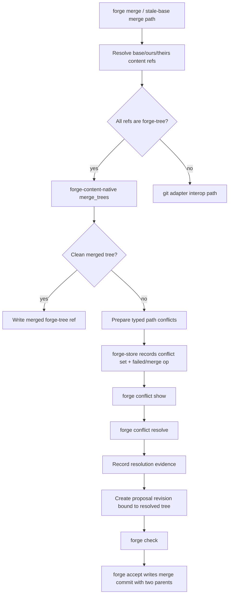

# feat: Phase 8 Slice 2b - Native 3-way merge engine + conflict resolution loop

## Summary

Build Phase 8 Slice 2b: consume the S2a conflict-as-data substrate to run native 3-way merges, persist typed conflicts from real merge analysis, and let an agent submit an explicit resolution that becomes the tree checked and accepted.

This slice does not add auto-resolution. Clean, non-overlapping changes may merge mechanically, but true conflicts are written as data and require an explicit resolution command.

---

## Problem Frame

S2a made conflicts inspectable but did not run a merge. Stale-base rows now carry base/ours/theirs refs and per-path metadata, and native history is merge-ready, but an agent still cannot ask Forge to combine two diverged native trees or bind a resolved tree back to the proposal lifecycle.

The next risk is semantic, not schema-shaped: Forge must distinguish clean merges from true conflicts without silently picking a side. PRD §15 requires conflict sets and path conflicts when stale-base apply or merge conflicts occur, and the Phase 8 requirements require manual/agent resolution before any automated suggestion layer. S2b is the focused merge-engine PR that gives agents a complete local loop: merge, inspect conflicts, submit resolution, re-check, accept.

---

## Requirements

**Merge engine**

- R1. A native 3-way merge takes base/ours/theirs `forge-tree:` refs and returns either a merged `forge-tree:` ref or a persisted `conflict_sets` record.
- R2. Clean, non-overlapping textual hunks auto-merge mechanically without creating conflict rows.
- R3. Overlapping textual edits create `content` path conflicts and never pick ours or theirs silently.
- R4. Binary conflicts are never silently resolved. If only one side changes a binary file and the other side matches base, the changed side may be taken mechanically.
- R5. `dir_file`, `delete_modify`, `mode`, `symlink`, and rename-shaped conflicts are classified into the S2a `path_conflicts.kind` vocabulary. `dir_file` conflicts are always emitted as conflicts and never tree-restructured.

**Resolution loop**

- R6. Agents can resolve a conflict through the JSON contract with an explicit command that names the conflict set and supplies a resolution tree or resolution mapping.
- R7. A successful resolution records evidence and updates the relevant proposal revision binding so subsequent `forge check` evaluates the resolved tree.
- R8. `forge accept` commits the resolved tree only after the resolved proposal has a passing check, preserving existing gate behavior.
- R9. Resolved conflicts update `conflict_sets.status`, `path_conflicts.status`, and `path_conflicts.resolution_ref`; partially-resolved state is representable when only some paths are resolved.

**History and compatibility**

- R10. A clean native merge accepted into history writes a merge commit with two parents and does not change the Phase 7 commit object schema.
- R11. A fixed merge-commit golden vector pins the hashed preimage layout with a hard-coded `f1:commit:` id.
- R12. Git-backed repositories keep existing git-tree compatibility. S2b may delegate git-tree merge execution to the git adapter, but native forge-tree merge is first-class and git-free.

**Security and contract**

- R13. JSON egress for conflict hunks, resolution previews, and merge diagnostics redacts inline secret-like content at the read boundary and emits warnings.
- R14. Raw filesystem paths are not emitted by `forge conflict list/show`; any new resolution or merge JSON that must identify a path uses existing opaque path-conflict ids or fingerprints.
- R15. S1 path-free error discipline, S2 policy exclusion, JSON envelope stability, typed-error drift guards, and `forge-store` dependency boundaries are preserved.

Origin traceability:

- F1 is the conflict-resolution loop from `docs/brainstorms/2026-05-31-ner-139-phase-8-requirements.md`.
- AE1, AE2, AE8, and AE11 are owned by this slice.
- R15-R19 from the origin are implemented here; R20-R22 remain deferred to S3 auto-resolution.

---

## Scope Boundaries

In scope:

- Native 3-way merge for `forge-tree:` refs.
- Typed conflict classification backed by `conflict_sets` and `path_conflicts`.
- A manual/agent resolution command in the JSON schema.
- Proposal rebinding so checks and accept operate on the resolved tree.
- Merge commit parent handling and a merge-commit golden vector.
- Tests for text, binary, delete/modify, mode, symlink, dir/file, clean merge, true conflict, resolution, check, and accept.

Out of scope:

- No auto-resolution ranking, suggestions, or evidence-based recommendation engine.
- No real GC deletion, physical worktrees, packfiles, compression, retention policy, or index cache.
- No remote sync, signing, merge queue, hosted collaboration, or Phase 9 trust ladder.
- No broad rewrite of the diff engine. Reuse the S1 native diff data and only add merge-specific primitives where needed.

---

## Key Technical Decisions

- **Native merge lives in `forge-content-native`:** Tree walking, blob reads, mode bits, symlink handling, and tree writes are content-store concerns. `forge-store` persists lifecycle and conflict records; it must not learn git adapter details or parse native object files directly.
- **Use a small deterministic merge algorithm before optimizing:** Start with line-based textual 3-way merge over normalized line sequences and explicit side/base comparisons. Correct conflict classification beats algorithmic cleverness in S2b.
- **Take unchanged-side changes mechanically:** If only ours differs from base, take ours. If only theirs differs from base, take theirs. If both differ identically, take the shared result. Only competing non-identical edits conflict.
- **Never synthesize a directory/file compromise:** A path that is a file on one side and an ancestor directory on another side is `dir_file`. The merged tree is blocked until explicit resolution chooses a shape.
- **Resolution rebinds proposal revision, not only evidence:** Evidence records why a resolution was submitted, but `check` and `accept` read proposal content. S2b must update or create the proposal revision that points at the resolved tree.
- **Resolution command is explicit and non-interactive:** Agents should be able to call a schema-documented command with ids and refs. No editor prompts, marker files, or hidden working-tree state are required.
- **Inline merge hunk content is egress, not storage:** Internal conflict analysis may inspect blob bytes, but any JSON carrying hunk excerpts must use the existing redactor at the read boundary and bound output size.
- **Git interop remains at the edge:** For mixed or git-tree refs, reuse existing content-ref classification and git adapter behavior where needed. Do not move `forge_export_git` into `forge-store`.
- **Merge commit format stays stable:** The existing `CommitObject.parents: Vec<String>` is sufficient. S2b only writes two parents and adds a hard-coded golden vector test for a fixed merge commit.

---

## High-Level Technical Design



The native merge engine should operate on flattened tree entries keyed by repo-relative path with `(object, mode)` fingerprints. File-level classification determines whether a path can be mechanically selected, needs textual hunk merge, or must become a typed path conflict. A clean merge writes a new native tree and returns `forge-tree:<root>`. A conflicted merge returns a conflict payload that `forge-store` persists in the existing S2a schema.

The first CLI surface should be small:

```text
forge merge --proposal <proposal-id>
forge conflict resolve <conflict-set-id> --tree <forge-tree-ref>
```

`forge merge` can be invoked explicitly by agents and reused internally by stale-base paths if implementation finds the lifecycle fit safe. `forge conflict resolve` records an explicit resolution by binding a resolved tree to the conflicted proposal. If implementation discovers the proposal id is not recoverable from the S2a conflict row, add it to the conflict `paths_json` compatibility object or the resolution command arguments without a schema migration.

---

## Implementation Units

### U1. Native merge primitives

**Goal:** Add deterministic native tree merge APIs that classify file-level and hunk-level outcomes without touching SQLite.

**Requirements:** R1, R2, R3, R4, R5, R13, R15.

**Files:**

- Modify: `crates/forge-content-native/src/lib.rs`
- Modify: `crates/forge-content/src/lib.rs`
- Test: `crates/forge-content-native/src/lib.rs`

**Approach:** Add public structs such as `MergeInput`, `MergeResult`, `MergedTree`, and `MergeConflictFile` in the shared content contract only as needed for CLI/store serialization. In `forge-content-native`, flatten base/ours/theirs trees into comparable entries, classify each path, and write a merged tree when every path resolves mechanically. Use existing blob read/write durability and tree entry validation paths.

**Test scenarios:**

- One side changes a text file, the other side is unchanged from base; merged tree takes the changed content.
- Both sides make identical text changes; merged tree contains the shared result.
- Both sides edit non-overlapping hunks in one text file; merged tree contains both edits.
- Both sides edit overlapping hunks differently; no merged tree is returned and a `content` conflict is reported.
- Binary file changed on both sides differently; a `binary` conflict is reported.
- File deleted on one side and modified on the other; a `delete_modify` conflict is reported.
- Executable mode changes conflict with content changes as `mode` or mechanically resolve when only one side changed.
- Symlink target changes conflict when both sides change differently and round-trip when one side changed.
- File vs directory collision returns `dir_file` and no merged tree.

**Verification:** Native merge unit tests pass without `git` in PATH.

### U2. Store conflict writer for merge results

**Goal:** Persist merge-engine conflicts through the S2a schema with operation ownership and integrity hashing.

**Requirements:** R3, R4, R5, R9, R13, R14, R15.

**Files:**

- Modify: `crates/forge-store/src/lib.rs`
- Modify: `crates/forge-store/src/integrity.rs`
- Modify: `crates/forge-store/src/error.rs`
- Test: `crates/forge-store/src/lib.rs`
- Test: `crates/forge-cli/tests/forge_conflict_set.rs`

**Approach:** Generalize the S2a `PreparedConflict` path beyond stale-base rows so merge results can set real per-side paths, statuses, modes, refs, and conflict kinds. Keep `record_failed_operation_with_conflict` stable for stale-base, but add a merge-owned writer that inserts conflict rows in the same operation transaction. Add typed errors only if the resolution path needs new contract failures.

**Test scenarios:**

- Merge conflict insert writes base/ours/theirs refs and `resolver_backend = "native_merge"`.
- Path rows carry kind-specific side status/mode/ref data.
- Conflict set integrity verification detects tampered path conflict rows.
- Existing stale-base conflict tests still pass unchanged.
- Missing or malformed resolution targets produce typed, path-free errors.

**Verification:** Store tests and doctor integrity tests cover both stale-base and native-merge conflict records.

### U3. CLI merge command and stale-base integration

**Goal:** Expose merge execution through the JSON contract and prepare it for reuse from stale-base flows.

**Requirements:** R1, R2, R3, R4, R5, R12, R13, R15.

**Files:**

- Modify: `crates/forge-cli/src/main.rs`
- Modify: `crates/forge-cli/src/schema.rs`
- Modify: `crates/forge-cli/tests/forge_schema.rs`
- Create or modify: `crates/forge-cli/tests/forge_native_merge.rs`

**Approach:** Add `forge merge --proposal <proposal-id>` as a mutating, lock-held command. Resolve the proposal revision, its base content ref, current ours content ref, and theirs proposal content ref. For native refs, call the new native merge API. On a clean merge, return the merged content ref and record an operation/view. On conflict, persist a conflict set and return a typed recoverable conflict response that includes the conflict set id but not raw paths or inline unredacted hunks.

**Test scenarios:**

- Clean non-overlapping native merge returns success with a `forge-tree:` merged ref.
- True native content conflict returns a stable typed error or recoverable status with `conflict_set_id`.
- `forge schema` documents `merge`.
- Mixed git/native refs continue to use existing compatibility behavior or fail with a typed unsupported error, not an untyped panic.
- Envelope `schema_version` remains `forge.cli.v0`.

**Verification:** CLI merge tests run with git removed from PATH for native repos.

### U4. Conflict resolution command and proposal rebinding

**Goal:** Let agents submit an explicit resolution tree and make that tree the proposal revision that checks and accepts.

**Requirements:** R6, R7, R8, R9, R13, R14, R15.

**Files:**

- Modify: `crates/forge-cli/src/main.rs`
- Modify: `crates/forge-cli/src/schema.rs`
- Modify: `crates/forge-store/src/lib.rs`
- Modify: `crates/forge-policy/src/lib.rs` only if check binding requires a policy-side shape update
- Test: `crates/forge-cli/tests/forge_native_merge.rs`
- Test: `crates/forge-cli/tests/forge_propose_check.rs`
- Test: `crates/forge-cli/tests/forge_accept_export.rs`

**Approach:** Add `forge conflict resolve <conflict-set-id> --tree <forge-tree-ref>` first. Verify the tree ref exists, is policy-clean, and is compatible with the conflict's base/ours/theirs context. Record resolution evidence with conflict id and resolution ref, mark path conflicts resolved where the command resolves the entire set, and create a new proposal revision for the affected proposal with `content_ref = resolution_ref`. Existing `check` should then bind to the new proposal revision; existing `accept` gate should require that check.

**Test scenarios:**

- Resolving a conflict set with a valid `forge-tree:` marks the conflict set `resolved`.
- Resolution records evidence containing conflict id and resolution ref but no inline secret content.
- `forge check --proposal <id>` evaluates the resolved tree, not the conflicted proposal tree.
- `forge accept --proposal <id>` commits the resolved tree after passing check.
- Resolving an unknown conflict id returns `CONFLICT_SET_NOT_FOUND`.
- Resolving with a missing or unsupported tree ref returns a typed, path-free error.

**Verification:** End-to-end native conflict-resolution loop passes through `merge -> conflict show -> conflict resolve -> check -> accept`.

### U5. Merge commit parent handling and golden vector

**Goal:** Write accepted native merge results as two-parent commits without changing the commit format.

**Requirements:** R10, R11, R15.

**Files:**

- Modify: `crates/forge-store/src/lib.rs`
- Modify: `crates/forge-content-native/src/lib.rs`
- Test: `crates/forge-cli/tests/forge_native_history.rs`
- Test: `crates/forge-content-native/src/lib.rs`

**Approach:** Thread merge parent metadata from the resolved proposal into the native accept path. A normal accept remains single-parent. A resolved merge accept writes parents `[ours_head, theirs_base_or_commit]` according to the merge input lineage, preserving deterministic order. Add a hard-coded golden vector for a fixed merge commit object that includes two parents, actor, authored time, decision id, proposal revision id, and evidence digest.

**Test scenarios:**

- Accepting a resolved merge writes a commit with two parents.
- `forge log` includes both parents using the S2a multi-parent traversal.
- `forge doctor` reports the merge history clean.
- The hard-coded merge commit id changes if commit preimage layout changes.

**Verification:** Native history tests prove merge commits are valid history, not just valid objects.

### U6. Redaction, policy, and contract hardening

**Goal:** Keep conflict and resolution egress safe while adding hunk-level data.

**Requirements:** R13, R14, R15.

**Files:**

- Modify: `crates/forge-content/src/lib.rs`
- Modify: `crates/forge-cli/src/main.rs`
- Modify: `crates/forge-store/src/lib.rs`
- Test: `crates/forge-cli/tests/forge_conflict_set.rs`
- Test: `crates/forge-cli/tests/forge_native_merge.rs`

**Approach:** Centralize any conflict-hunk JSON projection through the existing evidence redaction helpers. Keep internal raw path storage, but continue to emit opaque ids/fingerprints on read surfaces. Ensure merge diagnostics use warnings for redaction/truncation and never leak secret-like strings in `message`, `details`, or alternate error formatting.

**Test scenarios:**

- A conflict hunk containing `API_KEY=value` is redacted in every JSON response.
- Raw path names are absent from `conflict list/show` even for merge-generated conflicts.
- Secret-risk named files are excluded from merge JSON and surfaced only as counts or warnings.
- Error `to_string()` and alternate debug formatting contain no filesystem paths.

**Verification:** Schema and egress tests fail if a new JSON path bypasses redaction.

### U7. Verification, dogfood, and review

**Goal:** Ship S2b behind the full Phase 8 gate.

**Requirements:** R1-R15.

**Files:**

- Modify test and e2e artifacts as needed.

**Approach:** Extend `scripts/e2e-eval.sh` with a native merge conflict loop and a clean merge loop. Dogfood with git removed from PATH for native merge and resolution. Run the normal verification trio plus code review with adversarial/reliability focus on merge classification, proposal rebinding, and redaction.

**Test scenarios:**

- Clean native merge loop succeeds and accepts.
- Conflicting native merge loop persists conflict, resolves explicitly, re-checks, and accepts.
- Binary conflict does not auto-resolve.
- `dir_file` conflict does not auto-resolve.
- Existing git-backed lifecycle and export remain green.

**Verification:** `cargo fmt --all --check`, `cargo test --workspace`, `cargo clippy --workspace --all-targets -- -D warnings`, `bash scripts/e2e-eval.sh`, native dogfood with git removed from PATH, and `ce-code-review mode:autofix`.

---

## System-Wide Impact

- `forge-content-native` gains merge authority over native trees and must preserve object durability and policy filtering.
- `forge-store` gains resolution lifecycle state, proposal rebinding, and conflict integrity coverage beyond stale-base rows.
- `forge-cli` gains mutating commands that must participate in repo locking, idempotency, JSON schema, typed errors, and redaction.
- Native history starts writing real merge commits rather than only synthetic test DAGs.
- Future S3 auto-resolution depends on the resolution command and conflict provenance shape created here.

---

## Risks and Mitigations

| Risk | Impact | Mitigation |
| --- | --- | --- |
| Merge algorithm silently picks a wrong side | Data loss or false confidence | Classify conservatively; auto-merge only unchanged-side, identical-change, and proven non-overlap cases |
| Resolution evidence does not change proposal content | Checks pass against the wrong tree | Rebind proposal revision to the resolution ref; test check and accept after resolution |
| Binary or dir/file conflicts are treated like text | Corrupt output tree | File-level classifier gates before textual merge |
| `forge-store` learns native object internals | Boundary regression | Keep tree/blob mechanics in `forge-content-native`; store accepts refs and prepared conflict rows |
| Conflict hunk JSON leaks secrets | Machine-visible egress risk | Redact at read boundary, bound excerpts, and add egress tests with secret-like values |
| Merge commit parent order drifts | History and golden vectors become unstable | Pin deterministic parent order and hard-code merge commit id |
| Stale-base integration widens PR too much | Harder review and higher regression risk | Ship explicit `forge merge` and resolution loop first; only reuse inside stale-base paths when lifecycle fit is clear |

---

## Verification Plan

- `cargo fmt --all --check`
- `cargo test -p forge-content-native`
- `cargo test -p forge-store`
- `cargo test -p forge-cli --test forge_native_merge`
- `cargo test -p forge-cli --test forge_conflict_set`
- `cargo test -p forge-cli --test forge_native_history`
- `cargo test --workspace`
- `cargo clippy --workspace --all-targets -- -D warnings`
- `bash scripts/e2e-eval.sh`
- Native dogfood with git removed from PATH:
  - clean merge
  - content conflict
  - conflict resolve
  - check
  - accept
  - log/doctor
- `ce-code-review mode:autofix plan:docs/plans/2026-06-06-018-feat-phase-8-slice-2b-native-merge-resolution-plan.md`

---

## Open Questions

- Whether `forge merge --proposal <id>` should be the only entry point, or whether stale-base `accept` should invoke merge automatically in S2b. Default: explicit command first; wire stale-base automation only after the explicit loop is correct.
- Whether `forge conflict resolve` should initially accept only a full resolved tree or also per-path resolution refs. Default: full tree first because it binds cleanly to proposal revisions; per-path resolution can layer on once hunk-level UX is proven.
- What exact parent pair should a resolved merge commit store when the proposal's `theirs` side is a tree rather than a commit id. Default: use current native HEAD as ours and the proposal base/native attempt lineage where available; if unavailable, preserve the merged tree and record the missing lineage in operation state rather than fabricating a parent.
- Whether git-backed merge should be fully implemented in S2b or return a typed unsupported response while native merge ships. Default: preserve existing git-tree compatibility by delegating where practical, but do not block native merge on git adapter completeness.

