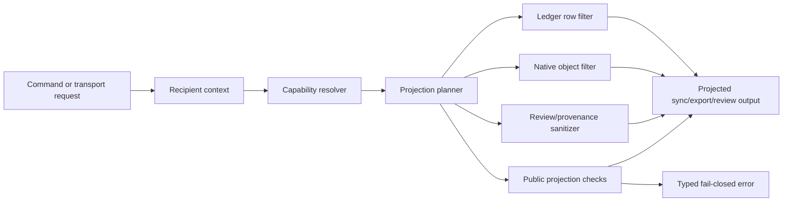

# feat: Add permissioned Forge projections

## Summary

Add permissioned Forge v1: change-level visibility for Forge work packages, enforced as recipient-scoped projections at every Forge-managed egress and materialization boundary. A single Forge graph should be able to contain public core work, private extensions, private attempts, and embargoed fixes without leaking restricted content through sync, export, review, or generated Git artifacts.

The first shipping slice is not cryptographic secrecy. It is a local-first, deny-by-default projection system with explicit visibility metadata, explicit grants, policy-shaped sync/export/review outputs, public projection checks, sanitized provenance, typed failures, audit, and an agent-visible schema contract.

## Problem Frame

Forge already has native work packages, native content/history, sync, conflict-as-data, signed evidence, trust policy, decisions, and Git export. The remaining product gap is collaboration when visibility is not repo-wide. Today, Git-style public/private boundaries push teams toward split repos, hidden forks, side channels, and manual embargo handling. Forge can do better because its product unit is already an intent -> attempt -> proposal -> evidence -> decision package, not only a branch or pull request.

NER-354 turns that work package into the primary permission boundary, with path/content labels inside it. The implementation must make "what this recipient can see or materialize" an explicit policy decision before any bytes leave Forge or become local files for that recipient.

## Requirements

- R1. Work packages carry an explicit visibility label: `private`, `team`, `public`, or `embargoed`.
- R2. Visibility applies before proposal creation; intents and attempts can be private while exploration is still in progress.
- R3. Work-package visibility controls existence, coordination stubs, review access, evidence access, and publish/reveal authority.
- R4. Path/content labels refine sync, materialization, inspection, and export inside mixed work packages.
- R5. Permission checks are deny-by-default and validate capability on every egress or materialization boundary.
- R6. Capability tiers include `see_stub`, `inspect_content`, `inspect_evidence`, `sync_materialize`, and `publish_reveal`.
- R7. Normal private work may expose a sanitized coordination stub when policy allows; embargoed work is invisible by default.
- R8. Sync/export/review outputs are recipient-scoped projections, not raw repo dumps.
- R9. Projection building filters ledger rows and native object payloads together so omitted rows cannot leave reachable restricted payloads behind.
- R10. If a valid projection cannot be produced, Forge fails closed with a typed, redacted error.
- R11. Public projections run declared public checks and must fail closed when the public view depends on restricted implementation or evidence.
- R12. Public Git export excludes restricted work packages, paths, native payloads, evidence, review data, and embargoed material.
- R13. Accepting private work does not imply public visibility; reveal/publish is a separate policy-controlled action.
- R14. Sanitized provenance for reveal/publish includes accepted content reference, decision actor, timestamp, trust/signature level, and check summary, but excludes raw logs, excerpts, private paths, diffs, and review discussion.
- R15. Every visibility change, grant, revocation, and reveal/publish action records an audit event.
- R16. Revocation is future-only in v1: it blocks future Forge-managed sync/review/export/materialization and does not claim to claw back already materialized content.

## Key Technical Decisions

- KTD1. Add explicit permission metadata instead of overloading existing evidence visibility. Evidence already has sensitivity/visibility metadata, but NER-354 needs work-package, path/content, grant, and audit concepts that apply beyond evidence rows.
- KTD2. Treat projection as the enforcement boundary. The dangerous operation is not creating private rows locally; it is emitting or materializing data for a recipient.
- KTD3. Keep policy decision and policy enforcement separable. Core/store/policy code should compute capabilities and projection decisions; sync/export/review adapters should enforce those decisions before serialization, file materialization, or Git effects.
- KTD4. Filter rows and content payloads as one graph. A projected sync bundle is only safe if ledger rows, native object references, native payloads, and materialized files are pruned consistently.
- KTD5. Make projection protocol-visible. A downstream agent must be able to tell whether an output is full or projected, which actor/capability context shaped it, and what policy version produced it.
- KTD6. Preserve adapter boundaries. Store/sync/policy code may expose projection data and pure checks; Git-specific tree construction remains in the Git export adapter.
- KTD7. Keep public reveal separate from accept. Decisions establish correctness/trust; visibility widening is a later policy action with its own authorization and audit.
- KTD8. Recompute projection-validity from source state where possible. Do not persist stale "allowed view" snapshots unless they are explicit audit/provenance events.
- KTD9. Keep the existing secret-risk and evidence-redaction layers mandatory. Permission projection is an additional control, not a replacement for path redaction or trust policy.
- KTD10. Be honest about v1 secrecy. This feature prevents Forge-managed leaks; encryption, org key governance, and local same-user isolation are separate follow-up work.

## High-Level Technical Design

The implementation should introduce a projection pipeline with three responsibilities:

- Decide: resolve actor, target recipient, visibility labels, grants, path/content labels, and requested operation into allowed capabilities.
- Plan: compute the rows, objects, evidence, paths, stubs, and provenance fields allowed for the recipient.
- Enforce: serialize, materialize, export, or render only the planned projection; if enforcement detects missing policy, dangling restricted reachability, failed checks, or ambiguous state, return a typed failure.

This pipeline should be reused by sync, Git export, PR/review body generation, attempt/proposal display, and any command that can reveal work-package state.

## Threat Model

Primary assets:

- Restricted native payloads, paths, diffs, evidence, review discussion, object IDs, and ledger rows.
- Embargo existence signals, including errors, counts, status output, sync deltas, and review/provenance metadata.
- Visibility labels, grants, revocations, reveal/publish events, and audit records.

Primary attacker capabilities in v1:

- A local recipient or downstream agent can request sync/export/review output without the right grant.
- A recipient can compare public and private-ish outputs across time to infer hidden work.
- A malformed or stale sync bundle can omit policy metadata or include dangling restricted references.
- A maintainer or creator can accidentally widen visibility before public projection checks pass.

Required mitigations:

- Enforce deny-by-default checks at every egress/materialization/display boundary, not only at creation time.
- Make projection metadata protocol-visible and reject unknown, missing, stale, or inconsistent projection state.
- Redact errors by capability, with embargoed work returning generic hidden/not-authorized failures unless explicitly granted.
- Keep audit events for every label/grant/revocation/reveal mutation and include policy reason where available.
- Run public projection checks before public export/reveal/publish and fail closed when restricted implementation is required.
- State the v1 residual risk clearly: Forge cannot erase or protect content already materialized on a recipient's machine.

## Implementation Units

### U1. Permission Domain Model and Migration

Add first-class permission state to the local ledger:

- Work-package visibility labels for intents/attempts/proposals and their related evidence/review/decision package.
- Path/content labels for restricted files or object subgraphs inside mixed packages.
- Grants that map an actor/recipient to capability tiers.
- Visibility defaults at repository/workspace scope.
- Audit rows for label changes, grants, revocations, reveal, and publish.

Expected touchpoints:

- `crates/forge-store/src/lib.rs`
- `crates/forge-store/src/error.rs`
- `crates/forge-store/migrations/`
- `crates/forge-cli/tests/forge_attempts.rs`
- `crates/forge-cli/tests/forge_errors.rs`

Acceptance:

- New work receives the configured default visibility.
- Existing repositories migrate safely with public/default-compatible behavior.
- Private and embargoed labels can be persisted and queried without changing unrelated evidence semantics.
- Audit events are created for every label/grant/revocation/reveal mutation.
- Historical migration tests cover a pre-permission database shape.

### U2. Visibility Command Surface and Schema Contract

Expose the permission model through CLI and JSON schema so agents can reason about it without scraping human output.

Add a visibility command group for:

- Reading current defaults and effective policy.
- Setting work-package visibility.
- Setting path/content labels.
- Granting and revoking capabilities.
- Revealing or publishing accepted private/embargoed work.
- Listing audit events relevant to a work package.

Expected touchpoints:

- `crates/forge-cli/src/main.rs`
- `crates/forge-cli/src/schema.rs`
- `crates/forge-cli/tests/forge_schema.rs`
- `crates/forge-cli/tests/forge_errors.rs`

Acceptance:

- `forge schema` exposes the command surface, visibility labels, capability tiers, output fields, and typed errors.
- JSON output distinguishes full objects, stubs, hidden entries, and redacted fields.
- Unauthorized or ambiguous operations return stable typed errors with path/content-safe details.
- Human output is useful, but tests assert the JSON contract first.

### U3. Projection Engine in Store/Policy

Implement the shared projection decision layer used by egress surfaces.

Responsibilities:

- Build a recipient context from the local actor, requested recipient, operation, target work package, and requested projection type.
- Resolve effective capabilities from default policy, work-package label, path/content labels, grants, and embargo rules.
- Produce projection decisions for existence, stub fields, content inspection, evidence inspection, sync materialization, and publish/reveal.
- Provide redacted diagnostics that vary by capability: stub-aware for callers with `see_stub`, generic for embargo/hidden callers.

Expected touchpoints:

- `crates/forge-policy/src/lib.rs`
- `crates/forge-store/src/lib.rs`
- `crates/forge-store/src/error.rs`
- `docs/solutions/architecture-patterns/content-bound-gate-engine-and-failclosed-enforcement-2026-05-29.md`
- `docs/solutions/architecture-patterns/write-binding-verification-and-content-backend-isolation-2026-05-29.md`

Acceptance:

- Deny-by-default is enforced when labels, grants, policy, or recipient context are missing/corrupt.
- Embargoed work is invisible unless explicitly granted.
- Normal private work can return sanitized stubs when policy grants `see_stub`.
- Projection errors avoid private paths, object IDs, evidence excerpts, and command output.
- Unit tests cover each label/capability combination and default-policy failure mode.

### U4. Projected Sync Manifests and Materialization

Make sync export/import/clone/fetch/pull/push projection-aware.

Responsibilities:

- Extend sync manifest metadata to declare projection mode, policy version, recipient/capability context, and whether the bundle is full or projected.
- Filter ledger rows and native objects together.
- Reject projected manifests with dangling restricted references, missing required public rows, unknown projection metadata, or inconsistent object reachability.
- Materialize files only when the recipient has `sync_materialize`.
- Preserve current full-sync behavior for authorized local/full projections.

Expected touchpoints:

- `crates/forge-sync/src/lib.rs`
- `crates/forge-cli/src/main.rs`
- `crates/forge-cli/tests/forge_sync.rs`
- `docs/solutions/architecture-patterns/native-storage-scale-pack-gc-streaming-status-cache.md`
- `docs/solutions/architecture-patterns/conflict-as-data-and-multi-parent-native-history-2026-06-06.md`

Acceptance:

- Public sync from a graph with private extensions omits restricted rows and payloads.
- A private reviewer with grants can receive and materialize allowed private work.
- An unauthorized recipient cannot infer embargo existence through sync output.
- Import rejects malformed projected bundles instead of creating partial or misleading local state.
- Delta sync does not reintroduce rows or payloads omitted by projection.

### U5. Projected Git Export and Review Body Generation

Apply the projection pipeline to Git branch export and generated review artifacts.

Responsibilities:

- Run projection before Git tree synthesis or branch creation.
- Combine permission projection with existing secret-risk filtering.
- Omit restricted evidence, review discussion, private paths, and embargoed rows from PR/review bodies.
- Include sanitized provenance for public reveal/publish.
- Refuse export when public projection checks fail or when restricted data would be required for a usable public artifact.

Expected touchpoints:

- `crates/forge-export-git/src/lib.rs`
- `crates/forge-store/src/lib.rs`
- `crates/forge-cli/src/main.rs`
- `crates/forge-cli/tests/forge_secret_export.rs`
- `crates/forge-cli/tests/forge_accept_export.rs`
- `crates/forge-cli/tests/forge_pr_body.rs`
- `docs/solutions/architecture-patterns/compare-rank-on-verified-evidence-and-self-verifying-provenance-trailer-2026-05-30.md`
- `docs/solutions/architecture-patterns/commit-on-accept-ordering-ledger-authoritative-reconcile-and-the-last-hidden-git-dependency-2026-05-31.md`

Acceptance:

- Public branch export contains only public/projection-allowed files.
- PR body generation never includes restricted paths, command logs, excerpts, review discussion, or private object IDs.
- Sanitized provenance remains verifiable for local ledger consistency while avoiding authenticity claims not supported by v1.
- Existing secret-risk exclusion remains active and tested alongside permission projection.

### U6. Public Projection Checks

Add a check path for validating that the projected public artifact is usable without restricted implementation.

Responsibilities:

- Evaluate declared checks against the projected public content/review output.
- Fail closed when the public projection cannot build/test/lint as declared, or when checks need restricted paths.
- Reuse existing check/trust concepts where possible without persisting stale derived verdicts.

Expected touchpoints:

- `crates/forge-policy/src/lib.rs`
- `crates/forge-store/src/lib.rs`
- `crates/forge-cli/tests/forge_trust_policy.rs`
- `crates/forge-cli/tests/forge_accept_export.rs`
- `docs/solutions/architecture-patterns/content-bound-gate-engine-and-failclosed-enforcement-2026-05-29.md`

Acceptance:

- Public export of a private-extension-backed change fails if public checks cannot pass on the public projection.
- Passing private/full checks alone does not authorize public export.
- Check failure output is redacted by recipient capability.

### U7. Reveal, Publish, Embargo, and Future-Only Revocation

Implement visibility lifecycle actions separate from accept/reject.

Responsibilities:

- Allow maintainers to widen work from private/team to public when policy and checks permit.
- Support embargo grants, release-before-source, and later reveal/publish.
- Record future-only revocation and block future Forge-managed access.
- Make diagnostics explicit that revocation does not erase already materialized local files.

Expected touchpoints:

- `crates/forge-store/src/lib.rs`
- `crates/forge-cli/src/main.rs`
- `crates/forge-cli/tests/forge_accept_export.rs`
- `crates/forge-cli/tests/forge_sync.rs`
- `docs/solutions/architecture-patterns/tamper-evident-evidence-chain-and-failclosed-verification-2026-05-30.md`

Acceptance:

- Accepted private work remains private until an authorized reveal/publish action.
- Embargoed work exposes no existence signal to unauthorized recipients.
- Maintainer-controlled grants are required for embargo materialization or reveal.
- Revocation blocks future access and records audit without overpromising deletion.

### U8. Display, Compare, and Read Surfaces

Apply projection rules to non-transfer surfaces that reveal work-package state.

Responsibilities:

- Ensure attempt/proposal/intention display, compare, status, list, log, and review-related outputs honor existence/stub/content/evidence capabilities.
- Avoid raw path leakage in conflict, diff, evidence, and diagnostic output.
- Ensure JSON and human output agree on hidden/stub/redacted states.

Expected touchpoints:

- `crates/forge-cli/src/main.rs`
- `crates/forge-store/src/lib.rs`
- `crates/forge-evidence/`
- `crates/forge-cli/tests/forge_run_evidence.rs`
- `crates/forge-cli/tests/forge_pr_body.rs`

Acceptance:

- Unauthorized users cannot list private/embargoed work beyond allowed stubs.
- Compare/review output does not reveal restricted paths, diffs, evidence, object IDs, or command logs.
- Existing evidence redaction remains layered under the new projection rules.

### U9. End-to-End Tests, Docs, and Dogfood Script

Close the feature with scenario-level coverage and product-facing documentation.

Responsibilities:

- Add end-to-end tests for public core plus private extension, reviewer materialization, public projection export, embargo release-before-source, staged reveal, and future-only revocation.
- Update docs to describe v1 guarantees, non-goals, command flows, and operational warnings.
- Add or extend a dogfood scenario that demonstrates one Forge graph replacing split repos/private forks.

Expected touchpoints:

- `crates/forge-cli/tests/forge_sync.rs`
- `crates/forge-cli/tests/forge_secret_export.rs`
- `crates/forge-cli/tests/forge_accept_export.rs`
- `crates/forge-cli/tests/forge_schema.rs`
- `README.md`
- `docs/ROADMAP.md`
- `docs/P9_RELEASE_AUDIT.md`

Acceptance:

- The full workspace test suite covers restricted sync/export/review leaks.
- Documentation states that v1 is projection enforcement, not encryption or already-local content deletion.
- Agent-facing examples show how to create private work, invite a reviewer, export a public projection, embargo a fix, and reveal/publish later.

## System-Wide Impact

- Store: new persisted permission/grant/audit state and new typed errors.
- Policy: capability resolution, deny-by-default projection decisions, public projection checks.
- Sync: manifest semantics change from raw local graph transfer toward recipient-scoped bundles.
- Git export: projection must happen before tree synthesis, branch creation, and PR body generation.
- CLI/schema: new commands, JSON fields, and error codes become part of the agent contract.
- Evidence/trust: existing integrity and redaction rules remain in force; sanitized provenance must not weaken trust-policy claims.
- Tests: leak prevention needs negative tests, malformed bundle tests, and schema contract tests, not only happy-path private collaboration.

## Scope Boundaries

- In scope: local-first policy metadata, grants, projections, typed errors, audit, sync/export/review enforcement, public projection checks, staged reveal/publish, docs/tests.
- Out of scope: cryptographic object encryption and encrypted private content. Track under NER-356.
- Out of scope: org identity, key ownership, rotation, and durable revocation. Track under NER-357.
- Out of scope: hosted review UI. Track under NER-359, using this plan's projection semantics.
- Out of scope: resumable/partial network transport. Track under NER-360.
- Out of scope: intent-aware blame/annotate. Track under NER-362.
- Out of scope: same-user local sandboxing or protection from an agent with unrestricted access to already materialized local files.

## Risks and Mitigations

- Risk: Filtering ledger rows without filtering native payloads leaks restricted data. Mitigation: make projection planning row/object reachability-aware and reject dangling/inconsistent bundles.
- Risk: Old sync consumers misinterpret projected bundles as full graphs. Mitigation: make projection protocol-visible and fail closed on unknown projection metadata.
- Risk: Users assume v1 is encryption. Mitigation: command output, schema notes, docs, and audit messages must state the projection-only guarantee.
- Risk: Redaction makes collaboration unusable. Mitigation: support sanitized stubs and capability-specific diagnostics for normal private work while keeping embargo hidden by default.
- Risk: Public projection checks become expensive or flaky. Mitigation: start with declared checks and reuse existing check/trust machinery where possible.
- Risk: Grant semantics drift before org identity exists. Mitigation: keep v1 actor/capability records local and explicitly defer org key governance.
- Risk: Security controls land only on the happy path. Mitigation: enumerate every egress/materialization/display surface and add regression tests for each one.

## Acceptance Examples

- AE1. Private attempt before proposal: a creator starts private work, grants a reviewer access, and the reviewer can inspect/materialize it while unrelated recipients see nothing or only an allowed stub.
- AE2. Embargo invisibility: an unauthorized recipient cannot infer that an embargoed fix exists through sync, list, status, compare, review body, error details, or export output.
- AE3. Public projection export: a graph containing public core plus private extension exports a public branch with no restricted files, rows, evidence, object IDs, or review discussion.
- AE4. Projection check failure: public export fails closed when the projected public tree cannot pass declared checks without private implementation.
- AE5. Accept is not publish: accepted private work remains private until an authorized reveal/publish action produces sanitized provenance.
- AE6. Future-only revocation: revoking a reviewer blocks future Forge-managed sync/materialization and records audit, while docs and diagnostics avoid claiming already materialized files were erased.

## Documentation and Operational Notes

- Update `README.md` with the core workflow and the v1 guarantee.
- Update `docs/ROADMAP.md` to place permissioned projections before encryption/org governance/hosted review.
- Update `docs/P9_RELEASE_AUDIT.md` or successor release-audit docs with precise wording limits before public claims.
- Add a short security note explaining that Forge-managed projection prevents sync/export/review leaks but does not protect data already present on disk.
- Keep all examples agent-friendly: commands should have JSON equivalents and stable error codes.

## Sources and Research

- `docs/brainstorms/2026-06-23-permissioned-forge-requirements.md`
- `docs/ROADMAP.md`
- `docs/P9_RELEASE_AUDIT.md`
- `README.md`
- `crates/forge-store/src/lib.rs`
- `crates/forge-sync/src/lib.rs`
- `crates/forge-export-git/src/lib.rs`
- `crates/forge-cli/src/main.rs`
- `crates/forge-cli/src/schema.rs`
- `crates/forge-policy/src/lib.rs`
- `crates/forge-store/src/error.rs`
- `docs/solutions/architecture-patterns/tamper-evident-evidence-chain-and-failclosed-verification-2026-05-30.md`
- `docs/solutions/architecture-patterns/content-bound-gate-engine-and-failclosed-enforcement-2026-05-29.md`
- `docs/solutions/architecture-patterns/write-binding-verification-and-content-backend-isolation-2026-05-29.md`
- `docs/solutions/architecture-patterns/compare-rank-on-verified-evidence-and-self-verifying-provenance-trailer-2026-05-30.md`
- `docs/solutions/architecture-patterns/conflict-as-data-and-multi-parent-native-history-2026-06-06.md`
- `docs/solutions/architecture-patterns/native-storage-scale-pack-gc-streaming-status-cache.md`
- `docs/solutions/architecture-patterns/schema-migration-reconciliation-and-typed-error-contract-2026-05-29.md`
- `docs/solutions/architecture-patterns/commit-on-accept-ordering-ledger-authoritative-reconcile-and-the-last-hidden-git-dependency-2026-05-31.md`
- [Theo video](https://www.youtube.com/watch?v=wEAb0x3wTRc)
- [OWASP Authorization Cheat Sheet](https://cheatsheetseries.owasp.org/cheatsheets/Authorization_Cheat_Sheet.html)
- [NIST SP 800-207 Zero Trust Architecture](https://csrc.nist.gov/pubs/sp/800/207/final)
- [NIST SP 800-53 Rev. 5](https://csrc.nist.gov/pubs/sp/800/53/r5/upd1/final)
