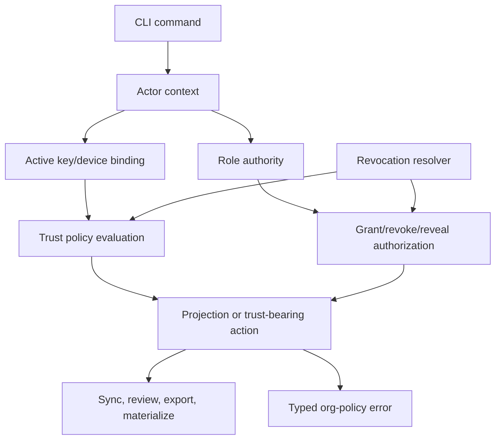

# feat: Add org identity, key governance, and revocation

## Summary

Add an org governance layer above Forge's existing local signatures, trust ladder, and permissioned projections. The implementation should introduce stable actors, actor-owned keys, role authority, scoped issuer trust, future-only revocation, and principal-aware audit so permissioned Forge can evaluate team/org policy without treating peer-imported signatures as trusted by default.

---

## Problem Frame

NER-354 added work-package visibility, capability grants, projection decisions, and audit. The current schema still stores grant `recipient` and audit `actor` as raw strings, and the signing layer knows key fingerprints without org ownership. That is insufficient for a team workflow where maintainers need to know who granted access, which key acted, what role allowed it, and whether a revoked actor or key can still satisfy future policy.

Forge already has the right substrate: signed evidence/decisions/native commits, local key rotation, key trust origins, hosted/third-party attestations, sync, and fail-closed projection. NER-357 should connect those pieces into org policy while preserving the existing trust ladder and local-first posture.

---

## Requirements

**Identity and Keys**

- R1. Add stable org principals for human, service, and external actors.
- R2. Bind actor principals to one or more signing keys/devices with lifecycle state.
- R3. Preserve existing local key status and rotation while adding org binding when configured.
- R4. Keep aliases mutable and separate from stable actor ids.

**Roles and Policy**

- R5. Add org roles that authorize key binding, grant, revoke, reveal, publish, and policy administration.
- R6. Resolve visibility grant recipients to org principals when org identity is enabled.
- R7. Enforce role-authorized grant/revoke/reveal/publish actions for private and embargoed work.
- R8. Expose identity and org-policy state through machine-readable CLI/schema output.
- R9. Add an explicit org-governance activation state so upgraded repos keep legacy behavior until an owner bootstraps org policy.

**Trust and Revocation**

- R10. Require org authority binding before a signature or issuer satisfies org policy.
- R11. Preserve peer-imported signatures as verifiable evidence that does not satisfy org policy by default.
- R12. Scope hosted-runner and third-party trust to configured issuers.
- R13. Enforce future-only key, actor, role, issuer, and grant revocation across sync, review, export, materialization, reveal, and publish.
- R14. Keep historical signatures verifiable with validity-at-time semantics.
- R15. Carry a signed org policy revision or revocation watermark on org-governed projected bundles to reject stale replay.

**Audit and Projection**

- R16. Record principal-aware audit for identity, key, role, grant, revoke, reveal, and publish mutations.
- R17. Filter identity metadata through permissioned projections so recipients see only allowed aliases, actors, and trust summaries.
- R18. Fail closed with typed, redacted org-policy errors when authority, identity metadata, or revocation state is missing, stale, corrupt, or revoked.
- R19. Imported org governance metadata can mutate local policy only when authorized by current active org authority; otherwise it remains untrusted evidence or is rejected.

---

## Key Technical Decisions

- KTD1. **Layer org governance on top of existing signing rather than replacing it.** `ledger_signatures` and `signing_keys` already separate cryptographic validity from trust origin; org policy should add actor/authority binding without changing old signatures into a new trust class.
- KTD2. **Use stable principal ids as the permission identity.** Emails, handles, and display names become aliases so grants, revocation, and audit do not break when people rename or change email.
- KTD3. **Model role authority separately from visibility capabilities.** A maintainer role authorizes creating a grant; a `sync_materialize` grant authorizes the recipient's projection.
- KTD4. **Make revocation an enforcement input, not a destructive rewrite.** Future checks consult revocation state while historical signatures and audit rows remain available for verification.
- KTD5. **Fail closed on missing governance metadata.** Org-governed policy must reject unknown actors, stale bundles, unbound peer keys, and revoked authority instead of falling back to string matching.
- KTD6. **Keep issuer trust scoped.** Hosted-runner and third-party attestations should satisfy org policy only when their issuer/key is configured for this org and not revoked.
- KTD7. **Project identity metadata like other restricted data.** Public and recipient-scoped outputs need sanitized actor/trust summaries, not raw aliases, keys, or private audit details.
- KTD8. **Make org governance an explicit repo mode.** Migrated repos stay in legacy local mode until `forge org init` creates an org authority profile and first owner from a local key; after activation, org-governed flows fail closed on missing principals instead of falling back to raw strings.
- KTD9. **Use org policy revision for validity-at-time.** Every authority-changing mutation advances an org policy revision recorded in audit; signatures and grants are evaluated against the revision active when Forge recorded the action, and projected bundles carry the minimum revision needed to reject stale replay.
- KTD10. **Centralize enforcement behind store-owned gates.** Sync, export, review, reveal, publish, materialization, and trust-bearing writes should receive an explicit policy decision from store/policy code instead of each adapter remembering to call low-level resolvers.

---

## High-Level Technical Design

The store should expose three reusable resolvers:

- Principal resolver: maps CLI actor flags, local key fingerprints, recipients, and aliases to stable principals.
- Authority resolver: evaluates roles, active keys, issuer configuration, and revocation state for the requested action.
- Projection metadata resolver: decides which actor, alias, key, issuer, and audit fields can appear in a recipient-scoped output.

These resolvers are implementation helpers, not the public enforcement boundary. Store/policy code should expose named gates such as `authorize_org_mutation`, `authorize_visibility_mutation`, `authorize_trust_satisfaction`, and `plan_org_projection`; adapters should receive a decision object and refuse to proceed without one. That keeps sync, export, review, reveal, publish, and materialization from bypassing revocation by skipping a resolver call.

---

## Output Structure

The first implementation pass should pin the machine contracts before broad command wiring.

**Schema shape**

- `org_authority_profile`: singleton with enabled state, org id, policy revision, bootstrap actor, bootstrap key fingerprint, created/updated timestamps, and recovery status.
- `org_principals`: stable actor ids with kind `human`, `service`, or `external`, lifecycle state, and created/updated timestamps.
- `org_principal_aliases`: mutable alias rows with alias kind, value, visibility, lifecycle state, and timestamps.
- `org_key_bindings`: actor-to-key/device rows with key fingerprint, public key, binding authority, lifecycle state, valid revision range, and revocation reason.
- `org_role_bindings`: actor-to-role rows with role, authority, lifecycle state, valid revision range, and revocation reason.
- `org_issuer_bindings`: scoped hosted-runner or third-party issuer trust with issuer kind, key fingerprint, subject/audience scope where available, lifecycle state, valid revision range, and revocation reason.
- `org_policy_audit`: principal-aware mutation log with action, actor, acting key, authority, prior state, new state, policy revision, reason, and timestamp.

**Enums**

- Principal kind: `human`, `service`, `external`.
- Lifecycle state: `active`, `rotated`, `expired`, `revoked`.
- Org roles: `owner`, `maintainer`, `member`, `external_reviewer`, `service`.
- Governance actions: actor create/update, alias add/remove, key bind/unbind/rotate/revoke, role bind/revoke, issuer bind/revoke, visibility grant/revoke, reveal, publish, policy update.

**CLI shape**

- `forge org status`
- `forge org init --actor <id-or-alias> --key <fingerprint-or-local> --reason <text>`
- `forge org actor create|show|alias|revoke`
- `forge org key bind|rotate|revoke`
- `forge org role grant|revoke`
- `forge org issuer bind|revoke`
- Existing `visibility`, `trust`, `key`, `sync`, and `export` commands should include org-policy details when org governance is active.

**Typed errors**

- `ORG_NOT_ENABLED`: org-governed operation requested before activation.
- `ORG_ALREADY_ENABLED`: bootstrap attempted after an org authority profile exists.
- `ORG_BOOTSTRAP_REQUIRED`: role-gated action attempted before first owner exists.
- `ORG_AUTHORITY_REQUIRED`: acting principal lacks authority for the requested mutation.
- `ORG_PRINCIPAL_UNKNOWN`: actor or recipient cannot resolve to an org principal.
- `ORG_KEY_REVOKED`: key is revoked or outside its valid revision range.
- `ORG_ISSUER_UNTRUSTED`: hosted-runner or third-party issuer is not configured, revoked, or outside scope.
- `ORG_POLICY_STALE`: projected bundle or imported metadata carries an old policy revision or missing revocation watermark.
- `ORG_IMPORTED_AUTHORITY_UNTRUSTED`: imported governance mutation is not authorized by active org authority.

---

## Origin Traceability

Plan-local R-IDs are shorthand for implementation planning. The origin requirements remain the product source of truth.

| Plan requirement | Origin requirements |
| --- | --- |
| R1 | Origin R1, R5 |
| R2 | Origin R3, R4 |
| R3 | Origin R4 |
| R4 | Origin R2 |
| R5 | Origin R6, R7, R8, R9 |
| R6 | Origin R7, R8 |
| R7 | Origin R8, R9, R20 |
| R8 | Origin R23 |
| R9 | Origin R4, Dependencies / Assumptions |
| R10 | Origin R11, R12 |
| R11 | Origin R12 |
| R12 | Origin R13 |
| R13 | Origin R15, R17 |
| R14 | Origin R16 |
| R15 | Origin R19 |
| R16 | Origin R20 |
| R17 | Origin R21, R22 |
| R18 | Origin R14, R23 |
| R19 | Origin R12, R19 |

---

## Implementation Units

### U1. Org Identity Domain Model and Migration

- **Goal:** Add org principals, aliases, key bindings, issuer bindings, role bindings, revocation rows, and principal-aware audit fields without breaking existing repos.
- **Files:** `crates/forge-store/migrations/019_org_identity_governance.sql`, `crates/forge-store/src/lib.rs`, `crates/forge-store/src/error.rs`, `crates/forge-store/src/migrations.rs`, `crates/forge-store/tests/migrate.rs`.
- **Patterns:** Follow numbered migration discipline from `docs/solutions/architecture-patterns/schema-migration-reconciliation-and-typed-error-contract-2026-05-29.md`; keep fresh-init and upgrade schema convergence covered.
- **Test Scenarios:**
  - A pre-NER-357 database upgrades and keeps existing signatures, trust policy, and visibility grants readable.
  - Fresh init and upgraded DBs converge at the same migration head.
  - Existing raw actor/recipient strings can remain as legacy aliases or fallback data without silently becoming org trust.
  - Org governance is disabled by default after migration and legacy visibility/trust flows keep their current behavior.
  - `forge org init` creates the first owner only when no org authority profile exists, records the local key, and advances policy revision.
  - A second bootstrap attempt fails with `ORG_ALREADY_ENABLED`.
  - Unknown future schema versions still refuse with the typed migration error.

### U2. Actor, Key, Role, and Issuer Command Surface

- **Goal:** Expose org governance through stable CLI and JSON contracts for actors, aliases, key binding, role binding, issuer binding, and revocation.
- **Files:** `crates/forge-cli/src/main.rs`, `crates/forge-cli/src/schema.rs`, `crates/forge-cli/tests/forge_schema.rs`, `crates/forge-cli/tests/forge_identity.rs`, `crates/forge-cli/tests/forge_errors.rs`.
- **Patterns:** Mirror existing `trust`, `key`, and `visibility` command JSON style; assert JSON contracts instead of human wording.
- **Test Scenarios:**
  - Creating a human actor returns a stable actor id and mutable aliases.
  - Creating service and external actors returns stable ids and distinct principal kinds.
  - Binding the current local key associates its fingerprint with the actor.
  - Key binding requires authority after bootstrap; unauthorized key binding returns `ORG_AUTHORITY_REQUIRED`.
  - Rotating a key preserves local signing behavior and records old/new key lifecycle state.
  - Granting and revoking roles returns stable typed errors when the acting actor lacks authority.
  - Actor create/update, alias add/remove, key bind/unbind/rotate/revoke, role bind/revoke, issuer bind/revoke, grant revoke, reveal, publish, and policy administration each have explicit authority checks.
  - `forge schema` advertises identity commands, output shapes, and org-policy error codes.

### U3. Authority Resolver for Governance Mutations, Grants, Reveal, and Publish

- **Goal:** Require role-authorized actors for governance mutation, visibility grant, revoke, reveal, publish, and org policy administration.
- **Files:** `crates/forge-store/src/lib.rs`, `crates/forge-store/src/error.rs`, `crates/forge-cli/src/main.rs`, `crates/forge-cli/tests/forge_visibility.rs`, `crates/forge-cli/tests/forge_identity.rs`.
- **Patterns:** Extend the NER-354 visibility pipeline rather than duplicating capability logic; use fail-closed rules from `docs/solutions/architecture-patterns/content-bound-gate-engine-and-failclosed-enforcement-2026-05-29.md`.
- **Test Scenarios:**
  - A maintainer can grant `sync_materialize` on private work and the audit records actor, key, authority, recipient, capability, prior state, new state, policy revision, timestamp, and reason.
  - A contributor without grant authority receives a typed org-policy denial.
  - Embargoed grant, revoke, reveal, and publish require maintainer or owner authority.
  - Self-service key or alias operations are either explicitly allowed by policy or denied with `ORG_AUTHORITY_REQUIRED`.
  - Legacy raw-recipient grants remain readable but cannot satisfy org-governed flows without principal resolution.

### U4. Org Trust Policy Integration

- **Goal:** Compose org actor/key/issuer binding with existing trust policy thresholds and anti-upgrade protections.
- **Files:** `crates/forge-store/src/lib.rs`, `crates/forge-cli/src/main.rs`, `crates/forge-cli/tests/forge_trust_policy.rs`, `crates/forge-cli/tests/forge_signatures.rs`, `crates/forge-cli/tests/forge_identity.rs`.
- **Patterns:** Preserve current anti-spoof tests where edited signatures cannot be upgraded to hosted or third-party trust; add org policy as an additional resolver after cryptographic validity.
- **Test Scenarios:**
  - A local signature from an org-bound active key satisfies an org policy requiring that actor role.
  - A peer-imported signature from an unknown key verifies but fails org-policy satisfaction.
  - A hosted-runner signature satisfies org policy only when the issuer/key is configured and active.
  - A service actor can bind a configured automation issuer without being modeled as a human actor.
  - An external reviewer can receive scoped access without receiving member authority.
  - A third-party signature cannot be upgraded by editing `signing_keys` or `ledger_signatures`.
  - Imported actor, key, role, issuer, grant, and revocation metadata mutates policy state only when signed or otherwise authorized by active org authority; unauthorized imported governance data is rejected or stored only as untrusted evidence.
  - Doctor reports raw signature validity, local trust status, and org trust status separately.

### U5. Future-Only Revocation Enforcement

- **Goal:** Enforce key, actor, role, issuer, and grant revocation at every future trust-bearing or egress/materialization boundary.
- **Files:** `crates/forge-store/src/lib.rs`, `crates/forge-store/src/error.rs`, `crates/forge-sync/src/lib.rs`, `crates/forge-export-git/src/lib.rs`, `crates/forge-cli/src/main.rs`, `crates/forge-cli/tests/forge_sync.rs`, `crates/forge-cli/tests/forge_accept_export.rs`, `crates/forge-cli/tests/forge_visibility.rs`, `crates/forge-cli/tests/forge_identity.rs`.
- **Patterns:** Treat revocation as a policy input, not a rewrite; preserve NER-354's future-only claim and fail-closed projection behavior.
- **Test Scenarios:**
  - Revoking a key blocks new signatures from satisfying org policy while old valid signatures remain historical evidence.
  - Revoking an actor or role blocks future grant, review, reveal, publish, sync, export, and materialization.
  - Revoking a grant blocks future projection decisions and records principal-aware audit.
  - Org-governed sync/export uses projection policy version `visibility_org.v1`; legacy non-org projections continue to use `visibility.v1`.
  - Org-governed import/materialization rejects bundles missing `visibility_org.v1`, identity metadata, or revocation watermark.
  - Replaying a pre-revocation projected bundle after revocation fails with `ORG_POLICY_STALE`.
  - Import rejects projected bundles with missing, stale, unauthorized, or revoked identity metadata.
  - Store-owned policy gates are required before sync, export, review, reveal, publish, or materialization can emit org-governed data.
  - Error details state future Forge-managed access is blocked without claiming local erasure.

### U6. Identity Projection, Sanitized Provenance, and Audit

- **Goal:** Filter identity metadata through projections and extend sanitized provenance with allowed actor/trust summaries.
- **Files:** `crates/forge-store/src/lib.rs`, `crates/forge-cli/src/main.rs`, `crates/forge-cli/tests/forge_pr_body.rs`, `crates/forge-cli/tests/forge_accept_export.rs`, `crates/forge-cli/tests/forge_visibility.rs`, `crates/forge-cli/tests/forge_identity.rs`.
- **Patterns:** Reuse NER-354 projection boundaries and existing evidence redaction/secret-risk exclusions.
- **Test Scenarios:**
  - Public reveal includes actor id, role/trust summary, timestamp, and decision reference.
  - Public reveal excludes private aliases, raw keys, restricted evidence, private paths, and review discussion.
  - A private recipient sees only aliases and audit fields allowed by their grant.
  - Audit queries show principal-aware mutation history to authorized actors and redacted summaries to others.
  - Audit rows assert timestamp, prior state, new state, policy revision, actor, acting key, authority, and reason for identity, key, role, grant, revoke, reveal, and publish mutations.
  - Audit prior/new state stores stable ids and policy-relevant summaries, not private aliases or raw key material unless explicitly allowed for authorized local diagnostics.

### U7. Dogfood and Release Gate Coverage

- **Goal:** Add end-to-end validation that org identity governance works in a real Forge repo and does not regress release gates.
- **Files:** `scripts/e2e-eval.sh`, `scripts/dogfood-release-gate.sh`, `docs/RELEASE_CHECKLIST.md`, `docs/P9_RELEASE_AUDIT.md`, `docs/DOGFOOD_PLAN.md`.
- **Patterns:** Extend the existing release requirement that new features are dogfooded in `forge-dogfood` before RC publication.
- **Test Scenarios:**
  - Dogfood creates an org actor, binds the local key, grants private access, revokes it, and verifies future projection blocks.
  - Dogfood imports or simulates a peer signature and confirms it does not satisfy org policy.
  - Dogfood creates a service actor and external reviewer, binds an automation issuer, and grants scoped external access.
  - Dogfood replays a pre-revocation projected bundle and verifies stale org policy rejection.
  - Release gate fails if identity governance schema, CLI schema, trust policy, visibility, sync, or export regress.
  - Release notes and audit docs state the v1 revocation limit without overclaiming secrecy.

---

## System-Wide Impact

- **Schema:** This is a migration-head bump and must update all migration-head tests, DB-ahead refusal fixtures, shell e2e expectations, and release-gate migration assertions.
- **Trust:** Existing local/hosted/third-party trust remains, but org policy adds a new authority dimension that must not be conflated with raw signature validity.
- **Permissions:** NER-354 projection decisions move from raw recipients toward principal resolution, with compatibility for existing grants.
- **Sync/export:** Identity and revocation metadata become part of the safety envelope for projected outputs, with `visibility_org.v1` marking org-governed projection semantics.
- **Agent contract:** `forge schema` needs new identity command descriptions, output fields, and typed errors so agents can reason without scraping.

---

## Risks & Dependencies

- **False trust upgrade:** Peer-imported signatures could accidentally satisfy org policy if key origins, actor binding, or issuer binding are conflated. Keep tests that mutate DB rows and expect rejection.
- **Revocation overclaim:** Users may assume revocation erases already materialized content. CLI errors, docs, and release notes must repeat the future-only boundary.
- **Role/grant coupling:** Combining role authority and visibility grants into one concept would make least-privilege hard to reason about. Keep separate tables/resolvers and separate tests.
- **Identity leakage:** Public projection could leak aliases, raw keys, or private audit details. Test success and error egress paths.
- **Bootstrap capture:** An attacker or synced bundle could try to establish first-owner authority. Bootstrap must be local, explicit, signed, and refused after an org authority profile exists.
- **Replay after revocation:** A stale projected bundle could carry metadata that was once valid. Use policy revision or revocation watermark checks on org-governed import/materialization.
- **Resolver bypass:** Adapters could skip low-level resolver calls. Require store-owned policy gates or decision objects at every trust-bearing and egress boundary.
- **Migration drift:** Adding migration `019` must update every schema-head pin. Grep for the old head and run full migration/e2e checks.

---

## Acceptance Examples

- AE1. **Covers R1, R2, R10.** Given an org-bound actor signs evidence with an active key, org policy can attribute and accept the signature.
- AE2. **Covers R3, R13, R14.** Given a key is rotated and then revoked, old signatures remain verifiable while new trust-bearing actions from the old key fail.
- AE3. **Covers R10, R11.** Given a peer-imported signed decision from an unknown key, Forge verifies the signature but refuses a maintainer-required org policy.
- AE4. **Covers R5, R7, R16.** Given a non-maintainer tries to grant embargoed access, Forge returns a typed denial and records no grant.
- AE5. **Covers R13, R18.** Given a revoked reviewer tries to sync or materialize private work, Forge fails closed and states the future-only revocation boundary.
- AE6. **Covers R12, R18.** Given a hosted-runner issuer is not configured or has been revoked, its attestation does not satisfy org policy.
- AE7. **Covers R17.** Given public reveal, sanitized provenance includes allowed actor/trust summary and excludes private identity metadata.
- AE8. **Covers R9.** Given a migrated repo has not run `forge org init`, legacy visibility commands behave as before and org-governed commands refuse with `ORG_NOT_ENABLED`.
- AE9. **Covers R15, R19.** Given a projected bundle from before revocation is replayed after revocation, import refuses it as stale org policy.

---

## Documentation / Operational Notes

- Update `docs/ROADMAP.md` when the feature ships so identity/key governance no longer appears entirely unbuilt.
- Update `docs/P9_RELEASE_AUDIT.md` and `docs/RELEASE_CHECKLIST.md` with the validated claim and release dogfood requirement.
- Add release notes that state the exact shipped scope and the future-only revocation limit.
- Consider a follow-up `docs/solutions/architecture-patterns/` entry if implementation discovers a reusable identity/revocation pattern.

---

## Sources / Research

- `docs/brainstorms/2026-06-24-org-identity-key-governance-requirements.md` - origin requirements.
- `docs/brainstorms/2026-06-23-permissioned-forge-requirements.md` - permissioned projection contract and NER-357 deferral.
- `docs/plans/2026-06-23-001-feat-permissioned-forge-plan.md` - current permissioned projection implementation units.
- `docs/ROADMAP.md` - release-candidate boundary and identity/revocation follow-on positioning.
- `crates/forge-store/migrations/011_local_signatures.sql` - current ledger signature model.
- `crates/forge-store/migrations/013_signing_key_origins.sql` - local vs peer signing key origins.
- `crates/forge-store/migrations/018_visibility_policy.sql` - current raw actor/recipient permission model.
- `crates/forge-store/src/lib.rs` - visibility, trust, signing, key rotation, and attestation APIs.
- `crates/forge-cli/src/main.rs` - current `trust`, `key`, and `visibility` command surfaces.
- `crates/forge-cli/tests/forge_signatures.rs` - local key lifecycle tests.
- `crates/forge-cli/tests/forge_trust_policy.rs` - trust ladder and anti-upgrade tests.
- `crates/forge-cli/tests/forge_visibility.rs` - visibility grant/revocation command tests.
- `docs/solutions/architecture-patterns/content-bound-gate-engine-and-failclosed-enforcement-2026-05-29.md` - fail-closed enforcement pattern.
- `docs/solutions/architecture-patterns/schema-migration-reconciliation-and-typed-error-contract-2026-05-29.md` - migration and typed error pattern.
