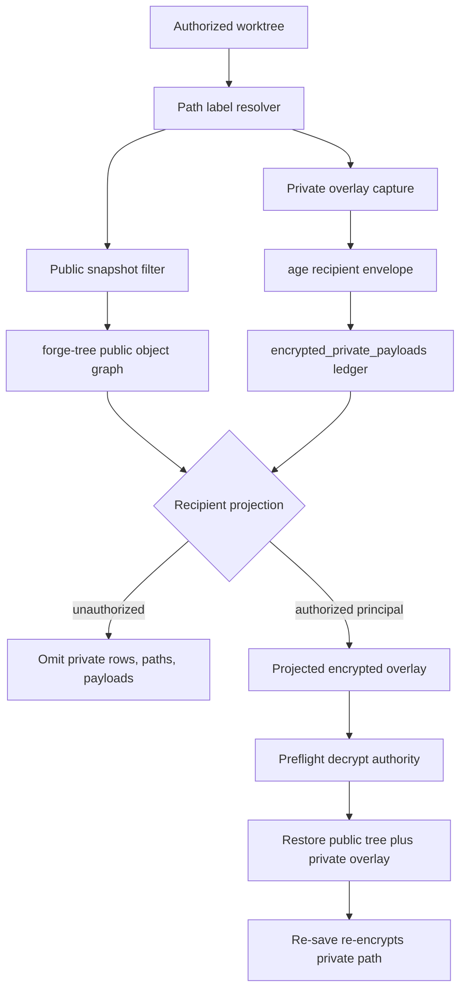

# feat: Add encrypted private content

## Summary

Implement encrypted private content as an overlay on top of Forge's existing work-package visibility and org-principal foundations. Public `forge-tree:` snapshots keep the public projection only; private source/config paths are captured into encrypted overlay records and are materialized only when the recipient has both `sync_materialize` visibility and org-bound decrypt authority.

The first slice proves Theo's change-level privacy pressure in one concrete flow: one Forge graph can carry public core work plus one private source/config path, unauthorized projections omit the private material completely, and an authorized org principal can decrypt and re-save that private path without turning it into public plaintext.

---

## Problem Frame

NER-354 made recipient-scoped projection possible, and NER-357 added local org identity/key governance. NER-356 closes the remaining leak: a private path must not be stored as a normal plaintext native object and then merely filtered later. Current sync export starts from every native object payload in `build_manifest`, so filtering alone is too late if the native tree already contains private path names, object ids, or plaintext blobs.

The implementation needs to move privacy earlier in the lifecycle. Capture must split a worktree into a public tree plus encrypted private overlays before storage, sync, export, review, or Git interop can observe the private payload.

---

## Requirements

**Visibility and content model**

- R1. Forge supports private path/content labels inside a work package so public and private files coexist in one Forge graph.
- R2. The prototype supports at least one private source/config path under one private work package.
- R3. Private content is deny-by-default unless the recipient has a current grant and decrypt authority.
- R4. Existing work-package visibility labels stay authoritative for existence, stubs, and egress.
- R5. Private path labels refine work-package visibility by marking which paths require encrypted capture and restricted projection.

**Encryption and decryption**

- R6. Private path payloads are encrypted before Forge-managed content storage, sync bundles, or exported Forge artifacts persist them.
- R7. Authorized materialization decrypts private payloads only for the granted org principal/encryption-key context.
- R8. Missing, revoked, stale, or mismatched decrypt authority fails closed before materialization writes any public or private file.
- R9. Unauthorized projections omit private encrypted payloads instead of shipping ciphertext placeholders.
- R10. Public Git export includes neither plaintext nor ciphertext for private paths.

**Egress, evidence, and projection safety**

- R11. Unauthorized sync/export/review output omits private object ids, private ledger rows, private diffs, private evidence, and private command excerpts.
- R12. Revocation blocks future Forge-managed sync, export, review, and materialization for the private payload.
- R13. Unauthorized diagnostics and sync manifests redact private existence, private path names, and private omission state when policy does not grant a safe stub.
- R14. Authorized private evidence and command output inherit restricted visibility until a future sanitized reveal feature exists.
- R15. Re-capturing an authorized worktree with a materialized private path preserves the private label and re-encrypts the payload.

**Agent contract and audit**

- R16. JSON output distinguishes full content, omitted content, encrypted private content, and failed decrypt authority without prose parsing.
- R17. Grants, revocations, encryption/materialization decisions, and omission decisions record principal-aware audit events. Origin R17's reveal-action audit is deferred because this slice ships no reveal command.
- R18. Docs and errors state the residual risk: Forge cannot erase or protect plaintext already materialized on an authorized machine, ciphertext bundles already delivered, or private keys already copied.

---

## Acceptance Examples

- AE1. Given public core code plus a private extension path, `forge save` stores the public tree normally and stores the private path only as encrypted private overlay content.
- AE2. Given an unauthorized recipient exports or syncs that work, the bundle contains no private plaintext, ciphertext, path name, object id, ledger row, diff, or evidence excerpt.
- AE3. Given a maintainer grants a reviewer private materialization and the reviewer has a valid org-bound decrypt key, `sync import --materialize` restores the public tree and decrypts the private path locally.
- AE4. Given the reviewer or key is revoked, future materialization fails closed with a structured revocation diagnostic while already materialized local plaintext, previously delivered ciphertext, and copied private keys remain out of clawback scope.
- AE5. Given private work is accepted but not revealed, public Git export emits only the public projection and sanitized provenance.
- AE6. Given a private label is `embargoed`, an unauthorized recipient receives no existence signal unless policy explicitly grants a safe stub.
- AE7. Given an authorized reviewer edits the materialized private path and saves a new attempt, Forge stores the new version as encrypted private content and does not regress it into the normal native tree.

---

## Key Technical Decisions

- KTD1. **Model private content as an encrypted overlay, not encrypted blobs in the normal tree.** Native tree objects include path names and object ids, so putting encrypted blobs in the tree still leaks private structure. Capture should exclude private paths from the public `forge-tree:` and persist encrypted overlay rows tied to the snapshot/work package.
- KTD2. **Use an internal `forge-private` crypto boundary.** Private capture, private storage, sync, and materialization code should depend on a narrow API such as `encrypt_private_payload`, `decrypt_private_payload`, and `recipient_fingerprint`, not on age crate types. Public Git export and public review paths depend only on the public `content_ref` projection contract and must not import or inspect private overlay payloads.
- KTD3. **Use age recipient envelopes as the first implementation target.** The `age` format already supports recipient-based file encryption, streaming payloads, and X25519 identities. The in-progress branch already has age-based scaffolding, so U1 is now a validation gate for that existing choice rather than a greenfield dependency decision. If validation rejects age, amend the envelope format, key format, recipient fingerprint semantics, and tests before U2-U7 continue.
- KTD4. **Do not reuse Ed25519 signing keys as encryption identities.** Existing local keys under `.forge/keys/local-ed25519.pk8` are signing keys. NER-356 needs a separate local encryption identity plus `org_encryption_key_bindings` rows that bind recipient encryption keys to org principals without reusing the existing signing-key foreign-key model.
- KTD5. **Projection still decides visibility; crypto enforces payload secrecy.** `projection_decision` and `sync_materialize` remain the authorization gate. Encryption does not create a second policy system; it protects the payload when policy says the recipient may receive it.
- KTD6. **Unauthorized recipients get omission, not ciphertext.** Projected sync and Git export should not contain private encrypted payloads, private overlay rows, private path labels, or private object references. A future reveal feature may define a safe public representation, but that is outside this slice.
- KTD7. **Materialization is transactional at the command level.** Every command path that restores a native `content_ref` must use a shared private-aware materialization helper: restore, checkout, undo, attempt attach, sync import, sync clone, and sync peer pull all validate public content, decrypt authority, payload integrity, metadata binding, and private label installation before writing any public or private file. If private overlay preflight fails, the command fails before worktree writes rather than restoring a public-only partial state.
- KTD8. **Preserve the existing secret-risk controls.** `.env`, private keys, credential-like files, and evidence redaction remain mandatory controls. Encrypted private content expands the model for private source/config paths; it does not make secret-risk exclusion optional.
- KTD9. **Treat private path metadata as private.** Private path labels are exact canonical repo-relative paths in this slice; no globs ship yet. Plain ledger rows may store only non-sensitive handles such as a path label id and scoped keyed path hash, while display paths, private changed paths, entry kind, mode, symlink targets, and plaintext-derived integrity metadata live inside authenticated encrypted overlay metadata. The path hash must be a per-repo keyed construction, not a raw SHA of the path. Raw repo-local hash keys are never exported; authorized import decrypts the private path metadata and rebinds the path into the recipient's local private label registry with that repo's local keyed hash so re-save preserves privacy without sharing hash-key material.
- KTD10. **Support grant-after-capture through recipient-specific transport envelopes.** Private overlays are stored at rest to the local owner/maintainer encryption identity. An authorized export decrypts locally and emits a recipient-specific encrypted transport overlay after `projection_decision` and org encryption-key checks pass, so grants do not have to exist before capture. Capture must either bind a configured maintainer/recovery recipient at capture time or emit a machine-readable warning that the overlay is single-key recoverable only. Missing or rotated-away owner/recovery decrypt keys fail future export with a typed diagnostic. Revocation disables future Forge-managed sync, export, review, and materialization; it cannot claw back previously delivered ciphertext or copied keys.
- KTD11. **Store encrypted bytes in a private content-addressed store.** Ciphertext bytes live under a private object area such as `.forge/private/objects/sha256/...`, referenced by `encrypted_private_payloads` rows by final ciphertext digest. The encrypted bytes are written and fsynced before the DB row commits, mirroring the existing store-before-DB durability contract.
- KTD12. **Bind overlay metadata cryptographically without circular digests.** Canonical overlay metadata is embedded inside the encrypted overlay payload and duplicated non-sensitive fields in the manifest/ledger must match the decrypted metadata before materialization. The final ciphertext digest is verified before decrypt from the object path or manifest bytes, but it is not embedded inside the encrypted metadata that produces that same ciphertext. This avoids a self-referential digest while still binding repo id, work-package kind/id, snapshot id, path label id or scoped path hash, envelope format, recipient fingerprint, plaintext content digest, and creator/signature subject.
- KTD13. **Use `forge-sync.v2` as a generic upgraded protocol, not a private-existence signal.** Keep reading/importing existing `forge-sync.v1` bundles that do not claim private-content capability. Upgraded clients may emit `forge-sync.v2` for all projections so the version alone does not reveal private content. Unauthorized manifests must not carry `private_content.capable`, `omitted`, private counts, or omission-mode fields unless projection policy explicitly grants a safe existence signal. Older clients receive a typed upgrade-required failure for v2 sync; public Git export remains the compatibility channel for public-only sharing to old clients.
- KTD15. **Authorize private/key mutations at the command boundary.** Mutating private-label, grant/revoke, decrypt-authority, and org-encryption-key binding commands must run under an authenticated org principal and require maintainer/owner authority, except for the deliberately narrow creator authority to label paths in their own work package if the existing visibility model allows it. Denials are typed and audited before any DB write.
- KTD14. **Treat migration 020 as additive and fail-closed.** The schema migration adds private-overlay tables and bindings without rewriting existing public snapshots. Older binaries must keep refusing databases ahead of their compiled schema version, and the release gate must exercise the live-binary ahead-of-DB failure mode that previously caught migration drift.

---

## Current Implementation Baseline

This plan is being executed on an in-progress branch. The following scaffolding already exists and should be extended rather than recreated:

- `crates/forge-private/` with age X25519 envelope helpers and envelope tests.
- Migration `crates/forge-store/migrations/020_encrypted_private_content.sql` plus store structs for private path labels, encrypted payload rows, org encryption-key bindings, and decrypt-authority checks.
- Native snapshot exclusion support in `crates/forge-content-native/src/lib.rs`.
- Initial CLI commands for `visibility path set`, `org encryption bind-local`, and `org decrypt-authority`.
- Initial encrypted-content tests in `crates/forge-cli/tests/forge_encrypted_private_content.rs` and org encryption tests in `crates/forge-cli/tests/forge_org_identity.rs`.

Remaining work should focus on closing the architectural gaps below: transaction-safe private save, keyed path-hash mechanics, private sync v2 projection/materialization, private-tainted evidence handling, public egress leak tests, and dogfood evidence.

---

## High-Level Technical Design

The normal snapshot path remains the authoritative public content ref. Private overlays are additional snapshot-bound records. A materialized worktree is therefore the composition of `content_ref` plus all private overlays the current principal is authorized to decrypt.

---

## Implementation Units

### U1. Add the private crypto boundary

- **Goal:** Add a small internal crate that owns encryption identity generation, recipient parsing, payload envelope encryption/decryption, tamper detection, and secret-value handling.
- **Files:** `Cargo.toml`, `Cargo.lock`, `crates/forge-private/Cargo.toml`, `crates/forge-private/src/lib.rs`, `crates/forge-private/tests/envelope.rs`, `crates/forge-store/src/error.rs`.
- **Approach:** Validate the existing age-based scaffolding for license, API stability, maintenance, security posture, and testability before expanding downstream private-content work. Generate a separate X25519 encryption identity under `.forge/keys/local-age-x25519.txt` or an equivalent private file with the same permission discipline used by `crates/forge-store/src/signing.rs`. Expose only Forge-owned structs with serde-safe public metadata and keep private identity material wrapped so debug/serde output cannot leak it. If age is rejected, stop after U1 and amend the plan before downstream units rely on a replacement envelope.
- **Test scenarios:**
  - `crates/forge-private/tests/envelope.rs` encrypts and decrypts a byte payload for one recipient.
  - `crates/forge-private/tests/envelope.rs` proves the wrong recipient fails without returning plaintext.
  - `crates/forge-private/tests/envelope.rs` proves tampered ciphertext fails with a typed error.
  - `crates/forge-private/tests/envelope.rs` proves debug/JSON output includes recipient fingerprints and envelope metadata but not private identity material or plaintext.
- **Verification:** `cargo test -p forge-private` plus the full Forge verification gate.
- **Requirements:** R3, R6, R7, R8, R16.

### U2. Persist private overlays and decrypt authority

- **Goal:** Add schema and store APIs for private path labels, encrypted payload metadata, encryption recipients, encrypted byte references, and principal-aware audit events.
- **Files:** `crates/forge-store/migrations/020_encrypted_private_content.sql`, `crates/forge-store/src/migrations.rs`, `crates/forge-store/src/lib.rs`, `crates/forge-store/src/error.rs`, `crates/forge-store/tests/migrate.rs`, `crates/forge-cli/tests/forge_migration_upgrade.rs`.
- **Approach:** Keep public/non-sensitive path labels on the existing visibility model, but add private-label storage that records a path label id, scoped keyed path hash, encrypted display-path metadata, visibility, and work-package binding without persisting private path names as plaintext. Replace any unkeyed path digest with a per-repo keyed hash helper and private hash-key file that follows signing/encryption key permissions. Add `org_encryption_key_bindings` for recipient public keys, fingerprints, state, principal, authority, revision bounds, and audit hooks. Add `encrypted_private_payloads` rows tied to `repo_id`, work-package kind/id, snapshot id, path label id, scoped path hash, envelope format, owner or transport recipient fingerprint, ciphertext digest, private object path, and created time. Store entry kind, mode, symlink target, private changed path, display path, and plaintext-derived integrity metadata only inside the encrypted payload; import/materialization compares decrypted metadata against manifest and ledger fields before writing. Keep migration 020 additive: existing public snapshots remain valid, no downgrade path is promised, and older binaries must refuse read-only access to a DB migrated beyond their compiled schema. Add decrypt-authority lookup through `org_principals` and active `org_encryption_key_bindings`; private sync treats `--recipient` as an org principal id in this slice, calls `private_decrypt_authority`, and uses the returned public key/fingerprint for recipient-specific transport envelopes. Mutating label, grant, revoke, decrypt-authority, and encryption-key binding APIs must validate caller authority before DB writes and record success plus denial audit events. Fail with typed org/decrypt errors when org bootstrap, encryption key binding, role binding, visibility grant, owner at-rest decrypt key, or recovery decrypt key is missing. Reserve reveal audit vocabulary for later; this slice records encryption, materialization, omission, grants, and revocations, while public egress remains omission-only.
- **Test scenarios:**
  - `crates/forge-store/tests/migrate.rs` applies migration 020 from a fresh DB and from a DB at migration 019.
  - `crates/forge-store/tests/migrate.rs` verifies all new rows carry migration checksums and fail read-only when the DB is ahead of the binary.
  - `crates/forge-store/src/lib.rs` unit tests prove active grant plus active org encryption key binding is required for decrypt authority.
  - `crates/forge-store/src/lib.rs` unit tests prove revoked grants, revoked encryption key bindings, disabled org authority, and mismatched recipient fingerprints fail closed.
  - `crates/forge-store/src/lib.rs` unit tests prove private overlay rows and syncable ledger rows do not contain plaintext private path names, unkeyed path digests, or plaintext-derived digests.
  - `crates/forge-store/src/lib.rs` unit tests prove private sync recipient ids resolve to org principal decrypt authority and reject raw/unmapped recipients.
  - `crates/forge-store/src/lib.rs` unit tests prove unprivileged callers cannot mutate private labels, grants, revocations, decrypt authority, or org encryption-key bindings.
- **Verification:** Store tests plus the migration live-binary compatibility test that previously caught ahead-of-binary failures.
- **Requirements:** R1, R2, R3, R5, R7, R8, R12, R17.

### U3. Capture private paths as encrypted overlays

- **Goal:** Change save/capture so private paths never enter the normal native tree object graph as plaintext, path-bearing tree entries, or encrypted placeholders.
- **Files:** `crates/forge-content/src/lib.rs`, `crates/forge-content-native/src/lib.rs`, `crates/forge-store/src/lib.rs`, `crates/forge-cli/src/main.rs`, `crates/forge-cli/src/schema.rs`, `crates/forge-cli/tests/forge_schema.rs`, `crates/forge-cli/tests/forge_encrypted_private_content.rs`.
- **Approach:** Add the minimal authorized `visibility path set` command/schema needed before capture, then add a `SnapshotOptions` or equivalent private-aware snapshot API that excludes selected private paths from `scan_worktree`/`write_tree`. `snapshot_effective_worktree` should resolve exact canonical private labels for the active work package, snapshot the public tree with those paths excluded, encrypt each private file into an overlay payload through `forge-private`, write ciphertext to the private object store, and record overlay rows atomically with the snapshot. This requires a store-level `save_snapshot_with_private_overlays` or equivalent: preflight private labels, read/encrypt/fsync private payloads, then insert the snapshot, overlay rows, and audit rows in one DB transaction; if any private overlay cannot be produced, no public snapshot is committed. Capture also records whether a maintainer/recovery recipient was bound or emits the single-key-recoverable warning from KTD10. `snapshots.changed_paths_json`, `proposal_revisions.changed_paths_json`, and save replay data store only public or redacted paths; private changed paths live in encrypted overlay metadata and surface only through authorized private-content APIs. A materialized private file moved, copied, or renamed to an unlabeled path must fail closed or require explicit relabeling before `forge save` can publish that path.
- **Test scenarios:**
  - `crates/forge-cli/tests/forge_encrypted_private_content.rs` saves a repo with `src/public.rs` and `src/private_ext.rs`; the resulting public `forge-tree:` contains only the public path.
  - `crates/forge-cli/tests/forge_encrypted_private_content.rs` scans `.forge/objects` and exported manifest JSON for a sentinel private string and finds none.
  - `crates/forge-cli/tests/forge_encrypted_private_content.rs` injects a private read/encrypt/overlay failure and proves no public snapshot is committed without its private overlay.
  - `crates/forge-cli/tests/forge_encrypted_private_content.rs` proves `changed_paths` reports authorized private changes while redacting unauthorized projections.
  - `crates/forge-cli/tests/forge_encrypted_private_content.rs` proves moving or copying a materialized private file to an unlabeled path fails closed or requires relabeling before save.
  - `crates/forge-content-native/src/lib.rs` tests prove private exclusion works for regular files, executable mode changes, symlinks, nested directories, and deletion of a previously private path.
- **Verification:** CLI encrypted-content tests plus native content tests.
- **Requirements:** R1, R2, R5, R6, R11, R13, R15, AE1, AE7.

### U4. Add CLI and schema contract for private path labels

- **Goal:** Complete the agent-facing command surface for inspecting authorized private path state and seeing machine-readable encrypted-content outcomes after U3 lands the minimal label setter.
- **Files:** `crates/forge-cli/src/main.rs`, `crates/forge-cli/src/schema.rs`, `crates/forge-cli/tests/forge_schema.rs`, `crates/forge-cli/tests/forge_visibility.rs`, `crates/forge-cli/tests/forge_encrypted_private_content.rs`.
- **Approach:** Extend the `visibility` command group with path operations rather than adding a separate policy vocabulary. U3 provides the minimal exact-path setter needed by capture; U4 adds check/inspection responses and schema detail. The first slice accepts exact canonical repo-relative paths only, rejects globs, and reports when a rename/move/copy requires relabeling. Mutating commands require the caller authority defined in KTD15. Path inspection evaluates recipient capability before returning exact states: unauthorized callers without a safe stub receive an indistinguishable redacted/not-found result for private, unlabeled, and absent paths, while authorized principals may see `public`, `omitted`, `encrypted_private`, or `materialized_private`. JSON responses must include stable codes for decrypt authority failures and omission reasons without creating a private-path oracle.
- **Test scenarios:**
  - `crates/forge-cli/tests/forge_schema.rs` proves the agent schema documents the new path-label and encrypted-content response fields.
  - `crates/forge-cli/tests/forge_visibility.rs` proves path labels inherit or refine work-package visibility as expected.
  - `crates/forge-cli/tests/forge_encrypted_private_content.rs` proves malformed paths, unlabeled paths, missing work packages, and invalid labels return typed errors without leaking private path contents.
  - `crates/forge-cli/tests/forge_encrypted_private_content.rs` proves unauthorized path inspection returns the same redacted/not-found shape for private, unlabeled, and absent paths unless a safe stub is granted.
- **Verification:** Schema and visibility CLI tests.
- **Requirements:** R1, R4, R5, R13, R16.

### U5. Project and materialize encrypted overlays through sync

- **Goal:** Extend sync export/import so authorized recipients receive encrypted private overlays and unauthorized recipients receive no private material.
- **Files:** `crates/forge-sync/src/lib.rs`, `crates/forge-cli/src/main.rs`, `crates/forge-cli/src/schema.rs`, `crates/forge-cli/tests/forge_sync.rs`, `crates/forge-cli/tests/forge_encrypted_private_content.rs`.
- **Approach:** Add dual protocol handling: continue accepting `forge-sync.v1` bundles that do not carry private-content capability, and emit/import generic `forge-sync.v2` bundles without making version or manifest metadata a private-existence signal. Authorized v2 manifests may carry encrypted private overlays; unauthorized manifests remove private `path_visibility_labels` entries, `encrypted_private_payloads`, private object refs, private changed paths, private evidence, private counts, and private omission-mode fields unless policy grants a safe stub. Older clients fail with a typed upgrade-required error for v2 sync; public Git export remains the compatibility path for public-only sharing to older clients. For the first private sync slice, `--recipient` is an org principal id; export calls `private_decrypt_authority`, decrypts the local at-rest overlay with an available owner/maintainer/recovery key, and emits a recipient-specific transport envelope with the returned public key/fingerprint. Every worktree materialization path, not only `sync import --materialize`, must use the same private-aware helper for public restore plus authorized overlays. On import/materialization, validate protocol version, feature capability, projection metadata, recipient fingerprint, envelope integrity, decrypted metadata binding, grant state, and all overlay rows before restoring public content or writing private files. Successful authorized materialization installs decrypted private path label metadata into the local private label registry with private-file permissions before writing the private file; if label installation fails, materialization fails closed. Materialization uses a staged write path: validate and decrypt into a temp/staging area, enforce canonical repo-relative paths, reject absolute paths, parent traversal, Windows drive/device prefixes, symlink-follow escapes, path collisions, and malicious symlink targets, then fsync and atomically swap/rename or roll back with an explicit journal. Imports must reject replay/substitution where ciphertext decrypts but the bound repo, work-package, snapshot, path-label, recipient, plaintext digest, or signature subject does not match the manifest/ledger state. Until U6's private-tainted evidence behavior is implemented, `forge run` and evidence persistence must fail closed in materialized private worktrees.
- **Test scenarios:**
  - `crates/forge-cli/tests/forge_sync.rs` proves unauthorized projected export omits private overlay rows, payloads, labels, object ids, path names, and sentinel plaintext.
  - `crates/forge-cli/tests/forge_sync.rs` proves unauthorized projections do not reveal private existence through protocol metadata, private counts, or omission-mode fields, and that generic `forge-sync.v2` upgrade failures are typed.
  - `crates/forge-cli/tests/forge_sync.rs` proves authorized projected export includes encrypted overlay payloads and no plaintext.
  - `crates/forge-cli/tests/forge_sync.rs` proves `sync import --materialize`, restore, checkout/undo, attempt attach, sync clone, and sync peer pull restore the public tree plus authorized private overlays through the shared helper.
  - `crates/forge-cli/tests/forge_sync.rs` proves authorized materialization installs local private label metadata, then editing and saving the materialized path re-encrypts it instead of adding it to the public tree.
  - `crates/forge-cli/tests/forge_sync.rs` proves revoked grant, revoked encryption key binding, missing owner/recovery decrypt key, missing recipient private key, wrong recipient, tampered payload, and metadata replay/substitution all fail before any worktree file is written and include the R18 residual-risk boundary where relevant.
  - `crates/forge-cli/tests/forge_sync.rs` proves malicious decrypted metadata with traversal, absolute path, Windows prefix, symlink target escape, or path collision fails before any worktree file is written.
  - `crates/forge-cli/tests/forge_sync.rs` proves incremental projected export cannot reintroduce private rows that were omitted in the base projection.
  - `crates/forge-cli/tests/forge_sync.rs` proves v1 bundles without private capability remain importable, while older/v1-only import paths reject generic v2 manifests with a typed upgrade-required error.
- **Verification:** Sync CLI tests and manifest validation tests.
- **Requirements:** R3, R7, R8, R9, R11, R12, R13, R16, R17, AE2, AE3, AE4, AE6.

### U6. Keep Git export, review output, and evidence leak-safe

- **Goal:** Ensure public egress paths never expose private plaintext, ciphertext, path names, diffs, evidence excerpts, or provenance that points to private overlays.
- **Files:** `crates/forge-export-git/src/lib.rs`, `crates/forge-evidence/src/lib.rs`, `crates/forge-store/src/lib.rs`, `crates/forge-cli/tests/forge_secret_export.rs`, `crates/forge-cli/tests/forge_accept_export.rs`, `crates/forge-cli/tests/forge_pr_body.rs`, `crates/forge-cli/tests/forge_run_evidence.rs`, `crates/forge-cli/tests/forge_encrypted_private_content.rs`.
- **Approach:** Treat private overlays like stronger secret-risk paths for public/export surfaces. Git export should operate on the public `content_ref` only and must not depend on `forge-private`. Compare/review paths should suppress private overlay diffs unless a future authorized review mode is built. For this slice, evidence captured while private content is materialized is not persisted as raw stdout/stderr or command excerpts; Forge stores only a typed private-tainted evidence marker plus redacted diagnostics, and raw evidence persistence fails closed if the command output cannot be proven public-safe. Projection omission alone is not enough because raw `.forge/forge.db` and evidence stores must not contain private sentinel plaintext. No reveal command or encrypted private-evidence viewer ships in this slice.
- **Test scenarios:**
  - `crates/forge-cli/tests/forge_accept_export.rs` exports an accepted proposal and proves the branch has no private file, ciphertext, private path name, or private provenance pointer.
  - `crates/forge-cli/tests/forge_pr_body.rs` proves PR body generation omits private changed paths and emits only redacted capability-aware warnings.
  - `crates/forge-cli/tests/forge_run_evidence.rs` proves command output from a materialized private worktree stores only a typed private-tainted evidence marker plus redacted diagnostics and is not present in raw `.forge/forge.db`, evidence stores, unauthorized review output, or export output.
  - `crates/forge-cli/tests/forge_secret_export.rs` proves existing `.env` and key-file exclusion still runs alongside encrypted private overlays.
- **Verification:** Export, PR body, evidence, and secret-export tests.
- **Requirements:** R10, R11, R13, R14, R18, AE5.

### U7. Add dogfood fixture and documentation

- **Goal:** Prove the feature in `forge-dogfood` with the exact release-grade leak matrix the user expects before any RC.
- **Files:** `docs/dogfood-reports/2026-06-24-ner-356-encrypted-private-content-dogfood.md`, `docs/RELEASE_CHECKLIST.md`, `docs/P9_RELEASE_AUDIT.md`, `README.md`, `crates/forge-cli/src/schema.rs`.
- **Approach:** Create a dogfood scenario with public core code, one private source/config path, one unauthorized recipient, one authorized org principal, a recovery-key or single-key-recoverable warning path, a revocation check, a re-save check, sync export/import, Git export, and raw artifact scans for sentinel plaintext/ciphertext/path leaks. The report must state that revocation does not claw back already delivered ciphertext, local sync bundles, or copied private keys, and it must show the same residual-risk boundary in relevant CLI diagnostics. Update release docs so NER-356 and future changes touching private content, projection, sync, export, or evidence egress require feature-specific dogfood evidence before RC publication.
- **Test scenarios:**
  - `docs/dogfood-reports/2026-06-24-ner-356-encrypted-private-content-dogfood.md` records commands and outcomes for unauthorized export omission.
  - `docs/dogfood-reports/2026-06-24-ner-356-encrypted-private-content-dogfood.md` records authorized materialization and re-save re-encryption.
  - `docs/dogfood-reports/2026-06-24-ner-356-encrypted-private-content-dogfood.md` records missing owner/recovery-key diagnostics and the single-key-recoverable warning path.
  - `docs/dogfood-reports/2026-06-24-ner-356-encrypted-private-content-dogfood.md` records public Git export leak scans.
  - `docs/RELEASE_CHECKLIST.md` requires feature-specific dogfood evidence before RC publication.
- **Verification:** Full Forge verification gate plus a dogfood run in `forge-dogfood`.
- **Requirements:** R16, R18, AE1, AE2, AE3, AE4, AE5, AE7.

---

## System-Wide Impact

- **Storage:** Migration 020 adds a new encrypted overlay lifecycle tied to snapshots and work packages. Ciphertext bytes live in a private content-addressed object area such as `.forge/private/objects/sha256/...`; store-before-DB durability must include encrypted payload writes before overlay rows commit.
- **Content model:** `forge-tree:` no longer represents the full authorized worktree when private overlays are present. Restoration becomes public tree plus optional private overlay through a shared helper used by every materialization path.
- **Sync protocol:** `forge-sync.v2` becomes a generic upgraded protocol rather than a private-existence signal. Older binaries fail closed with a typed upgrade-required error, and public Git export remains the compatibility path for public-only sharing.
- **Org identity:** Decrypt authority depends on org principal/encryption-key state, and encryption keys remain separate from Ed25519 signing keys through `org_encryption_key_bindings`.
- **Agent schema:** New path-label commands, omission states, encrypted-private states, and decrypt-failure codes must be machine-readable.
- **Release process:** The dogfood gate must include feature-specific private-content leak scans before an installable RC.

---

## Scope Boundaries

- No hosted identity, SSO, SCIM, OIDC, external KMS, or hosted certificate authority.
- No general team key-distribution system beyond one explicit authorized recipient/decrypt authority path.
- No same-user zero-trust guarantee after materialization.
- No claim to claw back plaintext that was already materialized on an authorized machine, ciphertext that was already delivered in a sync bundle, or private keys already copied to a recipient.
- No `.env`-only secret manager as the product shape for this slice.
- No ciphertext representation in public Git export.
- No reveal command in this slice; current public egress remains omission-only.
- No full hosted review UI.
- No broad path-label UX polish beyond what is needed to dogfood the prototype.
- No private merge/conflict UX beyond failing closed or preserving private overlays in the first slice.

---

## Risks & Dependencies

| Risk | Mitigation |
| --- | --- |
| Crypto dependency risk from using a pre-1.0 Rust `age` crate | Keep the crate behind `forge-private`, validate license/API/security posture in U1, and block downstream units if the dependency is rejected. |
| Private path leaks through native tree objects | Exclude private paths from `write_tree` and test raw `.forge/objects` plus manifest JSON for sentinel path/content strings. |
| Private path leaks through metadata rows | Store private path names and changed paths only inside authenticated encrypted metadata; expose only scoped keyed path hashes in plaintext rows and omit private rows from unauthorized projections. |
| Re-capture after authorized materialization stores plaintext | Resolve labels before snapshotting and make private-aware capture the only save path for labeled private paths. |
| Decrypt authority drifts from org authority | Centralize recipient-to-principal/encryption-key lookup in store APIs and test revoked/mismatched states. |
| Partial materialization leaves private plaintext after failure | Preflight all overlay integrity and authority checks before writing public or private files during materialization. |
| Private existence leaks through sync metadata | Make v2 a generic upgraded protocol, omit private-capable/omission fields from unauthorized manifests unless policy grants a safe stub, and test embargoed projections. |
| Authorized re-save loses private label state | Install private label metadata during materialization before writing private files and test import-edit-save re-encryption. |
| Private evidence persists before U6 lands | Fail closed for `forge run` and evidence persistence in materialized private worktrees until the redacted private-tainted evidence marker is implemented. |
| Existing secret-risk policy regresses | Keep `.env`/key-file exclusion tests and add combined secret-risk plus private-overlay tests. |
| Delivered ciphertext outlives revocation | State the boundary in docs/errors and test only future Forge-managed delivery/materialization after revocation. |
| Protocol compatibility with older binaries | Use typed upgrade-required failures for v2 sync and document public Git export as the compatibility channel. |
| Migration drift reaches release | Treat migration 020 as additive, update schema-migration fixtures in the same unit as the SQL, and keep the live-binary ahead-of-DB compatibility gate in the release path. |

---

## Sources / Research

- `docs/brainstorms/2026-06-24-encrypted-private-content-requirements.md` - origin requirements, actors, flows, acceptance examples, and Theo-derived product pressure.
- `docs/brainstorms/2026-06-23-permissioned-forge-requirements.md` - permissioned Forge visibility model and recipient-scoped projection.
- `docs/plans/2026-06-23-001-feat-permissioned-forge-plan.md` - prior visibility/sync/export implementation plan.
- `docs/brainstorms/2026-06-24-org-identity-key-governance-requirements.md` - org principal and key governance requirements.
- `docs/brainstorms/2026-05-29-encrypted-env-secrets-requirements.md` - related encrypted-secret threat boundary.
- `docs/P9_RELEASE_AUDIT.md` - release boundary that identifies encrypted private content as not yet shipped.
- `crates/forge-store/migrations/018_visibility_policy.sql` - existing visibility policy, path labels, grants, and audit tables.
- `crates/forge-store/migrations/019_org_identity_governance.sql` - existing org principal, key binding, role binding, and audit tables.
- `crates/forge-content-native/src/lib.rs` - native object/tree capture and restore paths that must exclude private paths from normal trees.
- `crates/forge-sync/src/lib.rs` - sync manifest, recipient projection, projected payload pruning, import, and materialization validation.
- `crates/forge-export-git/src/lib.rs` - Git export, review diff, and provenance surfaces that must remain public-only.
- `crates/forge-store/src/signing.rs` - local signing-key permission discipline to mirror for local encryption identity storage.
- [age Rust crate docs](https://docs.rs/age/latest/age/) - recipient-based encryption APIs and current crate status.
- [age format specification](https://age-encryption.org/v1) - recipient envelope, non-malleable payload, and streaming encryption format.
- [rage repository](https://github.com/str4d/rage) - Rust implementation and library guidance for the age ecosystem.
- [secrecy crate docs](https://docs.rs/secrecy/latest/secrecy/) - secret-value handling and zeroize-backed memory cleanup behavior.
