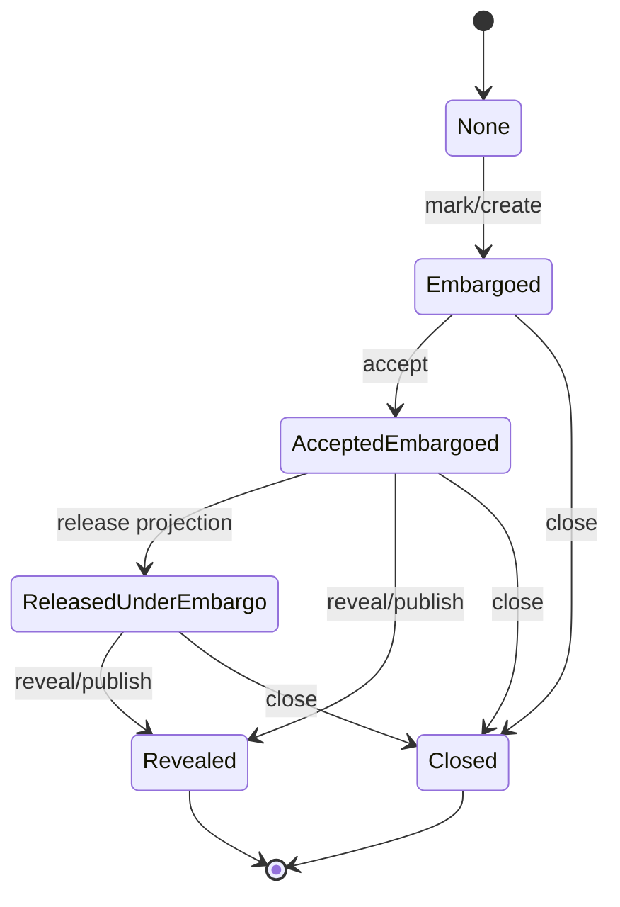
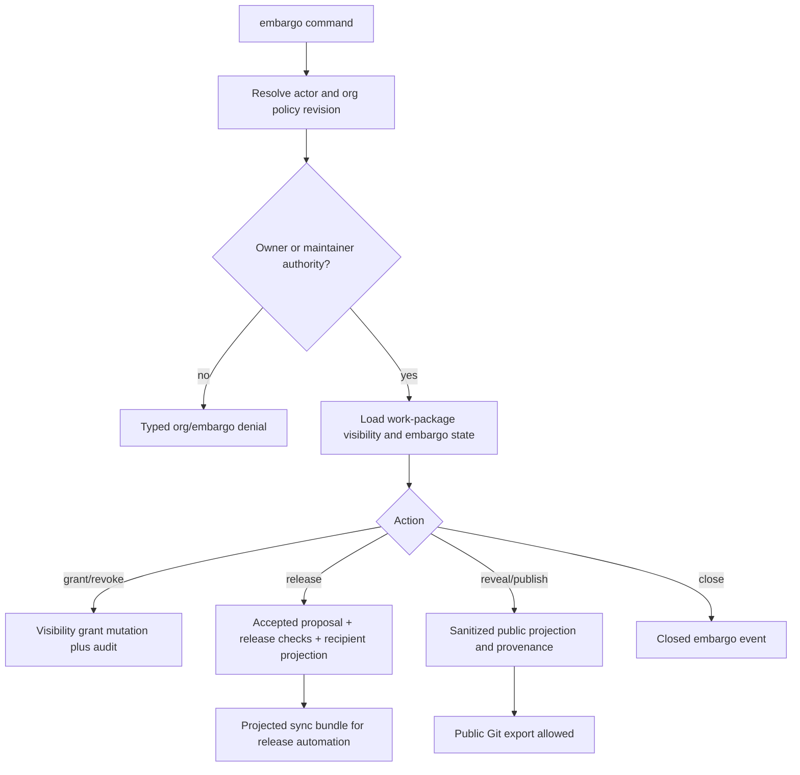
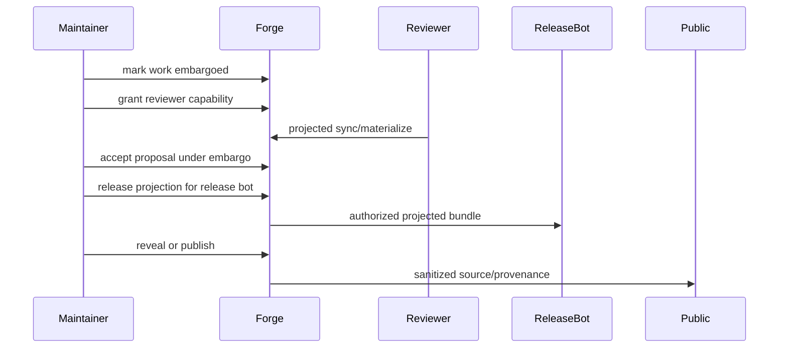

# feat: Add embargoed security-fix workflow

## Summary

Add a first-class embargo workflow for security fixes that can be accepted, reviewed, projected to authorized release automation, and later revealed, published, or closed without leaking source, private paths, raw evidence, diffs, or review history to unauthorized recipients.

The implementation should reuse Forge's existing visibility grants, org principals, encrypted private overlays, sync projection, trust policy, and Git export provenance. NER-358 adds workflow state, authority gates, release/reveal actions, sanitized provenance, and dogfood coverage around those primitives rather than creating a second permission model.

---

## Problem Frame

Forge already has the substrate that Git-style repository privacy lacks: work-package visibility, capability-scoped grants, org identity, encrypted private content, trust policy, recipient-scoped sync, and public Git export. The remaining gap is the workflow Theo highlighted: a security fix often needs to move through review and release before exploit-bearing source can be public.

The current `embargoed` visibility label hides work by default, but the product contract is broader than a label. Maintainers need stateful release-before-source, separate reveal or close, authority-aware grants, stale-policy refusal, sanitized provenance, and an evidence trail that proves the workflow was enforced.

---

## Requirements

These are plan-local requirement IDs (`PR#`). The origin brainstorm keeps its
own `R#` IDs; implementation units trace to `PR#` here and the Sources section
keeps the upstream link explicit.

**Embargo State and Authority**

- PR1. Forge records an embargo workflow state for intent, attempt, and proposal work packages without treating accept as reveal.
- PR2. Embargo creation, release projection, reveal, public publish, close, grant, and revoke require current owner or maintainer authority when org governance is enabled.
- PR3. Unauthorized recipients receive no embargo existence signal, path names, object ids, diffs, evidence, raw review metadata, or audit details unless explicitly granted a safe view.
- PR4. Every embargo workflow transition records actor, authority, reason, prior state, new state, policy revision, and timestamp.
- PR5. Legacy visibility commands continue to work for non-embargoed private/team/public flows.

**Restricted Review and Release**

- PR6. Embargo grants remain explicit, minimal, capability-scoped visibility grants.
- PR7. Authorized reviewers can inspect or materialize only the content/evidence capabilities they hold.
- PR8. Release automation receives a constrained recipient projection for accepted embargoed work without public source reveal.
- PR9. Release projection fails closed when required checks fail, authority is stale, decrypt authority is missing, or the projection would require ungranted embargoed material.
- PR10. Machine-readable command output distinguishes hidden content, authorized projection content, sanitized provenance, stale authority, and future-only revocation.

**Reveal, Publish, and Public Export**

- PR11. Reveal and public publish are separate maintainer actions after accept.
- PR12. Public reveal may include accepted content reference, public-safe decision actor reference, timestamp, trust/signature level, and required-check summary.
- PR13. Public reveal and public Git export exclude raw evidence, command logs, private paths, exploit notes, raw diffs, private review comments, private aliases, key material, and embargo audit internals.
- PR14. Maintainers can close an embargo without public reveal for abandoned, superseded, or non-public disclosure paths.
- PR15. Public Git export refuses unrevealed embargoed work instead of silently publishing hidden material.

**Safety and Dogfood**

- PR16. Existing secret-risk exclusion, evidence redaction, trust policy, encrypted private content, projection filtering, and private materialization checks remain mandatory.
- PR17. Revocation is future-only: Forge blocks future managed sync, export, review, release, reveal, and materialization without claiming local clawback.
- PR18. Sync import and materialization refuse stale or incomplete org-policy and embargo metadata.
- PR19. The shipped feature is proven by focused integration tests and a `forge-dogfood` scenario covering unauthorized omission, authorized review, release-before-source, sanitized reveal, close, stale authority, and revocation.

---

## Acceptance Examples

- AE1. Given a maintainer marks a vulnerability fix as embargoed, unauthorized recipient sync and visibility checks do not reveal the work exists, and audit records the actor, authority, reason, and state change.
- AE2. Given a maintainer grants an external reviewer `sync_materialize`, the reviewer can receive and materialize only the allowed projection while the grant, org role, and decrypt authority are current.
- AE3. Given an embargoed proposal is accepted, public sync/export still hides it until a maintainer runs a reveal or publish action.
- AE4. Given release automation is granted release projection for an accepted embargoed fix, Forge emits only sanctioned release content and sanitized provenance, and refuses if the release would require ungranted source, evidence, private overlays, or failed release checks.
- AE5. Given the embargo ends, a maintainer can reveal sanitized source/provenance while raw evidence, private paths, review discussion, exploit notes, and private identity metadata stay restricted.
- AE6. Given a fix is superseded or abandoned, a maintainer can close the embargo without public reveal and the closure is audited.
- AE7. Given a stale bundle, revoked reviewer, revoked key, or revoked role tries to sync embargoed material, Forge fails closed and states the future-only revocation boundary.
- AE8. Given a dogfood repo contains public core code and an embargoed security fix, the dogfood matrix proves unauthorized omission, authorized review, release projection, later sanitized reveal, and raw artifact leak scans.

---

## Key Technical Decisions

- KTD1. **Add an embargo workflow layer over visibility rather than a second permission system.** `embargoed` already exists as a visibility value, and grants already carry `see_stub`, `inspect_content`, `inspect_evidence`, `sync_materialize`, and `publish_reveal`. NER-358 should add workflow state, authority gates, and audit around those primitives.
- KTD2. **Use dedicated `embargo` commands for workflow actions.** `visibility set` and `visibility grant` are low-level permission primitives. Release-before-source, reveal, public publish, and close are security workflow actions with additional preconditions and should not look like ordinary label edits. Low-level visibility mutations must not create, widen, or revoke embargoed work outside the embargo workflow gate.
- KTD3. **Keep release projection constrained to recipient-scoped Forge sync transport with an embargo release envelope.** The first release-before-source path should reuse the existing `sync_materialize` transport mechanics, but embargo release bundles need a protocol-visible `embargo-release.v1` projection envelope with release authorization, policy freshness metadata, check enforcement, and audit instead of relying on plain `visibility.v1`.
- KTD4. **Make reveal/public publish the only way public Git export can include embargoed work.** `export branch` should refuse unrevealed embargoed proposals and should produce sanitized provenance only after an explicit reveal/publish action.
- KTD5. **Keep sanitized provenance as a public bridge, not raw audit.** Public output can show the accepted content reference, public-safe decision actor reference, timestamp, trust/signature summary, and check summary. It must not expose raw evidence, private path labels, exploit notes, review discussion, raw command excerpts, private aliases, keys, or internal grant/audit rows.
- KTD6. **Authorize through store-owned gates.** CLI, sync, and Git export adapters should ask store/policy code for an embargo decision object instead of rechecking raw tables independently. This follows the org-governance plan's rule that adapters must not bypass revocation by forgetting a resolver.
- KTD7. **Fail closed on stale org policy and grant state.** Release, reveal, import, and materialization must evaluate active principal, role, grant, encryption key, and policy revision state at the command boundary and reject stale projected bundles.
- KTD8. **Do not persist derived projection snapshots as source of truth.** Release and reveal decisions should recompute current authority, trust, checks, and projection reachability, then persist auditable workflow events. A stale persisted "allowed projection" cache would mask later revocation or tampering.
- KTD9. **Treat release checks as policy gates over the projected view.** A release-before-source action must prove the artifact can be built or validated from the authorized projection, and must fail if its required check depends on hidden/ungranted material.
- KTD10. **State residual risk in every relevant surface.** Revocation blocks future Forge-managed actions only; already-delivered bundles, copied keys, local plaintext, and downstream release artifacts are outside clawback.

---

## High-Level Technical Design







The authoritative state is the Forge ledger plus additive embargo workflow rows/events. Recipient projections remain transport artifacts, not durable permission snapshots. Public Git export is a projection consumer: before reveal/publish it refuses embargoed proposals; after reveal/publish it uses the existing export/provenance path with additional embargo sanitization.

---

## Implementation Units

### U1. Persist Embargo Workflow State and Audit

- **Goal:** Add durable embargo workflow state and workflow events without changing existing non-embargoed visibility behavior.
- **Requirements:** PR1, PR3, PR4, PR5, PR14, PR17.
- **Dependencies:** None.
- **Files:** `crates/forge-store/migrations/021_embargo_workflow.sql`, `crates/forge-store/src/migrations.rs`, `crates/forge-store/src/lib.rs`, `crates/forge-store/src/error.rs`, `crates/forge-store/tests/migrate.rs`, `crates/forge-cli/tests/forge_migration_upgrade.rs`, `crates/forge-cli/tests/forge_embargoed_security.rs`.
- **Approach:** Add an additive migration for embargo workflow records/events keyed by repo, work-package kind, and work-package id. Keep `work_package_visibility.visibility = 'embargoed'` as the existing deny-by-default visibility signal, but store lifecycle state such as active, accepted-under-embargo, released-under-embargo, revealed, and closed in the new workflow table. Record workflow events with prior/new state, action, actor principal, authority principal, policy revision, reason, recipient/capability when relevant, and timestamp. Avoid widening the existing `visibility_audit` `CHECK` constraint unless implementation shows it is cheaper and safe; an embargo-specific event table avoids a table rebuild and keeps legacy visibility audit semantics stable.
- **Execution note:** Start with migration and store tests because this introduces persistent state.
- **Patterns to follow:** Numbered migration discipline in `crates/forge-store/src/migrations.rs`; visibility table patterns in `crates/forge-store/migrations/018_visibility_policy.sql`; org audit shape in `crates/forge-store/migrations/019_org_identity_governance.sql`; migration head-bump lessons in `docs/solutions/architecture-patterns/schema-migration-reconciliation-and-typed-error-contract-2026-05-29.md`.
- **Test scenarios:**
  - `crates/forge-store/tests/migrate.rs` applies migration 021 on a fresh DB and on a DB at migration 020 with checksums recorded.
  - `crates/forge-store/tests/migrate.rs` verifies an older live binary refuses a DB ahead of its compiled schema head with `SCHEMA_VERSION_UNSUPPORTED`.
  - `crates/forge-store/src/lib.rs` tests valid transitions from no embargo to active, accepted-under-embargo, released-under-embargo, revealed, and closed.
  - `crates/forge-store/src/lib.rs` tests invalid transitions such as release before accept, reveal after close, and close after reveal returning a typed embargo error.
  - Covers AE1 and AE6. `crates/forge-cli/tests/forge_embargoed_security.rs` verifies marking and closing an embargo creates workflow events with actor, authority, reason, prior/new state, and policy revision.
- **Verification:** Embargo workflow state exists independently from accept/reveal, audit/event rows are complete, old visibility behavior still passes existing visibility tests, and migration-version tests prove the new schema bump is reconciled.

### U2. Add Embargo Command Surface and Schema Contract

- **Goal:** Expose workflow actions through stable CLI commands and JSON/schema output.
- **Requirements:** PR2, PR4, PR6, PR10, PR11, PR14, PR17.
- **Dependencies:** U1.
- **Files:** `crates/forge-cli/src/main.rs`, `crates/forge-cli/src/schema.rs`, `crates/forge-store/src/lib.rs`, `crates/forge-store/src/error.rs`, `crates/forge-cli/tests/forge_schema.rs`, `crates/forge-cli/tests/forge_embargoed_security.rs`, `crates/forge-cli/tests/forge_visibility.rs`, `crates/forge-cli/tests/forge_org_identity.rs`.
- **Approach:** Add a focused `embargo` command group for `mark`, `grant`, `revoke`, `release`, `reveal`, `publish`, and `close`. Keep `visibility` commands as lower-level primitives for non-embargoed private/team/public flows. For compatibility with the existing `forge.cli.v0` visibility schema, `visibility set --visibility embargoed` may act as a legacy alias for `embargo mark` as long as it records the same workflow state and audit event; `visibility grant/revoke` against embargoed work must still fail with a typed `EMBARGO_WORKFLOW_REQUIRED`-style error that points callers at the embargo commands, rather than bypassing embargo authority or audit. JSON responses should carry machine-readable workflow state, action, work-package identity, actor/authority, policy revision, recipient/capability when relevant, release/reveal/publish result fields, and residual-risk warnings for revocation or closure.
- **Execution note:** Implement the command contract test-first in `forge_schema.rs` so agents can discover the feature without scraping help text.
- **Patterns to follow:** Existing `VisibilityCommand` and `OrgCommand` command-group shape in `crates/forge-cli/src/main.rs`; schema command registry in `crates/forge-cli/src/schema.rs`; typed error registry discipline in `crates/forge-store/src/error.rs`.
- **Test scenarios:**
  - `crates/forge-cli/tests/forge_schema.rs` proves `forge schema` advertises embargo commands, output fields, and embargo-specific error codes.
  - Covers AE1. `crates/forge-cli/tests/forge_embargoed_security.rs` marks a proposal embargoed through the new command and verifies unauthorized access remains hidden.
  - `crates/forge-cli/tests/forge_embargoed_security.rs` proves a non-maintainer cannot mark, grant, release, reveal, publish, or close when org governance is enabled.
  - `crates/forge-cli/tests/forge_visibility.rs` proves `visibility set --visibility embargoed` creates the embargo workflow for compatibility, while `visibility grant/revoke` on embargoed work fail with the typed workflow-required error instead of bypassing embargo authority or audit.
  - `crates/forge-cli/tests/forge_visibility.rs` proves existing `visibility set/grant/revoke/check` behavior for private/team/public still works after the new command group lands.
  - `crates/forge-cli/tests/forge_org_identity.rs` proves owner/maintainer roles authorize embargo workflow actions while member/external/service roles do not unless explicitly allowed for recipient-side materialization.
- **Verification:** `forge schema` is updated, command responses are stable JSON envelopes, denials are typed/redacted, and legacy visibility command tests continue to pass.

### U3. Enforce Release-Before-Source Projection

- **Goal:** Produce an audited, recipient-scoped release projection for accepted embargoed work without public source reveal.
- **Requirements:** PR6, PR7, PR8, PR9, PR10, PR16, PR17, PR18.
- **Dependencies:** U1, U2.
- **Files:** `crates/forge-store/src/lib.rs`, `crates/forge-store/src/error.rs`, `crates/forge-sync/src/lib.rs`, `crates/forge-cli/src/main.rs`, `crates/forge-cli/src/schema.rs`, `crates/forge-cli/tests/forge_embargoed_security.rs`, `crates/forge-cli/tests/forge_sync.rs`, `crates/forge-cli/tests/forge_encrypted_private_content.rs`, `crates/forge-cli/tests/forge_trust_policy.rs`.
- **Approach:** Implement `embargo release` as a workflow wrapper around existing recipient-scoped sync export. The release gate should require an accepted proposal, active embargo state, maintainer authority, an explicit release authorization for the recipient/service principal, `sync_materialize` transport capability, active org/decrypt authority for private overlays when needed, current policy revision, and passing release checks over the projected content. Plain reviewer `sync_materialize` is not sufficient for release projection unless paired with the release authorization. Use the existing sync materialization transport, but emit an `embargo-release.v1` projection envelope carrying policy revision, grant/release event ids, embargo state revision, recipient principal, content-class declaration, check summary, bundle digest, generated timestamp, and future-only revocation warning. Build into a caller-hidden temporary output, run projection/leak checks, record the successful release transition with the bundle digest, and only then publish the final bundle path without clobbering an existing file; failed attempts may record non-transition attempt events but must not move state to released-under-embargo or leave a deliverable final bundle.

- **Release content model:** Release projection is not "everything the recipient can sync." It has declared content classes. Allowed classes are the minimum release inputs and sanitized provenance explicitly authorized for the release principal, plus encrypted private overlays only when that principal has decrypt authority. Prohibited by default are raw evidence, review history, exploit notes, private path labels, embargo audit internals, ungranted private overlays, and source/diff classes not explicitly declared for release. If a release build genuinely needs source-like content, the release authorization must name that class, the output remains non-public, and tests must assert the class boundary directly.
- **Technical design:** Directional gate shape:

  ```text
  authorize_embargo_release(actor, proposal, recipient)
    -> accepted decision and trust policy ok
    -> active embargo state
    -> active maintainer/owner authority
    -> active release authorization plus sync_materialize transport capability
    -> active decrypt authority if private overlays are reachable
    -> embargo-release.v1 freshness metadata can be produced
    -> release checks pass on projected view
    -> temp bundle assembled and leak-scanned
    -> audited release projection event with bundle digest
  ```

- **Patterns to follow:** Recipient projection in `crates/forge-sync/src/lib.rs`; private overlay transport through `private_overlay_transports_for_snapshots`; trust-policy enforcement in export/accept paths; content-bound gate fail-closed lessons in `docs/solutions/architecture-patterns/content-bound-gate-engine-and-failclosed-enforcement-2026-05-29.md`.
- **Test scenarios:**
  - Covers AE4. `crates/forge-cli/tests/forge_embargoed_security.rs` accepts an embargoed proposal and runs `embargo release` for a release service principal, producing a projected bundle while public export still refuses.
  - `crates/forge-cli/tests/forge_embargoed_security.rs` proves release before accept fails with a typed embargo state error and writes no release bundle.
  - `crates/forge-cli/tests/forge_embargoed_security.rs` proves reviewer `sync_materialize` alone cannot run `embargo release` without the explicit release authorization.
  - `crates/forge-cli/tests/forge_embargoed_security.rs` asserts the release content-class declaration: sanctioned release inputs are present, while raw evidence, exploit notes, private path labels, audit internals, and undeclared source/diff classes are absent.
  - `crates/forge-cli/tests/forge_embargoed_security.rs` proves release without active grant, active role, active recipient principal, or decrypt authority fails closed before bundle write.
  - `crates/forge-cli/tests/forge_embargoed_security.rs` proves failed release attempts may audit a non-transition attempt but never persist `released-under-embargo` state or a final bundle digest.
  - `crates/forge-cli/tests/forge_sync.rs` proves release projection keeps existing recipient projection invariants: hidden latest head for unauthorized recipients, no restricted ledger rows, no policy/audit rows, and no private-existence metadata for unauthorized recipients.
  - `crates/forge-cli/tests/forge_encrypted_private_content.rs` proves an authorized release projection can carry encrypted private overlays when the release service has decrypt authority and never carries plaintext or private object-store paths.
  - `crates/forge-cli/tests/forge_trust_policy.rs` proves release obeys configured export/release trust levels and refuses insufficient trust.
- **Verification:** Release-before-source works only for accepted embargoed proposals and authorized recipients, projected bundles remain non-leaking, failed releases leave no partial artifact, and release events are audited.

### U4. Implement Reveal, Publish, Close, and Public Git Export Guarding

- **Goal:** Make reveal/public publish a separate policy-controlled action and prevent public Git export of unrevealed embargoed work.
- **Requirements:** PR11, PR12, PR13, PR14, PR15, PR16, PR17.
- **Dependencies:** U1, U2, U3.
- **Files:** `crates/forge-store/src/lib.rs`, `crates/forge-store/src/error.rs`, `crates/forge-export-git/src/lib.rs`, `crates/forge-cli/src/main.rs`, `crates/forge-cli/src/schema.rs`, `crates/forge-cli/tests/forge_embargoed_security.rs`, `crates/forge-cli/tests/forge_accept_export.rs`, `crates/forge-cli/tests/forge_encrypted_private_content.rs`, `crates/forge-cli/tests/forge_schema.rs`.
- **Approach:** Add `embargo reveal`, `embargo publish`, and `embargo close` workflow actions. Reveal should record a policy-controlled public projection mode: `provenance-only`, `sanitized-source`, or `full-source` when the maintainer intentionally makes the accepted source public. Publish should be the public egress action that consumes the reveal mode and allows `export branch` only for the selected public projection. Public provenance must use a public-safe actor reference, such as a public signing/trust identity, or omit/pseudonymize the actor if resolving it would expose private aliases, keys, or org metadata. Close should terminate future workflow actions without emitting public source. Update `export branch` to check embargo workflow state and reveal/publish mode before assembling the publication trailer or creating a branch: unrevealed embargoed work refuses with a typed error; revealed/published work exports only the selected public content projection and sanitized provenance. Existing secret-risk filtering and private overlay omission stay mandatory.
- **Patterns to follow:** `export branch` preflight ordering in `crates/forge-cli/src/main.rs`; publication trailer construction in `crates/forge-store/src/lib.rs`; Git adapter boundary in `crates/forge-export-git/src/lib.rs`; provenance honesty lessons in `docs/solutions/architecture-patterns/compare-rank-on-verified-evidence-and-self-verifying-provenance-trailer-2026-05-30.md`; secret-path `-z` discipline in `crates/forge-export-git/src/lib.rs`.
- **Test scenarios:**
  - Covers AE3. `crates/forge-cli/tests/forge_accept_export.rs` proves accepting an embargoed proposal does not allow `export branch`.
  - Covers AE5. `crates/forge-cli/tests/forge_embargoed_security.rs` reveals an accepted embargoed proposal and verifies `export branch` succeeds with sanitized provenance.
  - `crates/forge-cli/tests/forge_embargoed_security.rs` proves `embargo publish` is a separate maintainer-authorized action and uses the selected reveal mode.
  - `crates/forge-cli/tests/forge_embargoed_security.rs` proves public provenance uses a public-safe actor reference or omits/pseudonymizes private actor identity.
  - `crates/forge-cli/tests/forge_embargoed_security.rs` proves `provenance-only`, `sanitized-source`, and intentionally `full-source` reveal modes drive what `export branch` may include.
  - `crates/forge-cli/tests/forge_embargoed_security.rs` proves reveal before accept, reveal by non-maintainer, and reveal after close fail with typed errors.
  - Covers AE6. `crates/forge-cli/tests/forge_embargoed_security.rs` closes an embargo and verifies release/reveal/public export are refused afterward while closure audit remains.
  - `crates/forge-cli/tests/forge_encrypted_private_content.rs` proves public Git export after reveal/publish omits private overlay plaintext, ciphertext, private paths, exploit sentinel strings, and private metadata.
  - `crates/forge-cli/tests/forge_accept_export.rs` proves existing non-embargoed accepted exports and `export verify-branch` still work.
- **Verification:** Public export cannot bypass embargo state, reveal/publish are separate from accept, close is final for the workflow, and public outputs carry sanitized provenance only.

### U5. Enforce Stale Authority, Revocation, and Import Safety

- **Goal:** Ensure stale bundles, revoked grants, revoked roles, and revoked keys cannot be reused to access embargoed content.
- **Requirements:** PR7, PR9, PR10, PR17, PR18.
- **Dependencies:** U1, U2, U3.
- **Files:** `crates/forge-store/src/lib.rs`, `crates/forge-store/src/error.rs`, `crates/forge-sync/src/lib.rs`, `crates/forge-cli/src/main.rs`, `crates/forge-cli/tests/forge_embargoed_security.rs`, `crates/forge-cli/tests/forge_sync.rs`, `crates/forge-cli/tests/forge_org_identity.rs`, `crates/forge-cli/tests/forge_encrypted_private_content.rs`.
- **Approach:** Extend the existing org policy and private decrypt authority checks so embargo release/import/materialization require current principal, role, grant, key, and policy revision state. Embargo release projections must use the protocol-visible `embargo-release.v1` envelope rather than plain `visibility.v1`, and import/materialization must reject envelopes that lack policy revision, grant/release event ids, embargo state revision, recipient principal, content-class declaration, or bundle digest. When the local authority store has newer policy or revocation state than the envelope, Forge rejects future managed import/materialization as stale or revoked. If the current authority state is unavailable, diagnostics must be honest that Forge cannot prove freshness and must fail closed for embargoed material. Keep diagnostics generic for unauthorized callers, but include structured stale/revoked reason codes for authorized actors.
- **Patterns to follow:** `private_decrypt_authority` grant/key checks; org policy revision and role-binding tests; projected sync validation in `ensure_supported_projection`; future-only revocation language in the org and encrypted-private-content plans.
- **Test scenarios:**
  - Covers AE7. `crates/forge-cli/tests/forge_embargoed_security.rs` exports an authorized release bundle, revokes the reviewer or release service, then proves a later Forge-managed materialization/import is refused as stale or revoked.
  - `crates/forge-cli/tests/forge_embargoed_security.rs` proves plain `visibility.v1` projected bundles cannot be imported/materialized as embargo release bundles.
  - `crates/forge-cli/tests/forge_embargoed_security.rs` proves an already-delivered release projection artifact is documented as outside clawback, while later Forge-managed release/materialization is blocked after revocation.
  - `crates/forge-cli/tests/forge_org_identity.rs` proves revoked maintainer role blocks new grant, release, reveal, and close actions.
  - `crates/forge-cli/tests/forge_encrypted_private_content.rs` proves revoked encryption keys block private overlay materialization before any file is written.
  - `crates/forge-cli/tests/forge_sync.rs` proves malformed or incomplete projection metadata is rejected instead of imported as a full bundle.
  - `crates/forge-cli/tests/forge_embargoed_security.rs` proves error details for unauthorized recipients do not reveal embargo existence, while authorized maintainers get machine-readable stale/revoked diagnostics.
- **Verification:** Revocation and stale authority are enforcement inputs on every future managed access path, and residual-risk language is visible without overclaiming erasure.

### U6. Add End-to-End Leak Tests, Dogfood Scenario, and Docs

- **Goal:** Prove NER-358 in the same release discipline used for permissioned projections, org identity, and encrypted private content.
- **Requirements:** PR16, PR17, PR18, PR19.
- **Dependencies:** U1, U2, U3, U4, U5.
- **Files:** `crates/forge-cli/tests/forge_embargoed_security.rs`, `scripts/dogfood-release-gate.sh`, `docs/dogfood-reports/2026-06-26-ner-358-embargoed-security-fix-workflow.md`, `docs/P9_RELEASE_AUDIT.md`, `docs/RELEASE_CHECKLIST.md`, `RELEASE_NOTES.md`, `SECURITY.md`, `README.md`, `crates/forge-cli/src/schema.rs`.
- **Approach:** Add a focused integration test file for the embargo workflow plus a dogfood report using `forge-dogfood` or a temporary copy of it. The dogfood fixture should include public app code, an embargoed vulnerability fix sentinel, an unauthorized recipient, an authorized reviewer, release automation, a release projection artifact, public reveal/publish modes, close, and revocation/stale-policy checks. Leak scans must inspect sync manifests, public Git export, branch messages, `.forge` stores, dogfood app output, and relevant JSON envelopes for embargoed path/source/evidence sentinels. Use a named sentinel taxonomy covering source content, source-like diff context, private paths, exploit notes, evidence excerpts, review discussion, audit internals, private aliases, key material, and private overlay object-store paths.
- **Patterns to follow:** Feature-specific dogfood sections in `docs/P9_RELEASE_AUDIT.md`; release checklist requirement that feature branches test both existing gates and the new behavior; encrypted private-content dogfood matrix from the rc7 audit.
- **Test scenarios:**
  - Covers AE8. `docs/dogfood-reports/2026-06-26-ner-358-embargoed-security-fix-workflow.md` records unauthorized omission, authorized reviewer materialization, release projection, later reveal, close, and revocation checks.
  - `crates/forge-cli/tests/forge_embargoed_security.rs` includes raw leak scans for source sentinel, private path sentinel, exploit note sentinel, evidence excerpt sentinel, private object-store paths, and embargo audit internals.
  - `docs/dogfood-reports/2026-06-26-ner-358-embargoed-security-fix-workflow.md` records the already-delivered release artifact boundary so revocation claims do not overpromise clawback.
  - `docs/P9_RELEASE_AUDIT.md` records the exact NER-358 dogfood evidence before any RC claims the feature.
  - `docs/RELEASE_CHECKLIST.md` requires feature-specific dogfood for embargo/reveal/release changes before release publication.
  - `SECURITY.md` states how the local embargo workflow relates to GitHub private vulnerability reporting without claiming CVE/advisory management.
- **Verification:** The full Forge verification gate passes, NER-358 feature tests pass, and dogfood evidence demonstrates the new workflow rather than only broad regression coverage.

---

## System-Wide Impact

- **Storage and migrations:** Migration 021 bumps the schema head. All migration-head literals, live-binary ahead-of-DB checks, and release-gate migration checks must be swept in the same change.
- **Authorization:** Org governance becomes part of the embargo workflow path. Legacy repos without org governance can retain local/raw actor behavior where existing commands already allow it, but org-enabled repos must fail closed on unresolved principals.
- **Sync protocol:** The first release projection reuses recipient-scoped sync transport but uses a protocol-visible `embargo-release.v1` projection envelope. Plain `visibility.v1` remains valid for non-release projected sync, but embargo release/import/materialization require freshness metadata and old-bundle handling tests.
- **Public export:** `export branch` becomes embargo-aware before branch creation. This is a trust-bearing egress path and must not create a branch before embargo state, reveal/publish mode, trust, and sanitized provenance checks pass.
- **Agent contract:** `forge schema` must advertise command names, JSON fields, warnings, and typed errors so agents can operate the embargo workflow without parsing prose.
- **Release process:** Feature-specific dogfood is mandatory before release notes or RC claims mention embargoed security-fix support.

---

## Scope Boundaries

### In Scope

- Local-first embargo workflow state and audit.
- Maintainer-authorized mark, grant, revoke, release, reveal, publish, and close actions.
- Release-before-source through constrained recipient-scoped projection.
- Public Git export guarding and sanitized provenance after reveal/publish.
- Stale/revoked authority enforcement for future Forge-managed access.
- Integration tests, schema contract updates, docs, and dogfood evidence.

### Deferred to Follow-Up Work

- Hosted review UI and hosted account management.
- SSO, SCIM, OIDC, external KMS, hosted CA, and hosted advisory publication.
- CVE assignment, customer notification, and broad disclosure program management.
- Package signing, reproducible builds, release-channel management, and downstream deployment orchestration.
- Same-user zero-trust after authorized materialization.
- Bulk group key distribution, multi-admin recovery UX, and hosted key escrow.

### Outside This Product's Identity for This Slice

- Replacing coordinated vulnerability disclosure systems.
- Erasing artifacts already delivered to authorized recipients.
- Treating public GitHub advisories as Forge's source-control model. GitHub-style private forks are external prior art, not the target architecture.

---

## Risk Analysis and Mitigation

| Risk | Mitigation |
| --- | --- |
| Embargo is treated as just a visibility label and accept accidentally becomes publish. | Store workflow state separately from accept, and make public Git export check reveal state before branch creation. |
| Release projection leaks raw source, evidence, private paths, or audit details. | Require explicit release authorization, an `embargo-release.v1` envelope, declared content classes, encrypted private overlay omission, and leak scans over manifests, branch trees, commit messages, JSON envelopes, and `.forge` stores. |
| Adapters bypass revocation by checking raw rows inconsistently. | Centralize release/reveal/import/materialization decisions in store-owned gates. |
| Stale projected bundles remain usable after revocation. | Require policy revision, grant/release event ids, embargo state revision, and bundle digest in the `embargo-release.v1` envelope, then reject stale org-governed projections before future Forge-managed materialization. |
| Public provenance overclaims authenticity or disclosure completeness. | Use sanitized provenance language that says what the public artifact proves and what remains restricted. |
| New schema bump repeats migration drift. | Apply the migration-head sweep from the migration solution doc and verify live-binary ahead-of-DB refusal. |
| Release checks become a separate CI product. | Keep them as Forge policy/check gates over the projected view, and defer package signing and release-channel orchestration. |

---

## Documentation and Operational Notes

- Update `SECURITY.md` to explain that GitHub private vulnerability reporting remains the intake path, while Forge's local embargo workflow is the source-control path for building, releasing, and later revealing a fix.
- Update `README.md` and `forge schema` notes with the residual-risk boundary: future Forge-managed access is blocked after revocation, but already materialized files, bundles, copied keys, and release artifacts are not clawed back.
- Update `docs/P9_RELEASE_AUDIT.md` only after dogfood evidence exists.
- Update `docs/RELEASE_CHECKLIST.md` so embargo/release/reveal changes require feature-specific dogfood before an installable RC.
- Add `RELEASE_NOTES.md` entries only when the implementation lands and has dogfood evidence.

---

## Sources / Research

- `docs/brainstorms/2026-06-26-embargoed-security-fix-workflow-requirements.md` - origin requirements, actors, flows, acceptance examples, and scope boundaries.
- `docs/plans/2026-06-23-001-feat-permissioned-forge-plan.md` - visibility labels, grants, projection decisions, public reveal separation, and revocation boundary.
- `docs/plans/2026-06-24-001-feat-org-identity-key-governance-plan.md` - org principals, roles, policy revisions, role-authorized grants, and stale-policy refusal.
- `docs/plans/2026-06-24-002-feat-encrypted-private-content-plan.md` - encrypted private overlays, authorized materialization, unauthorized omission, and dogfood process.
- `crates/forge-store/migrations/018_visibility_policy.sql` - current visibility labels, grants, capabilities, and visibility audit.
- `crates/forge-store/migrations/019_org_identity_governance.sql` - current org principal, role, key, issuer, and org policy audit tables.
- `crates/forge-store/migrations/020_encrypted_private_content.sql` - current encrypted private overlay and private content audit tables.
- `crates/forge-store/src/lib.rs` - visibility decisions, grant/revoke APIs, private decrypt authority, publication trailer, and exportable proposal flows.
- `crates/forge-sync/src/lib.rs` - recipient-scoped projected sync and materialization validation.
- `crates/forge-export-git/src/lib.rs` - Git export, secret-risk tree filtering, and publication trailer verification.
- `docs/P9_RELEASE_AUDIT.md` - current feature-specific dogfood precedent for rc5 permissioned projection, rc6 org identity, and rc7 encrypted private content.
- `SECURITY.md` - current vulnerability reporting and security scope.
- `docs/solutions/architecture-patterns/content-bound-gate-engine-and-failclosed-enforcement-2026-05-29.md` - fail-closed policy gates, in-transaction determining reads, and migration head-bump sweep.
- `docs/solutions/architecture-patterns/tamper-evident-evidence-chain-and-failclosed-verification-2026-05-30.md` - trust-bearing verification and additive typed-error discipline.
- `docs/solutions/architecture-patterns/compare-rank-on-verified-evidence-and-self-verifying-provenance-trailer-2026-05-30.md` - sanitized provenance honesty and adapter-boundary discipline.
- `docs/solutions/architecture-patterns/schema-migration-reconciliation-and-typed-error-contract-2026-05-29.md` - numbered migration and typed error contract lessons.
- [GitHub repository security advisories documentation](https://docs.github.com/en/code-security/security-advisories/working-with-repository-security-advisories/about-repository-security-advisories) - external context for private vulnerability work and temporary private-fork style workflows that Forge should avoid copying at the source-control layer.
- [OpenSSF Guide to Implementing a Coordinated Vulnerability Disclosure Process for Open Source Projects](https://openssf.org/resources/guides/) - external context for separating vulnerability response preparation, embargo coordination, disclosure templates, and publication responsibilities.
