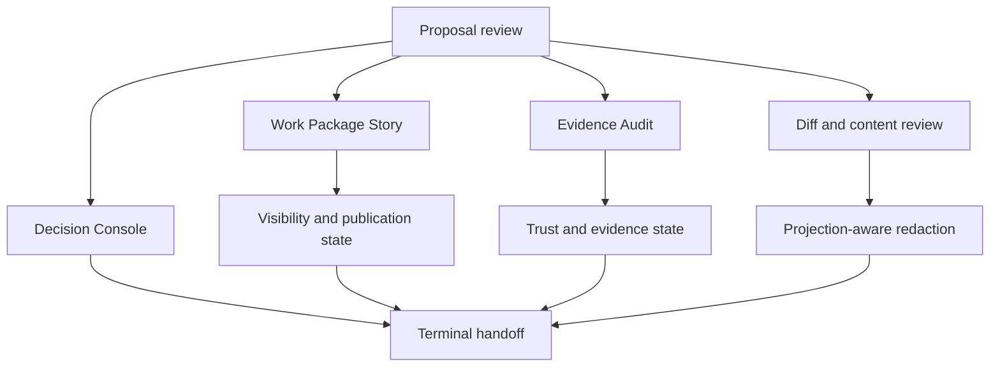
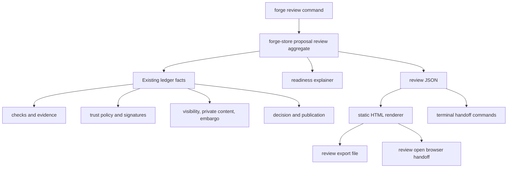
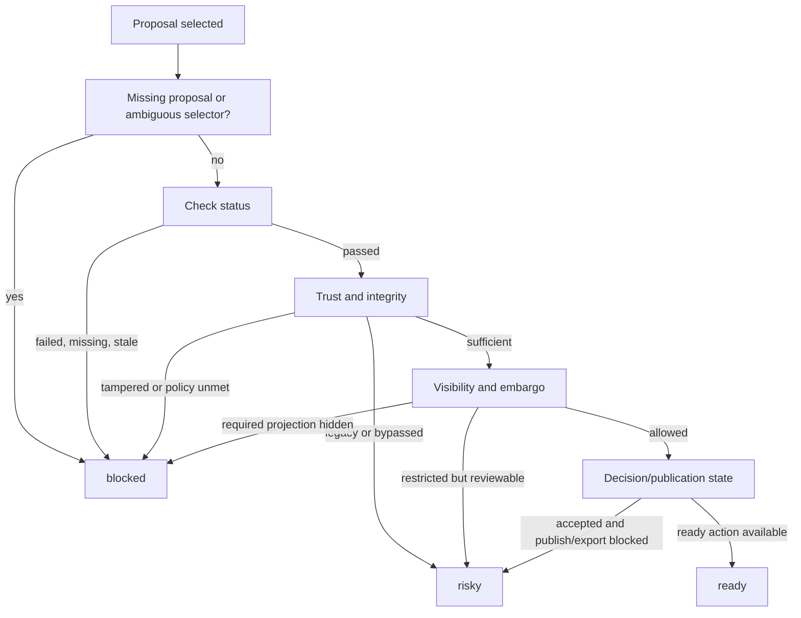

# Forge Review Surface - Plan

## Goal Capsule

| Field | Value |
| --- | --- |
| Objective | Build the first Forge-native local review surface for maintainers deciding whether one proposal is ready, risky, or blocked. |
| Product authority | NER-359 Product Contract first; existing Forge projection, trust, evidence, embargo, and export contracts second; repo conventions third. |
| Execution profile | Code implementation in the Rust CLI/store workspace, with a read-only JSON aggregate and static local browser surface. |
| Stop conditions | Stop if the work needs hosted accounts/storage/execution, if the UI would mutate `.forge`, or if projection-safe rendering cannot be proven without leaking restricted material. |
| Tail ownership | `ce-work` implements the units; verification must include feature-specific CLI tests, full repo gates, code review, and a forge-dogfood review run. |

---

## Product Contract

### Summary

Forge should add a local-first review app for maintainers reviewing one proposal at a time.
The first surface is a read-only Decision Console backed by Forge-native objects, with a Work Package Story rail for lifecycle context and an Evidence Audit view for trust detail.
It helps a maintainer decide the next safe terminal action without becoming a hosted workspace, hosted account system, or GitHub PR clone.

Product Contract unchanged.
Planning resolves the deferred technical questions through the Planning Contract and Implementation Units below.

### Problem Frame

Forge now records the lifecycle that GitHub PRs flatten: intent, attempts, proposals, evidence, checks, trust, visibility, decisions, and publication state.
The terminal is effective for agents and power users, but it is a poor human review surface once a maintainer needs to compare readiness, evidence, projection safety, private content, and embargo state in one pass.

Theo's source-control critique remains the pressure test.
Git and GitHub largely expose repository-level or branch/PR-level visibility, while Forge has been moving toward change-level visibility: private paths, private in-flight work, and embargoed fixes inside one graph.
NER-359 should make that model visible to a maintainer without rebuilding GitHub around branches.

The first step should not be hosted execution or cloud workspaces.
A local-first review app can prove the human decision experience over real Forge data while keeping `.forge` mutations, accounts, tenancy, and cloud isolation out of the first slice.

### Key Decisions

- **Proposal-centered review.** The main page reviews one proposal because the maintainer's first job is deciding whether this proposed change can move forward.
- **Decision Console primary shape.** The page starts with readiness, blockers, risks, and next safe action rather than imitating a diff-first PR.
- **Work Package Story as context.** Intent, attempt history, proposal status, decision state, visibility, and publication state remain visible so the proposal does not become detached from its Forge lifecycle.
- **Evidence Audit as drill-down.** Checks, command evidence, trust, signatures, projection status, and tamper state are available when the maintainer needs proof detail.
- **Read-only v1 with terminal handoff.** The UI does not accept, reject, reveal, publish, export, or mutate `.forge`; it explains readiness and hands the maintainer terminal actions.
- **Local-first before hosted.** v1 runs from the local repo and avoids hosted accounts, cloud sync, cloud execution, comments, teams, billing, and tenancy.

### Actors

- A1. **Maintainer reviewer:** Opens the review surface to decide whether a proposal is ready to accept, needs changes, should be rejected, or can be published/exported through an appropriate follow-up command.
- A2. **Agent or contributor:** Produces the proposal, evidence, checks, and provenance the maintainer reviews.
- A3. **Forge CLI:** Produces the authoritative proposal, evidence, check, visibility, trust, and publication data shown by the surface.
- A4. **Future hosted service:** A later product layer that may reuse this review model but is not required for v1.

### Key Flows

- F1. **Open proposal review**
  - **Trigger:** A maintainer wants to inspect a proposed Forge change without reading raw JSON or `.forge` internals.
  - **Actors:** A1, A3.
  - **Steps:** The maintainer opens a local review surface for a proposal -> Forge presents readiness, lifecycle context, evidence, checks, trust, visibility, and diff/content sections -> the maintainer sees whether the proposal is ready, risky, or blocked.
  - **Outcome:** The maintainer can orient on the proposal in one page.

- F2. **Decide readiness**
  - **Trigger:** The maintainer needs to choose accept, reject, request changes, reveal, publish, or export as the next step.
  - **Actors:** A1, A3.
  - **Steps:** The Decision Console summarizes blockers and risks -> the maintainer drills into evidence or content only when needed -> the surface shows the next safe terminal action and why it is safe or blocked.
  - **Outcome:** The maintainer acts through the terminal with enough context to trust the action.

- F3. **Review restricted work**
  - **Trigger:** The proposal includes private content, restricted evidence, or embargo state.
  - **Actors:** A1, A3.
  - **Steps:** The surface shows the maintainer what is visible, hidden, omitted, revealable, or exportable for the current projection -> restricted material is not rendered when the local policy says it should be hidden -> publication state explains what terminal action can widen visibility.
  - **Outcome:** The review surface makes permissioned Forge understandable without weakening projection semantics.

- F4. **Audit evidence**
  - **Trigger:** The maintainer wants proof that agent work is trustworthy before acting.
  - **Actors:** A1, A3.
  - **Steps:** The maintainer opens the evidence audit -> the surface groups checks, command evidence, signatures, trust tier, tamper status, and projection checks -> private or redacted evidence is represented as restricted rather than leaked.
  - **Outcome:** Trust-bearing evidence becomes reviewable by a human without losing the machine-readable source of truth.

### Requirements

**Review Shape**

- R1. The first review surface centers one Forge proposal as the review object.
- R2. The page starts with a Decision Console that labels the proposal as ready, risky, or blocked and explains the deciding factors.
- R3. The page includes a Work Package Story view showing the intent, attempt context, proposal state, decision state, visibility state, and publication state.
- R4. The page includes an Evidence Audit view showing checks, evidence, trust, signatures or attestations, tamper state, projection checks, and redaction status.
- R5. The page includes diff and content review, but diff is a section of the Forge review object rather than the product center.

**Maintainer Decision Support**

- R6. The surface shows the next safe terminal action for accept, reject, request changes, reveal, publish, or export when that action is applicable.
- R7. The surface explains why an action is blocked instead of showing a disabled or ambiguous action alone.
- R8. The surface distinguishes accepted work, publishable work, exportable work, and work that still requires reveal or projection checks.
- R9. The surface lets a maintainer understand the proposal without querying `.forge` storage or parsing raw JSON.
- R10. The surface preserves terminal control for trust-bearing mutations in v1.

**Permissioned and Embargoed Review**

- R11. The review surface reuses Forge's local projection semantics and does not create a separate hosted visibility model.
- R12. Private paths, private evidence, encrypted private payloads, embargo details, and raw command output are shown only when the current local policy permits them.
- R13. Restricted material appears as omitted, hidden, redacted, or unauthorized with enough context for an authorized maintainer to understand the review state.
- R14. Embargoed proposals show embargo state, release capability state, reveal mode, publish state, and export readiness without revealing exploit-bearing content outside the allowed projection.
- R15. Public or sanitized review views exclude private paths, raw evidence, private review discussion, private key or alias metadata, and unrevealed embargo material.

**Local-First Product Boundary**

- R16. v1 runs from a local Forge repository and does not require hosted accounts, hosted storage, or cloud execution.
- R17. v1 does not mutate Forge state from UI controls.
- R18. v1 does not add persistent hosted comments, team review state, notifications, billing, or tenancy.
- R19. v1 remains useful before a hosted service exists and can later become the review model a hosted service reuses.
- R20. Every visible conclusion in the review surface is backed by Forge's existing machine-readable contract rather than a UI-only interpretation.

### Acceptance Examples

- AE1. **Covers R1, R2, R6, R9.** Given a proposal with passing checks and sufficient trust, when a maintainer opens the review surface, then the page shows the proposal as ready and names the terminal action to accept it.
- AE2. **Covers R2, R4, R7.** Given a proposal with missing or failing evidence, when a maintainer opens the review surface, then the page shows the blocker and links the blocker to the evidence or check that caused it.
- AE3. **Covers R3, R5, R8.** Given a proposal under an intent with multiple attempts, when the maintainer reviews the proposal, then the page shows where the proposal sits in the Forge lifecycle without forcing the maintainer into a full intent comparison flow.
- AE4. **Covers R11, R12, R13, R15.** Given a proposal includes private content the current projection cannot show, when the maintainer opens the review surface, then the page shows that restricted material exists without rendering private paths, payloads, or raw evidence.
- AE5. **Covers R14.** Given an accepted embargoed proposal, when a maintainer opens the review surface, then the page shows whether release, reveal, publish, and Git export are currently allowed or blocked.
- AE6. **Covers R16, R17, R20.** Given the maintainer uses v1, when they click through review sections, then no Forge mutation happens through the UI and all trust-bearing actions remain terminal handoffs.
- AE7. **Covers R18, R19.** Given no hosted Forge service exists, when a maintainer uses the review surface locally, then they can still complete a useful proposal review without accounts, hosted comments, or cloud workspaces.

### Success Criteria

- A maintainer can decide whether a proposal is ready, risky, or blocked without inspecting raw JSON or `.forge` internals.
- A maintainer can explain why a proposal is safe or blocked by pointing to checks, evidence, trust, visibility, and publication state on the page.
- Private and embargoed work remain projection-safe in the review surface.
- The first dogfood pass can review a real `forge-dogfood` proposal through the local surface and complete the decision through terminal commands.
- Downstream implementation does not invent the primary actor, first deliverable, review object, mutation boundary, or success signal.

### Scope Boundaries

- Hosted workspaces, cloud execution, remote file editing, and browser-based materialization are out of scope for v1.
- Hosted accounts, teams, persistent comments, notification workflows, billing, and tenancy are out of scope for v1.
- UI-triggered accept, reject, reveal, publish, export, grant, or revoke actions are out of scope for v1.
- Full GitHub PR replacement is out of scope for v1; the surface should be better for Forge-native review, not feature-parity with GitHub.
- Intent-level comparison is deferred; v1 may show attempt context but the primary page is one proposal.
- Publication-only review is deferred; v1 can show publication readiness but does not make publication the primary object.
- Visual design polish is secondary to information hierarchy, projection safety, and decision clarity.

#### Deferred to Follow-Up Work

- Hosted comments, team review queues, notification state, and account identity.
- UI-triggered trust-bearing mutations after the read-only terminal handoff proves itself.
- Long-running local HTTP server mode if static export/open cannot support the needed interactions.
- Intent-level comparison as the primary review object.

### Dependencies / Assumptions

- Builds on the current Forge local/native surface: proposals, evidence, checks, trust policy, native diff/content review, visibility policy, private content overlays, embargo workflow, sync, and Git export.
- Assumes permissioned review uses the projection semantics from NER-354, NER-356, NER-357, and NER-358.
- Assumes the first implementation can dogfood against `forge-dogfood` without hosted infrastructure.
- Assumes the first version can be useful without persistent comments because terminal handoff remains the decision control plane.

### Resolved Planning Questions

- The local entrypoint is a read-only `forge review` command group with JSON, static export, and best-effort browser open modes.
- Readiness categories are `ready`, `risky`, and `blocked`; each visible category is derived from check, trust, decision, publication, visibility, embargo, and stale-base facts.
- Projection-safe rendering defaults to sanitized metadata and status labels; restricted payloads, raw evidence, and private paths render only through existing local policy decisions.
- UI state is ephemeral browser state only; Forge state remains owned by CLI terminal commands.
- Dogfood must use the new review command against a real proposal in `forge-dogfood`, not just run the broad release gate.

### Sources / Research

- `docs/brainstorms/2026-06-23-permissioned-forge-requirements.md` - work-package-first visibility, projection guarantees, hosted review deferral, and Theo-derived pressure for change-level visibility.
- `docs/brainstorms/2026-06-24-org-identity-key-governance-requirements.md` - org actor, role authority, revocation, and audit semantics that hosted review must eventually display.
- `docs/brainstorms/2026-06-24-encrypted-private-content-requirements.md` - private content projection, unauthorized omission, and hosted-surface reuse constraints.
- `docs/brainstorms/2026-06-26-embargoed-security-fix-workflow-requirements.md` - embargo workflow, release-before-source, reveal/publish separation, and hosted review assumptions.
- `PRD.md` - core thesis, current non-goals, decision/publication split, conflict-as-data warning, and success criteria for human understanding.
- `RELEASE_NOTES.md` - current release boundary for embargoed security-fix workflows and non-claims around hosted infrastructure.
- `docs/solutions/architecture-patterns/compare-rank-on-verified-evidence-and-self-verifying-provenance-trailer-2026-05-30.md` - read-only selection surfaces should verify per record, avoid stale persisted verdicts, and be honest about proof scope.
- `docs/solutions/architecture-patterns/content-bound-gate-engine-and-failclosed-enforcement-2026-05-29.md` - trust-bearing gates must fail closed, redact every egress, and avoid persisting derived verdicts before a consumer needs them.
- `docs/solutions/architecture-patterns/tamper-evident-evidence-chain-and-failclosed-verification-2026-05-30.md` - cheap per-row verification and deep doctor verification have different claims; review copy must not overstate either.
- Theo's YouTube video - product pressure for private files, private in-flight work, embargoed fixes, and change-level visibility instead of repo-level privacy.

---

## Planning Contract

### Key Technical Decisions

- KTD1. **Add `forge review` as a read-only command group.** `review show` returns the machine-readable review aggregate, `review export` writes a self-contained static HTML file, and `review open` uses that same export path before best-effort browser launch.
- KTD2. **Require one proposal as the review object.** The command accepts an explicit proposal selector and may accept an attempt selector only to resolve the latest proposal for that attempt; the rendered page is still one proposal.
- KTD3. **Derive the review model live from existing ledger facts.** The first slice should not add a migration for readiness, evidence summaries, or UI state; derived facts are recomputed from proposals, attempts, checks, evidence, decisions, publications, visibility, embargo, trust, and content refs.
- KTD4. **Keep readiness advisory and terminal-backed.** `ready`, `risky`, and `blocked` are explanation labels for the maintainer; trust-bearing commands remain authoritative and can still refuse even when the page says a next action appears ready.
- KTD5. **Use existing projection semantics at every restricted egress.** Private paths, private payloads, raw command output, embargo details, and projection status are rendered through the same visibility, private-content, and embargo boundaries used by sync/export.
  The default review projection is sanitized; plaintext private detail requires an explicit policy-backed projection decision rather than mere access to a local private-label cache.
- KTD6. **Prefer static HTML over a local server in v1.** Static export is deterministic, easy to test in integration tests, works without a new runtime dependency, and leaves a future local server as an extension rather than a prerequisite.
- KTD7. **Keep the browser renderer thin.** The renderer consumes the review aggregate and escapes all text; business rules stay in Rust data assembly so JSON tests and HTML tests prove the same decisions.

### High-Level Technical Design

### Implementation Constraints

- Review commands must not create operation rows, update views, write decisions, grant visibility, reveal embargoes, publish, export branches, or mutate the worktree.
- The JSON aggregate is the source for HTML; avoid separate HTML-only logic for readiness, projection, or next actions.
- Generated HTML must escape every string from the repo, ledger, evidence, command output, paths, and user-supplied summaries.
- Sanitized review output must be the default for private paths, raw evidence, and embargo details; any detail-revealing mode must name the recipient/capability decision that allowed it.
- The static page should use semantic headings/landmarks and responsive layout rules so the Decision Console, story context, evidence audit, and diff section remain readable without custom browser state.
- No new Rust dependency is expected for v1; if implementation proves one is necessary, prefer a small dependency with no runtime server requirement and document why local patterns were insufficient.
- Any schema migration added during implementation triggers the full migration-head fan-out and upgrade/convergence tests.

### System-Wide Impact

- **CLI contract:** `forge schema` must document the new `review` commands because automation can discover commands from the published contract.
- **Security posture:** The feature creates a new human-readable egress for paths, evidence, and embargo metadata, so it must share redaction and projection safety with existing sync/export surfaces.
- **Agent parity:** The JSON aggregate gives agents the same review facts as the browser page, preventing a UI-only capability gap.
- **Release process:** Dogfood must exercise the new feature directly in `forge-dogfood` before release, in addition to the standard regression gates.

### Risks & Mitigations

| Risk | Mitigation |
| --- | --- |
| Static HTML leaks private paths, raw evidence, or embargo exploit detail. | Add sentinel-based integration tests for JSON and HTML, and escape or omit restricted fields before rendering. |
| Readiness language overclaims safety beyond Forge's authoritative gates. | Label readiness as advisory, show the exact blocking facts, and keep terminal commands as the enforcement path. |
| Derived review facts drift from existing commands. | Build the aggregate from existing store helpers where possible and add tests that compare expected check, decision, publication, visibility, and embargo states. |
| `review open` is flaky across platforms. | Make `review export` deterministic and testable; `review open` can fall back to printing the exported path. |
| Adding a browser surface bloats `main.rs`. | Move review command handling and HTML rendering into a focused CLI module while keeping command dispatch consistent with existing patterns. |

### Deferred Implementation Notes

- Exact struct and helper names are implementation-time choices.
- The final browser-open mechanism can be platform-specific and best-effort as long as export remains deterministic.
- If the aggregate needs detailed private-content counts that no public store helper exposes safely, add a read-only helper rather than querying `.forge` ad hoc from the CLI.

---

## Implementation Units

### U1. Review Command Contract

- **Goal:** Add the user-facing `forge review` command group and published schema entries without adding mutations.
- **Requirements:** R1, R6, R9, R10, R16, R17, R20, AE6.
- **Dependencies:** None.
- **Files:** `crates/forge-cli/src/main.rs`, `crates/forge-cli/src/review.rs`, `crates/forge-cli/src/schema.rs`, `crates/forge-cli/tests/forge_schema.rs`, `crates/forge-cli/tests/forge_review_surface.rs`.
- **Approach:** Introduce `review show`, `review export`, and `review open` under the existing Clap command style.
  Route all three through read-only command handlers that return `operation_id: null`.
  Update `forge schema` so command discovery includes the new review surface and its read-only status.
- **Patterns to follow:** `proposal list` for read-only command routing, `export pr-body` for generated review artifact shape, and `schema.rs` for hand-authored command contract entries.
- **Test scenarios:**
  - Schema output includes `review show`, `review export`, and `review open` and remains repo-independent.
  - `review show` outside an initialized Forge repo returns the existing typed not-initialized error behavior through the envelope.
  - `review show` for an unknown proposal returns the existing proposal selector error instead of a generic failure.
  - `review export` and `review open` do not report an operation id and do not append operation rows.
- **Verification:** The new commands appear in schema discovery, read-only command tests pass, and no mutation row is created by any review command.

### U2. Proposal Review Aggregate

- **Goal:** Build a `ProposalReview` read model that gathers proposal, intent, attempt, check, evidence, trust, decision, publication, and next-action facts for one proposal.
- **Requirements:** R1, R2, R3, R4, R6, R7, R8, R9, R20, AE1, AE2, AE3.
- **Dependencies:** U1.
- **Files:** `crates/forge-store/src/lib.rs`, `crates/forge-cli/src/review.rs`, `crates/forge-cli/tests/forge_review_surface.rs`.
- **Approach:** Add a read-only store API that resolves the selected proposal and owning attempt, then derives the review aggregate from existing proposal metadata, latest check, latest evidence, latest decision, latest publication, trust policy, and comparison context.
  The aggregate should include explicit deciding factors for `ready`, `risky`, and `blocked` rather than only a label.
  Do not persist readiness or UI state.
- **Execution note:** Start with CLI integration tests that create real proposals and assert the JSON aggregate before adding HTML rendering.
- **Patterns to follow:** `show`, `list_proposals`, `compare_attempts`, `pr_body_for`, and the existing cheap integrity/check-summary split.
- **Test scenarios:**
  - Covers AE1. A proposal with a passing check and sufficient trust renders `ready` with an accept handoff.
  - Covers AE2. A proposal with no matching evidence or a failed check renders `blocked` and cites the check/evidence reason.
  - Covers AE3. A proposal under an intent with multiple attempts includes owning intent and sibling attempt context without turning the page into a full comparison view.
  - An accepted proposal distinguishes accepted state from exported/published state.
  - A rejected proposal renders blocked or terminal-complete state without suggesting accept.
  - A stale-base proposal surfaces a blocker that matches the existing accept/export stale-base facts.
- **Verification:** JSON output gives the maintainer enough facts to explain readiness without reading `.forge` tables or raw JSON from other commands.

### U3. Projection and Embargo Safety

- **Goal:** Make private, restricted, and embargoed proposal review projection-safe in both JSON and rendered HTML.
- **Requirements:** R11, R12, R13, R14, R15, R20, AE4, AE5.
- **Dependencies:** U2.
- **Files:** `crates/forge-store/src/lib.rs`, `crates/forge-cli/src/review.rs`, `crates/forge-cli/tests/forge_review_surface.rs`, `crates/forge-cli/tests/forge_encrypted_private_content.rs`, `crates/forge-cli/tests/forge_visibility.rs`.
- **Approach:** Derive visibility, private-content, and embargo review facts through existing local policy helpers.
  Default to sanitized output for private paths, raw evidence, and embargo details unless the selected review projection names a recipient and capability that the existing policy permits.
  Render restricted material as status, count, disclosure, or redaction metadata unless the same local policy path permits the detail.
  For embargoed proposals, show workflow state, release capability state, reveal mode, publish state, and export readiness without exposing exploit-bearing source or unrevealed details.
- **Patterns to follow:** `visibility check`, projected sync behavior, encrypted-private-content sentinel tests, embargo release/reveal/publish lifecycle tests, and secret-risk filtering in export paths.
- **Test scenarios:**
  - Covers AE4. A proposal with a private-path sentinel does not leak the private path or payload in unauthorized JSON or HTML.
  - Covers AE4. Restricted material still appears as an omitted, hidden, redacted, or unauthorized review fact with enough context to explain the blocker.
  - A local private-label cache alone does not cause plaintext private paths to appear in sanitized JSON or HTML.
  - Covers AE5. An accepted embargoed proposal shows whether release, reveal, publish, and Git export are allowed or blocked.
  - Public or sanitized rendering excludes private paths, raw evidence, private key metadata, and unrevealed embargo material.
  - Missing local private label cache fails closed instead of producing a partial review that hides the integrity problem.
- **Verification:** Sentinel strings and private paths are absent from unauthorized outputs, while restricted-state explanations remain present.

### U4. Diff and Evidence Audit Enrichment

- **Goal:** Add review-ready diff/content and evidence-audit sections to the aggregate without making diff the product center.
- **Requirements:** R4, R5, R7, R8, R9, R20, AE2, AE3.
- **Dependencies:** U2, U3.
- **Files:** `crates/forge-cli/src/review.rs`, `crates/forge-cli/src/main.rs`, `crates/forge-store/src/lib.rs`, `crates/forge-cli/tests/forge_review_surface.rs`, `crates/forge-cli/tests/forge_native_diff.rs`, `crates/forge-cli/tests/forge_run_evidence.rs`.
- **Approach:** Reuse native/git content-ref diff helpers at the CLI layer for review diff data, keeping the store aggregate responsible for identities and refs rather than backend rendering.
  Group evidence by command, exit status, structured metrics, trust level, signature/integrity status, and redaction status.
  Keep raw output excerpts behind the same redaction/projection decisions as existing evidence egress.
- **Patterns to follow:** `diff_response`, `compare --diff`, `collect_diff_warnings`, `redaction_warnings`, and the check/evidence summary behavior in `pr_body_for`.
- **Test scenarios:**
  - The review diff lists public changed paths and file summaries for a normal proposal.
  - Binary or truncated diff data renders as structured metadata rather than broken text.
  - Evidence audit links a failed or missing check to the specific evidence/check status that caused readiness to block.
  - Secret-risk paths dropped by diff/export logic do not reappear in review output.
  - A proposal with structured test evidence surfaces pass/fail counts as audit detail, not as the sole readiness source.
- **Verification:** Maintainers can drill from a blocker to the relevant check/evidence/diff fact without seeing restricted data.

### U5. Static Review Renderer and Browser Handoff

- **Goal:** Render the review aggregate as a self-contained local HTML review surface with Decision Console, Work Package Story, Evidence Audit, diff/content review, and terminal handoff.
- **Requirements:** R1, R2, R3, R4, R5, R6, R7, R9, R10, R16, R17, R18, R19, R20, AE1, AE2, AE3, AE6, AE7.
- **Dependencies:** U1, U2, U3, U4.
- **Files:** `crates/forge-cli/src/review.rs`, `crates/forge-cli/src/main.rs`, `crates/forge-cli/tests/forge_review_surface.rs`.
- **Approach:** Generate static HTML from the JSON aggregate with a top-level Decision Console, secondary lifecycle context, evidence audit drill-down, diff/content section, and copyable terminal handoff commands.
  The page must contain no forms or mutation endpoints.
  Use semantic headings, landmarks, visible focus, and responsive layout constraints so the review remains usable from a local file on narrow and desktop viewports.
  `review export` writes the file deterministically to the requested path; `review open` uses the same renderer and falls back to printing the path if a browser cannot be launched.
- **Execution note:** Treat HTML escaping as feature behavior, not polish; add tests before relying on the renderer.
- **Patterns to follow:** PR-body artifact generation for deterministic output, existing envelope warnings for non-fatal handoff issues, and Rust-side escaping before interpolation.
- **Test scenarios:**
  - Covers AE1. A ready proposal page opens with readiness and accept handoff before diff detail.
  - Covers AE2. A blocked proposal page explains the blocker and links it to the audit section.
  - Covers AE6. The HTML contains no forms, no mutation URLs, and no state-changing controls.
  - Repository-controlled strings containing HTML or script syntax are escaped in output.
  - The exported page preserves reading order, focus visibility, and non-overlapping sections at narrow and desktop viewport widths.
  - `review open` succeeds or returns a clear non-fatal warning while preserving the exported file path.
  - The same aggregate rendered to JSON and HTML carries matching readiness, blockers, and next actions.
- **Verification:** The rendered page is readable from a local file and matches the JSON review state without introducing a separate behavior layer.

### U6. Documentation, Dogfood, and Release Pipeline Proof

- **Goal:** Document the new review workflow and prove it through direct dogfood before treating the feature branch as shippable.
- **Requirements:** R6, R9, R16, R17, R19, AE1, AE6, AE7.
- **Dependencies:** U1, U2, U3, U4, U5.
- **Files:** `README.md`, `RELEASE_NOTES.md`, `docs/dogfood-reports/2026-07-03-ner-359-review-surface.md`, `docs/plans/2026-07-03-001-feat-hosted-forge-review-surface-plan.md`, `scripts/dogfood-release-gate.sh`.
- **Approach:** Add concise CLI docs for `forge review show/export/open`, update release notes with the read-only local review surface, and capture a forge-dogfood run that reviews a real proposal through the new surface.
  If the existing dogfood gate has a feature-specific section hook, add the review-surface scenario there; otherwise document the exact manual dogfood run in a report and keep the release checklist expectation explicit.
- **Patterns to follow:** Existing release notes style, dogfood report conventions, and the repo rule that new feature branches must directly test the new feature.
- **Test scenarios:**
  - Documentation examples match the command names and mutation boundary implemented in U1.
  - A dogfood repo creates or uses a real proposal and runs review JSON plus HTML export/open against it.
  - The dogfood report records what the new surface proved and which terminal action completed the decision.
  - Release notes do not imply hosted review, comments, accounts, or UI mutation support.
- **Verification:** The branch has focused tests for the new feature, a recorded forge-dogfood review run, updated docs, and no release-facing overclaim.

---

## Verification Contract

| Gate | Scope | Done Signal |
| --- | --- | --- |
| Format | Workspace formatting | `rtk cargo fmt --all --check` passes. |
| Unit and integration tests | Existing behavior plus new review surface tests | `rtk cargo test --workspace` passes, including `forge_review_surface` coverage for JSON, HTML, privacy, readiness, and no-mutation behavior. |
| Lints | Rust warnings and clippy | `rtk cargo clippy --workspace --all-targets -- -D warnings` passes. |
| CI mirror | Full local CI script | `rtk bash scripts/ci.sh` passes before PR/merge. |
| Feature dogfood | Real user flow in `forge-dogfood` | A maintainer-style run opens or exports a review for a real proposal and completes the decision through terminal commands. |
| Code review | Plan-aware diff review | `ce-code-review` runs against the branch diff with this plan path and any actionable findings are fixed or triaged. |

---

## Definition of Done

- The artifact remains `artifact_readiness: implementation-ready`, and implementation does not mutate the Product Contract except to correct documented review findings.
- `forge review show`, `forge review export`, and `forge review open` exist, are documented in `forge schema`, and are read-only.
- The review aggregate explains `ready`, `risky`, or `blocked` from existing Forge facts rather than from HTML-only logic.
- The static review page starts with Decision Console information, includes lifecycle context, evidence audit, diff/content review, and terminal handoff commands.
- Private, restricted, and embargoed material is projection-safe in JSON and HTML, with sentinel tests proving restricted content does not leak.
- No new DB migration is added unless implementation proves it is necessary; if one is added, migration head tests and upgrade fixtures are updated in the same branch.
- Focused tests cover the new feature directly, and the standard workspace gates pass.
- A forge-dogfood report proves the new surface on a real proposal before release preparation.
- Documentation and release notes describe the local read-only review surface without claiming hosted review, comments, accounts, teams, or UI-triggered mutations.
- Abandoned experimental code, generated scratch files, and unused renderer paths are removed before the branch is considered complete.
