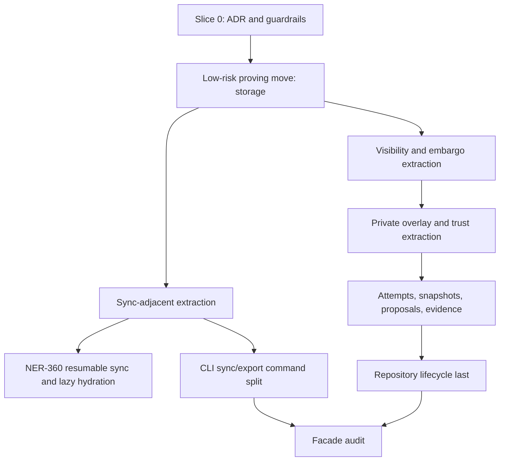

# Domain Module Refactor - Plan

## Goal Capsule

| Field | Value |
| --- | --- |
| Objective | Establish Forge's domain-module architecture contract and first refactor path so `forge-store` and `forge-cli` stop growing as agent-hostile god files. |
| Product authority | NER-366 first; the external refactoring brief second; Forge's agent-native thesis in `PRD.md` and `CLAUDE.md` third. |
| Execution profile | Code/documentation implementation for Slice 0 only: ADR, agent guidance, and non-behavioral guardrails. Domain code moves happen in later NER-366 child slices. |
| Stop conditions | Stop if the first PR starts moving domain logic, changes public APIs, widens visibility without a call-site need, or mixes behavior cleanup with structural moves. |
| Tail ownership | `ce-work` implements Slice 0; later module moves each get their own Forge intent/attempt, Linear tracking, doc-review/code-review gates, and release-path decision. |

---

## Product Contract

### Summary

Forge should adopt a domain-oriented module structure inside its largest crates before adding more sync and review complexity.
The first slice accepts the architecture decision, records the module map, and sets the execution guardrails.
It does not move logic yet.

### Problem Frame

Forge is an agent-native source-control system, but two files now work against that goal.
`crates/forge-store/src/lib.rs` is 14,163 lines and spans repository lifecycle, attempts, snapshots, proposals, evidence, trust and attestation, visibility and embargo, private overlays, sync, merge/conflict handling, GC, storage accounting, and tests.
`crates/forge-cli/src/main.rs` is 4,839 lines and holds argument parsing, response envelope construction, dispatch, command handlers, sync/export handling, and worktree healing.

That shape is not just untidy.
It weakens agent execution because every scoped change competes with unrelated context, repetitive SQL/serde anchors become fragile, reviewers lose file-path signal, and parallel attempts concentrate merge conflicts in the same files.
This directly conflicts with Forge's product thesis: agents should work checked changes safely, and the codebase should make those checked changes reviewable.

NER-360 makes this urgent because resumable sync and lazy hydration should land in a sync domain module, not deepen the current monolith.

### Key Decisions

- **Module split, not crate split.** The accepted end state is domain modules inside `forge-store` and `forge-cli`; new crates remain a later option only if compile-time or ownership pressure proves modules insufficient.
- **Facade files stay stable.** `lib.rs` and `main.rs` become orientation and dispatch files, with public items re-exported from their old paths where needed.
- **Verbatim moves only.** Refactor PRs move code without renames, signature changes, behavior edits, or opportunistic cleanup.
- **One domain per slice.** The refactor should be sequenced as small mechanical PRs so diffs stay reviewable and failures have narrow blame.
- **Slice 0 is decision and guardrails.** The first PR lands the ADR and guidance only; module files should be created with the first real move unless empty scaffolding proves useful and compiles cleanly.
- **Sync extraction precedes NER-360 implementation.** NER-360 should not add resumable-transfer behavior into `crates/forge-store/src/lib.rs`.
- **File-size enforcement is staged.** Start with a documented rule; defer automation until a later slice can add an allowlisted or warning-style check without blocking CI.

### Requirements

**Architecture Decision**

- R1. The repo records an ADR that makes domain modules the accepted structure for large Forge crates.
- R2. The ADR names `lib.rs` and `main.rs` as facades and keeps their target role narrow.
- R3. The ADR preserves public API stability during moves through re-exports rather than caller churn.
- R4. The ADR forbids mixed behavior cleanup in structural move slices.

**Module Boundaries**

- R5. The store module map covers repository lifecycle, attempts, snapshots, proposals, evidence, trust, org governance, visibility, embargo, private overlays, sync, storage, conflict/merge, publication/export support, and shared internals.
- R6. The CLI module map covers args, envelope/response helpers, worktree helpers, and command-family modules.
- R7. Attestation belongs in the trust/org policy domain and calls existing signing mechanics rather than moving Ed25519 primitives out of `signing.rs`.
- R8. `projection_decision` starts under visibility unless direct code inspection during extraction proves sync or proposals is the stronger owner.

**Execution Guardrails**

- R9. Each future move slice keeps external public paths stable for callers.
- R10. Each future move slice moves domain tests with the moved code where practical and leaves cross-domain lifecycle coverage in integration tests or a small facade-level test module.
- R11. Each future move slice runs the standard Forge verification gates before PR.
- R12. The refactor creates new module files only when they receive real code or provide useful, reviewed scaffolding.

**Sequencing**

- R13. Storage is the preferred proving slice because it is small and currently starts near `crates/forge-store/src/lib.rs:1191`.
- R14. Sync-adjacent extraction should happen before NER-360 implementation.
- R15. Repository lifecycle extraction happens late because it owns central open/init/migration/lock helpers.
- R16. CLI splitting can run after the ADR or in parallel with store moves, but should not block the first store proving slice.

### Acceptance Examples

- AE1. **Covers R1-R4.** Given a contributor opens the ADR, when they inspect the decision, then they can tell that future Forge code should land in domain modules and that facade files should not absorb new domain behavior.
- AE2. **Covers R5-R8.** Given an agent plans to edit sync, trust, visibility, or private overlay code, when it reads the module map, then it can identify the intended owning module and the boundary with adjacent domains.
- AE3. **Covers R9-R12.** Given a future refactor slice moves code out of `lib.rs`, when reviewers inspect the diff, then they see a mechanical move with preserved public paths and no behavior cleanup.
- AE4. **Covers R13-R16.** Given NER-360 begins, when the implementation needs sync storage or CLI handling, then the relevant sync code has a domain home or the NER-360 plan explicitly starts by creating it.

### Scope Boundaries

- Slice 0 does not move Rust domain logic.
- Slice 0 does not rename public functions, alter signatures, or change CLI behavior.
- Slice 0 does not split `forge-store` into new crates.
- Slice 0 does not make the 3,000-line rule a hard CI failure without allowlisting current known breaches.
- Later slices do not use this refactor to change schema, storage semantics, trust policy, sync behavior, or CLI output.

### Success Criteria

- A future agent can find the intended module owner without reading all of `crates/forge-store/src/lib.rs`.
- A future reviewer can reject new domain behavior in a facade file by citing the ADR.
- NER-360 can start from a sync module plan rather than adding more code to the store monolith.
- Every later refactor slice can be reviewed as a move plus tests, not as an unbounded cleanup.

### Sources / Research

- `NER-366` - Linear tracker for this refactor.
- `PRD.md` - Forge is agent-native and optimizes for checked changes, evidence, and reviewable lifecycle objects.
- `CLAUDE.md` - verification gates, Linear project, dogfood expectations, and compound-engineering workflow.
- `crates/forge-store/src/lib.rs` - current 14,163-line store facade candidate.
- `crates/forge-cli/src/main.rs` - current 4,839-line CLI facade candidate.
- `crates/forge-store/src/error.rs`, `crates/forge-store/src/integrity.rs`, `crates/forge-store/src/migrations.rs`, `crates/forge-store/src/repo_lock.rs`, `crates/forge-store/src/signing.rs` - existing store modules that should remain as good local precedent.
- `crates/forge-cli/src/review.rs` and `crates/forge-cli/src/schema.rs` - existing CLI modules that show the binary can already host extracted command support.

---

## Planning Contract

### Product Contract Preservation

The Product Contract was synthesized from the external refactoring brief and the agreed chat decisions.
The implementation plan adds Slice 0 execution detail without widening that accepted scope.

### Key Technical Decisions

- KTD1. **ADR is the first artifact.** `docs/adr/0001-domain-modules.md` becomes the durable decision because this is an architectural rule, not only a one-off refactor note.
- KTD2. **Agent guidance links to the ADR.** `CLAUDE.md` should gain a short module-size and facade rule so agents see the decision before they start editing.
- KTD3. **No hollow module forest by default.** Empty `mod` declarations add little review signal and may create churn; create module files with the first domain move unless Slice 0 can keep them clearly documented and warning-free.
- KTD4. **Line-count rule starts as documentation.** The ADR should name the 3,000-line ceiling and current exceptions; automation is deferred until a later slice can choose an allowlisted or warning-style check without blocking CI.
- KTD5. **Follow-up slices are tracked separately.** NER-366 is the parent architecture track; storage, sync extraction, CLI split, and later domains should become child issues or linked issues before implementation starts.

### Proposed Store Module Map

| Module | Owns |
| --- | --- |
| `repository.rs` | init/open/migrate/root/backend/lock helpers, request-id operation lookup, central repository context helpers. |
| `attempts.rs` | start/list/show/attach/detach attempts, attempt workspace paths and markers, attempt materialization helpers. |
| `snapshots.rs` | save, restore, checkout, expected content refs, snapshot content refs, undo targets if the caller shape proves snapshot-owned. |
| `proposals.rs` | propose/check/accept/reject metadata, proposal review records, decision lookup, proposal readiness helpers. |
| `evidence.rs` | evidence recording, structured run capture summaries, integrity verification entry points that delegate to `integrity.rs`. |
| `trust.rs` | trust policy, enforcement, local key status, hosted/third-party attestation policy calls, and trust-rank helpers. |
| `org.rs` | organization governance status and initialization when extraction shows it is clearer than folding org into trust. |
| `visibility.rs` | visibility policy, grants/revocations, projection decisions, work-package visibility state. |
| `embargo.rs` | embargo mark/grant/revoke/release/reveal/publish/close workflows and publishability guards. |
| `private_overlay.rs` | private path hashes, private labels/exclusions, encryption key binding, private payload transport, materialized overlays. |
| `sync.rs` | native/projected clone setup, sync fetch/pull/push bookkeeping, sync merge markers, `SYNC_MERGED_OP_KIND_SQL_IN`. |
| `storage.rs` | storage accounting, storage budget status, pack/GC accounting helpers that remain in store. |
| `conflict.rs` | conflict set, failed operations with conflict, merge conflict recording, preflight conflict resolution. |
| `publication.rs` | publication trailers, exportable proposal metadata, publication records and branch publication checks. |
| `internal.rs` | shared row mappers, transaction helpers, canonical JSON helpers, and small utilities used by several domains. |

Existing modules `error.rs`, `integrity.rs`, `migrations.rs`, `repo_lock.rs`, and `signing.rs` stay module-owned unless a later slice proves a narrow helper belongs elsewhere.

### Proposed CLI Module Map

| Module | Owns |
| --- | --- |
| `args.rs` | clap derive structs, command parsing, request-id extraction, parser error conversion. |
| `envelope.rs` | response envelope helpers and exit-code mapping not already owned by `schema.rs`. |
| `worktree.rs` | clean-worktree checks, expected-ref healing, sync import materialization guards, native content-ref helpers. |
| `commands/attempt.rs` | start, attempt, save, restore, checkout, show, undo, log where attempt lifecycle is dominant. |
| `commands/intent.rs` | intent list/detail command handling. |
| `commands/proposal.rs` | propose, check, accept, reject, proposal list/review handlers. |
| `commands/diffmerge.rs` | compare, diff, merge, conflict, native diff options, diff warnings. |
| `commands/run.rs` | run/evidence capture response handling. |
| `commands/trust.rs` | trust, key, org, hosted-runner, and third-party attestation handlers. |
| `commands/visibility.rs` | visibility and embargo handlers, split to `commands/embargo.rs` if the file grows. |
| `commands/sync.rs` | sync clone/fetch/pull/push/serve handlers. |
| `commands/export.rs` | export branch/pr/body handlers and replay if publication ownership proves aligned. |
| `main.rs` | main entrypoint, top-level dispatch, and minimal shared wiring only. |

### Sequencing

1. Land Slice 0: ADR and `CLAUDE.md` guidance.
2. Create linked child issues for the proving slices after the ADR text is accepted.
3. Move `storage` first and preserve public re-exports.
4. Move sync-adjacent store code before NER-360 adds resumable transfer or hydration behavior.
5. Extract CLI sync/export handling after the store sync module exists.
6. Continue store domains from lower coupling to higher coupling: visibility, embargo, private overlay, trust/org, publication, conflict, evidence, proposals, snapshots, attempts, repository.
7. Run a final facade audit after the major moves and decide whether to turn the line-count rule into a hard CI failure.

### Risks & Dependencies

- **Private helper visibility drift.** Moving code may force formerly file-private helpers across module boundaries; prefer `pub(crate)` helpers in `internal.rs` or move callers together before widening public API.
- **False mechanical diff confidence.** Rust moves can hide small behavior edits inside large pastes; each slice should be reviewed as a move and should avoid formatting churn unrelated to the move.
- **Test relocation mistakes.** Inline tests near `mod tests` at the bottom of `crates/forge-store/src/lib.rs` should move only when ownership is clear.
- **NER-360 schedule pressure.** Starting resumable sync before sync extraction will deepen the monolith; make sync extraction the prerequisite or first unit of NER-360.
- **Stale documentation convention.** `CLAUDE.md` still mentions older plan frontmatter language; keep this change focused on module guidance unless a separate docs cleanup is required.

---

## Implementation Units

### U1. Add ADR-0001 for domain modules

- **Goal:** Add the durable architecture decision that accepts domain modules and defines facade boundaries.
- **Requirements:** R1-R8, R12.
- **Files:** `docs/adr/0001-domain-modules.md`.
- **Approach:** Adapt the external ADR draft, but include the decisions resolved in this plan: module split over crate split, attestation under trust/org calling signing mechanics, `projection_decision` initially under visibility, advisory file-size enforcement first, and no hollow module forest by default.
- **Test Scenarios:** Documentation review confirms the ADR names the problem, decision, consequences, alternatives, enforcement path, and accepted open-question answers.
- **Verification:** `rtk git diff --check`.

### U2. Add agent-facing module guidance

- **Goal:** Make the ADR visible in the instructions agents load before editing Forge.
- **Requirements:** R1-R4, R9-R12.
- **Files:** `CLAUDE.md`.
- **Approach:** Add a short "Domain module rule" subsection near Layout or Engineering workflow that points to the ADR, says new domain behavior should not land in facade files, and names the review-blocking rule for mixed behavior edits.
- **Test Scenarios:** A reader can find the ADR pointer and facade rule without reading the full ADR.
- **Verification:** `rtk git diff --check`.

### U3. Document staged file-size enforcement

- **Goal:** Prevent the file-size rule from becoming aspirational while avoiding a red CI baseline.
- **Requirements:** R11-R12.
- **Files:** `docs/adr/0001-domain-modules.md`.
- **Approach:** Document the staged enforcement rule in the ADR: 3,000 lines is the soft ceiling, current breaches are known exceptions, and hard automation waits until the facade split or an explicit allowlist check is planned.
- **Test Scenarios:** The ADR clearly says when hard enforcement becomes valid and why Slice 0 does not fail CI on current line counts.
- **Verification:** `rtk git diff --check`.

### U4. Create follow-up slice tracking

- **Goal:** Convert NER-366 from one large refactor into reviewable child slices.
- **Requirements:** R13-R16.
- **Files:** Linear issue comments or child issues; no repo file required unless the ADR links a local checklist.
- **Approach:** Add child/related Linear work for storage proving slice, sync extraction before NER-360, CLI sync/export split, and final facade audit. Keep the remaining domains in the ADR sequence until the first moves reveal better coupling information.
- **Test Scenarios:** Linear shows NER-366 as the parent tracker and the first executable follow-up slice is unambiguous.
- **Verification:** Confirm child or related tickets are in the Forge Linear project, not the separate Nerdio Forge project.

---

## Verification Contract

| Gate | Applies to | Command or check | Done signal |
| --- | --- | --- | --- |
| Markdown integrity | U1-U3 | `rtk git diff --check` | No whitespace or patch-format issues. |
| Formatting | Any Rust touch | `rtk cargo fmt --all --check` | Formatting passes. |
| Tests | Any Rust touch | `rtk cargo test --workspace` | Workspace tests pass. |
| Clippy | Any Rust touch | `rtk cargo clippy --workspace --all-targets -- -D warnings` | No warnings. |
| Full CI mirror | Before PR push if Slice 0 touches Rust or executable scripts | `rtk bash scripts/ci.sh` | The real binary e2e gate passes. |
| Doc-review gate | Before `ce-work` or before PR if plan changes materially | `ce-doc-review` on this plan or the ADR | Safe fixes applied and remaining findings handled or deferred. |
| Code-review gate | Before PR for Slice 0 | `ce-code-review` with plan context | No blocking findings remain. |

Future behavior-preserving move slices must run the full Forge trio and `rtk bash scripts/ci.sh`.
Feature-bearing follow-up releases must also run feature-specific dogfood in `forge-dogfood`; pure mechanical refactor slices only need dogfood when they change user-visible behavior or release packaging.

---

## Definition of Done

- ADR-0001 exists and is linked from `CLAUDE.md`.
- The ADR documents the module map, facade rule, public API stability rule, behavior-preserving move rule, staged line-count rule, and accepted answers to the external review's open questions.
- Slice 0 makes no behavior changes and moves no domain logic.
- NER-366 has clear follow-up tracking for the first proving slice and sync extraction before NER-360.
- The branch passes the applicable verification contract.
- The PR description states that Slice 0 is an architecture/governance slice and that code moves are intentionally deferred.
