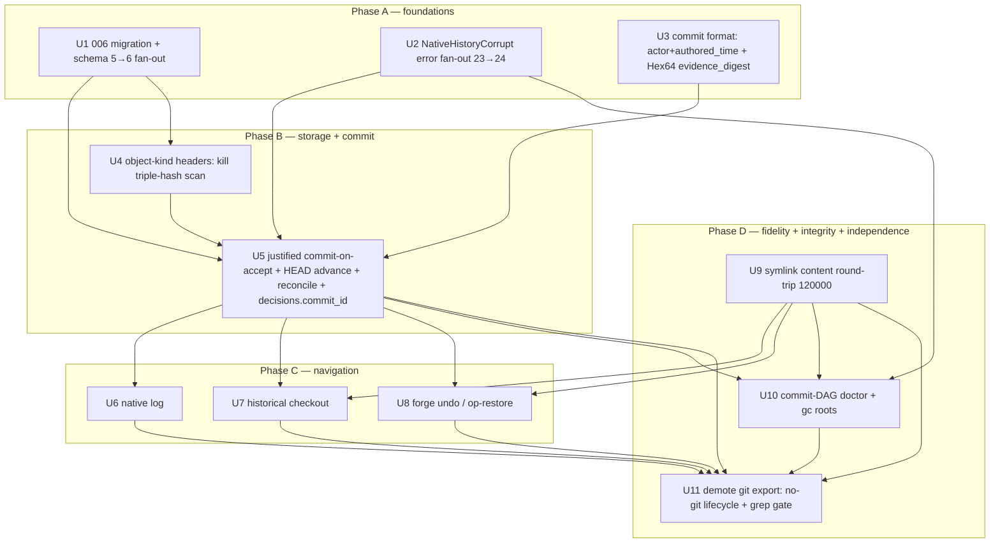

# feat: Phase 7 Slice 3 — Navigable native history + full git independence

## Summary

Slice 1 made the native backend's **snapshot enumerator** git-free; slice 2 made its **base anchoring + changed-paths** git-free and laid the history substrate (a `Commit` `ObjectKind`, a `.forge/refs/HEAD` ref store, backend-agnostic `base_head`) **genesis-only** — HEAD was set once at `start` and never advanced. Slice 3 is the **final** slice of Phase 7: it makes that substrate *navigable* and earns full native-VCS independence. Accepting a proposal in a **native** repo now writes a **justified** `Commit` (`{tree, parents=[prior HEAD], intent_id, proposal_revision_id, decision_id, actor, authored_time, evidence_digest}`), advances the ref-store HEAD, records `decisions.commit_id` (a new `006` column), and progresses the base. Forge can then **walk its own history** (`log`), **check out any past commit's tree**, and **`forge undo`** a prior operation from the op-log — all with **git removed from PATH**. Slice 3 also rounds out fidelity and integrity: symlinks round-trip as mode-`120000` objects, object-kind headers kill the `all_object_ids` triple-hash scan, `doctor` validates the commit DAG (cycle / dangling-parent) behind a new typed `NativeHistoryCorrupt` error code, and git export is demoted to one optional interop adapter. When this lands, **NER-138 → Done**.

The slice's headline correctness problem — flagged but deliberately deferred by slice 2 — is the **commit-on-accept ordering conflict**: the commit payload references a `decision_id` that `decide()` mints *inside* its `IMMEDIATE` transaction, while store-before-DB durability wants the commit object durable before the row that references it. This plan **resolves it** (mint + write inside the txn before COMMIT; advance HEAD after COMMIT; heal the torn window via a **HEAD-from-ledger reconcile** that treats the SQLite ledger as authoritative and the ref-store HEAD as a reconcilable cache) and proves crash-retry convergence for **both** replay paths (same `request_id` → replay guard returns the original; new `request_id` → fresh accept, with stale-base preventing double-accept). `actor` + `authored_time` go into the **hashed** commit bytes so Phase 9 signing attests who/when, while genesis commits stay byte-identical (the two new fields `skip_serializing_if = None`, so existing repos' `base_head` does not desync).

---

## Problem Frame

Phase 7 exists to cut the native backend's dependency on the `git` binary and give Forge its own history primitives. Slices 1+2 removed git from the snapshot/base/changed-paths paths but stopped at a **static** genesis: the ref store holds exactly one commit, HEAD never advances, and there is nothing to navigate. The whole-phase exit criteria — "walks its own history, checks out any past commit, `forge undo` restores a prior operation, all with git removed from PATH" — are unmet because the *lifecycle* never writes a second commit. Slice 2 explicitly descoped commit-on-accept after the doc-review gate because (a) its only slice-2 consumer would have been stale-base-after-accept and (b) it imports the slice's hardest correctness problem (the `decision_id`-minted-in-txn ordering contradiction). Slice 3 is where `log`/checkout/`undo` make a multi-node DAG load-bearing, so this is the right slice to write justified commits and resolve the ordering head-on (see origin: `docs/handoffs/2026-05-30-ner-138-phase-7-slice-3-kickoff.md`, scope item 1; and the slice-2 learnings §1).

Three sharp regression vectors make this the riskiest *correctness* slice (vs. slice 2's riskiest *reversal*): (1) adding `actor`/`authored_time` to the hashed commit format must **not** change the genesis hash, or every existing native repo's `base_head` desyncs into spurious `STALE_BASE`; (2) two non-transactional stores (loose objects + ref file vs. SQLite) admit a torn window that must heal forward, never leave HEAD ahead of the ledger; (3) the schema-head `5→6` fan-out and the `NativeHistoryCorrupt` error fan-out are both "one change or the contract drifts" surfaces where the slice-2 retro proved the enumeration is never complete (a repo-wide grep gate is the backstop, and the moving HEAD+1 stamp literal is invisible to a grep-for-the-old-head).

---

## Requirements

- **R1. Justified commit-on-accept (native) + HEAD advancement + base progression.** Accepting a proposal in a **native** repo writes a `Commit` referencing `{tree (the accepted proposal tree), parents=[prior HEAD = proposal.base_head], intent_id, proposal_revision_id, decision_id, actor, authored_time, evidence_digest}`, advances the ref-store HEAD to it, and records the commit id in **`decisions.commit_id`**. The next attempt's `base_head` is then the accepted commit, and stale-base-after-accept becomes meaningful. Git-backend repos are unaffected (`commit_id` stays `NULL`; no ref store).
- **R2. Resolve the ordering/determinism conflict (slice-2-flagged) and prove crash-retry convergence.** Pick **one** ordering and prove it for **both** replay paths (same `request_id` → replay guard; new `request_id` → fresh accept). The chosen ordering (see Key Technical Decisions): mint `decision_id` + capture `authored_time` + build & **durably write** the commit object **inside** the `IMMEDIATE` `FnMut`, **before** the `INSERT decisions(commit_id)` / COMMIT (store-before-DB); **advance HEAD after** COMMIT; treat the ledger as authoritative and heal a committed-but-HEAD-stale crash window with a **HEAD-from-ledger reconcile** at the command boundary under the advisory lock. Retries produce orphan commit objects (gc-collectible); idempotency keys on `request_id`, never on a re-derived hash.
- **R3. `actor` + `authored_time` in the HASHED commit bytes.** The first *justified* commit format includes the decider (`actor`, already in `decisions.actor`) and an authored-time in the hashed payload, because Phase 9 signs these exact bytes. **Genesis commits must stay byte-identical** to slice 2 (the two new fields `skip_serializing_if = Option::is_none`, so a genesis with `None`/`None` serializes exactly as before → identical hash → no `base_head` desync). A golden-vector test pins genesis-hash stability.
- **R4. `evidence_digest` populated, opaque-hex only.** Populate `evidence_digest` from the deciding evidence's `content_hash` (a lowercase-hex digest already in the DB) — **never** excerpt text (the commit payload bypasses `redact_evidence_excerpt`). Guard with a `Hex64` newtype or a `debug_assert` that rejects non-hex at write time (slice-2 security finding).
- **R5. Native `log`.** Walk the commit DAG from the authoritative tip via the JSON contract — "show every change under this intent and the evidence that justified it." Read-only; emits each commit's `{commit_id, tree, parents, intent_id, proposal_revision_id, decision_id, actor, authored_time, evidence_digest}`.
- **R6. Historical checkout.** Check out any past commit's tree into the worktree (materialize via the policy-excluded, crash-atomic restore path; refuse a dirty worktree). Recorded in the op-log so `undo` can reverse it. Does **not** move the base anchor (scope decision — full detached-HEAD rebasing is out).
- **R7. `forge undo` / op-restore.** Surface the existing operations/views op-log (`001_init.sql:15-48`): rewind `current_state` one operation and restore the worktree to the prior operation's content state, recording the undo as a chained operation.
- **R8. Symlink content round-trip (mode `120000`).** Symlinks survive snapshot→restore/checkout as links (target captured as content under mode `120000` via `read_link`, recreated as a symlink, not a regular file). Fold symlink-ness (the `120000` mode) into the `changed_paths` diff key so a symlink and a same-bytes regular file are distinct. Differential parity with `git ls-files` extends to symlinks.
- **R9. Object-kind headers.** Store each object's kind in its own on-disk header so `all_object_ids` reads the kind instead of re-hashing each blob under `[Blob, Tree, Commit]`. Legacy (headerless) objects stay readable (read-compat fallback). Prove the header-derived id set equals the old triple-hash set before deleting the scan (both paths alive in one PR).
- **R10. Commit-DAG `doctor` integrity + typed `NativeHistoryCorrupt`.** `doctor` walks the commit DAG and detects cycles, dangling parents, dangling trees, and a dangling `decisions.commit_id` (a `commit_id` with no object). A new typed **`NativeHistoryCorrupt`** error code (corruption distinguishable from transient IO) carries a closed corruption-kind enum in `details` (opaque ids only) and is **non-retryable**. Full additive fan-out (see R12).
- **R11. Demote git export to optional interop.** The full native lifecycle (`init → start → save → run → propose → check → accept → restore`, `log`, checkout, `undo`) runs with **git removed from PATH**; git export survives only as the explicit `export` adapter in `forge-export-git`. The slice-2 `native_production_paths_shell_no_git` grep gate extends to every new native path; `forge-store` stays free of git-adapter crates.
- **R12. Schema + error contract fan-out (one change or it drifts).** A numbered **`006_*.sql`** migration adds `decisions.commit_id TEXT` and records the commit-format-version bump in `native_object_format`; the **full `schema_head` 5→6 fan-out** updates every literal-`5` schema site **and** advances the prior HEAD+1 stamp literal `6` → `7`, verified by a repo-wide grep gate over `crates/` + `scripts/e2e-eval.sh`. `NativeHistoryCorrupt` lands on **every** contract surface in one change: enum variant + `code()`/`details()`/`retryable()`/`after_ms()`/`Display` + `error_registry()` `ErrorCodeSpec` + **both** `error.rs` drift-guard tests (the `all` array *and* the exhaustive match) + the `FORGE_ERROR_CODES` list in `tests/forge_schema.rs` (**23 → 24**).
- **R13. No durability / secret-hygiene / boundary regression.** All new write/HEAD-advance/materialize paths inherit the store-before-DB + crash-atomic (temp + `sync_all` + atomic rename + parent-dir fsync incl. new ancestors) + WAL+`IMMEDIATE`+busy/517 + advisory-lock acquire-once (+ `run` carve-out) discipline. S1 (no fs paths in `anyhow` context — assert `to_string()` **and** `{:#}`), S2 (materialization references a policy-excluded tree; `.forge/` excluded), and `evidence_digest`-opaque-hex are preserved. `forge-store` stays git-free; native history lives in `forge-content-native`; git export interop in `forge-export-git`.
- **R14. gc reachability roots grow with the DAG (slice-2 §2).** gc's reachability *report* stays honest as the commit DAG advances. Roots grow to the union of (the full `decisions.commit_id` set ∪ `reachable_from_head` ∪ **every `commit_id` referenced by an op-log operation/view `state_json`** — checkout targets write **no** `decisions` row, so their target commit is reachable only through the op-log). `undo` never deletes `decisions` rows (only rewinds `current_state`), so a rewindable accept's commit stays protected. gc stays **dry-run-only** (Phase 8 owns deletion); only its report changes.
- **R15. Symlink-target containment (security control, new in slice 3).** A materialized symlink (checkout / restore / undo) must not escape the worktree: reject an **absolute** target and any **relative** target whose normalized join with the destination parent escapes the worktree root, before creating the link. Symmetrically, re-capture validates `120000` targets so an externally-placed escaping symlink cannot smuggle out-of-tree content into a later snapshot (S2's `is_ignored_by_policy` checks the link's own path, not its resolved target). Violations raise a typed, path-free error.

**Origin actors:** N/A at the substrate layer; the decider (`actor` on `decisions`) becomes load-bearing — it is now hashed into the commit (R3).
**Origin flows:** `accept` (writes the justified commit, advances HEAD, stamps `commit_id`), `start` (stamps the progressed `base_head`), `log` / `checkout` / `undo` (new navigation), `save`/`restore` (symlink fidelity), `doctor`/`gc` (DAG integrity + reachability roots).
**Origin acceptance examples:** the NER-138 whole-phase exit criteria — native `init→start→save→run→propose→check→accept→restore` + `log` + checkout + `undo` **with git removed from PATH**; differential snapshot-set equality (incl. secret-risk exclusion); no `git ls-files`/`git diff`/`git rev-parse` in native paths; symlinks + object-kind headers round-trip; DAG has no cycles/dangling parents (doctor verifies); git export still works as interop.

---

## Scope Boundaries

**In scope (slice 3):** justified commit-on-accept + HEAD advancement + base progression + `decisions.commit_id`; the ordering-conflict resolution + HEAD-from-ledger reconcile; `actor`/`authored_time` in the hashed commit format (genesis-stable); `evidence_digest` population + opaque-hex guard; native `log`; historical checkout (materialize-only); `forge undo` (single-step op-restore); symlink content round-trip (mode `120000`); object-kind headers (kill the triple-hash scan, legacy read-compat); commit-DAG `doctor` integrity + `NativeHistoryCorrupt`; growth of gc's reachability roots to cover the advanced DAG (gc stays **dry-run-only**); git-export demotion (no-git grep-gate extension + git-removed-from-PATH lifecycle e2e); the `006` migration + `schema_head` 5→6 fan-out + the `NativeHistoryCorrupt` 23→24 fan-out.

- **`gc` stays dry-run-only.** Real mark-sweep deletion is **Phase 8 (NER-139)**. Slice 3 only keeps gc's *reachability report* honest as the DAG grows (new roots: the advanced HEAD chain, and any prior HEAD a `undo`/checkout can rewind/restore to).
- **Checkout is materialize-only.** It does not move the base anchor / implement detached-HEAD rebasing (a `save` after checkout still diffs against the unchanged base HEAD). Full checkout-as-rebase is future work.
- **`forge undo` is single-step.** One operation back + content restore. Multi-step undo / redo is deferred.

### Deferred to Follow-Up Work

- **NER-142** (already filed): the NER-137 D1 `-z`/C-quote secret leak in the *export* path's `filter_secret_paths_from_tree` (`crates/forge-export-git/src/lib.rs`). Slice 3 demotes git export but does **not** fix the structural `-z` flaw; its own minimal PR, can land anytime. If U11's demotion touches that egress, parse with `-z --no-renames` (slice-2 §see-also); otherwise leave to NER-142.

**NOT slice 3 (Phase 8 — NER-139):** native **content** diff at hunk/line granularity, the 3-way merge engine, **real mark-sweep GC deletion**, pack/delta/compression, the working-tree index/status cache, **physical per-attempt worktrees**.

**NOT slice 3 (Phase 9):** wire protocol / ledger sync / **signing** (signing anchors on the commit-object format — which is why slice 3 gets `actor`/`authored_time` into the hashed bytes now).

---

## Context & Research

### Relevant Code and Patterns

- **`crates/forge-store/src/lib.rs`** — `decide()` (`lib.rs:1433-1521`): resolves attempt+proposal outside the txn; the `IMMEDIATE` boundary is `with_immediate_retry(&mut connection, |tx| {…})` (`lib.rs:1446-1512`) running `replay_guard` (`:1447`) → evidence gate (`:1455-1467`, `EVIDENCE_TAMPERED` fails closed even under `--allow-unverified`) → `decision_id = new_id("decision")` (`:1468`) → `created = now_ms()` (`:1472`) → `content_hash = integrity::decision_digest(…)` (`:1473-1479`) → `INSERT INTO decisions` (`:1480-1493`) → `UPDATE proposals` (`:1494-1497`) → `insert_operation_view_chained(…)` (`:1498-1510`). Returns `DecisionRecord` (`lib.rs:196-210`). **The commit write + `commit_id` slot in here.** `with_immediate_retry`'s body is `FnMut` (re-runs per retry → ids minted inside differ per attempt). `insert_operation_view_chained` (`lib.rs:3473-3549`) appends to the op-log spine + does the optimistic `current_state` CAS (`CurrentStateChanged`/`CONFLICT` on loss). `doctor` (`lib.rs:1975-2080`, read-only, no lock) + `gc_dry_run` (`lib.rs:2419-2456`, seeds `reachable.extend(native_store.reachable_from_head()?)` at `:2443`). `DoctorReport` (`lib.rs:292-312`), `GcDryRunReport` (`lib.rs:325-332`). `replay_guard` (`lib.rs:3685-3711`). forge-store **already depends on `forge-content-native`** (constructs `NativeObjectStore`/ref store in doctor+gc) — so it can drive HEAD reconcile.
- **`crates/forge-store/src/error.rs`** — `ForgeError` (23 variants, `:56-151`), `code()` (`:156-182`), `retryable()` (`:188-190`), `after_ms()` (`:193-199`), `details()` (`:202-275`, catch-all `_ =>` at `:273`), `Display` (`:297-387`), `ErrorCodeSpec` (`:398-404`), `error_registry()` (23 entries, `:411-552`). Drift-guard tests: `codes_match_the_pre_change_registry` (`:561-685`) and `registry_covers_every_variant` (`:893-1013` — the `let all = [...]` 23-array at `:897-958`, the exhaustive match at `:962-987`, `registry.len() == all.len()` at `:998-1002`). `TamperKind` is the closed-serde-enum precedent (snake_case + `as_str` parity test) to mirror for the corruption-kind enum.
- **`crates/forge-cli/tests/forge_schema.rs`** — `FORGE_ERROR_CODES` (23 entries, `:9-33`), used by `registry_contains_every_forge_error_code_plus_lock_timeout` (`:82-103`); `CLI_LEVEL_CODES` (`:148-156`).
- **`crates/forge-store/src/migrations.rs`** — `MIGRATIONS` (`:34-56`, 5 entries), `schema_head()` (computed `max`, `:59-65` — auto-bumps to 6 when 006 appended), `apply_pending_migrations()` (per-statement split on `;`, tolerate `duplicate column name`, HEAD+1 refuse `:156-162`). `crates/forge-store/migrations/{001..005}.sql`. `decisions` created `001_init.sql:121-128`, extended `004_integrity_and_actor.sql:11-12` (`content_hash`, `actor`).
- **`crates/forge-content-native/src/lib.rs`** — `SCHEMA_VERSION=1` (`:18`); `ObjectKind` (`:26-46`); `ObjectId::new` domain-sep hash (`:55-69`, preimage `b"forge-object\n"+kind+"\n"+schema+"\n"+len+"\n"+payload`), `parse`/`kind()`/`digest()`/`Display` (`:71-107`); `CommitObject` (`:500-514`, has tree/parents/intent_id/proposal_revision_id/decision_id/evidence_digest — **needs actor+authored_time**); `NativeObjectStore::write_object` (`:242-272`, the crash-atomic discipline), `read_object` (`:274-283`), `write_commit`/`read_commit` (`:288-306`), `all_object_ids` (triple-hash scan `:342-374`, slice-3 TODO at `:362-364`), `reachable_from_head` (`:322-340`), `verify_reachable` (`:376-395`); `NativeRefStore` (`:420-480`, `read_head`/`set_head`, crash-atomic); `ensure_head` (lazy genesis, `:186-209`); `snapshot_worktree`/`restore_snapshot`/`current_base`/`base_content_ref` (`:113-171`); `changed_paths` (`:862-889`), `FileFingerprint=(String,u32)` (`:894`), `flatten_tree*` (`:899-942`); walker `walk_worktree` (`:752-798`, `.follow_links(false)`) + `scan_worktree` (`:711-733`, `fs::metadata` **follows** links → symlink-to-file captured as a regular file today; `is_executable`→mode `0o100755/0o100644`, dirs `0o040000`, restore `set_file_mode` `:1008-1012`); `#[cfg(test)]` differential harness (`git_based_scan` `:1232-1247`, parity test `:1262`).
- **`crates/forge-cli/src/main.rs`** — `Command` enum (`:25-45`) + dispatch (`:231-256`); `command_result` (`:922-1042`, runs `migrate` first `:949-952`, acquires lock once if `requires_repo_lock` `:960-976`, preflight replay `:982-991`); `is_mutating_command` (`:1218-1234`, **string match — a new mutating subcommand must be added**); `requires_repo_lock` (`:1242-1244`, `is_mutating && !run|init`); `accept_response` (`:624-680`, CLI-layer stale-base precheck `:631-652`, calls `decide(…)` `:655-663`); `doctor_response` (`:721-726`); `gc_response` (`:728-736`, `--dry-run` bail `:730-732`); read-only/no-lock template `show_response`/`compare_response`/`proposal_response` (`:702-719`, `:446-479`); `selected_backend`/`backend_for_content_ref` (`:1113-1127`).
- **`crates/forge-protocol/src/lib.rs`** — `SCHEMA_VERSION="forge.cli.v0"` (`:4`), `ResponseEnvelope` (`:66-77`), `success/error` (`:79-135`).
- **`crates/forge-store/migrations/001_init.sql`** — `operations` (`:8-19`: id, repo_id, request_id, command, status, kind, `parent_operation_id` self-ref spine, resulting_view_id, error_json, created_at_ms), `views` (`:25-32`: id, repo_id, operation_id, kind, state_json, created_at_ms), `current_state` singleton (`:34-40`: current_operation_id, current_view_id — the head pointer `undo` rewinds).
- **`scripts/e2e-eval.sh`** — schema literals at `:61` (`doctor schema_version=5`), `:155` (`versions 1,2,3,4,5`), `:160` (HEAD+1 insert `(6,'future',…)`).

### Institutional Learnings

- **Slice 2 (`docs/solutions/architecture-patterns/native-commit-objects-base-anchoring-and-the-new-objectkind-gc-reachability-coupling-2026-05-30.md`):** §1 cut the slice where the *reader* lives — slice 3 is that reader, and it inherits the descoped commit-on-accept hazard (the `decision_id`-minted-in-txn ordering; "re-run re-derives the identical commit" is **false**). §2 a new `ObjectKind`/root couples to gc's reachability — grow `reachable_from_head` (and any rewindable root) in the same change; gc stays dry-run-only. §3 lazy-write-in-a-reader is safe only behind a verified lock invariant — every HEAD-advance/commit-write path must hold the advisory lock; surface it explicitly + test it. §4 `base_head` anchors on a commit, stable across edits. §5 a content-addressed diff is mode-blind unless mode is in the key → symlink-ness folds into `(blob,mode)`. §6 the schema-head grep gate catches what the enumeration misses; the HEAD+1 stamp literal **moves** and a grep-for-the-old-head can't find it; semicolons in `--` comments break the naive split. §7 git-export determinism (fixed env, two-fresh-repos test).
- **Crash-correctness (`crash-correctness-advisory-lock-and-atomic-restore-2026-05-29.md`):** crash-atomic = temp (in the destination's own parent dir) + `set_mode` + `sync_all` + atomic rename + parent-dir fsync incl. newly-created ancestors (dedup dir-fsyncs); store-before-DB proven by crash injection (object durable *before* the DB row that references it; crash-before-commit ⇒ object-present/ref-absent, never the inverse). Advisory lock acquire-exactly-once, never nested; `run` carved out. `abort()` skips `Drop` → lock release relies on OS reclamation; temp cleanup relies on a `doctor` scan, not `Drop` (symlink/checkout temps need a distinctively-prefixed reclamation net excluded by every backend's ignore policy). A lock only helps when both racers take it → any determining read feeding a write that could race `run` must go *into* the IMMEDIATE txn.
- **SQLite concurrency + idempotent replay (`sqlite-multiprocess-concurrency-and-idempotent-replay-2026-05-29.md`):** every writer is `BEGIN IMMEDIATE` (busy/517 not retried by `busy_timeout`); the body is `FnMut`, re-run per retry → mint ids inside, capture timestamps once per attempt; the committed attempt's object is referenced, the loser's is orphan (gc-collectible). Idempotency = re-check inside the write lock + a sentinel error recovered via `downcast_ref`, **not** "let the unique index throw." `rowid DESC` tiebreak for any "latest" selector.
- **Schema-migration + typed-error contract (`schema-migration-reconciliation-and-typed-error-contract-2026-05-29.md`):** additive ALTER tolerated (`duplicate column name` → skip-and-continue), one IMMEDIATE txn, comments semicolon-free; the convergence test must reconstruct the *real* shipped v5 shape, not an idealized baseline; **the sharpest trap is a fix wired to dead code** — grep the caller graph so `NativeHistoryCorrupt` + the doctor DAG check fire on the path real callers take.
- **Tamper-evident chain + fail-closed (`tamper-evident-evidence-chain-and-failclosed-verification-2026-05-30.md`):** the §7 additive-error checklist is the `NativeHistoryCorrupt` template; a corruption *kind* reaching two egresses (error payload + `DoctorReport`) is a **closed serde enum** with a serde-vs-`as_str` parity test (like `TamperKind`); hash over *persisted* bytes via the integrity `DigestWriter` with a domain tag, recomputed per retry; `grep "INSERT INTO operations"` — `record_failed_operation` + the init genesis INSERT append directly, so the op-log walk must cover all sites; the redactor exempts 40/64-hex + UUID shapes (commit ids/digests must fall in an exempted shape).
- **Write-binding + content-backend isolation (`write-binding-verification-and-content-backend-isolation-2026-05-29.md`):** S1 (no fs paths in `anyhow` *context*, not just `details`; strip to a fresh path-free error from `io::ErrorKind`; assert both `to_string()` and `{:#}`); S2 (materialization references a policy-excluded tree via the shared `is_ignored_by_policy` backstop, never forked); enumerate **every** mutator of protected state — the one you forget is where HEAD desyncs from what's materialized; place the irreversible check *before* materialization.
- **Slice 1 (`native-worktree-walker-ignore-engine-and-index-vs-filesystem-divergence-2026-05-30.md`):** `file_type().is_file()` silently drops symlinks; preserve link-ness end-to-end (capture target under `120000`, recreate a *symlink*); prove-before-delete with both paths alive in one PR so `clippy -D warnings` never flags a retained reference; re-verify each `Edit` actually landed (a silently-failed edit can drop a deliverable).
- **Compare-rank + provenance (`compare-rank-on-verified-evidence-and-self-verifying-provenance-trailer-2026-05-30.md`):** keep `forge-store` free of `forge-export-git`/`forge-content-git` when demoting export (the adapter depends on store → a cycle); core exposes git-free data + pure recompute, the adapter does the impure git work.

### External References

- None required — slice 3 reuses the audited `sha2`/`tempfile`/`ignore` primitives + `std::fs::File::try_lock` (stable 1.89) + `std::os::unix::fs::symlink` already in the toolchain. No new crate (custom crypto banned; reuse the `f1:` tag + `native_object_format` registry).

---

## Key Technical Decisions

- **The ordering resolution (R2) — mint-inside-txn + write-before-COMMIT + advance-HEAD-after-COMMIT + HEAD-from-ledger reconcile.** Inside `decide()`'s `IMMEDIATE` `FnMut`: after the replay guard and evidence gate, mint `decision_id`, capture `authored_time = created_at_ms` (one timestamp, used for both the decision digest and the commit's hashed `authored_time`), resolve the accepted tree (`proposal.content_ref` → its `f1:tree:` id) and the parent (`parents = [proposal.base_head]` — the commit the stale-base check already validated, so no extra HEAD read), build the justified `CommitObject`, **`write_commit` it durably (temp+fsync+rename) before** the `INSERT decisions(commit_id)`. After `with_immediate_retry` returns `Ok` (DB committed), **`set_head(commit_id)`**. Rationale: this keeps minting *inside* the txn (the documented "committed attempt's ids are returned" principle) without changing `decide()`'s public signature (only its return gains `commit_id`); HEAD lags the ledger on a crash, **never leads** (HEAD-ahead is the unhealable direction — you cannot know the prior HEAD to roll back to); a crash in the COMMIT→`set_head` window is healed forward by treating the **SQLite ledger as authoritative** and HEAD as a reconcilable cache. *Alternative considered — pre-mint `decision_id` in `main.rs` and thread it into `decide()`*: rejected because it changes `decide()`'s signature, moves minting out of the txn, and to write the commit before the txn it must *also* pre-capture `created_at_ms` (a larger restructure) — for the same net guarantees. The per-retry orphan commit objects (a busy/517 retry mints a new `decision_id` → a new object; the loser is unreferenced) are the documented, gc-collectible cost.
- **HEAD-from-ledger reconcile — the ledger is authoritative; HEAD is a cache.** A `reconcile_native_head(cwd)` in `forge-store` reads the latest accepted `decisions.commit_id` (by op-log chain / `rowid DESC` tiebreak); if the native ref-store HEAD differs and the target commit's object exists, it advances HEAD to match (a dangling `commit_id` whose object is missing → `NativeHistoryCorrupt`). It runs at the command boundary **under the advisory lock** (in `command_result`, for the lock-holding commands that read/advance the base: `start`, `accept`, `export`, `undo`, `checkout`) so HEAD is fresh before it is used as a base/parent. **`log` does not write HEAD** (it is read-only / lock-free) — it resolves its tip from the **ledger's latest `commit_id`** (authoritative) when present, else the ref-store HEAD (genesis-only), then walks parents through the object store; this makes navigation independent of HEAD-lag without a write. Surfacing the lock invariant: a doc-comment + a test asserting reconcile/advance only run under the held lock (slice-2 §3 discipline).
- **`actor` + `authored_time` are additive `Option` fields with `skip_serializing_if = Option::is_none` (R3).** Genesis commits (slice 2: all justification `None`, no actor/time) must serialize **byte-identically** → omitting `None` fields keeps the genesis JSON (and hash, and `base_head`) stable across existing repos. Justified commits always populate both. A golden-vector test pins the genesis id; a justified-commit round-trip test pins the new fields are hashed (changing `actor` changes the id). The format-version bump is recorded in `native_object_format` (R12) — `f1` stays the tag (the hashing primitive is unchanged); the `commit_schema_version` row moves so a future reader knows justified commits may carry actor/time.
- **`evidence_digest` opaque-hex guard (R4).** A `Hex64` newtype (validates `[0-9a-f]{64}` on construction, `Display`/`serde` as the bare hex) wraps the digest at the write boundary; the commit-build path can only assign a `Hex64`, so excerpt text is unrepresentable. The digest source is the deciding evidence's existing `content_hash` (already redacted+hashed in the DB) — never recomputed ad-hoc. Falls in the redactor's exempted 64-hex shape.
- **Object-kind headers = store the self-describing domain-separated preimage (R9).** The stored object file becomes the full `ObjectId::new` **preimage** (`b"forge-object\n"+kind+…+payload`) rather than the raw payload. The id is unchanged (it is already `hash(preimage)`), so **no object re-addressing** and dedup/path are stable; the file is now self-verifying (`hash(file)==id`) and self-describing (kind is a parsable field). `all_object_ids` reads each file's kind field — no triple re-hash. **Legacy read-compat:** a file lacking the `b"forge-object\n"` magic is a slice-1/2 raw-payload object → fall back to the triple-kind probe; `read_object`/`verify_reachable` handle both. **Prove-before-delete:** keep the triple-hash scan alive as the legacy path and add a differential test that the header path reproduces the identical id set on a mixed (headered + legacy) store before the scan is demoted to fallback-only. Recorded as a format bump in `native_object_format`.
- **Symlinks (R8) = a `120000` mode in the existing tree/diff machinery, not a new `ObjectKind`.** The walker switches the symlink decision to `symlink_metadata` (detect link without following), captures the link **target bytes** as a blob under mode `0o120000`, and the `TreeEntry` carries that mode. `FileFingerprint`/`flatten_tree` already key on `(blob, mode)` (slice-2 chmod fix) → `120000` distinguishes a symlink from a same-target-bytes regular file in `changed_paths`. Restore/checkout recreate a symlink (`std::os::unix::fs::symlink`) crash-atomically (symlink into a temp name → rename), gated `#[cfg(unix)]` like `is_executable`. This matches git's symlink representation (mode `120000` blob = target as content) → the differential parity corpus gains a symlink case and native == git-based set holds. (Non-Unix: symlinks remain captured-as-content as today; documented.)
- **Checkout is materialize-only; `undo` is single-step (scope).** Checkout resolves `commit_id → tree → materialize` (policy-excluded, crash-atomic, refuse dirty worktree) and records an op-log operation, but does **not** move the base anchor — avoiding entanglement with base progression / fork semantics. `undo` rewinds `current_state` one operation and restores the prior content state, recorded as a chained op. Both are deliberate v0 simplifications (detached-HEAD rebasing, multi-step undo/redo are future work).
- **`NativeHistoryCorrupt` carries a closed corruption-kind enum (R10/R12).** Mirroring `TamperKind`: a `#[serde(rename_all = "snake_case")]` enum (`Cycle`, `DanglingParent`, `DanglingTree`, `DanglingCommitId`) with an `as_str`-vs-serde parity test, so the two egresses (the error `details` and the new `DoctorReport` fields) can never disagree. `details` carries only opaque commit ids + the kind — never paths/excerpts (S1; a `details_carry_only_ids` test). `retryable()=false`, no `after_ms`. The first **production raisers** land in U5 (reconcile/read of a dangling `commit_id`) and U10 (the doctor DAG walk) so the variant is not wired to dead code.
- **gc reachability roots grow with the DAG (R-gc, slice-2 §2).** `reachable_from_head` already walks HEAD→parents→trees; with HEAD advancing it now covers the whole linear chain. Additional roots: any commit a `undo`/checkout can rewind/restore to that is still referenced by the op-log/`decisions`. gc seeds reachability from the union of (ledger `decisions.commit_id` set ∪ `reachable_from_head`) so an about-to-be-restored commit is never reported garbage. gc stays **dry-run-only** (Phase 8 owns deletion); only its report must stay honest. Test: `undo` then `gc --dry-run` does not flag the restored commit.

---

## Open Questions

### Resolved During Planning

- *Which ordering resolves the `decision_id`-in-txn conflict?* Mint-inside-txn + write-commit-before-COMMIT + advance-HEAD-after-COMMIT + HEAD-from-ledger reconcile (ledger authoritative). See Key Technical Decisions; both replay paths proven in U5 tests.
- *Does commit-on-accept apply to git-backend repos?* No — native-only. Detected by the proposal's `content_ref`/`base_head` prefix (`forge-tree:`/`f1:commit:`); git repos leave `commit_id` NULL and never touch the ref store.
- *Does adding actor/authored_time break existing repos?* No, **if** the fields `skip_serializing_if = None` (genesis stays byte-identical). Pinned by a golden-vector genesis-hash test (the prominent regression guard).
- *Where does HEAD advancement / reconcile live, given the native backend has no DB?* In `forge-store` (which already depends on `forge-content-native` and constructs the ref store), driven at the command boundary under the lock. The native backend's `current_base` still reads HEAD; reconcile keeps HEAD == ledger before it is read as a base.
- *Does `log` need to write HEAD to avoid lag?* No — `log` resolves its tip from the authoritative ledger `commit_id` (read-only), sidestepping HEAD-lag without taking the lock.
- *Object-kind header format — new file layout or a side index?* Store the self-describing domain-sep preimage (id unchanged, no re-addressing), legacy read-compat fallback. No side state.
- *Does checkout move the base anchor?* No — materialize-only in v0.
- *New error code, or map onto existing?* New typed `NativeHistoryCorrupt` (the slice-2-designated follow-up now that the DAG walk makes corruption distinguishable from transient IO). Full 23→24 fan-out.

### Resolved at the Doc-Review Gate (2026-05-30)

The doc-review gate (6 personas) surfaced these, now folded into the units above:
- **Symlink target path-traversal (security P0)** → new R15 + `validate_symlink_target` at materialize **and** re-capture (U7/U8/U9).
- **`CommitObject`/`write_commit`/`read_commit` are private (feasibility P1, compile blocker)** → U3 promotes them `pub`.
- **Replay can't return `commit_id` through `decide()` (feasibility + adversarial)** → U5 reframes to the `idempotent_replay` stub.
- **Reconcile must run before the preflight-replay short-circuit + be ancestor-checked + no-op on git (multi-persona)** → U5 wiring pinned (inside `requires_repo_lock`, fork-detection raises `NativeHistoryCorrupt`).
- **gc roots miss op-log-only checkout targets (scope + adversarial)** → R14 + U10 add op-log `commit_id`s; U8 `undo` never deletes `decisions` rows.
- **Genesis golden vector must be a real slice-2 id literal, not reconstructed (adversarial)** → U3 mandates the hard-coded literal.
- **Object-kind header dedup must be format-aware (adversarial)** → U4 legacy-collision handling + the two distinct format-version columns (U1).
- **`--intent` log filter closes the ROADMAP differentiator (product)** → added to U6.
- **Checkout materialize-only semantics surfaced (`base_unchanged`) + unknown-commit-id is NOT_FOUND not `NativeHistoryCorrupt` (product + scope)** → U7.
- **`Display` path-free + S1 tests for the new error/materialize sites (security)** → U2/U7/U8.
- Mermaid/dependency edges (U5→U11, U9→U7, U9→U8), `R-gc`→formal R14, U1 cites R1 (coherence).

### Deferred to Implementation

- **Phase 9 signing scope (product-lens, for the Phase 9 owner — not slice-3-resolvable):** does the signed trust ladder (PRD §17.1 anti-gaming: checks bound to executable hashes + clean-tree state) require gate-*outcomes* anchored into the hashed commit bytes, or does the single `evidence_digest` + `decision_id` pointer suffice? If the former, slice-3 justified commits need the same forward-compat treatment now being given to `actor`/`authored_time`, or the retroactive-provenance gap reopens on the gate-outcome dimension. Recorded so Phase 9 either confirms `evidence_digest` closes it or schedules a separate format bump that won't strand slice-3 commits.
- **`Hex64` newtype vs `debug_assert` (scope-guardian):** the handoff offered both; this plan keeps `Hex64` because it makes excerpt text *structurally unrepresentable* at the commit-build boundary (a stronger guarantee than a debug-only assert, and the field is security-sensitive). If a second hex-digest consumer never materializes and the type feels heavy in review, the `debug_assert` + property-test alternative is the fallback — decide at implementation if the newtype earns its surface.
- The exact `forge undo` content-restore mechanics for operations whose view has no associated snapshot (skip vs. error) — decide in U8 against the real op-log shape; a content-less op (e.g. a pure status view) undoes by rewinding `current_state` only.
- The precise `evidence_digest` source row when a proposal has multiple evidence entries (the deciding check's evidence `content_hash`) — pin in U5 against `evaluate_check_on`'s output; must be a single deterministic `content_hash`.
- Whether `log` and `checkout` share a tip-resolution helper with the reconcile path or each resolve independently — mechanical, decide in U6/U7.
- The `doctor` temp-reclamation prefix for crash-orphaned symlink/checkout temps (distinctive, excluded by every backend's policy) — pick in U9/U7, reuse the existing `.forge-restore-*` scan precedent.

---

## High-Level Technical Design

> *This illustrates the intended approach and is directional guidance for review, not implementation specification. The implementing agent should treat it as context, not code to reproduce.*

Commit-on-accept ordering (the headline correctness resolution) and its crash windows:

```
accept (native repo), under the advisory lock (acquire-once):
  command_result → reconcile_native_head(cwd)   // HEAD := ledger-latest commit_id (heals prior torn window)
  CLI stale-base precheck: current_base() (== reconciled HEAD) must equal proposal.base_head  → else STALE_BASE

  decide(cwd, request_id, …):
    with_immediate_retry(IMMEDIATE txn, FnMut):          // re-runs per busy/517 retry
      replay_guard(request_id)                           // same request_id → return original (incl. its commit_id)
      evidence gate (EVIDENCE_TAMPERED fails closed)
      decision_id = new_id("decision")                   // minted INSIDE the txn
      authored = now_ms()                                // one timestamp: decision digest AND commit authored_time
      tree   = proposal.content_ref → f1:tree:…
      commit = CommitObject{ tree, parents=[proposal.base_head], intent_id, proposal_revision_id,
                             decision_id, actor, authored_time=authored, evidence_digest=Hex64(ev.content_hash) }
      commit_id = write_commit(commit)                   // DURABLE (temp+fsync+rename)  ── store-before-DB
      INSERT decisions(… commit_id) ; UPDATE proposals ; insert_operation_view_chained(…)
    // ── COMMIT (WAL) ──
    set_head(commit_id)                                  // advance HEAD AFTER commit

  crash BEFORE COMMIT  ⇒ orphan commit object(s), no decision row, HEAD unchanged          (consistent; orphans gc'd)
  crash AFTER COMMIT, before set_head ⇒ decision row + commit_id durable, HEAD STALE       (healed forward by reconcile)
  crash AFTER set_head ⇒ fully consistent
  retry (busy/517) ⇒ loser commit object orphaned; winner referenced by decisions.commit_id; HEAD := winner
```

Navigation reads the authoritative tip from the ledger (no HEAD write):

```
log:      tip = ledger-latest(decisions.commit_id) ?? ref_store.HEAD ?? genesis ; walk parents through object store → JSON[]
checkout <commit_id>: validate object reachable (else NativeHistoryCorrupt) → resolve tree → materialize (policy-excluded, crash-atomic, refuse-dirty) → record op
undo:     current_state → parent operation → restore prior content state (crash-atomic) → chain a new "undo" op
```

Object storage gains a self-describing header (id unchanged):

```
slice 1/2 on disk:  <object_path(id)> = <raw payload bytes>                 // kind recovered by re-hashing under [Blob,Tree,Commit]
slice 3 on disk:    <object_path(id)> = <b"forge-object\n"+kind+…+payload>  // = the hash preimage; kind is a parsed field
read:  starts-with magic ? parse kind + verify hash(file)==id : LEGACY triple-probe
all_object_ids: read each file's kind field (no triple re-hash); legacy files fall back to probe
```

Implementation-unit dependency graph (4 phases):



---

## Implementation Units

### U1. `006` migration (`decisions.commit_id` + format-version bump) + full `schema_head` 5→6 fan-out

**Goal:** Add `006_native_history_commit_id.sql` (`ALTER TABLE decisions ADD COLUMN commit_id TEXT;` + the `native_object_format` format-version bumps) and bump **every** hard-coded `5` schema site to `6`, advancing the prior HEAD+1 stamp literal `6` → `7`. Standalone foundation (no slice-3 code reads `commit_id` yet).

**Requirements:** R1 (provides the `decisions.commit_id` column R1 stamps), R12

**Dependencies:** none

**Files:**
- Create: `crates/forge-store/migrations/006_native_history_commit_id.sql`
- Modify: `crates/forge-store/src/migrations.rs` (append `(6, "006_native_history_commit_id", include_str!(…))` to `MIGRATIONS`; update tests: `schema_head_is_max_version` `==6`, `fresh_apply_reaches_head_with_checksums` `len==6`/`versions[5].0==6`/`[5]` checksum, `cd1bb3b_…` last `==6`/`current_schema_version==6`, `three_genesis_cases_converge_by_name` adds the `commit_id` column assertion — build the **real** v5 shape, not an idealized baseline)
- Modify: `crates/forge-store/tests/migrate.rs` (`:150,165-175,181,218` → `6`; HEAD+1 stamp `:205,208,217` `(6,…)`→`(7,…)`/`==7`)
- Modify: `crates/forge-cli/tests/forge_init.rs` (`:170,229` → `6`)
- Modify: `crates/forge-cli/tests/forge_concurrency.rs` (`:468,504` comments, `:509-511` bound `"5"`→`"6"`)
- Modify: `crates/forge-cli/tests/forge_migration_upgrade.rs` (`:32-37` stamp `(6,'future',…)`→`(7,'future',…)` + doc comment "HEAD+1 is now 7")
- Modify: `scripts/e2e-eval.sh` (`:61` `schema_version=5`→`6`; `:155` `1,2,3,4,5`→`1,2,3,4,5,6`; `:160` HEAD+1 insert `(6,…)`→`(7,…)`)

**Approach:**
- `006` migration: a single `ALTER TABLE decisions ADD COLUMN commit_id TEXT;` (additive, nullable — git repos and pre-006 decisions stay NULL) plus the `native_object_format` format-version bumps. **Two distinct format concerns must not be conflated into one column (scope-guardian finding):** (a) the **commit-payload shape** (U3's `actor`/`authored_time` justified-commit fields) → bump `commit_schema_version` to 2; (b) the **object-file framing** (U4's kind-header preimage storage) → record under a **separate** `object_format_version` column added in this same `006` (e.g. `ALTER TABLE native_object_format ADD COLUMN object_format_version INTEGER NOT NULL DEFAULT 1;` then `UPDATE … SET commit_schema_version = 2, object_format_version = 2 WHERE singleton = 1;`). Keep all comments **semicolon-free** (naive split-on-`;`); the additive ALTERs must tolerate `duplicate column name` (already handled by the applier).
- **Grep gate (broadened, the backstop — trust the grep, not the list):** after editing, `grep -rn` the whole `crates/` test tree + `scripts/` for (a) residual schema-`5` literals in a schema context and (b) the prior HEAD+1 literal `6` used as a future-version stamp — confirm only intended occurrences remain and the new HEAD+1 stamp is `7`. The in-`migrations.rs` HEAD+1 tests use `schema_head()+1` (version-agnostic — no edit), so the brittle stamps are the literal `6`s in `migrate.rs`/`forge_migration_upgrade.rs`/`e2e-eval.sh:160`.

**Patterns to follow:** `004_integrity_and_actor.sql` additive ALTER; `005_native_history.sql` semicolon-free comments; the existing convergence-fixture tests.

**Test scenarios:**
- Happy path: `schema_head()==6`; fresh apply reaches version 6 with a non-NULL checksum on the `006` row.
- Edge: `decisions.commit_id` exists post-migration, NULL for pre-existing decision rows; the three genesis/convergence cases converge by name with the new column.
- Edge: applying `006` twice (or onto a DB that already has the column) tolerates `duplicate column name` and reaches target state.
- Error: HEAD+1 (now `7`) still triggers the unknown-future-version refusal; `forge_migration_upgrade` passes with the `7` stamp.
- Integration: `bash scripts/e2e-eval.sh` migration block green with `schema_version=6`, `versions 1..6`, HEAD+1 `7`.

**Verification:** `cargo test -p forge-store` + `--workspace` green; e2e migration block green; grep gate finds no stray `5` or stale HEAD+1-`6`.

---

### U2. `NativeHistoryCorrupt` typed error code — full contract fan-out (23 → 24)

**Goal:** Add the typed `NativeHistoryCorrupt` `ForgeError` variant carrying a closed corruption-kind enum, landed on **every** contract surface in one change. Self-testable via the drift guards (production raisers arrive in U5/U10 — noted so review does not flag dead code).

**Requirements:** R10, R12

**Dependencies:** none (raisers: U5, U10)

**Files:**
- Modify: `crates/forge-store/src/error.rs` (enum variant + `code()` + `details()` + `retryable()` + `after_ms()` + `Display` + `error_registry()` `ErrorCodeSpec` with matching `details_keys`; extend BOTH drift-guard tests — `codes_match_the_pre_change_registry` assertion AND `registry_covers_every_variant`'s `all` array + exhaustive match + the `len()` assertion + retryable/after_ms parity loop)
- Create/Modify: the corruption-kind enum (`NativeHistoryCorruptKind`, `#[serde(rename_all="snake_case")]`, `Cycle`/`DanglingParent`/`DanglingTree`/`DanglingCommitId`) + an `as_str`-vs-serde parity test — in `error.rs` (or a small sibling module reused by `DoctorReport`)
- Modify: `crates/forge-cli/tests/forge_schema.rs` (`FORGE_ERROR_CODES` 23→24: add `NATIVE_HISTORY_CORRUPT`)

**Approach:**
- Code string `NATIVE_HISTORY_CORRUPT`; `retryable()=false`; no `after_ms`. `details()` emits only `{ kind: <snake_case>, commit_id?: <opaque hex>, parent_id?: <opaque hex> }` — opaque ids only (S1). `ErrorCodeSpec.details_keys` matches exactly. `Display` is corruption-kind-aware but path-free.
- Preserve every existing code string byte-for-byte (the parity test pins them); the new code is purely additive; `schema_version` stays `forge.cli.v0`.
- Add a `details_carry_only_ids` test asserting `details()` never contains a filesystem path (assert against the serialized JSON), **and** a `display_is_path_free` test asserting that for every kind both `format!("{}", err)` and `format!("{:#}", anyhow::Error::new(err))` contain no path separator / path prefix (S1 covers the `Display`/`{:#}` egress, not just `details`).

**Patterns to follow:** `TamperKind` closed-serde-enum + parity test; the §7 additive-error checklist (tamper-evidence learnings); the existing `error_registry()` entries.

**Test scenarios:**
- Happy path: `NativeHistoryCorrupt{kind:Cycle, commit_id}.code() == "NATIVE_HISTORY_CORRUPT"`; `retryable()==false`; `details()` carries `kind:"cycle"` + the opaque id.
- Edge: each `NativeHistoryCorruptKind` round-trips serde and `as_str` agree (parity test); `registry.len() == all.len()` (now 24).
- Error/Security: `details()` for every kind contains no fs path (`details_carry_only_ids`).
- Edge: `FORGE_ERROR_CODES` (24) matches the registry; both `error.rs` drift guards compile + pass (the exhaustive match forces the new arm).

**Verification:** `cargo test -p forge-store` (both drift guards) + `cargo test -p forge-cli --test forge_schema` green; the schema doc (`schema.rs`) auto-includes the new code.

---

### U3. Commit format — `actor` + `authored_time` in the hashed bytes + `Hex64` `evidence_digest` guard

**Goal:** Extend `CommitObject` with `actor: Option<String>` and `authored_time: Option<i64>` (both `skip_serializing_if = Option::is_none`, so genesis stays byte-identical) and introduce a `Hex64` newtype guarding `evidence_digest`. No lifecycle wiring (writing justified commits is U5).

**Requirements:** R3, R4

**Dependencies:** none (consumed by U5)

**Files:**
- Modify: `crates/forge-content-native/src/lib.rs` (`CommitObject` `:500-514` + `actor`/`authored_time` with `skip_serializing_if`; add `Hex64` newtype validating `^[0-9a-f]{64}$` with `serde`/`Display` as bare hex; type `evidence_digest` as `Option<Hex64>` or guard at the write boundary; doc-comment that the field is opaque-hex only, bypassing `redact_evidence_excerpt`; **promote `CommitObject` + its fields to `pub` (or add a `pub CommitView` projection) and `write_commit`/`read_commit` to `pub fn` on `NativeObjectStore`** — these are currently private and U5/U6/U10 in `forge-store` cannot compile against them otherwise)
- Test: `crates/forge-content-native/src/lib.rs` (`#[cfg(test)] mod tests`)

**Approach:**
- The two new fields default to `None` and are omitted when `None` → a genesis `CommitObject{parents:[], all justification None, actor:None, authored_time:None}` serializes identically to slice 2 → identical `ObjectId`. **This is the prominent regression guard.** (`skip_serializing_if` is scoped to ONLY the two new fields — the existing fields, which serialize as `null` today, must keep that serialization or the genesis hash changes.)
- **Visibility (feasibility finding, compile prerequisite):** `forge-store` (U5/U6/U10) builds, reads, and walks `CommitObject`s, so the type, its fields, and `write_commit`/`read_commit` must be `pub` (today private). This is a mechanical API-surface change U3 owns so the downstream units compile.
- `Hex64::new(&str) -> Result<Hex64>` rejects non-hex / wrong-length; the commit-build path (U5) can only assign a `Hex64`, so excerpt text is structurally unrepresentable.
- `read_commit` continues to validate kind + `schema_version`; the new optional fields tolerate absence (`#[serde(default)]`) so older justified commits (none exist yet) and genesis both parse.

**Patterns to follow:** the existing `CommitObject`/`TreeObject` serde shape; the slice-2 `(blob,mode)` `FileFingerprint` newtype style; the redactor's 64-hex exemption.

**Test scenarios:**
- Happy path: a fully-populated justified `CommitObject` (actor + authored_time + evidence_digest `Hex64`) round-trips byte-identically; `Display` id is `f1:commit:sha256:<64hex>`.
- **Regression guard (critical):** a genesis-shaped `CommitObject` (all `None`) hashes to the **same** id as the slice-2 genesis format. **Pin against a hard-coded `f1:commit:sha256:<hex>` literal captured from a REAL slice-2-written genesis** (e.g. recorded from `main@95429c4` / a checked-in fixture) — NOT a value recomputed from an in-test reconstructed `CommitObject` (adversarial finding: a reconstructed baseline can drift from the real shipped bytes in serde field-order/encoding and still pass green while existing repos brick).
- Edge: changing `actor` (or `authored_time`) changes the commit id (the fields are hashed); two justified commits identical except `actor` are distinct ids.
- Error: `Hex64::new("not-hex")` / wrong length errors; a `CommitObject` cannot be built with non-hex `evidence_digest`.
- Edge: `read_commit` parses both a genesis (no actor/time) and a justified (with) commit.

**Verification:** `cargo test -p forge-content-native` green; the genesis golden-vector test pins hash stability (existing-repo `base_head` cannot desync).

---

### U4. Object-kind headers — kill the `all_object_ids` triple-hash scan (legacy read-compat)

**Goal:** Store each object as its self-describing domain-separated preimage (kind as a parsed field, id unchanged), so `all_object_ids` reads the kind instead of re-hashing under `[Blob, Tree, Commit]`. Keep legacy (raw-payload) objects readable; prove the header path reproduces the old id set before demoting the scan to a fallback.

**Requirements:** R9, R13 (boundary)

**Dependencies:** U1 (records the object-format bump in `native_object_format`)

**Files:**
- Modify: `crates/forge-content-native/src/lib.rs` (`write_object` stores the preimage; `read_object`/`read_commit`/`verify_reachable` parse the magic+kind header, falling back to the legacy triple-probe when the magic is absent; `all_object_ids` `:342-374` reads kinds from headers, legacy files via probe; keep the triple-probe alive as the legacy path — do not delete it)
- Test: `crates/forge-content-native/src/lib.rs` (`#[cfg(test)] mod tests`)

**Approach:**
- New writes persist the full `ObjectId::new` preimage at `object_path(id)`; since `id == hash(preimage)`, the file is self-verifying (`hash(file)==id`) and the kind is the parsed header field. Reads detect the `b"forge-object\n"` magic: present → parse kind + verify `hash(file)==id`; absent → legacy raw payload → triple-probe (re-hash the payload under each kind to recover identity), exactly as slice 1/2.
- **`read_object` and `write_object`'s dedup MUST become format-aware (adversarial finding — else a valid legacy object bails "hash mismatch").** Today `write_object` dedup is `if path.exists() { read_object(&id)?; return Ok(id) }` and `read_object` re-hashes the file bytes as a payload under `id.kind()`. After the format change a legacy file at `object_path(id)` holds the **raw payload** while a new headered write holds the **preimage** — both at the same path (id unchanged). `read_object` must branch on the magic: headered → verify `hash(file)==id`; legacy → triple-probe `hash(payload-under-kind)==id`. Decide explicitly whether a headered write *over* a legacy file is a verified no-op (leave the valid legacy bytes) or an in-place upgrade (rewrite the preimage) — the plan's default: **verified no-op** (dedup confirms the legacy bytes are valid for `id`, returns `id`, leaves them; the kind-header optimization applies to new objects, legacy objects keep working via the probe).
- `all_object_ids` reads the header kind for headered files (verify `hash(file)==id`), triple-probe only for legacy files. Inline-comment that the triple-hash is now the **legacy fallback**, not the primary path.
- Record the object-file framing under the **`object_format_version`** registry column (U1), distinct from `commit_schema_version` (the payload shape).
- **Prove-before-delete:** a differential test builds a mixed store (legacy raw-payload objects + new headered objects) and asserts the header-aware `all_object_ids` returns the identical id set the pure triple-hash scan returns. Both paths stay compiled (no `clippy -D warnings` dead-code).

**Patterns to follow:** slice-1 §7 prove-before-delete (both paths alive in one PR); the existing `ObjectId::new` preimage construction; `write_object`'s dedup-if-exists + re-verify.

**Test scenarios:**
- Happy path: a freshly-written blob/tree/commit reads back with the correct kind from its header (no triple-probe); `hash(file)==id`.
- Edge: a legacy raw-payload object (written without the header) still reads correctly via the probe fallback; `all_object_ids` recovers it.
- Edge (differential): on a mixed store, header-aware `all_object_ids` == the legacy triple-hash id set (the prove-before-delete guard).
- Edge (legacy-collision, adversarial): re-writing the same logical object is a no-op against an existing headered file; re-writing over an existing **legacy raw-payload** file at the same `object_path(id)` is a verified no-op (the format-aware `read_object` probe confirms the legacy bytes hash to `id`) — it must NOT bail "hash mismatch".
- Security/Boundary: a blob whose first bytes coincidentally equal the magic still verifies by `hash(file)==id` (ambiguity is hash-resolved, not format-guessed).

**Verification:** `cargo test -p forge-content-native` green; gc/doctor object enumeration no longer triple-hashes headered objects; the differential id-set test pins parity.

---

### U5. Justified commit-on-accept + HEAD advancement + base progression + `decisions.commit_id` + HEAD-from-ledger reconcile

**Goal:** The headline. On native-repo `accept`, write a justified `Commit` durably inside the `IMMEDIATE` txn before COMMIT, record `decisions.commit_id`, advance the ref-store HEAD after COMMIT, and heal the torn window with a `reconcile_native_head` at the command boundary. Prove crash-retry convergence for both replay paths.

**Requirements:** R1, R2, R3, R4, R13

**Dependencies:** U1 (`decisions.commit_id`), U3 (commit format + `Hex64`), U4 (header writes — co-landing keeps the store one format), U2 (the `NativeHistoryCorrupt` raiser for a dangling `commit_id`)

**Files:**
- Modify: `crates/forge-store/src/lib.rs` (`decide()` `:1433-1521`: native-repo branch builds + `write_commit`s the justified commit inside the `FnMut` before `INSERT decisions(… commit_id)`; `DecisionRecord` gains `commit_id`; after `with_immediate_retry` Ok → `set_head`; add `reconcile_native_head(cwd)`; the replay path reconstructs/returns the original `commit_id`)
- Modify: `crates/forge-cli/src/main.rs` (`command_result` calls `reconcile_native_head` under the lock for base-reading commands; `accept_response` surfaces `commit_id` in the JSON `data`)
- Test: `crates/forge-store/src/lib.rs` unit (reconcile, ordering) + `crates/forge-cli/tests/forge_accept_export.rs` (end-to-end accept + base progression + replay) + a crash-injection test (gated `cfg!(debug_assertions)`, mirroring the crash-correctness harness)

**Approach:**
- Native detection: branch on `proposal.content_ref`/`base_head` prefix (`forge-tree:`/`f1:commit:`). Git repos skip the commit write (`commit_id` NULL, no ref store touch).
- Inside the `FnMut` (per Key Technical Decisions): mint `decision_id`, `authored = now_ms()` (shared by the decision digest and the commit's `authored_time`), `tree = strip(proposal.content_ref)`, `parents = [proposal.base_head]`, `actor`, and `evidence_digest`; `write_commit` durably; then the existing `INSERT decisions` gains `commit_id`. Retries re-run the whole closure (new `decision_id` → new object; loser orphaned).
- **`evidence_digest` source (feasibility finding):** `evaluate_check_on(tx,…)` returns a `CheckOutcome` whose gates carry an `evidence_id` (Option), **not** a `content_hash`. Inside the same `FnMut`, `SELECT content_hash FROM evidence WHERE id = ?` on the deciding gate's `evidence_id`; wrap in `Hex64`. If the deciding gate has **no** `evidence_id` (default-mode gate / no captured evidence), `evidence_digest = None`. (The "which row when multiple evidence entries" pick stays deferred to implementation; the in-txn fetch + nil path are now explicit.)
- **`set_head` reads the COMMITTED `commit_id`, not a closure-captured variable (adversarial residual):** after `with_immediate_retry` returns `Ok`, read the just-committed `decisions.commit_id` (or have `with_immediate_retry` return the winning attempt's `commit_id`) and `set_head` *that* — never an outer `mut` captured inside the `FnMut` (a retried closure leaves it holding the last *attempted* value, which is the winner only by accident).
- **`reconcile_native_head` wiring + ordering (feasibility + scope + adversarial — pin it):** call it unconditionally inside `command_result`'s **`requires_repo_lock` branch** (every lock-holding command reconciles; read-only `log`/`show`/`compare` never do — no per-command enumeration to drift). Place it **after** `migrate` and lock acquisition but **before** the preflight-replay short-circuit (`main.rs:982-991`) — otherwise a same-`request_id` replay of a *torn* accept (committed but `set_head` not yet run) returns the idempotent stub without healing HEAD, leaving it stale for the next command. It is a **no-op on git-backend repos / when no ref store exists**. Reconcile advances HEAD to the ledger's latest `commit_id` only after verifying that commit is a **descendant of the current HEAD** (ancestor check); a non-descendant ledger tip, or a missing target object, raises `NativeHistoryCorrupt` (`DanglingCommitId` / a fork-detected kind) rather than blindly forking the tip ("HEAD lags, never leads" — and never *forks*).
- **Replay path reframe (feasibility + adversarial, promoted):** the same-`request_id` replay does **not** flow through `decide()` — the preflight check short-circuits to the existing `idempotent_replay` envelope before the closure runs (and the in-txn `replay_guard` aborts via `RequestIdReplay`). So replay returns the existing stub, writes **no** second commit, and (with reconcile placed before the short-circuit) HEAD is healed. If surfacing the original `commit_id` on replay is required, record `commit_id` into the op-log view `state_json` (alongside `decision_id`) at accept and have the replay envelope resolve it from the replayed `operation_id` — do **not** claim `decide()` reconstructs a `DecisionRecord` on replay (dead path).
- Lock invariant: `reconcile_native_head`/`set_head` only run under the held advisory lock (doc-comment + a test asserting it; `run` never reaches them).

**Execution note:** Start with a failing crash-injection test for the store-before-DB ordering (object durable before the decision row; crash-before-COMMIT leaves HEAD unadvanced) before wiring `set_head`.

**Technical design:** *(directional — see the High-Level Technical Design "commit-on-accept ordering" block; do not reproduce verbatim.)*

**Patterns to follow:** `with_immediate_retry` `FnMut` + mint-inside + capture-timestamp-once (Phase 5 `created_at_ms`); `insert_operation_view_chained` CAS; the crash-injection harness; `ensure_head`/`set_head` durability; S1 path-free errors.

**Test scenarios:**
- Happy path: native `accept` writes a `Commit{parents=[base_head], tree=accepted, intent_id, proposal_revision_id, decision_id, actor, authored_time, evidence_digest}`, advances HEAD to it, stamps `decisions.commit_id`; the JSON `data` carries `commit_id`.
- Happy path (base progression): after accept, a new `start` stamps `base_head` = the accepted commit; a second accept off the *old* base → `STALE_BASE`.
- Edge (git repo): `accept` on a git-backend repo leaves `commit_id` NULL, no ref store written, behavior byte-identical to today.
- **Replay path 1 (same `request_id`):** re-issuing the same accept returns the existing `idempotent_replay` envelope, writes **no** second commit, HEAD unchanged. Covers AE (whole-phase idempotency). (Does NOT assert a reconstructed `DecisionRecord` through `decide()` — that path does not run on replay.)
- **Replay path 2 (new `request_id`):** re-accepting the same already-accepted proposal → `STALE_BASE` (HEAD advanced past the proposal's base), never a double-commit.
- **Torn-accept replay heals HEAD (adversarial):** crash after COMMIT before `set_head`, then replay the **same** `request_id` → because reconcile runs before the preflight short-circuit, HEAD == ledger-latest afterward (not left stale).
- **Reconcile is monotonic (adversarial):** a planted ledger tip whose parent is NOT the current HEAD makes reconcile **refuse** (`NativeHistoryCorrupt`), never silently fork the tip.
- Error/crash: crash before COMMIT → orphan object, no decision row, HEAD unadvanced (re-accept converges to one commit); crash after COMMIT before `set_head` → `decisions.commit_id` durable, HEAD stale → `reconcile_native_head` advances HEAD on the next command; crash after `set_head` → consistent.
- Edge (retry): a forced busy/517 retry produces an orphan commit object (gc-collectible); `decisions.commit_id` references the winner; HEAD == winner.
- Error: a dangling `commit_id` (object missing) → `NativeHistoryCorrupt::DanglingCommitId` (the first production raiser of U2's variant).
- Security (S1): a forced commit-write/reconcile failure yields a path-free error in both `to_string()` and `{:#}`.
- Security (S2/R4): `evidence_digest` is opaque hex (a `Hex64`), never excerpt text.

**Verification:** native `accept` advances a real DAG; base progression + stale-base-after-accept hold; both replay paths converge; crash-injection asserts store-before-DB; `grep` shows no git in the accept/commit path.

---

### U6. Native `log` — walk the commit DAG from the authoritative tip

**Goal:** A read-only `forge log` that resolves the tip from the ledger's latest `commit_id` (else ref-store HEAD/genesis) and walks parents through the object store, emitting each commit's full justification via the JSON contract.

**Requirements:** R5

**Dependencies:** U5

**Files:**
- Modify: `crates/forge-cli/src/main.rs` (`Command::Log` variant + dispatch + `log_response`, read-only/no-lock template like `show_response`)
- Modify: `crates/forge-store/src/lib.rs` (a `native_log(cwd) -> Vec<CommitView>` that resolves the tip from `decisions.commit_id` and walks parents via `NativeObjectStore::read_commit`)
- Test: `crates/forge-cli/tests/forge_log.rs` (new) + a store unit test

**Approach:**
- Tip = `max-by-chain(decisions.commit_id)` (rowid tiebreak) if present, else `ref_store.read_head()`, else "no history". Walk `commit → parents` until empty parents (genesis), emitting `{commit_id, tree, parents, intent_id, proposal_revision_id, decision_id, actor, authored_time, evidence_digest}` in tip→genesis order. A missing parent object → `NativeHistoryCorrupt::DanglingParent`.
- **Tip resolution reuses the SAME helper as `reconcile_native_head`** (not an independent re-implementation) so `log` and reconcile can never disagree on the authoritative tip under concurrent writes.
- **`forge log --intent <id>` (closes the ROADMAP differentiator):** an optional filter returning only commits whose `intent_id` matches — the literal "show every change under this intent and the evidence that justified it" query the ROADMAP names as Phase 7's agent-native differentiator. Without it, slice-3 `log` ships the navigable substrate but not the headline query. Unfiltered `log` is the default; `--intent` filters the walked set.
- Read-only: no lock, no HEAD write (sidesteps HEAD-lag). JSON envelope `forge.cli.v0`.

**Patterns to follow:** `show_response`/`proposal_response` read-only no-lock shape; the JSON envelope; `reachable_from_head`'s DAG walk.

**Test scenarios:**
- Happy path: after two accepts, `log` lists both commits + the genesis in tip→genesis order with full justification fields; `--json` envelope is well-formed.
- Edge: a genesis-only repo (no accepts) → `log` shows the single genesis (or "no history" if HEAD is genesis with no justification) without error.
- Edge: `log` does not take the lock and does not advance HEAD (assert HEAD unchanged after `log`).
- Happy path (`--intent`): with commits under two intents, `forge log --intent <A>` returns only intent-A commits; unfiltered `log` returns all.
- Edge (shared tip): a `log` run immediately after a torn-accept (HEAD stale, ledger has the new `commit_id`) returns the ledger tip, not the stale HEAD (verifies the shared tip-resolution helper).
- Error: a dangling parent object → `NativeHistoryCorrupt::DanglingParent` (path-free).
- Integration: native `log` works with **git removed from PATH**.

**Verification:** `forge log` walks history git-free; ordering tip→genesis; justification fields present; no lock taken.

---

### U7. Historical checkout — materialize a past commit's tree

**Goal:** `forge checkout <commit_id>` materializes that commit's tree into the worktree (policy-excluded, crash-atomic, refuse-dirty), recorded in the op-log so `undo` can reverse it. Materialize-only — does not move the base anchor.

**Requirements:** R6, R13, R15

**Dependencies:** U5, U9 (the materialize path must be symlink-aware before checkout ships, else checkout restores symlinks as regular files)

**Files:**
- Modify: `crates/forge-cli/src/main.rs` (`Command::Checkout{commit_id}` + dispatch + `checkout_response`; add `"checkout"` to `is_mutating_command` so it takes the lock + replay-guard; surface `base_unchanged: true` in the JSON `data`)
- Modify: `crates/forge-store/src/lib.rs` (a `checkout_commit(cwd, commit_id)` resolving commit → tree → materialize via the shared restore path; records a chained operation)
- Test: `crates/forge-cli/tests/forge_checkout.rs` (new)

**Approach:**
- **Error-code disambiguation (scope finding):** a syntactically-valid `commit_id` that was never written (object absent, no `decisions`/op-log reference) → a distinct **NOT_FOUND / invalid-argument** path (user typo). `NativeHistoryCorrupt` is reserved for a commit reachable from the ledger/HEAD/op-log chain whose object/parent/tree is missing (genuine corruption). Do not raise `NativeHistoryCorrupt` for a bad-input commit id (it would inflate the perceived corruption rate).
- Resolve `commit.tree` → reuse `restore_snapshot`/`materialize_tree` (S2 policy-excluded; `.env`/keys never written; crash-atomic temp+fsync+rename; **symlink-aware + target-contained via U9/R15**). Refuse a dirty worktree (`DIRTY_WORKTREE`, mirroring `restore`). Place the irreversible dirty-check **before** materialization.
- **Surface the materialize-only semantics (product finding):** checkout does **not** move the base anchor, which diverges from git's HEAD-moving `checkout`; emit `base_unchanged: true` in the JSON `data` and note it in the command help so an agent isn't silently misled (a `save` after checkout still diffs against the unchanged base).
- Record a `checkout` operation in the op-log (chained, with the target `commit_id` in `state_json`) so `undo` can restore the prior worktree **and** gc (U10) can treat the checkout target as a reachability root. Do **not** call `set_head` (base anchor unchanged — documented scope decision).

**Patterns to follow:** `restore` (`DIRTY_WORKTREE` refusal, crash-atomic materialization); `materialize_tree`; `is_mutating_command` registration; the op-log chaining.

**Test scenarios:**
- Happy path: after two accepts, `checkout <genesis-or-first-commit>` materializes that tree into the worktree (files match); a later `checkout <tip>` restores the tip tree.
- Edge: checkout does not change `base_head`/HEAD (assert the anchor is unchanged; a subsequent `start` stamps the unchanged base); the JSON `data` carries `base_unchanged: true`.
- Error: a dirty worktree → `DIRTY_WORKTREE` (refused before any materialization).
- Error: a never-written `commit_id` → NOT_FOUND/invalid-argument (NOT `NativeHistoryCorrupt`); a ledger-reachable commit with a missing object/tree → `NativeHistoryCorrupt`. Both path-free.
- Security (S2): a policy-excluded path (`.env`, `.forge/…`) is never written by checkout even if present in the tree.
- Security (R15): a checkout of a tree containing a symlink whose target is absolute (`/etc/passwd`) or escapes the worktree (`../../etc/passwd`) is rejected at materialize; a safe relative target materializes.
- Security (S1): a forced materialization failure during checkout yields a path-free error under both `.to_string()` and `{:#}`.
- Integration: checkout works with **git removed from PATH**; a crash mid-materialize leaves a reclaimable temp (doctor scan), never a torn worktree.

**Verification:** historical trees materialize correctly + git-free; dirty-worktree refused; base anchor untouched; secret paths excluded.

---

### U8. `forge undo` / op-restore — rewind `current_state` + restore prior content

**Goal:** `forge undo` rewinds `current_state` one operation and restores the worktree to the prior operation's content state, recorded as a chained op. Surfaces the existing operations/views op-log.

**Requirements:** R7, R13, R15

**Dependencies:** U5 (op-log chaining + reconcile), U9 (symlink-aware materialize) — op-log tables already exist (`001_init.sql`)

**Files:**
- Modify: `crates/forge-cli/src/main.rs` (`Command::Undo` + dispatch + `undo_response`; add `"undo"` to `is_mutating_command`)
- Modify: `crates/forge-store/src/lib.rs` (an `undo_last(cwd)` that reads `current_state` → parent operation/view, restores the prior content state, CAS-rewinds `current_state`, chains an `undo` op)
- Test: `crates/forge-cli/tests/forge_undo.rs` (new)

**Approach:**
- Read `current_state.current_operation_id` → its `parent_operation_id` and the prior view's `state_json`. If the prior state has an associated content snapshot/tree, restore the worktree to it (reuse the crash-atomic, S2-policy-excluded, **R15 symlink-target-contained** restore path + `DIRTY_WORKTREE` guard); if the prior op is content-less (e.g. a status view), rewind `current_state` only. Record the undo as a new chained operation (auditable; idempotent via replay-guard + the `current_state` CAS — `CurrentStateChanged` on a lost race).
- **`undo` never deletes `decisions` rows** (it only rewinds `current_state`) — this is the invariant that keeps an undone accept's `commit_id` a permanent gc reachability root (U10/R14). State it explicitly so a future change can't quietly break gc protection.
- **Op-log walk must cover all INSERT sites** (`grep "INSERT INTO operations"`: `insert_operation_view_chained`, `record_failed_operation`, the init genesis INSERT) so undo does not brick a repo whose last op was a failed command.
- gc-root implication: a commit the undo restores to must stay reachable (U10 grows gc roots to include rewindable targets).

**Patterns to follow:** `restore` materialization + `DIRTY_WORKTREE`; `insert_operation_view_chained` CAS + `CurrentStateChanged`; the `current_state` singleton update.

**Test scenarios:**
- Happy path: `start → save (A) → save (B) → undo` restores the worktree to state A and rewinds `current_state` to the prior operation; the undo is itself a recorded op.
- Edge: undo of a content-less operation rewinds `current_state` only (no worktree change), no error.
- Edge: `undo` at genesis (nothing to undo) → a clear, path-free "nothing to undo" outcome, not a crash.
- Error: a dirty worktree → `DIRTY_WORKTREE` (before materialization).
- Error/concurrency: a concurrent op losing the `current_state` CAS → `CurrentStateChanged` (retryable).
- Edge (gc-root invariant): the `decisions` row for an undone accept still exists after `undo` (undo never deletes it).
- Security (S1): a forced restore failure during undo yields a path-free error under both `.to_string()` and `{:#}`.
- Integration: `undo` then `gc --dry-run` does not flag the restored commit as garbage (with U10); works **git removed from PATH**.

**Verification:** `forge undo` restores a prior operation git-free (the exit criterion); op-log walk covers all INSERT sites; CAS-safe.

---

### U9. Symlink content round-trip (mode `120000`)

**Goal:** Symlinks survive snapshot→restore/checkout as links (target captured under mode `0o120000`, recreated as a symlink), folded into the `changed_paths` diff key, with differential parity to `git ls-files`.

**Requirements:** R8, R13, R15

**Dependencies:** none (extends the walker/diff; consumed by U7/U8 materialization)

**Files:**
- Modify: `crates/forge-content-native/src/lib.rs` (walker: detect symlinks via `symlink_metadata`, capture `read_link` target bytes as a blob under mode `0o120000`; `TreeEntry` carries the symlink mode; `flatten_tree`/`FileFingerprint` already key on `(blob,mode)` so `120000` distinguishes; restore/`materialize_tree`/checkout recreate a symlink via `std::os::unix::fs::symlink` crash-atomically; `#[cfg(unix)]` gating; extend the differential parity corpus with a symlink case)
- Test: `crates/forge-content-native/src/lib.rs` (`#[cfg(test)] mod tests`, `#[cfg(unix)]`)

**Approach:**
- Walker switches the capture decision from `fs::metadata` (follows) to `symlink_metadata` (detects link-ness): a symlink → store its target string as a `120000` blob; a regular file → unchanged. `follow_links(false)` is already set. On restore/checkout, a `120000` entry creates a symlink (temp symlink → atomic rename), not a regular file.
- **R15 target containment (security P0 — the sharpest new vector):** at **materialize** (restore/checkout/undo), before creating the link, reject an **absolute** target and any **relative** target whose normalized join with the destination parent escapes the worktree root (`normalize(worktree_root.join(parent).join(target)).starts_with(worktree_root)`). At **re-capture** (`scan_worktree`/`walk_worktree` of a `120000` entry), validate the target does not resolve outside the worktree root before storing the blob — a defence-in-depth complement (S2's `is_ignored_by_policy` checks the *link's own path*, not its resolved target, so an externally-placed escaping symlink could otherwise smuggle out-of-tree content into a later snapshot). Violations raise a **typed, path-free** error — never `symlink()` an unvalidated target. A central `validate_symlink_target(worktree_root, link_parent, target) -> Result<()>` is shared by both sites.
- A symlink and a regular file containing the same target bytes are **distinct** (mode differs in the tree + diff key). This matches git's mode-`120000` blob representation, so the slice-1 differential harness (native == git-based set) holds with a symlink in the corpus.
- Crash-orphaned symlink temps are reclaimed by the `doctor` temp scan (distinctive prefix, policy-excluded) — `abort()` skips `Drop`.

**Patterns to follow:** slice-1 symlink trap (capture link-ness end-to-end); the `(blob,mode)` chmod fix; `set_file_mode` restore; the crash-atomic temp+rename discipline; the `#[cfg(unix)]` `is_executable` gating.

**Test scenarios:**
- Happy path (`#[cfg(unix)]`): a symlink in the worktree snapshots as a `120000` object and restores as a symlink with the identical target; `readlink` matches.
- Edge: a symlink and a regular file whose content equals the symlink's target are distinct objects and distinct `changed_paths` entries (mode-keyed).
- Edge: a broken symlink (target missing) round-trips by target bytes (not by following).
- Edge (differential): the parity corpus with a symlink yields native snapshot-set == git-based set (git stores symlinks as `120000` blobs).
- **Security (R15, P0): materializing a `120000` entry with target `../../etc/passwd` or `/etc/passwd` is rejected (typed, path-free error); a safe relative target (`../sibling/file` within the worktree) materializes.** Re-capturing an externally-planted escaping symlink is likewise rejected/excluded.
- Security (S2): a symlink whose target is a secret path is still policy-excluded by name where applicable; the link object itself stores only the target string.
- Integration: snapshot→restore and historical checkout (U7) preserve symlinks git-free.

**Verification:** `cargo test -p forge-content-native` (`#[cfg(unix)]`) green; symlinks round-trip as links; differential parity holds; diff distinguishes symlink vs file.

---

### U10. Commit-DAG `doctor` integrity + gc reachability-root growth

**Goal:** `doctor` walks the commit DAG and reports cycles / dangling parents / dangling trees / dangling `decisions.commit_id` (raising/reporting `NativeHistoryCorrupt`); gc's reachability roots grow to the advanced DAG + rewindable targets (gc stays dry-run-only).

**Requirements:** R10, R14 (gc roots), R13

**Dependencies:** U2 (`NativeHistoryCorrupt`), U5 (the DAG to walk), U9 (symlink-aware tree walk)

**Files:**
- Modify: `crates/forge-store/src/lib.rs` (`doctor` `:1975-2080`: add a commit-DAG walk from the authoritative tip — visited-set cycle detection, dangling parent/tree detection, dangling `decisions.commit_id` detection; extend `DoctorReport` `:292-312` with the corruption findings using the closed `NativeHistoryCorruptKind` enum; `gc_dry_run` `:2419-2456`: seed reachability from the union of the `decisions.commit_id` set ∪ `reachable_from_head`, covering rewindable/restorable commits)
- Test: `crates/forge-cli/tests/forge_doctor_gc.rs` (extend)

**Approach:**
- The DAG walk reuses the `log`/`reachable_from_head` traversal but adds a visited-set (cycle → `Cycle`), checks each parent/tree object exists (`DanglingParent`/`DanglingTree`), and cross-checks every `decisions.commit_id` has an object (`DanglingCommitId`). **Fail-closed**: report/raise, never silently trust. Wire the check on the path real `doctor` callers take (not a dead helper — grep the caller graph).
- gc roots: today `reachable_from_head` + committed `content_ref`s. Add (a) the full `decisions.commit_id` set, **and (b) every `commit_id` referenced by an op-log operation/view `state_json`** (adversarial finding — a `checkout` target writes **no** `decisions` row, so it is reachable only through the op-log; `decisions.commit_id ∪ reachable_from_head` alone would report it garbage). The `undo`-never-deletes-`decisions` invariant (U8) keeps rewindable accepts protected. gc stays **dry-run-only** (`--dry-run` bail unchanged; Phase 8 owns deletion) — only the *report* changes.
- `DoctorReport`'s corruption findings serialize via the closed enum (parity with the error `details`).

**Patterns to follow:** the existing `doctor` checks + `DoctorReport`; `gc_dry_run` reachable-set seeding; `TamperKind`/`verify_integrity_chain` fail-closed depth split.

**Test scenarios:**
- Happy path: a healthy multi-commit DAG → `doctor` reports `ok`, no corruption findings.
- Error: a planted missing parent / missing tree / dangling `decisions.commit_id` → `doctor` reports the matching `NativeHistoryCorruptKind`; a forged parent cycle → `Cycle` (visited-set terminates).
- Edge (gc roots): `accept ×2` then `undo` then `gc --dry-run` → the restored/about-to-be-restored commit is **not** in `unreachable_native_objects`.
- Edge (gc roots, op-log-only target, adversarial): `accept` → `checkout <genesis>` → `undo`, then `gc --dry-run` → the checkout-target commit (which has no `decisions` row) is **not** in `unreachable_native_objects`.
- Edge: gc remains dry-run-only (`gc` without `--dry-run` still bails).
- Security: `doctor`/`NativeHistoryCorrupt` `details` carry only opaque commit ids (no fs paths).
- Integration: `doctor` DAG check runs git-free on a native repo.

**Verification:** `doctor` detects cycle/dangling-parent/dangling-tree/dangling-commit_id (the exit criterion); gc report stays honest as the DAG grows; gc stays dry-run-only.

---

### U11. Demote git export to optional interop — git-removed-from-PATH lifecycle + grep gate

**Goal:** Prove the full native lifecycle + navigation runs with **git removed from PATH**; git export survives only as the explicit `export` adapter; extend the no-git grep gate to every new native path; keep `forge-store` free of git-adapter crates.

**Requirements:** R11, R13

**Dependencies:** U5, U6, U7, U8, U9, U10

**Files:**
- Modify/Create: `scripts/e2e-eval.sh` (a native-lifecycle block run with `git` removed from PATH covering `init→start→save→run→propose→check→accept→restore` + `log` + checkout + `undo`)
- Modify: `crates/forge-cli/tests/` (extend the slice-2 `native_production_paths_shell_no_git` grep gate to the new `log`/`checkout`/`undo`/accept-commit paths; assert `forge-store`'s `Cargo.toml` has no `forge-export-git`/`forge-content-git` dependency)
- Modify: `docs/ROADMAP.md` (mark Phase 7 exit criteria met when this lands) — closeout-time
- Test: the e2e eval + the grep-gate test

**Approach:**
- Add a git-stripped-PATH run of the full native lifecycle to `scripts/e2e-eval.sh` (the whole-phase exit criterion). The `export` command (interop) is exercised only in a git-present block.
- Extend the grep gate: no `git ls-files`/`git diff`/`git rev-parse`/`git cat-file` in the new native production paths (`log`/`checkout`/`undo`/the accept-commit write). Assert the dependency boundary (`forge-store` → no git-adapter crate; the adapter depends on store, not the inverse — no cycle).
- If U11 touches the export secret-filter egress, use `-z --no-renames`; otherwise leave the structural `-z` flaw to NER-142 (Deferred to Follow-Up Work).

**Patterns to follow:** the slice-2 `native_production_paths_shell_no_git` gate; the e2e-eval structure; the compare-rank "store free of git-adapter" boundary.

**Test scenarios:**
- Integration (the exit criterion): the full native lifecycle + `log` + checkout + `undo` completes with **git removed from PATH**.
- Edge: `export branch` (interop) still works in a git-present block; native repos export via the synthesized-parent path (slice-2 behavior unchanged).
- Edge (provenance, product finding): the demoted export still emits the **Phase-6 provenance trailer** (proposal_id / evidence digest / deciding actor / gate outcomes) unchanged — demotion is a dependency-boundary change, not a provenance-surface reduction. Assert the trailer is present, not just that `export branch` exits 0.
- Boundary/grep: no `git …` in the new native production paths; `forge-store` has no git-adapter dependency.
- Integration: the differential snapshot-set equality (incl. secret-risk exclusion + symlinks) holds.

**Verification:** `bash scripts/ci.sh` green incl. the git-removed-from-PATH e2e block; grep gate clean; dependency boundary intact — the whole-phase exit criteria are met.

---

## System-Wide Impact

- **Interaction graph:** `accept` → `decide()` (new commit write + HEAD advance) → op-log chaining; `command_result` → `reconcile_native_head` (new boundary step under the lock); `log`/`checkout`/`undo` are new entry points; `doctor`/`gc` gain DAG awareness; the native object store's on-disk format changes (headers) — every reader is touched.
- **Error propagation:** the new `NativeHistoryCorrupt` flows through the typed envelope (non-retryable, opaque-id details); IO/commit-write failures stay path-free `anyhow` (S1); `STALE_BASE`/`DIRTY_WORKTREE`/`CurrentStateChanged` reused for the new commands.
- **State lifecycle risks:** the two-store torn window (objects/ref vs SQLite) is the central risk — healed forward by the ledger-authoritative reconcile; per-retry orphan commit objects are gc-collectible; crash-orphaned materialize/symlink temps are reclaimed by the doctor scan (not `Drop`).
- **API surface parity:** `decisions.commit_id` is additive (NULL for git repos / pre-006); the `--json` envelope stays `forge.cli.v0` (new commands + the additive `NATIVE_HISTORY_CORRUPT` code); `base_head` stays opaque `TEXT`.
- **Integration coverage:** the git-removed-from-PATH full-lifecycle e2e + the differential parity corpus (now incl. symlinks) are the cross-layer proofs unit tests cannot give.
- **Unchanged invariants:** genesis commit hashing (R3 — pinned byte-identical), `forge-store` git-freedom, the advisory-lock acquire-once + `run` carve-out, S1/S2, gc dry-run-only, the `f1:`/sha256 hashing primitive (only the *stored framing* and the *commit payload fields* change, not the hash function).

---

## Risk Analysis & Mitigation

| Risk | Likelihood | Impact | Mitigation |
|------|-----------|--------|------------|
| Adding `actor`/`authored_time` changes the **genesis** hash → every existing native repo's `base_head` desyncs → spurious `STALE_BASE` | Med | High | `skip_serializing_if = None` on both fields (genesis omits them → byte-identical JSON → identical hash); a golden-vector genesis-hash regression test (U3) is the prominent guard. |
| Torn window: crash between COMMIT and `set_head` leaves HEAD stale, base progression skipped, next commit forks off the old HEAD | Med | High | Ledger is authoritative; `reconcile_native_head` advances HEAD to the ledger's latest `commit_id` at the command boundary under the lock; HEAD lags, never leads; crash-injection test (U5). |
| Schema `5→6` / HEAD+1 stamp fan-out misses a site (the slice-2 enumeration was incomplete) | Med | High | Repo-wide grep gate over `crates/` + `scripts/` for both the old head `5` AND the moving HEAD+1 literal `6` (advanced to `7`); the in-`migrations.rs` HEAD+1 tests use `schema_head()+1` (version-agnostic). |
| `NativeHistoryCorrupt` wired to dead code (a typed variant + green drift test on a function with no production caller) | Low | Med | First production raisers land in U5 (dangling `commit_id`) and U10 (doctor DAG); grep the caller graph to confirm the check fires on the real `doctor`/`log`/checkout path. |
| Object-kind header format breaks existing (legacy raw-payload) objects | Low | High | Legacy read-compat fallback (magic-detection → triple-probe); id unchanged (no re-addressing); prove-before-delete differential test (U4) keeps both paths alive. |
| Per-retry orphan commit objects accumulate | Low | Low | Documented + gc-collectible (Phase 8 deletes); accept is low-frequency; only busy/517 retries orphan. |
| Symlink capture change regresses the differential parity harness | Low | Med | Native `120000` representation matches git's; parity corpus gains a symlink case asserting native == git-based set (U9). |
| **Symlink target path-traversal (a materialized link escapes the worktree → out-of-tree read / S2 bypass on re-snapshot)** | Med | High | R15: a shared `validate_symlink_target` rejects absolute + worktree-escaping targets at **both** materialize (U7/U8/U9) and re-capture; typed path-free error; tested with `../../etc/passwd` + `/etc/passwd`. (Security P0 finding.) |
| Reconcile non-monotonically forks the tip (ledger-latest not a HEAD descendant) | Low | High | Reconcile verifies ledger-latest is a descendant of current HEAD before advancing; a non-descendant → `NativeHistoryCorrupt`, never a silent fork (U5). |
| Replay path assumed to return `commit_id` through `decide()` (dead path — preflight short-circuits) | Med | Med | U5 reframes: replay returns the existing `idempotent_replay` stub; reconcile (placed before the short-circuit) heals a torn-accept HEAD; if `commit_id`-on-replay is needed, resolve it from the replayed `operation_id`, not via `decide()`. |
| `forge undo` bricks a repo whose last op was a failed command (op-log INSERT sites missed) | Low | Med | Walk covers all `INSERT INTO operations` sites (`insert_operation_view_chained`, `record_failed_operation`, init genesis); test the failed-last-op case (U8). |
| Cross-machine synthesized-parent determinism in demoted git export | Low | Low | Unchanged from slice 2 (fixed env + autocrlf pin); documented residual; export is interop-only now. |

---

## Documentation / Operational Notes

- **Closeout (post-merge):** flip this plan to `status: completed` + move to `docs/plans/completed/`; `/ce-compound` a slice-3 learnings doc (the ordering resolution + ledger-authoritative reconcile + object-kind-header format + genesis-hash-stability guard are the non-obvious wins); set **NER-138 → Done** (all 3 slices landed). Update `docs/ROADMAP.md` Phase 7 exit criteria to met.
- **Format registry:** `native_object_format.commit_schema_version` moves to 2 (justified-commit format with actor/authored_time + the object-kind header framing); the `f1` tag and sha256 are unchanged.
- **Operational note (carried from slice 2):** native-history corruption is now agent-distinguishable from transient IO via `NativeHistoryCorrupt` (the slice-2-designated follow-up, now delivered). gc remains dry-run-only; real deletion + the orphan-reclamation policy land in Phase 8.
- **NER-142** remains open and adjacent (the export `-z`/C-quote leak); not slice-3 scope unless U11 touches that egress.

---

## Sources & References

- **Origin document:** `docs/handoffs/2026-05-30-ner-138-phase-7-slice-3-kickoff.md`
- Slice-2 completed plan: `docs/plans/completed/2026-05-30-013-feat-phase-7-slice-2-commit-objects-plan.md`
- Slice-2 learnings: `docs/solutions/architecture-patterns/native-commit-objects-base-anchoring-and-the-new-objectkind-gc-reachability-coupling-2026-05-30.md`
- Slice-2 code review (its "Defer-able" section = slice-3 to-do): `docs/code-reviews/2026-05-30-ner-138-phase-7-slice-2.md`
- Crash-correctness / SQLite-concurrency / schema-migration / tamper-evidence / write-binding / slice-1 learnings: `docs/solutions/architecture-patterns/`
- ROADMAP Phase 7: `docs/ROADMAP.md:140-155`
- Linear: **NER-138** (project **Forge** `2b5e82f7-7a78-4354-af7d-68609e6e77bc`, team **SE Engineers**); adjacent open **NER-142**
